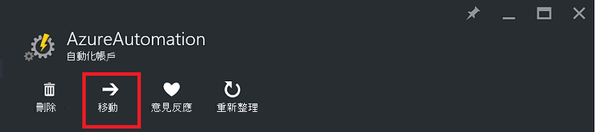
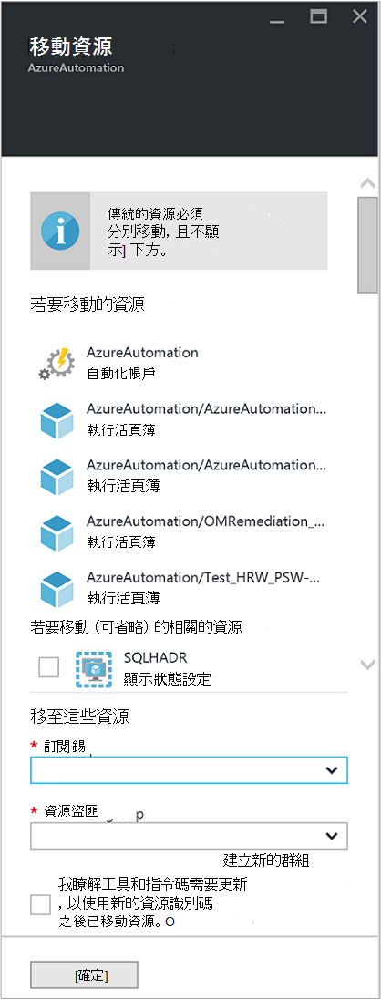

<properties
   pageTitle="移轉自動化帳戶與資源 |Microsoft Azure"
   description="本文將說明如何將 Azure 自動化及相關聯的資源自動化帳戶移到另一個訂閱。"
   services="automation"
   documentationCenter=""
   authors="MGoedtel"
   manager="jwhit"
   editor="tysonn" />
<tags
   ms.service="automation"
   ms.devlang="na"
   ms.topic="article"
   ms.tgt_pltfrm="na"
   ms.workload="infrastructure-services"
   ms.date="07/07/2016"
   ms.author="magoedte" />

# <a name="migrate-automation-account-and-resources"></a>移轉自動化帳戶和資源

自動化帳戶和其相關的資源 （亦即資產、 runbooks、 模組等），您已在 Azure 入口網站中建立要移轉從一個資源群組到另一個，或從一個訂閱到另一個，您也可以使用[移動資源](../resource-group-move-resources.md)功能 Azure 入口網站提供輕鬆地完成此。 不過，進行此動作前，先您應該先檢閱下列[檢查清單，再繼續資源](../resource-group-move-resources.md#Checklist-before-moving-resources)及此外，下方自動化專用的清單。   

1.  目的地訂閱/資源群組必須在同一個地區做為來源。  這表示，自動化帳戶無法移過區域。
2.  移動時 （例如 runbooks、 工作等） 的資源，來源群組和目標群組會遭鎖定作業期間。 撰寫及刪除作業直到完成移動封鎖在群組]。  
3.  任何 runbooks 或變數參照資源或訂閱 ID 從現有的訂閱，必須完成移轉後更新。   


>[AZURE.NOTE] 此功能不支援移動傳統自動化資源。

## <a name="to-move-the-automation-account-using-the-portal"></a>若要移動自動化帳戶使用入口網站

1. 從您的自動化帳戶，請按一下 [刀頂端的 [**移動**]。<br> <br> 
2. 上**移動資源**刀，請注意，它會顯示您自動化的帳戶和您的資源群組相關的資源。  從下拉式清單中，選取 [**訂閱**及**資源群組**，或選取 [**建立新的資源群組**] 選項，提供的欄位中輸入新的資源群組名稱。  
3. 檢閱並選取的核取方塊，確認您*了解工具和指令碼需要更新，以使用新的資源識別碼之後已移動資源*，然後按一下**[確定]**。<br> <br>   

這個動作會需要幾分鐘才能完成。  在**通知**，就會顯示其狀態是 [生效-驗證，移轉中，每個動作，然後最後何時完成。     

## <a name="to-move-the-automation-account-using-powershell"></a>若要移動自動化帳戶使用 PowerShell

若要將現有的自動化資源移到另一個資源群組或訂閱，使用**取得 AzureRmResource**指令程式取得特定自動化帳戶，然後**移動 AzureRmResource** cmdlet 來執行移動。

第一個範例會示範如何將自動化帳戶移至新的資源群組。

   ```
    $resource = Get-AzureRmResource -ResourceName "TestAutomationAccount" -ResourceGroupName "ResourceGroup01"
    Move-AzureRmResource -ResourceId $resource.ResourceId -DestinationResourceGroupName "NewResourceGroup"
   ``` 

執行上述範例中的程式碼之後，系統會提示您確認您想要執行此動作。  按一下 [**是**]，並允許以繼續的指令碼，您不會在執行移轉時收到任何通知。  

若要移動至新訂閱，包括*DestinationSubscriptionId*參數的值。

   ```
    $resource = Get-AzureRmResource -ResourceName "TestAutomationAccount" -ResourceGroupName "ResourceGroup01"
    Move-AzureRmResource -ResourceId $resource.ResourceId -DestinationResourceGroupName "NewResourceGroup" -DestinationSubscriptionId "SubscriptionId"
   ``` 

與上一個範例中，系統會提示您確認移動。  

## <a name="next-steps"></a>後續步驟

- 如需有關如何將資源移至新的資源群組或訂閱的詳細資訊，請參閱[移動到新的資源群組或訂閱的資源](../resource-group-move-resources.md)
- 如需在 Azure 自動化角色型存取控制的詳細資訊，請參閱[Azure 自動化中的角色型存取控制](../automation/automation-role-based-access-control.md)。
- 若要進一步瞭解 PowerShell cmdlet 來管理您的訂閱，請參閱[使用 PowerShell 的 Azure 與資源管理員](../powershell-azure-resource-manager.md)
- 若要瞭解入口網站的功能，管理您的訂閱，請參閱[使用 Azure 入口網站管理資源](../azure-portal/resource-group-portal.md)。 
