<properties 
   pageTitle="Azure 自動化中的角色型存取控制 |Microsoft Azure"
   description="角色型存取控制 (RBAC) 可讓您存取管理 Azure 資源。 本文將說明如何設定在 Azure 自動化 RBAC。"
   services="automation"
   documentationCenter=""
   authors="mgoedtel"
   manager="jwhit"
   editor="tysonn"
   keywords="自動化 rbac 角色存取控制，azure rbac" />
<tags 
   ms.service="automation"
   ms.devlang="na"
   ms.topic="get-started-article"
   ms.tgt_pltfrm="na"
   ms.workload="infrastructure-services"
   ms.date="09/12/2016"
   ms.author="magoedte;sngun"/>

# Azure 自動化中的角色型存取控制

## 角色型存取控制

角色型存取控制 (RBAC) 可讓您存取管理 Azure 資源。 您可以使用[RBAC](../active-directory/role-based-access-control-configure.md)，將您的小組中的職責並授與使用者、 群組及執行工作所需的應用程式存取的數量。 使用 Azure 入口網站、 Azure 的命令列工具或 Azure 管理 Api 的使用者可以授與角色型存取。

## 在自動化帳戶 RBAC

在 Azure 自動化授與存取以將適當的 RBAC 角色指派給使用者、 群組和自動化帳戶範圍內的應用程式。 以下是支援自動化帳戶的內建角色︰  

|**角色** | **描述** |
|:--- |:---|
| 擁有者 | 擁有者角色允許存取所有資源和自動化帳戶包括提供的存取權給其他使用者、 群組和應用程式來管理自動化帳戶內的動作。 |
| 參與者 | 參與者角色可讓您管理修改其他使用者的存取權限自動化帳戶以外的所有內容。 |
| 閱讀程式 | 讀取者角色可讓您在自動化帳戶中檢視所有的資源，但無法進行任何變更。|
| 自動化運算子 | 自動化運算子角色可讓您執行作業的工作，例如開始、 停止、 暫停、 繼續及排程工作。 此角色是如果您想要檢視或修改保護您自動化帳戶之類的資源認證資產] 與 [runbooks，但仍允許貴組織的成員，執行下列 runbooks 很有幫助的。 |
| 使用者存取系統管理員 | 使用者存取系統管理員角色，可讓您管理 Azure 自動化帳戶的使用者存取權。 |

>[AZURE.NOTE] 您無法授與存取權限至特定的 runbook 或 runbooks、 僅供資源，自動化帳戶內的動作。  

本文中我們會逐步引導您完成如何設定在 Azure 自動化 RBAC。 首先，但我們來看深入瞭解在個別的權限授與參與者、 讀取、 自動化運算子和使用者存取系統管理員，讓我們充分瞭解之前自動化帳戶權限授與任何人。  否則，可能會導致非預期或非預期的結果。     

## 參與者角色的權限

下表將呈現的自動化中的參與者角色，才能執行特定動作。

| **資源類型** | **已讀取** | **撰寫** | **刪除** | **其他動作** |
|:--- |:---|:--- |:---|:--- |
| Azure 自動化帳戶 |  |  |  | | 
| 自動化憑證資產 |  |  |  | |
| 自動化連線資產 |  |  |  | | 
| 自動化連線類型資產 |  |  |  | | 
| 自動化認證資產 |  |  |  | |
| 自動化排程資產 |  |  |  | |
| 自動化變數資產 |  |  |  | |
| 自動化所需的狀態設定 | | | |  |
| 混合式 Runbook 工作者資源類型 |  | |  | | 
| Azure 自動化工作 |  |  | |  | 
| 自動化工作串流 |  | | | | 
| 自動化工作排程 |  |  |  | |
| 自動化模組 |  |  |  | |
| Azure 自動化 Runbook |  |  |  |  |
| 自動化 Runbook 草稿 |  | | |  |
| 自動化 Runbook 草稿測試工作 |  |  | |  | 
| 自動化 Webhook |  |  |  |  |

## 閱讀程式角色的權限

下表將呈現的閱讀程式中的角色自動化，才能執行特定動作。

| **資源類型** | **已讀取** | **撰寫** | **刪除** | **其他動作** |
|:--- |:---|:--- |:---|:--- |
| 傳統的訂閱的管理員 |  | | | 
| 管理鎖定 |  | | | 
| 權限 |  | | |
| 提供者作業 |  | | | 
| 角色指派 |  | | | 
| 角色定義 |  | | | 

## 自動化運算子角色的權限

下表將呈現的自動化運算子中的角色自動化，才能執行特定動作。

| **資源類型** | **已讀取** | **撰寫** | **刪除** | **其他動作** |
|:--- |:---|:--- |:---|:--- |
| Azure 自動化帳戶 |  | | | 
| 自動化憑證資產 | | | |
| 自動化連線資產 | | | |
| 自動化連線類型資產 | | | |
| 自動化認證資產 | | | |
| 自動化排程資產 |  |  | | |
| 自動化變數資產 | | | |
| 自動化所需的狀態設定 | | | | |
| 混合式 Runbook 工作者資源類型 | | | | | 
| Azure 自動化工作 |  |  | |  | 
| 自動化工作串流 |  | | |  
| 自動化工作排程 |  |  | | |
| 自動化模組 | | | |
| Azure 自動化 Runbook |  | | | |
| 自動化 Runbook 草稿 | | | |
| 自動化 Runbook 草稿測試工作 | | | |  
| 自動化 Webhook | | | |

如需詳細資訊，[自動化運算子動作](../active-directory/role-based-access-built-in-roles.md#automation-operator)會列出支援自動化帳戶和其資源的自動化運算子角色的動作。

## 使用者存取系統管理員角色的權限

下表將呈現的使用者存取系統管理員角色中自動化，才能執行特定動作。

| **資源類型** | **已讀取** | **撰寫** | **刪除** | **其他動作** |
|:--- |:---|:--- |:---|:--- |
| Azure 自動化帳戶 |  | | | |
| 自動化憑證資產 |  | | | |
| 自動化連線資產 |  | | | |
| 自動化連線類型資產 |  | | | |
| 自動化認證資產 |  | | | |
| 自動化排程資產 |  | | | |
| 自動化變數資產 |  | | | |
| 自動化所需的狀態設定 | | | | |
| 混合式 Runbook 工作者資源類型 |  | | | | 
| Azure 自動化工作 |  | | | | 
| 自動化工作串流 |  | | | | 
| 自動化工作排程 |  | | | |
| 自動化模組 |  | | | |
| Azure 自動化 Runbook |  | | | |
| 自動化 Runbook 草稿 |  | | | |
| 自動化 Runbook 草稿測試工作 |  | | | | 
| 自動化 Webhook |  | | |

## 設定 RBAC 自動化帳戶使用 Azure 入口網站

1.  [Azure 入口網站](https://portal.azure.com/)登入並開啟您的自動化帳戶自動化帳戶刀。  

2.  按一下右上角**Access**控制項。 這會開啟您可以在其中新增新的使用者、 群組及應用程式，管理您的自動化帳戶及檢視現有的角色，可以設定自動化帳戶的**使用者**刀。  

    ![Access] 按鈕](media/automation-role-based-access-control/automation-01-access-button.png)  

>[AZURE.NOTE] 以預設的使用者已存在**訂閱的管理員**。 訂閱的管理員 active directory 群組包含的服務給系統管理員和 co-administrator(s) Azure 訂閱。 服務管理員為您 Azure 的訂閱，它的資源的擁有者，會有的擁有者角色繼承自動化帳戶太。 這表示 access 的是**服務管理員和共同管理員**的訂閱，則**指派**其他使用者的**繼承**。 按一下 [**訂閱的管理員**，若要檢視其權限的相關的更多詳細資料]。  

### 新增使用者並指派角色

1.  從使用者刀中，按一下 [**新增**] 以開啟 [**新增存取刀**便可在其中新增使用者、 群組中或應用程式，並為其指派角色]。  

    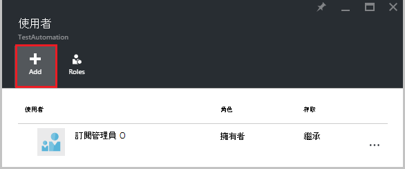  

2.  從可用角色的清單中選取一個角色。 我們會選擇**助讀程式**的角色，但您可以選擇可用的內建角色自動化帳戶支援下列任一或任何自訂的角色，您可能已經定義。  

    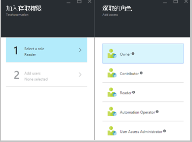  

3.  按一下 [**新增使用者**，以開啟 [**新增使用者**刀上。 如果您已新增任何使用者、 群組或管理您的訂閱，會列出這些使用者，且您可以選取，將 access 應用程式。 如果沒有列出，任何使用者或如果您有興趣使用者沒有列出新增再按 [**邀請**] 可開啟**邀請來賓**刀，您可以在此邀請擁有有效的 Microsoft 帳戶電子郵件地址等 Outlook.com、 OneDrive 或 Xbox Live Id 的使用者。 一旦您輸入使用者的電子郵件地址，請按一下 [**選取**要新增使用者，然後再按一下**[確定**]。 

    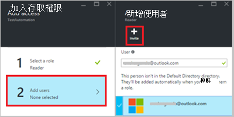  
 
    現在，您應該會看到新增到**使用者**刀及**讀取者**角色指派給使用者。  

      

    您也可以指派給使用者的角色，從**角色**刀。 

1. 按一下 [從使用者刀，以開啟**角色刀**[**角色**]。 從這個刀，您可以檢視角色]、 [使用者和群組指派給該角色的數字的名稱。

    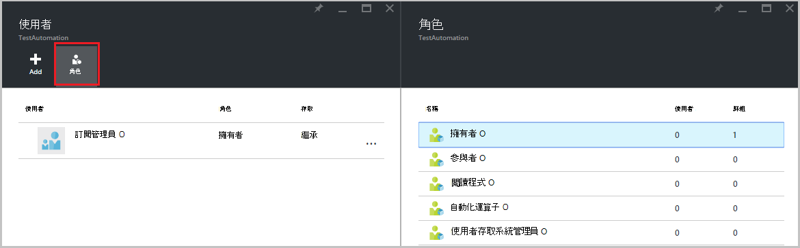  
   
    >[AZURE.NOTE] 角色型存取控制只能自動化帳戶層級，而非任何資源下方自動化帳戶設定。

    您可以將一個以上的角色指派給使用者、 群組或應用程式。 例如，如果我們可以將**自動化運算子**角色，以及**讀取者角色**的使用者，然後他們可以檢視的自動化資源，，以及執行 runbook 工作。 您可以展開下拉式清單檢視的角色指派給使用者清單。  

    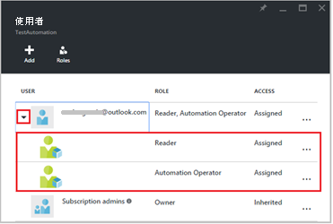  
 
### 移除使用者

您可以移除人員不由管理自動化帳戶，或者不再適用於組織使用者的存取權限。 以下是要移除使用者的步驟︰ 

1.  從**使用者**刀中，選取您想要移除的角色指派。

2.  按一下 [工作分派的詳細資料刀中的 [**移除**] 按鈕。

3.  按一下 [ **]**以確認移除。 

    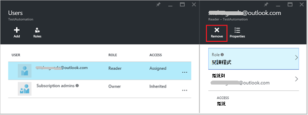  

## 指派的角色的使用者

當使用者指派給角色登入他們的自動化帳戶時，他們現在可以看到**預設目錄**的清單中所列的擁有者的帳戶。 若要檢視新增至自動化帳戶，請他們必須擁有者的預設目錄切換預設目錄。  

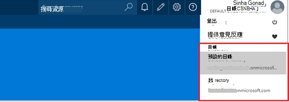  

### 自動化運算子角色的使用者體驗

時的使用者，指派給自動化運算子角色檢視指派給自動化帳戶，他們只能檢視 runbooks、 runbook 工作排程自動化帳戶中建立的清單，但無法檢視其定義。 他們可以啟動、 停止、 暫停、 繼續或排程 runbook 工作。 使用者不會有其他自動化資源，例如設定混合式背景工作群組或 DSC 節點的存取。  

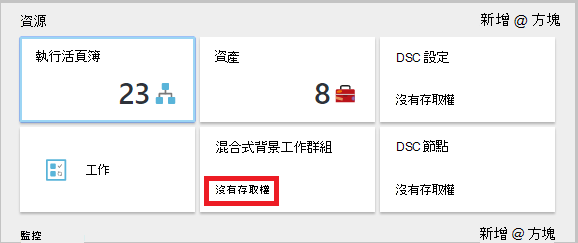  

當使用者在 runbook 時，為自動化運算子角色不允許存取，不會提供檢視來源或編輯 runbook 的命令。  

  

使用者會有存取權，檢視和建立排程，但不是會有任何其他資產類型的存取。  

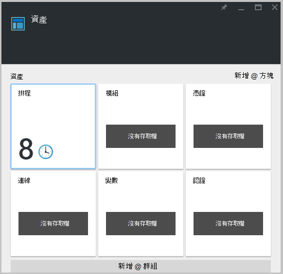  

此使用者也不會有權存取檢視 runbook 相關聯 webhooks

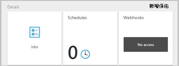  

## 使用 PowerShell 的 Azure 自動化帳戶設定 RBAC

也可以使用下列[PowerShell 的 Azure cmdlet](../active-directory/role-based-access-control-manage-access-powershell.md)自動化帳戶設定角色型存取。

•[取得 AzureRmRoleDefinition](https://msdn.microsoft.com/library/mt603792.aspx)列出所有 RBAC 角色所提供的 Azure Active Directory。 您可以使用這個命令，以及 [**名稱**] 屬性，列出所有的特定角色，才能執行的動作。  
    **範例︰**  
    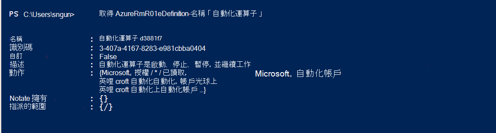  

•[取得 AzureRmRoleAssignment](https://msdn.microsoft.com/library/mt619413.aspx)列出 Azure AD RBAC 角色指派在指定的範圍。 沒有任何參數，此命令會傳回所有訂閱底下所做的角色指派。 使用清單存取工作分派的**ExpandPrincipalGroups**參數指定的使用者，以及使用者的群組的成員。  
    **範例︰**您可以使用下列命令] 清單中的所有使用者的角色與自動化帳戶內。

    Get-AzureRMRoleAssignment -scope “/subscriptions/<SubscriptionID>/resourcegroups/<Resource Group Name>/Providers/Microsoft.Automation/automationAccounts/<Automation Account Name>” 

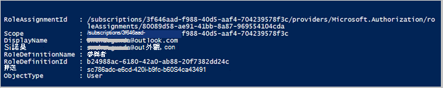

•[新增 AzureRmRoleAssignment](https://msdn.microsoft.com/library/mt603580.aspx)將存取指派給使用者、 群組及特定範圍的應用程式。  
    **範例︰**您可以使用下列命令，指定自動化帳戶範圍中的使用者的 「 自動化運算子 」 角色。

    New-AzureRmRoleAssignment -SignInName <sign-in Id of a user you wish to grant access> -RoleDefinitionName "Automation operator" -Scope “/subscriptions/<SubscriptionID>/resourcegroups/<Resource Group Name>/Providers/Microsoft.Automation/automationAccounts/<Automation Account Name>”  

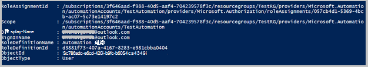

• 使用[移除 AzureRmRoleAssignment](https://msdn.microsoft.com/library/mt603781.aspx)移除特定範圍的存取權的指定的使用者、 群組或應用程式。  
    **範例︰**若要移除自動化帳戶範圍中的 「 自動化運算子 」 角色的使用者使用下列命令。

    Remove-AzureRmRoleAssignment -SignInName <sign-in Id of a user you wish to remove> -RoleDefinitionName "Automation Operator" -Scope “/subscriptions/<SubscriptionID>/resourcegroups/<Resource Group Name>/Providers/Microsoft.Automation/automationAccounts/<Automation Account Name>”

在上述範例中，以您帳戶的詳細資訊取代 [**登入 Id**、**訂閱識別碼**、**資源群組名稱**和**自動化帳戶名稱**。 選擇 [ **]**時提示您確認要移除使用者角色指派在繼續之前。   

## 後續步驟
-  不同的方式來設定 RBAC Azure 自動化的詳細資訊，請參閱[管理與 PowerShell 的 Azure RBAC](../active-directory/role-based-access-control-manage-access-powershell.md)。
- 若要開始 runbook 的不同方式的詳細資訊，請參閱[啟動 runbook](automation-starting-a-runbook.md)
- 如需不同 runbook 類型的資訊，請參閱[Azure 自動化 runbook 類型](automation-runbook-types.md)

