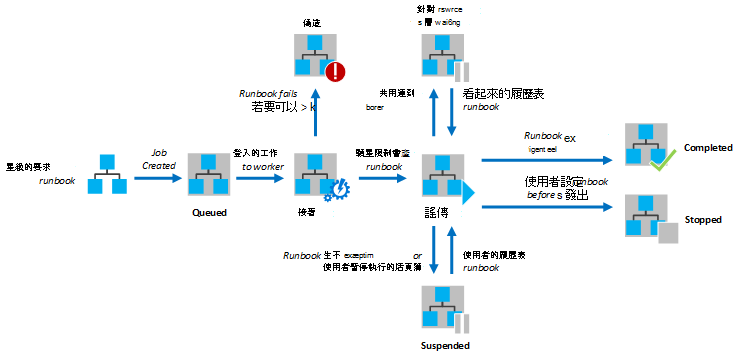
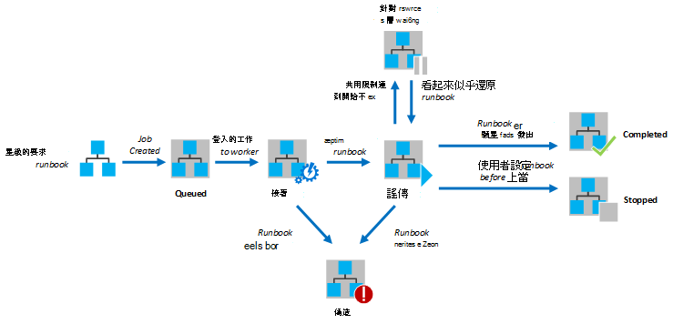

<properties
   pageTitle="Azure 自動化 Runbook 執行"
   description="將說明在 Azure 自動化 runbook 的處理方式的詳細資料。"
   services="automation"
   documentationCenter=""
   authors="mgoedtel"
   manager="stevenka"
   editor="tysonn" />
<tags
   ms.service="automation"
   ms.devlang="na"
   ms.topic="article"
   ms.tgt_pltfrm="na"
   ms.workload="infrastructure-services"
   ms.date="03/21/2016"
   ms.author="bwren" />

# Azure 自動化 Runbook 執行

當您開始 runbook Azure 自動化中時，會建立工作。 工作是 runbook 單一的執行個體。 Azure 自動化工作指派給執行每項工作。 時同事共用的多個 Azure 帳戶，從不同的自動化帳戶的工作是從另一個隔離。 您沒有將服務的要求您的工作的工作者控制。  單一 runbook 可以有多個一次執行的工作。 當您在 Azure 入口網站的 runbooks 清單時，其會列出已針對每個 runbook 啟動的最後一個工作狀態。 若要追蹤的每個狀態，您可以檢視的每個 runbook 工作清單。 不同的工作狀態的說明，請參閱[工作狀態](#job-statuses)。

下圖顯示的生命週期 runbook 工作的[圖形化 runbooks](automation-runbook-types.md#graphical-runbooks)和[PowerShell 工作流程 runbooks](automation-runbook-types.md#powershell-workflow-runbooks)。

下圖顯示[PowerShell runbooks](automation-runbook-types.md#powershell-runbooks)runbook 工作的週期。

您的工作就可以連線至您訂閱的 Azure Azure 資源的存取權。 他們只會擁有資料中心資源的存取權，這些資源是否可以從公用雲端存取。

## 工作狀態

下表描述的工作可能會不同狀態。

| 狀態| 描述|
|:---|:---|
|完成|已順利完成作業。|
|失敗| [圖形化和 PowerShell 工作流程 runbooks](automation-runbook-types.md)，如 runbook 編譯失敗。  [PowerShell 指令碼 runbooks](automation-runbook-types.md)，runbook 無法啟動，或工作時發生例外狀況。 |
|失敗，等待的資源|工作失敗，因為它達到[展覽共用](#fairshare)限制三次，每次啟動從相同的檢查點，或從 runbook 的開頭。|
|佇列中|工作正在等候的資源，讓它可以啟動更多可用的自動化工作。|
|啟動|已指派工作給背景工作，而系統是程序啟動它。|
|繼續|系統會程序之後，已擱置，繼續工作。|
|執行|執行作業。|
|執行，請等候資源|已經卸載工作，因為它達到[展覽共用](#fairshare)限制。 它會繼續引進了從其上次儲存點。|
|停止|已完成之前，該工作已停止使用者。|
|停止|系統會在過程中停止工作。|
|暫停|工作已擱置使用者、 系統、 或 runbook 中的命令。 暫停工作重新啟動並會繼續從其上次儲存點或 runbook 開頭如果不有任何檢查點。 Runbook 只會在例外狀況的情況下，系統已暫停。 根據預設，ErrorActionPreference 設定為 [**繼續]**作業會繼續執行在錯誤的意義。 如果此喜好設定變數設定，若要**停止**工作會暫停上錯誤。  只適用於[圖形和 PowerShell 工作流程 runbooks](automation-runbook-types.md) 。|
|暫停|系統嘗試擱置的要求，使用者的工作。 Runbook，可以暫停之前，必須連絡其下一個檢查點。 如果它已經過了及其上次儲存點，然後就會完成之前，可以暫停。  只適用於[圖形和 PowerShell 工作流程 runbooks](automation-runbook-types.md) 。|

## 使用 [Azure 管理入口網站檢視工作狀態

### 自動化儀表板

自動化儀表板顯示所有的特定自動化帳戶 runbooks 摘要。 也包含帳戶的使用方式概觀。 摘要圖表會顯示總工作的日期或時間在給定數輸入每個狀態的所有 runbooks 的數目。 您可以選取圖表的右上角的時間範圍。 根據您所選取的時間範圍的類型，將會變更時間座標軸的圖表。 您可以選擇是否要按一下畫面頂端顯示的狀態為特定的列。

您可以使用下列步驟，以顯示 [自動化儀表板。

1. 在 Azure 管理入口網站中，選取**自動化**，然後按一下 [自動化帳戶的名稱。
1. 選取 [**儀表板**] 索引標籤。

### Runbook 儀表板

[Runbook 儀表板顯示為單一 runbook 摘要。 摘要圖表會顯示的總工作輸入每個狀態日期或時間在給定數 runbook 的數目。 您可以選取圖表的右上角的時間範圍。 根據您所選取的時間範圍的類型，將會變更時間座標軸的圖表。 您可以選擇是否要按一下畫面頂端顯示的狀態為特定的列。

您可以使用下列步驟，以顯示 [Runbook 儀表板。

1. 在 Azure 管理入口網站中，選取**自動化**，然後按一下 [自動化帳戶的名稱。
1. 按一下 [runbook 的名稱。
1. 選取 [**儀表板**] 索引標籤。

### 工作摘要

您可以檢視所有已建立特定的 runbook 和最新狀態的工作清單。 您可以篩選此工作狀態的清單和上次變更工作的日期範圍。 按一下要檢視其的詳細的資訊，以及其輸出的工作的名稱。 詳細的檢視的工作包括 runbook 參數是提供給該工作的值。

若要檢視的 runbook 工作，您可以使用下列步驟。

1. 在 Azure 管理入口網站中，選取**自動化**，然後按一下 [自動化帳戶的名稱。
1. 按一下 [runbook 的名稱。
1. 選取 [**工作**] 索引標籤。
1. 按一下 [**建立工作**欄若要檢視其詳細資料和輸出工作。

## 使用 Windows PowerShell 的擷取工作狀態

您可以使用[取得 AzureAutomationJob](http://msdn.microsoft.com/library/azure/dn690263.aspx)擷取建立 runbook 與特定工作的詳細資料的作業。 如果您使用 Windows PowerShell 使用[開始 AzureAutomationRunbook](http://msdn.microsoft.com/library/azure/dn690259.aspx)啟動 runbook，它會傳回結果的工作。 若要取得工作的輸出使用[取得 AzureAutomationJob](http://msdn.microsoft.com/library/azure/dn690263.aspx)輸出。

下列範例命令擷取範例 runbook 的最後一個工作，並顯示它的狀態] 的值提供 runbook 參數，和從工作成果。

    $job = (Get-AzureAutomationJob –AutomationAccountName "MyAutomationAccount" –Name "Test-Runbook" | sort LastModifiedDate –desc)[0]
    $job.Status
    $job.JobParameters
    Get-AzureAutomationJobOutput –AutomationAccountName "MyAutomationAccount" -Id $job.Id –Stream Output

## 展覽共用

間共用資源所有 runbooks 在雲端，才能 Azure 自動化會暫時卸載任何工作之後，已經執行了 3 小時。    [圖形化](automation-runbook-types.md#graphical-runbooks)和[PowerShell 工作流程](automation-runbook-types.md#powershell-workflow-runbooks)runbooks 會繼續從其上次儲存[檢查點](http://technet.microsoft.com/library/dn469257.aspx#bk_Checkpoints)。 在此期間，工作會顯示狀態為執行，等待的資源。 如果 runbook 具有檢查點或作業不已達的第一個檢查點之前卸載，它會重新啟動開始。  [PowerShell](automation-runbook-types.md#powershell-runbooks) runbooks 從頭一律重新啟動，因為它們不支援檢查點。

>[AZURE.NOTE] 展覽共用限制不適用於 runbook 混合式 Runbook 工作者上執行的工作。

如果從相同的檢查點或開頭 runbook 連續三次，重新啟動 runbook，它將會狀態為 [失敗，等待資源的結束。 這是從 runbooks 無限期執行，而不完成，他們無法進行下一個檢查點中沒有再次卸載保護。 在此情況下，您會收到下列例外狀況失敗。

*工作無法繼續執行，因為它已重複收回從相同的檢查點。請確定您 Runbook 不會執行冗長的作業，而不保存其狀態。*

當您建立 runbook 時，您應該確保時間執行兩個檢查點之間的任何活動不會超過 3 小時。 您可能需要將檢查點新增到您 runbook，以確保，它不達到此 3 小時限制或分割長時間執行作業。 例如，您 runbook 可能會執行重新索引大型的 SQL 資料庫。 如果此單一作業未完成展覽共用限制，然後工作會卸載並從頭開始。 在此情況下，您應該分割成多個步驟，例如重新一個資料表索引一次重新索引作業，然後再插入檢查點之後每一項作業，讓工作可能會在最後一個作業完成後繼續。

## 後續步驟

- [啟動 Azure 自動化 runbook](automation-starting-a-runbook.md)
