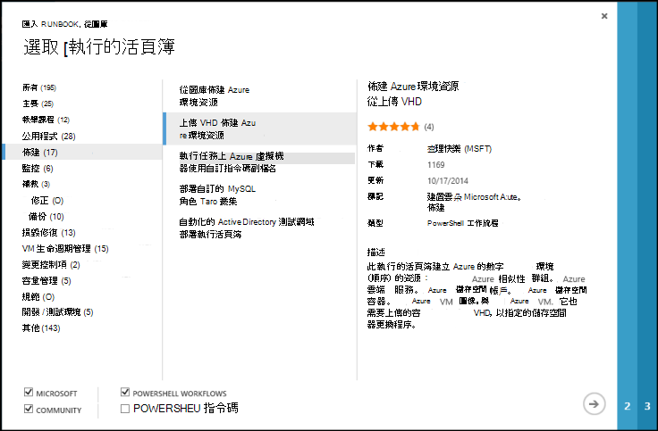
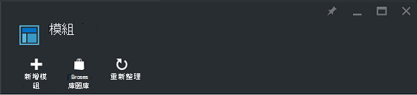
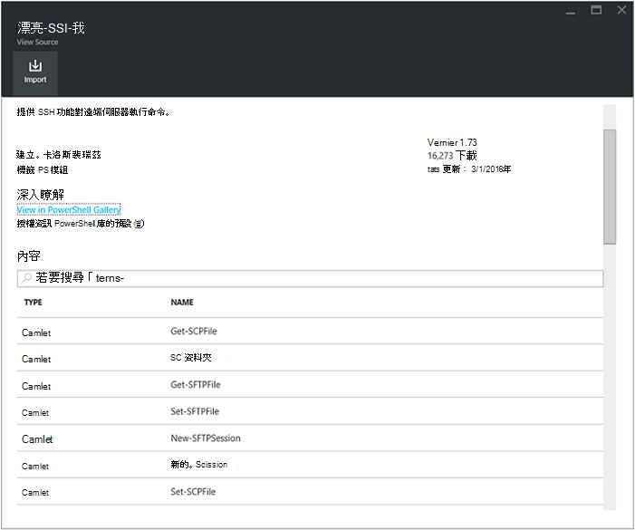
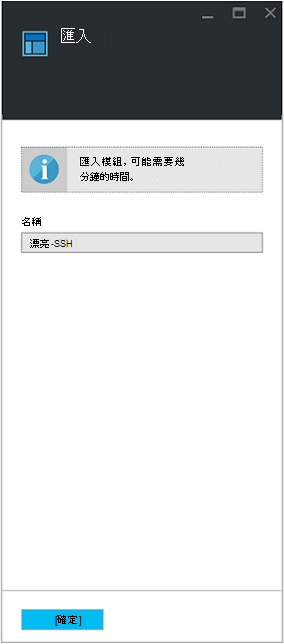

<properties
    pageTitle="Azure 自動化 Runbook 和模組圖庫 |Microsoft Azure"
    description="Runbooks 和 Microsoft 和社群的模組，可為您要安裝 Azure 自動化環境中使用。  本文將說明如何存取這些資源，並提供您 runbooks 庫。"
    services="automation"
    documentationCenter=""
    authors="mgoedtel"
    manager="jwhit"
    editor="tysonn" />
<tags
    ms.service="automation"
    ms.devlang="na"
    ms.topic="article"
    ms.tgt_pltfrm="na"
    ms.workload="infrastructure-services"
    ms.date="09/18/2016"
    ms.author="magoedte;bwren" />

# Azure 自動化 Runbook 和模組組件庫

而不是在 Azure 自動化建立您自己的 runbooks 和模組，您可以存取各種已經建置 Microsoft 和社群的案例。  您可以使用這些案例不需要修改，或使用其作為起點，進行編輯，您特定需求。

您可以取得 runbooks [Runbook 庫](#runbooks-in-runbook-gallery)與[PowerShell 圖庫](#modules-in-powerShell-gallery)中的模組。  您也可以共用您所開發的案例來參與社群。

## Runbooks Runbook 庫中

[Runbook 庫](http://gallery.technet.microsoft.com/scriptcenter/site/search?f[0].Type=RootCategory&f[0].Value=WindowsAzure&f[1].Type=SubCategory&f[1].Value=WindowsAzure_automation&f[1].Text=Automation)提供各種不同的 runbooks Microsoft 和您可以匯入 Azure 自動化社群。 您可以從圖庫是裝載在[TechNet 指令碼中心](http://gallery.technet.microsoft.com/)，runbook 任一下載或您可以從 [從 Azure 傳統入口網站或 Azure 入口網站] 庫直接匯入 runbooks。

您可以只匯入直接從 Runbook 圖庫使用 Azure 傳統入口網站或 Azure 入口網站。 您無法執行此函數使用 Windows PowerShell。

>[AZURE.NOTE] 您應該驗證任何 runbooks 您從 Runbook 圖庫中取得，並使用謹慎中安裝及執行這些生產環境中的內容。 |

### 從 Azure 傳統入口網站 Runbook 庫匯入 runbook

1. 在 Azure 入口網站中，按一下，**新****服務應用程式**、**自動化**、 **Runbook**、**從圖庫**。
2. 選取類別來檢視相關的 runbooks，然後選取 runbook 若要檢視其詳細資料。 當您選取您想要的 runbook 時，按一下 [向右箭號] 按鈕。

    

3. 檢閱 runbook 的內容，並注意說明中的任何需求。 當您完成時，請按一下向右箭號按鈕。
4. 輸入 runbook 的詳細資訊，然後按一下 [核取記號] 按鈕。 將已填入 runbook 名稱。
5. 自動化帳戶，runbook 會出現在 [ **Runbooks** ] 索引標籤。

### 從 Azure 入口網站 Runbook 庫匯入 runbook

1. 在 [Azure 入口網站中，開啟您自動化的帳戶。
2. 按一下 [ **Runbooks** ] 方塊，以開啟 runbooks 清單。
3. 按一下 [**瀏覽圖庫**] 按鈕。

    ![瀏覽] 圖庫] 按鈕](media/automation-runbook-gallery/browse-gallery-button.png)

4. 找出您想要並選取要檢視其詳細資料的組件庫項目。

    ![瀏覽] 庫](media/automation-runbook-gallery/browse-gallery.png)

4. 按一下 [**檢視來源專案**中[TechNet 指令碼中心](http://gallery.technet.microsoft.com/)檢視項目。
5. 若要匯入項目，請按一下要檢視其詳細資料，然後按一下 [**匯入**] 按鈕。

    ![匯入] 按鈕](media/automation-runbook-gallery/gallery-item-detail.png)

6. 您也可以變更 runbook 的名稱，然後按一下 [**確定**] 以匯入 runbook。
5. 自動化帳戶，runbook 會出現在 [ **Runbooks** ] 索引標籤。

### 新增 runbook runbook 庫

Microsoft 鼓勵您新增您認為有幫助其他客戶 Runbook 庫 runbooks。  您可以新增 runbook[上傳指令碼中心以](http://gallery.technet.microsoft.com/site/upload)納入考量下列詳細資料。

- 您必須指定要顯示在精靈中的**類別**和**子類別**的 runbook*自動化*的*Windows Azure* 。  

- 上傳必須是單一.ps1 或.graphrunbook 檔案。  如果 runbook 需要的任何模組、 子 runbooks 或資產，然後您應該列出這些送出的描述和 runbook [註解] 區段中。  如果您需要多個 runbooks 情況，然後上傳每分別和相關的 runbooks 在每一個描述的清單。 請確定您使用相同的標籤，使其會顯示在同一個類別。 使用者必須以閱讀描述，知道其他 runbooks 所需搭配使用案例。

- 如果您要發佈**圖形 runbook** （不圖形工作流程），請新增標籤 」 GraphicalPS 」。 

- 使用**插入程式碼區段**圖示描述中插入的 PowerShell 」 或 「 PowerShell 工作流程的程式碼片段。

- 會 Runbook 庫結果中顯示上傳的摘要，因此您應該提供可協助使用者識別的 runbook 功能的詳細的資訊。

- 您應該要上傳指定 1 到 3 的下列標籤。  Runbook 會列在精靈的 [符合其標記的類別下。  精靈會略過此清單上沒有任何標籤。 如果您不指定相符的任何標記，runbook 將會列出其他類別下。

 - 備份
 - 容量管理
 - 變更控制項
 - 法規遵循
 - 開發 / 測試環境
 - 修復損毀
 - 監控
 - 修正
 - 佈建
 - 修復
 - VM 生命週期管理

- 自動化更新圖庫小時，讓您不會立即看到您的成果。

## PowerShell 圖庫中的模組

PowerShell 模組包含您可在您的 runbooks 使用 cmdlet，您可以安裝在 Azure 自動化的現有模組[PowerShell 圖庫](http://www.powershellgallery.com)中，您可以使用。  您可以啟動此圖庫從 Azure 入口網站，並直接將 Azure 自動化安裝，或您可以下載檔案並手動安裝。  您無法直接從 Azure 傳統入口網站，安裝模組，但您可以下載安裝您想要的任何其他模組。

### 若要從 Azure 入口網站的 [自動化] 模組庫匯入模組

1. 在 [Azure 入口網站中，開啟您自動化的帳戶。
2. 按一下以開啟的資產清單的 [**資產**] 磚。
3. 按一下 [**模組**] 方塊，以開啟模組的清單。
4. 按一下 [**瀏覽圖庫**] 按鈕，並瀏覽] 圖庫刀啟動。

      
5. 您已啟動瀏覽] 圖庫刀之後，您可以搜尋下列欄位︰

   - 模組名稱
   - 標記
   - 作者
   - Cmdlet/DSC 資源名稱

6. 找出您感興趣的模組，然後選取要檢視其詳細資料。  
當您深入瞭解特定模組時，您可以檢視詳細的資訊模組，包括 [PowerShell] 庫中，連結的相關任何必要的相依性，以及 「 所有 」 的 cmdlet 及/或模組包含 DSC 資源。

      

7. 若要直接將 Azure 自動化安裝模組，按一下 [**匯入**] 按鈕。

    ![匯入模組] 按鈕](media/automation-runbook-gallery/module-import-button.png)

8. 當您按一下 [匯入] 按鈕時，您會看到您即將匯入的模組名稱。 如果已安裝所有相依性， **[確定**] 按鈕會變成作用中。 如果您遺失相依性，必須先匯入這些之前，您可以匯入此模組。
9. 按一下**[確定**] 以匯入模組和模組刀便會啟動。 時 Azure 自動化便會模組匯入至您的帳戶，它會擷取模組和 cmdlet 的中繼資料。

    

    因為需要要擷取的每一個活動，這可能需要幾分鐘。
10. 完成後，您會收到通知部署的模組和通知。
11. 模組匯入之後，您會看到的可用的活動，然後您可以使用其資源 runbooks 與所需的狀態設定。

## 要求的 runbook 或模組

您可以傳送要求[使用者語音](https://feedback.azure.com/forums/246290-azure-automation/)。  如果您需要協助撰寫 runbook，或是已與 PowerShell 相關的問題，張貼至[論壇，在](http://social.msdn.microsoft.com/Forums/windowsazure/en-US/home?forum=azureautomation&filter=alltypes&sort=lastpostdesc)我們的問題。

## 後續步驟

- 若要開始使用 runbooks，請參閱[建立或匯入 runbook 中 Azure 自動化](automation-creating-importing-runbook.md)
- 若要瞭解與 runbooks PowerShell 和 PowerShell 工作流程之間的差異，請參閱[學習 PowerShell 工作流程](automation-powershell-workflow.md)
