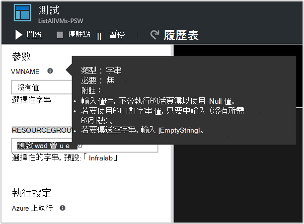

<properties
   pageTitle="輸入參數的 Runbook |Microsoft Azure"
   description="Runbook 輸入的參數會增加 runbooks 的彈性，可以讓您將資料傳遞到 runbook，啟動時。 本文將說明不同情況 runbooks 中使用輸入的參數的位置。"
   services="automation"
   documentationCenter=""
   authors="MGoedtel"
   manager="jwhit"
   editor="tysonn" />
<tags
   ms.service="automation"
   ms.devlang="na"
   ms.topic="article"
   ms.tgt_pltfrm="na"
   ms.workload="infrastructure-services"
   ms.date="10/11/2016"
   ms.author="sngun"/>

# <a name="runbook-input-parameters"></a>Runbook 輸入的參數

Runbook 輸入的參數增加 runbooks 的彈性，可以讓您啟動時，將資料傳遞給它。 參數允許 runbook 動作，若要針對特定案例與環境。 本文中，我們會引導您執行不同情況 runbooks 中使用輸入的參數的位置。

## <a name="configure-input-parameters"></a>設定 [輸入的參數

PowerShell 與圖形 runbooks PowerShell 工作流程，您可以設定輸入的參數。 Runbook 可以有多個參數不同資料類型或沒有參數完全。 輸入參數可以強制或選擇性的而且您可以指派的選擇性參數的預設值。 當您開始透過其中一個可用的方法時，您就可以分派給 runbook 輸入參數值。 這些方法包括 runbook 自入口網站或 web 服務。 您也可以開始在另一個 runbook 稱為直接子項 runbook 為其中一個。

## <a name="configure-input-parameters-in-powershell-and-powershell-workflow-runbooks"></a>在 PowerShell 和 PowerShell 工作流程 runbooks 設定輸入的參數

PowerShell 和 Azure 自動化中的[PowerShell 工作流程 runbooks](automation-first-runbook-textual.md)支援會透過下列屬性來定義的輸入的參數。  

| **屬性** | **描述** |
|:--- |:---|
| 類型 | 所需。 預期的參數值的資料類型。 任何.NET 類型無效。 |
| 名稱 | 所需。 參數名稱。 這必須中 runbook，都是唯一和可以包含唯一字母、 數字或底線字元。 它必須以字母開頭。 |
| 強制性 | 選用。 指定是否必須提供參數的值。 如果您的設定來**$true**，然後值時，必須提供 runbook 開始。 如果您的設定來**$false**，值是選擇性的。 |
| 預設值 | 選用。  指定如果 runbook 啟動時，在未傳遞值將用於參數的值。 預設值，可以設定任何參數，然後會自動建立參數選擇性強制設定。 |

Windows PowerShell 支援更多的屬性輸入參數那些列於此處，例如 [驗證]，別名，而且參數是設定。 不過，Azure 自動化目前支援只輸入的參數列於上方。

在 PowerShell 工作流程 runbooks 參數定義有下列一般表單，多個參數會以逗號分隔。

   ```
     Param
     (
         [Parameter (Mandatory= $true/$false)]
         [Type] Name1 = <Default value>,

         [Parameter (Mandatory= $true/$false)]
         [Type] Name2 = <Default value>
     )
   ```

>[AZURE.NOTE] 當您定義的參數，如果您不指定**強制**屬性時，然後根據預設，參數會被視為選用。 此外，如果您在 PowerShell 工作流程 runbooks 中設定預設值參數，它將會視為 PowerShell 以選用的參數，而不**必要**的屬性值。

作為範例，讓我們來設定輸出的詳細資訊虛擬機器，[單一 VM] 或 [資源群組內的所有 Vm PowerShell 工作流程 runbook 輸入的參數。 此 runbook 有兩個參數，如以下的螢幕擷取畫面所示︰ 虛擬機器] 和 [資源群組的名稱的名稱。


這個參數中定義的參數**$VMName**及**$resourceGroupName**是簡單的參數字串類型。 不過，PowerShell 和 PowerShell 工作流程 runbooks 支援所有簡單類型與複雜的類型，例如**物件**或輸入參數**PSCredential** 。

如果您 runbook 物件類型輸入的參數，然後使用 （名稱、 值） PowerShell 雜湊表来傳入值組。 例如，如果您在 runbook 有下列參數︰

     [Parameter (Mandatory = $true)]
     [object] $FullName

然後，您可以參數傳遞以下的值︰

    @{"FirstName"="Joe";"MiddleName"="Bob";"LastName"="Smith"}


## <a name="configure-input-parameters-in-graphical-runbooks"></a>在圖形 runbooks 設定輸入的參數

若要[設定圖形的 runbook](automation-first-runbook-graphical.md)包含輸入參數，讓我們來建立圖形的 runbook 輸出虛擬機器，[單一 VM] 或 [資源群組內的所有 Vm 的詳細資料。 設定 runbook 包含兩個主要的活動，如下所述。

[**Azure 執行為帳戶的項目會驗證 Runbooks**](automation-sec-configure-azure-runas-account.md) Azure 驗證方法。

若要取得的虛擬機器屬性[**取得 AzureRmVm**](https://msdn.microsoft.com/library/mt603718.aspx) 。

您可以使用[**寫入輸出**](https://technet.microsoft.com/library/hh849921.aspx)活動輸出虛擬機器中的名稱。 活動**取得 AzureRmVm**接受兩個參數，**虛擬機器名稱**和**資源群組名稱**。 每次啟動 runbook 時，這些參數可能需要不同的值，因為您可以新增您 runbook 輸入的參數。 若要新增輸入的參數步驟如下︰

1. 選取圖形 runbook 從**Runbooks**刀，然後按一下 [[**編輯**](automation-graphical-authoring-intro.md)它。

2. 從 runbook 編輯器] 中，按一下 [**輸入與輸出**開啟**輸入與輸出**刀]。

    

3. **輸入與輸出**刀顯示輸入參數 runbook 所定義的清單。 在此刀，您可以新增新的輸入的參數，或編輯現有的輸入參數的設定。 若要新增 runbook 新增參數，按一下 [**新增輸入**開啟**Runbook 輸入的參數**刀。 那里，您可以設定下列參數︰

  	| **屬性** | **描述** |
  	|:--- |:---|
  	| 名稱 | 所需。  參數名稱。 這必須中 runbook，都是唯一和可以包含唯一字母、 數字或底線字元。 它必須以字母開頭。 |
  	| 描述 | 選用。 相關的 [輸入參數用途的描述。 |
  	| 類型 | 選用。 需要參數值的資料類型。 支援的參數類型是**字串**、 **Int32**、 **Int64**、**小數位數**、**布林值**、 **DateTime**和**物件**。 如果未選取的資料類型，則預設**字串**。 |
  	| 強制性 | 選用。 指定是否必須提供參數的值。 如果您選擇**[是]**，然後值時，必須提供 runbook 開始。 如果您選擇 [**無**]，然後值，就不需要 runbook 開始時，而設定預設值。 |
  	| 預設值 | 選用。 指定如果 runbook 啟動時，在未傳遞值將用於參數的值。 不是必要的參數，可以設定的預設值。 若要設定預設值，選擇 [**自訂**]。 除非 runbook 啟動時，會提供另一個值，則會使用這個值。 如果您不想要提供任何預設值，請選擇 [**無**]。 |  

    

4. 建立兩個參數，以**取得 AzureRmVm**活動會使用下列屬性︰

    - **參數 1:**
      - 名稱-VMName
      - String 類型
      - 強制-無

    - **參數 2:**
      - 名稱-resourceGroupName
      - String 類型
      - 強制-無
      - 預設值-自訂
      - 自訂的預設值-\<包含虛擬機器的資源群組的名稱 >

5. 一旦您新增參數，請按一下**[確定]**。  您現在可以檢視中**輸入與輸出**。 還是一樣，請按一下**[確定]** ，然後按一下 [**儲存**並**發佈**您 runbook。

## <a name="assign-values-to-input-parameters-in-runbooks"></a>指派至輸入參數 runbooks 中的值

您可以將傳遞至輸入參數 runbooks 在下列情況中的值。

### <a name="start-a-runbook-and-assign-parameters"></a>啟動 runbook 並指派的參數

Runbook 開始多種方式︰ 透過 Azure 入口網站，webhook、 透過 PowerShell cmdlet，以的 REST API，或 SDK。 以下我們討論啟動 runbook 並為人員分派參數的不同的方法。

#### <a name="start-a-published-runbook-by-using-the-azure-portal-and-assign-parameters"></a>開始使用 Azure 入口網站的已發佈的 runbook 並指定參數

當您[開始 runbook](automation-starting-a-runbook.md#starting-a-runbook-with-the-azure-portal)，**開始 Runbook**刀開啟和您可以設定您剛剛建立的參數值。


在 [輸入] 方塊下方標籤中，您可以看到已設定參數的屬性。 屬性包括強制或選擇性類型及預設值。 在參數名稱旁的說明球形文字說明，您可以看到您要的輸入參數值的決策的重要資訊。 這項資訊包含強制或選擇性參數是否。 也包含的類型及預設值 （如果有的話），以及其他實用的備忘稿。



>[AZURE.NOTE] 字串類型參數支援**空白**字串值。  在 [輸入的參數] 方塊中輸入**[若是]** ，將參數傳遞空字串。 此外，字串類型參數不支援傳遞的**Null**值。 如果您沒有字串參數傳遞的任何值，然後 PowerShell 會解譯為 null。

#### <a name="start-a-published-runbook-by-using-powershell-cmdlets-and-assign-parameters"></a>使用 PowerShell cmdlet 來啟動發佈的 runbook 並指定參數

  - **Azure 資源管理員 cmdlet:**您可以開始使用[開始 AzureRmAutomationRunbook](https://msdn.microsoft.com/library/mt603661.aspx)建立資源群組中的自動化 runbook。

    **範例︰**

   ```
    $params = @{“VMName”=”WSVMClassic”;”resourceGroupeName”=”WSVMClassicSG”}
 
    Start-AzureRmAutomationRunbook -AutomationAccountName “TestAutomation” -Name “Get-AzureVMGraphical” –ResourceGroupName $resourceGroupName -Parameters $params
   ```

  - **Azure 服務管理 cmdlet:**您可以開始使用[開始 AzureAutomationRunbook](https://msdn.microsoft.com/library/dn690259.aspx)建立預設資源群組中的自動化 runbook。

    **範例︰**

   ```
    $params = @{“VMName”=”WSVMClassic”; ”ServiceName”=”WSVMClassicSG”}

    Start-AzureAutomationRunbook -AutomationAccountName “TestAutomation” -Name “Get-AzureVMGraphical” -Parameters $params
   ```

>[AZURE.NOTE] 當您使用 PowerShell cmdlet，預設值參數，來啟動 runbook **MicrosoftApplicationManagementStartedBy**會建立值**PowerShell**。 在 [**工作詳細資料**刀，您可以檢視此參數。  

#### <a name="start-a-runbook-by-using-an-sdk-and-assign-parameters"></a>使用 SDK 來啟動 runbook 並指定參數

  - **Azure 資源管理員方法︰**您可以使用的程式設計語言的 SDK 開始 runbook。 以下是在您的自動化帳戶啟動 runbook C# 程式碼片段。 您可以檢視所有的程式碼，我們[GitHub 存放庫](https://github.com/Azure/azure-sdk-for-net/blob/master/src/ResourceManagement/Automation/Automation.Tests/TestSupport/AutomationTestBase.cs)。  

   ```
     public Job StartRunbook(string runbookName, IDictionary<string, string> parameters = null)
        {
          var response = AutomationClient.Jobs.Create(resourceGroupName, automationAccount, new JobCreateParameters
           {
              Properties = new JobCreateProperties
               {
                  Runbook = new RunbookAssociationProperty
                   {
                     Name = runbookName
                   },
                     Parameters = parameters
               }
           });
        return response.Job;
        }
   ```

  - **Azure 服務管理方法︰**您可以使用的程式設計語言的 SDK 開始 runbook。 以下是在您的自動化帳戶啟動 runbook C# 程式碼片段。 您可以檢視所有的程式碼，我們[GitHub 存放庫](https://github.com/Azure/azure-sdk-for-net/blob/master/src/ServiceManagement/Automation/Automation.Tests/TestSupport/AutomationTestBase.cs)。

   ```      
    public Job StartRunbook(string runbookName, IDictionary<string, string> parameters = null)
      {
        var response = AutomationClient.Jobs.Create(automationAccount, new JobCreateParameters
      {
        Properties = new JobCreateProperties
           {
             Runbook = new RunbookAssociationProperty
           {
             Name = runbookName
                },
                  Parameters = parameters
                }
         });
        return response.Job;
      }
   ```

  若要開始這個方法，建立字典儲存 runbook 參數、 **VMName**及**resourceGroupName**，以及其值。 啟動 [runbook。 以下是 C# 程式碼片段呼叫定義上方的方法。

   ```
    IDictionary<string, string> RunbookParameters = new Dictionary<string, string>();

    // Add parameters to the dictionary.
    RunbookParameters.Add("VMName", "WSVMClassic");
    RunbookParameters.Add("resourceGroupName", "WSSC1");

    //Call the StartRunbook method with parameters
    StartRunbook(“Get-AzureVMGraphical”, RunbookParameters);
   ```

#### <a name="start-a-runbook-by-using-the-rest-api-and-assign-parameters"></a>使用 REST API 來啟動 runbook 並指定參數

您可以建立及使用**放**方法使用下列要求 URI 入門 Azure 自動化 REST API runbook 工作。

    https://management.core.windows.net/<subscription-id>/cloudServices/<cloud-service-name>/resources/automation/~/automationAccounts/<automation-account-name>/jobs/<job-id>?api-version=2014-12-08`

在邀請中 URI，取代下列參數︰

  - **訂閱識別碼︰**您的 Azure 訂閱 id。  
  - **雲端服務名稱︰**雲端服務要求應該傳送到其中的名稱。  
  - **自動化帳戶名稱︰**您裝載在指定的雲端服務中的自動化帳戶名稱。  
  - **作業識別碼︰**工作的 GUID。 您可以建立 Guid PowerShell 中的使用**[GUID]::NewGuid()。Tostring （)** ] 命令。

將參數傳遞給 runbook 工作，才能使用邀請內文。 採用 JSON 格式中提供下列兩個屬性︰

  - **Runbook 名稱︰**所需。 若要開始工作 runbook 名稱。  
  - **Runbook 參數︰**選用。 字典 （名稱] 值） 中的 [參數] 清單的格式名稱應為字串類型及值可為任何有效的 JSON 值位置。

如果您要開始做為參數**VMName**與**resourceGroupName**先前建立**取得 AzureVMTextual** runbook，請使用下列 JSON 格式邀請內文。

   ```
    {
      "properties":{
        "runbook":{
        "name":"Get-AzureVMTextual"},
      "parameters":{
         "VMName":"WSVMClassic",
         "resourceGroupName":”WSCS1”}
        }
    }
   ```

如果已成功建立工作，會傳回 HTTP 狀態碼 201。 如需有關回應標頭和回應內容的詳細資訊，請參閱有關如何文章[建立 runbook 工作使用 REST API。](https://msdn.microsoft.com/library/azure/mt163849.aspx)

### <a name="test-a-runbook-and-assign-parameters"></a>測試 runbook 並指派的參數

當您[測試您 runbook 的草稿版本](automation-testing-runbook.md)，請使用測試選項，請**測試**刀會開啟，並您可以設定您剛剛建立的參數值。


### <a name="link-a-schedule-to-a-runbook-and-assign-parameters"></a>連結至 runbook 的排程，並指定參數

您 runbook 使 runbook 開始在特定時間可以[連結排程](automation-schedules.md)。 當您建立排程，並 runbook 會使用這些值，以排程啟動時，您可以指定輸入的參數。 您無法儲存排程，直到提供所有必要的參數值。


### <a name="create-a-webhook-for-a-runbook-and-assign-parameters"></a>建立的 runbook webhook 及指定參數

您可以建立您 runbook [webhook](automation-webhooks.md) ，並設定 runbook 輸入的參數。 您無法儲存 webhook 提供所有必要的參數值。


當您執行 runbook 使用 webhook 時，傳送**[Webhookdata](automation-webhooks.md#details-of-a-webhook)** ，以及您所定義的輸入參數的預先定義的輸入參數。 您可以按一下以展開**WebhookData**參數，如需詳細資訊。


## <a name="next-steps"></a>後續步驟

- 如需有關 runbook 輸入與輸出的詳細資訊，請參閱[Azure 自動化︰ runbook 輸入與輸出巢狀的 runbooks](https://azure.microsoft.com/blog/azure-automation-runbook-input-output-and-nested-runbooks/)。
- 如需啟動 runbook 的不同方式的詳細資訊，請參閱[啟動 runbook](automation-starting-a-runbook.md)。
- 若要編輯文字的 runbook，請參閱[編輯文字 runbooks](automation-edit-textual-runbook.md)。
- 若要編輯的圖形化 runbook，請參閱[Azure 自動化中撰寫的圖形](automation-graphical-authoring-intro.md)。
