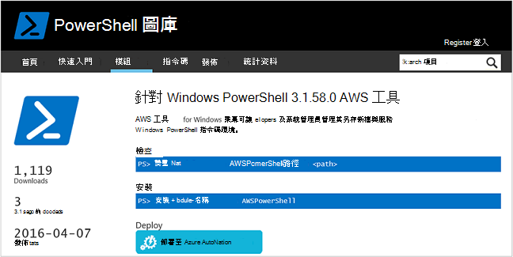
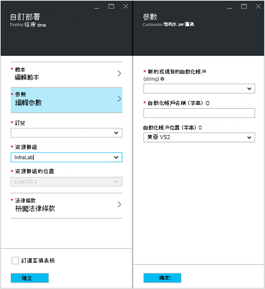
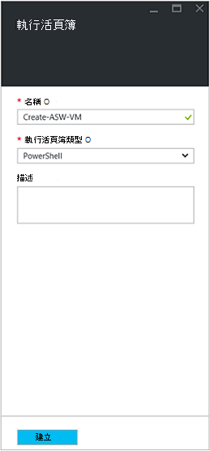
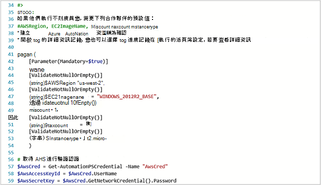
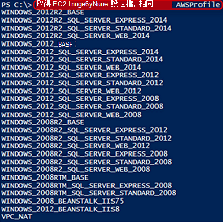
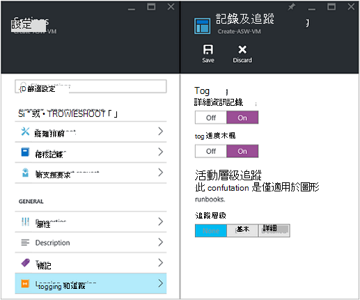
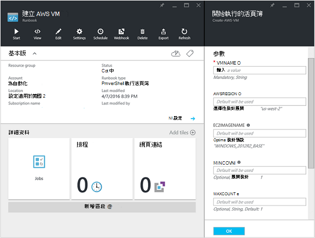
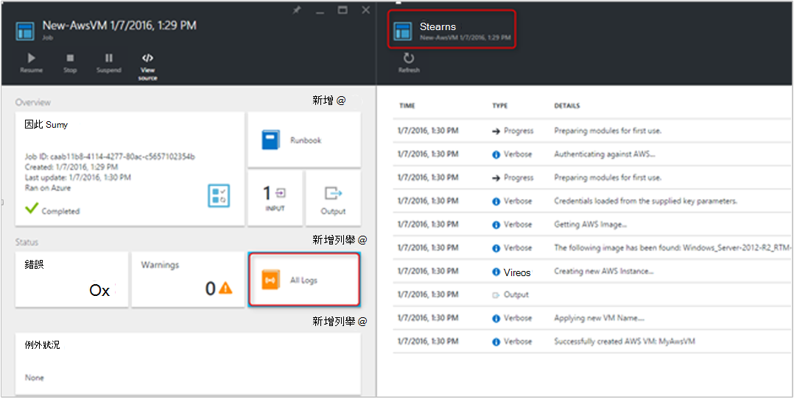
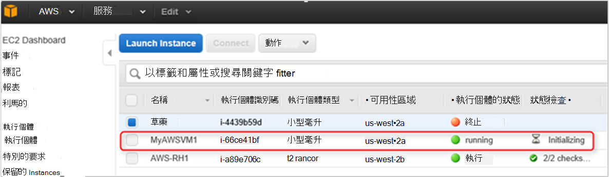

<properties
   pageTitle="自動化 VM Amazon Web 服務中的部署 |Microsoft Azure"
   description="本文將示範如何使用 [自動建立 Amazon Web 服務 VM [Azure 自動化"
   services="automation"
   documentationCenter=""
   authors="mgoedtel"
   manager="jwhit"
   editor="" />
<tags
   ms.service="automation"
   ms.devlang="na"
   ms.topic="article"
   ms.tgt_pltfrm="na"
   ms.workload="na"
   ms.date="08/17/2016"
   ms.author="tiandert; bwren" />

# <a name="azure-automation-scenario---provision-an-aws-virtual-machine"></a>Azure 自動化案例-佈建 AWS 虛擬機器 

在本文中，我們會示範如何充分利用 Azure 自動化佈建虛擬機器中 Amazon Web 服務 (AWS) 訂閱，並賦予該 VM 的特定名稱 – AWS 參照為 「 標記 」 VM。

## <a name="prerequisites"></a>必要條件

為了這份文件，您需要有 Azure 自動化帳戶與 AWS 訂閱。 如需有關設定 Azure 自動化帳戶並進行設定以 AWS 訂閱認證的詳細資訊，檢閱[設定驗證 Amazon Web 服務](../automation/automation-sec-configure-aws-account.md)。  此帳戶必須建立或更新 AWS 訂閱認證之前，因為我們會參考下列步驟中的此帳戶。


## <a name="deploy-amazon-web-services-powershell-module"></a>部署 Amazon Web 服務 PowerShell 模組

佈建 runbook 我們 VM 會運用 AWS PowerShell 模組執行其工作。 執行下列步驟，以新增至您的自動化帳戶設定 AWS 訂閱認證的模組。  

1. 開啟網頁瀏覽器並瀏覽至[PowerShell 圖庫](http://www.powershellgallery.com/packages/AWSPowerShell/)，按一下 [**部署至 Azure 自動化] 按鈕**上。<br> 

2. 會將您導向 Azure 登入] 頁面，並在驗證後，您會傳送至 Azure 入口網站並出現下列刀。<br> 

3. 選取 [資源] 群組中，從 [**資源群組**] 下拉式清單，然後在 [參數刀，提供下列資訊︰
   * 從 [**新增或現有的自動化帳戶 （字串）**下拉式清單中選取 [**現有**]。  
   * 在**自動化帳戶名稱 （字串）** ] 方塊中，輸入包含 AWS 訂閱認證的自動化帳戶確切的名稱。  例如，如果您建立名為**AWSAutomation**專用的帳戶，就是您在] 方塊中輸入的內容。
   * 從**自動化帳戶位置**下拉式清單中選取適當的區域。

4. 當您完成輸入所需的資訊時，請按一下 [**建立**]。

    >[AZURE.NOTE]而 PowerShell 模組匯入 Azure 自動化，它也擷取 cmdlet 下列活動不會出現，直到模組完全完成匯入及擷取 cmdlet。 此程序可能需要幾分鐘。  
<br>
5. 在 [Azure 入口網站中，開啟您在步驟 3 中所參照的自動化帳戶。
6. 按一下 [**資產**] 磚，**資產**刀，選取 [**模組**] 磚。
7. 在**模組**刀您會看到清單中的**AWSPowerShell**模組。

## <a name="create-aws-deploy-vm-runbook"></a>建立 AWS 部署 VM runbook

已部署 AWS PowerShell 模組，我們可以現在撰寫 runbook 自動化佈建虛擬機器中 AWS 使用 PowerShell 指令碼。 下列步驟將示範如何運用在 Azure 自動化的原生 PowerShell 指令碼。  

>[AZURE.NOTE] 如需進一步的選項與這個指令碼的相關資訊，請造訪[PowerShell 圖庫](https://www.powershellgallery.com/packages/New-AwsVM/DisplayScript)。


1. 從 PowerShell 庫下載的 PowerShell 指令碼新增 AwsVM，開啟的 PowerShell 工作階段，並輸入下列動作︰<br>
   ```
   Save-Script -Name New-AwsVM -Path \<path\>
   ```
<br>
2. 從 Azure] 入口網站，開啟您自動化的帳戶，按一下 [ **Runbooks** ] 磚。  
3. 從**Runbooks**刀中，選取 [**新增 runbook**。
4. 在 [**新增 runbook**刀中，選取 [**快速建立**[建立新的 runbook）]。
5. 在**Runbook**屬性刀中，您 runbook 的 [名稱] 方塊中輸入名稱，然後從**Runbook 類型**下拉式清單選取**PowerShell**，然後按一下 [**建立**。<br> 
6. 編輯 PowerShell Runbook 刀出現時，複製並貼上撰寫畫布 runbook PowerShell 指令碼。<br> <br>

    >[AZURE.NOTE] 請當您使用範例 PowerShell 指令碼時，注意下列事項︰
    >
    > - Runbook 包含預設參數值的數目。 請評估所有的預設值，並更新所需的位置。
    > - 如果您有儲存 AWS 認證為不同**AWScred**命名認證資產，您會需要更新行 57 以符合適當的指令碼。  
    > - 使用 PowerShell 中使用此範例 runbook，尤其是 AWS CLI 命令時，您必須指定 AWS 區域。 否則，cmdlet，將會失敗。  如需詳細資訊的 PowerShell 文件 AWS 工具中檢視 AWS 主題[指定 AWS 區域](http://docs.aws.amazon.com/powershell/latest/userguide/pstools-installing-specifying-region.html)。  
<br>
7. 若要從您的 AWS 訂閱擷取圖像的名稱清單，請啟動 PowerShell ise [以系統，匯入 AWS PowerShell 模組。  藉由使用 ise [以系統環境中取代**取得 AutomationPSCredential**驗證 AWS **AWScred = 取得認證**。  這會提示您輸入您的認證，您可以提供您**存取鍵識別碼**的使用者名稱和**密碼便捷鍵**的密碼。  請參閱下面的範例中︰

        #Sample to get the AWS VM available images
        #Please provide the path where you have downloaded the AWS PowerShell module
        Import-Module AWSPowerShell
        $AwsRegion = "us-west-2"
        $AwsCred = Get-Credential
        $AwsAccessKeyId = $AwsCred.UserName
        $AwsSecretKey = $AwsCred.GetNetworkCredential().Password

        # Set up the environment to access AWS
        Set-AwsCredentials -AccessKey $AwsAccessKeyId -SecretKey $AwsSecretKey -StoreAs AWSProfile
        Set-DefaultAWSRegion -Region $AwsRegion

        Get-EC2ImageByName -ProfileName AWSProfile
   會傳回下列輸出︰<br>
     
8. 複製並貼上其中一個圖像名稱為**$InstanceType**runbook 參考自動化變數中。 由於此範例會使用免費的 AWS 層訂閱，我們將使用**t2.micro** runbook 範例。
9. 儲存 runbook，然後按一下 [**發佈**] 發佈 runbook]，然後****出現提示時。


### <a name="testing-the-aws-vm-runbook"></a>測試 AWS VM runbook
我們繼續使用測試 runbook 之前，我們需要驗證的一些事項。 特別是︰

   -  建立驗證 AWS 資產稱為的**AWScred**或指令碼已更新要參照的認證資產的名稱。  
   -  在 Azure 自動化匯入 AWS PowerShell 模組
   -  建立新的 runbook 的已驗證，必要時更新參數值
   -  **記錄檔的詳細資訊記錄**和 （選擇性）**記錄進度**底下設定**記錄及追蹤**runbook 已設定為 [**開啟**。<br> 

1. 我們想要啟動 runbook，所以請按一下 [**開始**，然後按一下**[確定]**開始 Runbook 刀開啟時。
2. 在開始 Runbook 防禦，以提供**VMname**。  接受您預先設定的指令碼較舊版本的參數的預設值。  按一下**[確定**] 以啟動 runbook 工作。<br> 
3. 工作窗格會開啟為您剛剛建立的 runbook 工作。 關閉此窗格。
4. 我們可以檢視的工作進度，並檢視輸出**資料流**從 runbook 工作刀中選取 [**所有記錄檔**] 方塊。<br> 
5. 若要確認 VM 正在佈建後，請登入 AWS 管理主控台如果您目前無法登入。<br> 

## <a name="next-steps"></a>後續步驟
-   若要開始使用圖形 runbooks，請參閱[我的第一個圖形 runbook](automation-first-runbook-graphical.md)
-   若要開始使用 PowerShell 工作流程 runbooks，請參閱[我的第一個 PowerShell 工作流程 runbook](automation-first-runbook-textual.md)
-   若要知道 runbook 類型、 優點和限制的詳細資訊，請參閱[Azure 自動化 runbook 類型](automation-runbook-types.md)
-   如需有關 PowerShell 指令碼支援功能，請參閱[Azure 自動化中支援的原生的 PowerShell 指令碼](https://azure.microsoft.com/blog/announcing-powershell-script-support-azure-automation-2/)
