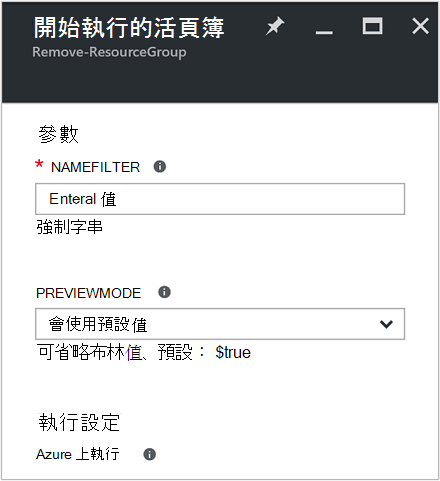
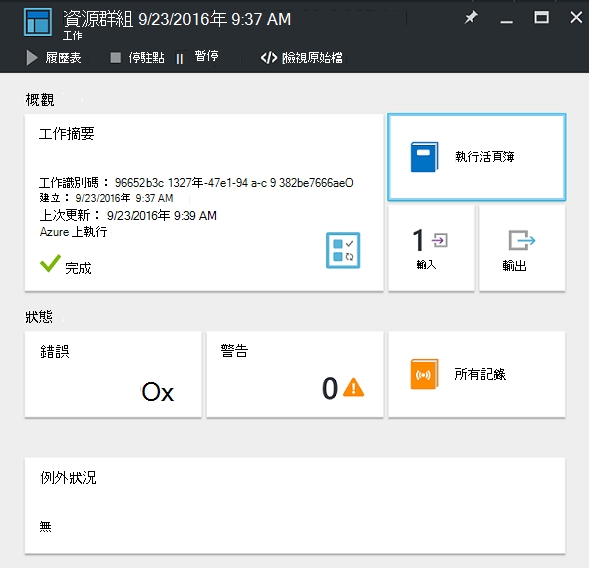
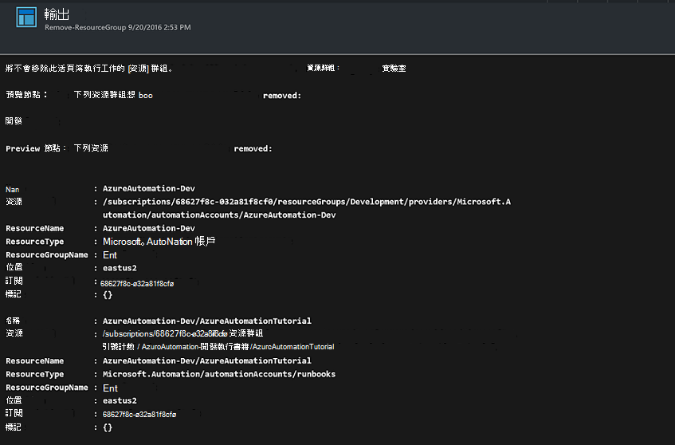

<properties
    pageTitle="自動化移除資源群組 |Microsoft Azure"
    description="包括您的訂閱中移除所有資源群組 runbooks Azure 自動化案例的 PowerShell 工作流程版本。"
    services="automation"
    documentationCenter=""
    authors="MGoedtel"
    manager="jwhit"
    editor=""
    />
<tags
    ms.service="automation"
    ms.workload="tbd"
    ms.tgt_pltfrm="na"
    ms.devlang="na"
    ms.topic="get-started-article"
    ms.date="09/26/2016"
    ms.author="magoedte"/>

# Azure 自動化案例-自動化的資源群組移除

許多客戶建立一個以上的資源群組。 一些可能會用來管理生產應用程式，與其他人可做為開發、 測試和臨時環境。 自動化這些資源的部署是項目，但也可以解除委任資源群組] 按鈕的按一下另一個。 您可以使用 Azure 自動化簡化一般管理工作。 這是如果您正在使用的耗費的限制，透過 MSDN 或 Microsoft 合作夥伴網路 Cloud Essentials 計畫等的成員優惠的 Azure 訂閱很有幫助。

此案例為基礎的 PowerShell runbook，設計用來從您的訂閱您指定的一或多個資源群組移除。 若要繼續之前先測試是 runbook 的預設設定。 如此一來，可確保您沒有不小心刪除資源群組之前您準備好要完成此程序。   

## 快速分析藍本

您可以從[PowerShell 庫](https://www.powershellgallery.com/packages/Remove-ResourceGroup/1.0/DisplayScript)下載 PowerShell runbook 包含這種情況。 您也可以直接從 Azure 入口網站中的[Runbook 庫](automation-runbook-gallery.md)匯它。  

Runbook | 描述|
----------|------------|
移除 ResourceGroup | 從訂閱中移除一或多個 Azure 資源群組及相關聯的資源。  
 
為此 runbook 定義下列輸入的參數︰

參數 | 描述|
----------|------------|
NameFilter （必要） | 指定名稱篩選器來限制您想要刪除的資源群組。 您可以將多個值，使用逗點分隔的清單。 篩選是不區分大小寫，並會使其符合包含字串的任何資源群組。|
PreviewMode （選用） | 執行 runbook，若要查看哪些資源群組會被刪除，但會採取任何動作。 預設為**true** ，協助避免意外刪除一或多個傳遞給 runbook 的資源群組。  

## 安裝和設定這種情況

### 必要條件

此 runbook 驗證使用[Azure 執行為帳戶](automation-sec-configure-azure-runas-account.md)。    

### 安裝及發佈 runbooks

下載 runbook 之後，您可以使用匯入其程序[匯入 runbook 程序](automation-creating-importing-runbook.md#importing-a-runbook-from-a-file-into-Azure-Automation)中。 其已成功匯入至您的自動化帳戶後，請發佈 runbook。

## 使用 runbook

下列步驟會引導您執行此 runbook 和協助您熟悉運作方式的執行。 您將只測試 runbook 在此範例中，並未實際刪除資源群組。  

1. 從 Azure] 入口網站中，開啟您的自動化帳戶，然後按一下 [ **Runbooks**]。
2. 選取 [**移除 ResourceGroup** runbook，然後按一下 [**開始**]。
3. Runbook 開始後，**開始 Runbook**刀隨即會開啟，且您可以設定參數。 在您的訂閱，您可以使用來測試並不小心刪除會導致不會輸入資源群組的名稱。  

    >[AZURE.NOTE] 請確定**Previewmode**設定為**true** ，以避免刪除選取的資源群組。  **注意**此 runbook 不會移除包含執行此 runbook 自動化帳戶的資源群組。  

4. 設定所有參數之後的值，按一下**[確定**]，並會執行排 runbook。  

若要在 Azure 入口網站檢視**移除 ResourceGroup** runbook 工作的詳細資訊，請選取**的工作**中 runbook。 輸入的參數和輸出資料流除了的工作及發生的任何例外狀況的一般資訊，則會顯示摘要工作。  。

**工作摘要**包含來自輸出警告，與錯誤資料流。 選取 [檢視詳細的結果，從 runbook 執行**輸出**。  

## 後續步驟

- 若要開始建立您自己的 runbook，請參閱[建立或匯入中 Azure 自動化 runbook](automation-creating-importing-runbook.md)。
- 若要開始使用 PowerShell 工作流程 runbooks，請參閱[我的第一個 PowerShell 工作流程 runbook](automation-first-runbook-textual.md)。
