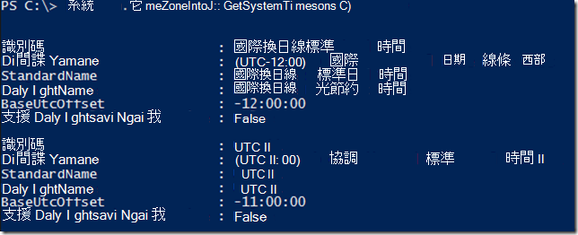

<properties
   pageTitle="使用 JSON 格式化標記，以建立的 Azure VM 啟動和關閉排程 |Microsoft Azure"
   description="本文將示範如何在標籤上使用 JSON 字串，這樣便可自動化 VM 啟動和關閉的排程。"
   services="automation"
   documentationCenter=""
   authors="MGoedtel"
   manager="jwhit"
   editor="tysonn" />
<tags
   ms.service="automation"
   ms.devlang="na"
   ms.topic="article"
   ms.tgt_pltfrm="na"
   ms.workload="infrastructure-services"
   ms.date="07/18/2016"
   ms.author="magoedte;paulomarquesc" />

# Azure 自動化案例︰ 使用 JSON 格式化標記，以建立的 Azure VM 啟動和關閉排程

客戶想要安排啟動和關閉虛擬機器，以協助降低訂閱成本或支援商務與技術的需求。  

下列情況可讓您設定自動的啟動和關閉您的 Vm 使用標記，稱為 [資源群組層級或 Azure 虛擬機器層級的排程。 此排程可以從星期日到 Saturday 以設定啟動時間] 和 [關閉時間。  

我們有一些--現成的選項。 這些功能包括︰
-  使用自動調整大小的設定，可讓您不按比例縮放或縮小，[虛擬機器縮放] 設定](../virtual-machine-scale-sets/virtual-machine-scale-sets-overview.md)。
- [DevTest 實驗室](../devtest-lab/devtest-lab-overview.md)服務已排程啟動和關閉作業的內建功能。

然而，這些選項僅支援特定案例並不能套用至基礎結構為-的-服務 (IaaS) Vm。   

當 [排程] 標籤套用至 [資源群組時，也會套用到該資源群組內的所有虛擬機器。 如果排程也會直接套用至 VM，最後一個排程優先以下列順序︰

1.  套用至 [資源群組的排程
2.  套用到資源群組和 [資源] 群組中的虛擬機器中的排程
3.  套用至虛擬機器中的排程

這種情況基本上採用 JSON 字串使用指定的格式，並將它做為的值的一部分排程的標籤。 然後 runbook 列出所有資源群組和虛擬機器，並根據先前所列的案例每個 VM 識別排程。 下一步它循環 Vm 具有附加的排程，並會評估應該採取什麼動作。 例如，它會決定 Vm 需要停止、 關機，或略過。

這些 runbooks 使用[Azure 執行為帳戶](../automation/automation-sec-configure-azure-runas-account.md)驗證。

## 下載案例 runbooks

您可以從[TechNet 圖庫](https://gallery.technet.microsoft.com/Azure-Automation-Runbooks-84f0efc7)或此專案的[GitHub](https://github.com/paulomarquesdacosta/azure-automation-scheduled-shutdown-and-startup)存放庫下載的四個 PowerShell 工作流程 runbooks 包含這種情況。

Runbook | 描述
----------|----------
測試 ResourceSchedule | 檢查每個虛擬機器排程，並執行關機] 或 [根據排程啟動。
新增 ResourceSchedule | 新增至 VM] 或 [資源群組的 [排程] 標籤。
更新 ResourceSchedule | 修改現有的排程標籤以將其取代為新。
移除 ResourceSchedule | 移除 VM] 或 [資源群組中的 [排程] 標籤。

## 安裝和設定這種情況

### 安裝及發佈 runbooks

下載之後 runbooks，您可以使用匯入這些程序中[建立或匯入中 Azure 自動化 runbook](automation-creating-importing-runbook.md#importing-a-runbook-from-a-file-into-Azure-Automation)。  每個 runbook 後發佈其已成功匯入至您的自動化帳戶。

### 若要測試 ResourceSchedule runbook 新增排程

請遵循這些步驟來啟用測試 ResourceSchedule runbook 的排程。 這是驗證虛擬機器應該是啟動、 關閉，或保留，runbook。

1. 從 Azure] 入口網站中，開啟您自動化的帳戶，，然後按一下 [ **Runbooks** ] 磚。
2. 在**測試 ResourceSchedule**刀中，按一下 [**排程**] 磚。
3. 在**排程**刀中，按一下 [**新增排程**。
4. 在**排程**刀中，選取 [**連結至您 runbook 排程**]。 然後選取 [**建立新的排程**。
5.  在**新的排程**刀中，輸入此排程，在 [名稱]，例如︰ *HourlyExecution*。
6. 排程**開始**，請為小時，然後設定啟動時間。
7. 選取 [**週期**]，，然後**重複發生的每個間隔內**，選取**1 小時**。
8. ]，確認**設定到期日**設為 [**否**]，然後按一下 [**建立**]，儲存新的排程。
9. 在**排程 Runbook**選項刀中，選取**參數和執行的設定**。 在測試 ResourceSchedule**參數**刀中，輸入您的訂閱**SubscriptionName**欄位中的名稱。  這是唯一的參數 runbook 所需。  完成後，請按一下**[確定**]。  

完成時，runbook 排程應該如下所示︰

 

## 設定 JSON 字串的格式

此方案 JSON 字串使用指定的格式，並將它做為標記的值會花費基本上稱為排程。 然後 runbook 列出所有資源群組和虛擬機器，並識別每個虛擬機器排程。

Runbook 循環查看虛擬機器具有附加的排程，並檢查應該採取什麼動作。 以下是範例格式化解決方案的方式︰

    {
       "TzId": "Eastern Standard Time",
        "0": {  
           "S": "11",
           "E": "17"
        },
        "1": {
           "S": "9",
           "E": "19"
        },
        "2": {
           "S": "9",
           "E": "19"
        },
    }

以下是一些此結構的詳細的資訊︰

1. 若要解決 256 個字元的限制 Azure 中的單一標籤值最佳化此 JSON 結構的格式。

2. *TzId*表示虛擬機器的時區。 您可以利用 TimeZoneInfo.NET 類別中 PowerShell 工作階段，取得此 ID**[System.TimeZoneInfo]:: GetSystemTimeZones()**。

    

    - 六個零的數字值表示多少個工作日。 零值等於星期日。
    - 開始時間表示有**S**的屬性，，其值為 24 小時制的格式。
    - End 或關閉時間表示有**E**的屬性，，其值為 24 小時制的格式。

    如果**S**和**E**每個屬性值為零 (0)，會保留在虛擬機器目前的狀態的評估次。   

3. 如果您想要略過評估特定一天的週，不新增章節週的那一天。 在下列範例中，僅星期一會評估，而且其他星期會被略過︰

        {
          "TzId": "Eastern Standard Time",
           "1": {
             "S": "11",
             "E": "17"
           }
        }

## 標記資源群組或 Vm

若要關閉 Vm，您必須標記 Vm 或它們是位於資源群組。 沒有排程標記的虛擬機器不會進行評估。 因此，他們無法啟動，或關閉。

有兩種方法可以標記資源群組或 Vm 此方案。 您可以直接從入口網站中執行。 或者，您可以使用新增 ResourceSchedule、 更新 ResourceSchedule 及移除 ResourceSchedule runbooks。

### 標記透過入口網站

請遵循下列步驟，在入口網站中標記的虛擬機器或資源群組︰

1. 簡維 JSON 字串，並確認沒有任何空格。  您的 JSON 字串看起來應該像這樣︰

        {"TzId":"Eastern Standard Time","0":{"S":"11","E":"17"},"1":{"S":"9","E":"19"},"2": {"S":"9","E":"19"},"3":{"S":"9","E":"19"},"4":{"S":"9","E":"19"},"5":{"S":"9","E":"19"},"6":{"S":"11","E":"17"}}

2. 選取要套用此排程 VM] 或 [資源群組的 [**標籤**] 圖示。

    
3. 標籤是追蹤金鑰/值組所定義。 在**索引鍵**欄位中，輸入**排程**，然後貼到 [**值**] 欄位的 [JSON 字串。 按一下 [**儲存**]。 您新增標籤現在應該出現在清單中的資源的標籤。

### 從 PowerShell 的標籤

所有的匯入的 runbooks 包含說明如何執行 runbooks 直接從 PowerShell 指令碼的開頭的說明資訊。 您可以從 PowerShell 呼叫新增 ScheduleResource 和更新 ScheduleResource runbooks。 藉由傳送必要的參數，可讓您建立或更新 VM] 或 [資源群組外部入口網站上的 [排程] 標籤執行此動作。  

若要建立，新增和刪除透過 PowerShell，您需要先[設定 PowerShell 的 Azure 環境](../powershell-install-configure.md)的標籤。 安裝完成後，您就可以使用下列步驟。

### 使用 PowerShell 建立排程標記

1. 開啟的 PowerShell 工作階段。 若要執行為帳戶驗證方法，並指定訂閱，然後使用下列範例︰   

        Conn = Get-AutomationConnection -Name AzureRunAsConnection
        Add-AzureRMAccount -ServicePrincipal -Tenant $Conn.TenantID `
        -ApplicationId $Conn.ApplicationID -CertificateThumbprint $Conn.CertificateThumbprint
        Select-AzureRmSubscription -SubscriptionName "MySubscription"

2. 定義排程雜湊資料表。 以下是如何應該建構的範例︰

        $schedule= @{ "TzId"="Eastern Standard Time"; "0"= @{"S"="11";"E"="17"};"1"= @{"S"="9";"E"="19"};"2"= @{"S"="9";"E"="19"};"3"= @{"S"="9";"E"="19"};"4"= @{"S"="9";"E"="19"};"5"= @{"S"="9";"E"="19"};"6"= @{"S"="11";"E"="17"}}

3. 定義 runbook 所需的參數。 在下列範例中，我們的目標 VM:

        $params = @{"SubscriptionName"="MySubscription";"ResourceGroupName"="ResourceGroup01"; `
        "VmName"="VM01";"Schedule"=$schedule}

    如果您標記資源群組，移除*VMName*參數 $params 雜湊資料表，如下所示︰

        $params = @{"SubscriptionName"="MySubscription";"ResourceGroupName"="ResourceGroup01"; `
        "Schedule"=$schedule}

4. 執行新增 ResourceSchedule runbook 使用下列參數來建立排程標記︰

        Start-AzureRmAutomationRunbook -Name "Add-ResourceSchedule" -Parameters $params `
        -AutomationAccountName "AutomationAccount" -ResourceGroupName "ResourceGroup01"

5. 若要更新的資源群組或虛擬機器標記，請執行**更新 ResourceSchedule** runbook，使用下列參數︰

        Start-AzureRmAutomationRunbook -Name "Update-ResourceSchedule" -Parameters $params `
        -AutomationAccountName "AutomationAccount" -ResourceGroupName "ResourceGroup01"

### 移除使用 PowerShell 排程標籤

1. 開啟的 PowerShell 工作階段，然後執行下列執行為帳戶驗證方法，以選取，然後指定訂閱︰

        Conn = Get-AutomationConnection -Name AzureRunAsConnection
        Add-AzureRMAccount -ServicePrincipal -Tenant $Conn.TenantID `
        -ApplicationId $Conn.ApplicationID -CertificateThumbprint $Conn.CertificateThumbprint
        Select-AzureRmSubscription -SubscriptionName "MySubscription"

2. 定義 runbook 所需的參數。 在下列範例中，我們的目標 VM:

        $params = @{"SubscriptionName"="MySubscription";"ResourceGroupName"="ResourceGroup01" `
        ;"VmName"="VM01"}

    如果您從 [資源群組移除標記，移除*VMName*參數 $params 雜湊資料表，如下所示︰

        $params = @{"SubscriptionName"="MySubscription";"ResourceGroupName"="ResourceGroup01"}

3. 執行移除 ResourceSchedule runbook，若要移除的排程標記︰

        Start-AzureRmAutomationRunbook -Name "Remove-ResourceSchedule" -Parameters $params `
        -AutomationAccountName "AutomationAccount" -ResourceGroupName "ResourceGroup01"

4. 若要更新的資源群組或虛擬機器標記，請執行移除 ResourceSchedule runbook，使用下列參數︰

        Start-AzureRmAutomationRunbook -Name "Remove-ResourceSchedule" -Parameters $params `
        -AutomationAccountName "AutomationAccount" -ResourceGroupName "ResourceGroup01"

>[AZURE.NOTE] 我們建議您主動監視以驗證您的虛擬機器都被關閉這些 runbooks （和虛擬機器狀態） 下，依此開始。  

若要在 Azure 入口網站檢視測試 ResourceSchedule runbook 工作的詳細資訊，請選取 runbook 的 [**工作**] 方塊。 如果發生摘要工作會顯示輸入的參數和輸出資料流，除了的工作及任何例外狀況的一般資訊。  

**工作摘要**包含來自輸出警告，與錯誤資料流。 選取檢視詳細的結果，從 runbook 執行的**輸出**磚。

  

## 後續步驟

-  若要開始使用 PowerShell 工作流程 runbooks，請參閱[我的第一個 PowerShell 工作流程 runbook](automation-first-runbook-textual.md)。
-  若要瞭解 runbook 類型，其優點和限制的詳細資訊，請參閱[Azure 自動化 runbook 類型](automation-runbook-types.md)。
-  如需 PowerShell 指令碼支援的功能，請參閱[Azure 自動化中支援的原生的 PowerShell 指令碼](https://azure.microsoft.com/blog/announcing-powershell-script-support-azure-automation-2/)。
-  若要瞭解 runbook 記錄和輸出的詳細資訊，請參閱[Runbook 輸出和 Azure 自動化中的郵件](automation-runbook-output-and-messages.md)。
-  若要進一步瞭解 Azure 執行為帳戶，以及如何使用它來驗證您 runbooks，請參閱[驗證 runbooks Azure 執行為帳戶](../automation/automation-sec-configure-azure-runas-account.md)。
