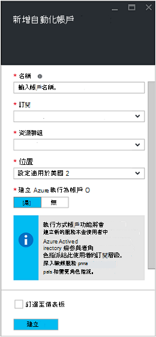
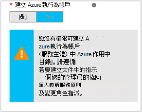

<properties
   pageTitle="設定 Azure AD 使用者帳戶 |Microsoft Azure"
   description="本文將說明如何在 Azure 自動化手錶和 ASM 進行驗證，設定 runbooks Azure AD 使用者帳戶認證。"
   services="automation"
   documentationCenter=""
   authors="MGoedtel"
   manager="jwhit"
   editor="tysonn"
   keywords="azure active directory 使用者，azure 服務管理、 azure ad 使用者帳戶" />
<tags
   ms.service="automation"
   ms.devlang="na"
   ms.topic="get-started-article"
   ms.tgt_pltfrm="na"
   ms.workload="infrastructure-services"
   ms.date="09/12/2016"
   ms.author="magoedte" />

# 驗證 Runbooks Azure 服務管理與資源管理員

本文將說明您設定 Azure 自動化 runbooks 針對 Azure 服務管理 (ASM) 或 Azure 資源管理員 (ARM) 資源執行的 Azure AD 使用者帳戶時，您必須執行的步驟。  雖然這仍然是支援的驗證的身分識別您 ARM 基礎 runbooks，建議的方法使用新的 Azure 執行為帳戶。       

## 建立新的 Azure Active Directory 使用者

1. 您想要管理的 Azure 訂閱服務管理員的身分登入 Azure 傳統入口網站。
2. 選取 [ **Active Directory**]，然後選取 [您組織的目錄的名稱。
3. 選取 [**使用者**] 索引標籤，然後在 [命令] 區域中，選取 [**新增使用者**。
4. 在 [**告訴我們瞭解此使用者**] 頁面**的使用者類型**] 下選取**您組織中的新使用者**。
5. 輸入使用者名稱。  
6. 選取的 Azure Active Directory 頁面上訂閱相關聯的目錄名稱。
7. 在 [**使用者設定檔**] 頁面上提供的第一個和最後一個名稱、 好記的名稱，以及使用者從 [**角色**] 清單。  執行**啟用多重因素驗證**。
8. 請注意使用者的完整名稱和暫時密碼。
9. 選取 [**設定 > 管理員 > 新增**。
10. 輸入完整的使用者名稱您所建立的使用者。
11. 選取您想要管理使用者訂閱]。
12. 登出 Azure，然後以您剛剛建立的帳戶重新登入。 系統會提示您變更使用者的密碼。

## Azure 傳統入口網站中建立自動化帳戶
在此區段中，您將會執行下列步驟，以將用於您管理 ASM 手錶] 模式中的資源的 runbooks Azure 入口網站中建立新的 Azure 自動化帳戶。  

>[AZURE.NOTE] 自動化帳戶 Azure 傳統入口網站以建立可管理 Azure 傳統和 Azure 入口網站及其中的 cmdlet 設定。 一旦建立帳戶之後，沒有差別如何建立及管理帳戶內的資源。 如果您打算要繼續使用 Azure 傳統入口網站，然後您應該使用它，而不是 Azure 入口網站來建立任何自動化帳戶。

1. 您想要管理的 Azure 訂閱服務管理員的身分登入 Azure 傳統入口網站。
2. 選取 [**自動化**]。
3. 在 [**自動化**] 頁面中，選取 [**建立自動化帳戶**。
4. 在**建立自動化帳戶**] 方塊中，輸入您的新自動化帳戶的名稱，然後從下拉式清單中選取的**區域**。  
5. 按一下**[確定]**以接受您的設定，並建立帳戶]。
6. 建立之後，會列出 [**自動化**] 頁面上。
7. 按一下帳戶，它會將您帶到儀表板頁面。  
8. 在自動化儀表板頁面上，選取 [**資產**]。
9. 在 [**資產**] 頁面上選取 [**新增設定**位於頁面底部的頁面]。
10. 在 [**新增設定**] 頁面中，選取 [**新增認證**]。
11. 在**定義的認證**] 頁面上，從 [**認證類型**] 下拉式清單中選取 [ **Windows PowerShell 認證**，並提供認證的名稱。
12. 下列**定義的認證**] 頁面中的使用者名稱的類型 AD 使用者帳戶建立較舊版本的**使用者名稱**] 欄位和 [**密碼**] 和 [**確認密碼**欄位中的密碼。 按一下**[確定]**儲存變更]。

## Azure 入口網站中建立自動化帳戶

在此區段中，您將會執行下列步驟，將會用於 runbooks 管理資源手錶模式中 Azure 入口網站中建立新的 Azure 自動化帳戶。  

1. 您想要管理的 Azure 訂閱服務管理員的身分登入 Azure 入口網站。
2. 選取 [**自動化帳戶**。
3. 在自動化帳戶刀中，按一下 [**新增**]。 
2. 在 [**新增自動化帳戶**刀，在 [**名稱**] 方塊中輸入您的新自動化帳戶的名稱。
5. 如果您有多個訂閱，指定新的帳戶，以及新的或現有的**資源群組**和 Azure 資料中心**位置**的項目。
3. 選取 [**無**選項的值**建立 Azure 執行為帳戶**，然後按一下 [**建立**] 按鈕。  

    >[AZURE.NOTE] 如果您選擇不執行方式可以建立帳戶選取 [**否**] 選項，您就會顯示警告訊息中**新增自動化帳戶**刀。  時建立帳戶，並指派給訂閱中的**參與者**角色，不會在您的訂閱有相對應的驗證身分識別，在您訂閱的目錄服務，因此，沒有存取資源。  這可防止任何 runbooks 參照此帳戶無法進行驗證，並執行針對 ARM 資源的工作。

    

4. 時 Azure 建立自動化帳戶，您可以從功能表來追蹤進度**通知**底下。

完成時建立的認證，然後您必須建立自動化帳戶與先前建立的 AD 使用者帳戶認證資產。  請記住，我們只所建立的自動化帳戶並不是與驗證身分識別相關聯。  執行[認證資產 Azure 自動化文件中的](../automation/automation-credentials.md#creating-a-new-credential)所述的步驟，並輸入**使用者名稱**格式**網域 \ 使用者**的值。

## 使用中 runbook 認證

您可以擷取中使用[取得 AutomationPSCredential](http://msdn.microsoft.com/library/dn940015.aspx)活動 runbook 認證，然後依照[新增 AzureAccount](http://msdn.microsoft.com/library/azure/dn722528.aspx)與連線至您訂閱的 Azure 使用它。 如果 Azure 的多個訂閱的管理員認證，然後您也應該使用[選取 AzureSubscription](http://msdn.microsoft.com/library/dn495203.aspx)指定正確的項目。 Windows PowerShell 下列通常是出現在大部分的 Azure 自動化 runbooks 頂端的範例所示。

    $cred = Get-AutomationPSCredential –Name "myuseraccount.onmicrosoft.com"
    Add-AzureAccount –Credential $cred
    Select-AzureSubscription –SubscriptionName "My Subscription"

您應該重複這些線條任何[檢查點](http://technet.microsoft.com/library/dn469257.aspx#bk_Checkpoints)之後，在您 runbook。 如果 runbook 暫停，然後再繼續進行在另一個工作，它將需要執行一次驗證。

## 後續步驟
* 檢閱不同 runbook 類型和建立您自己的 runbooks 下列文章[Azure 自動化 runbook 類型](../automation/automation-runbook-types.md)的步驟
