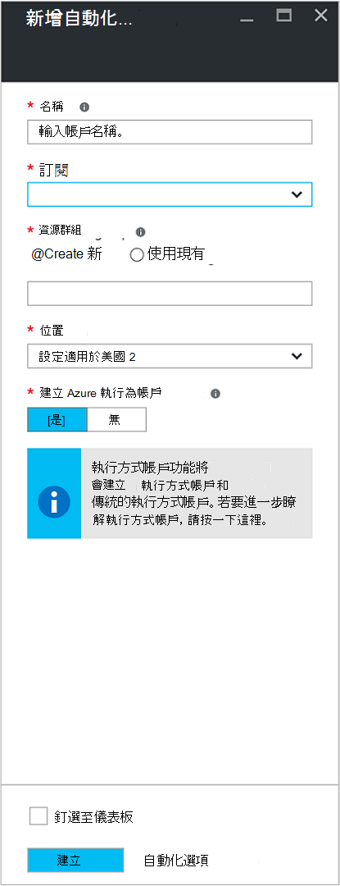
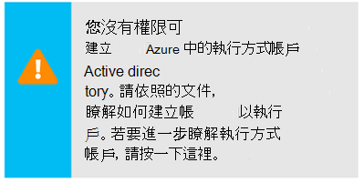
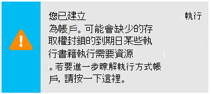
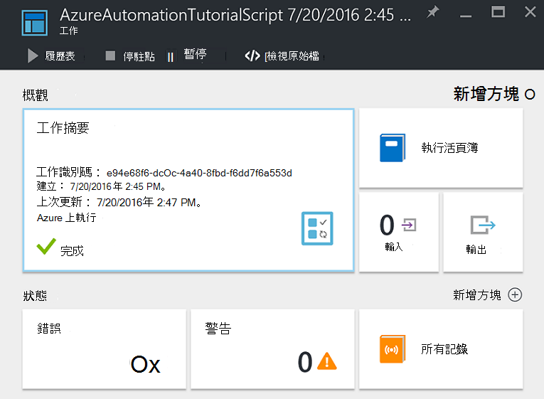
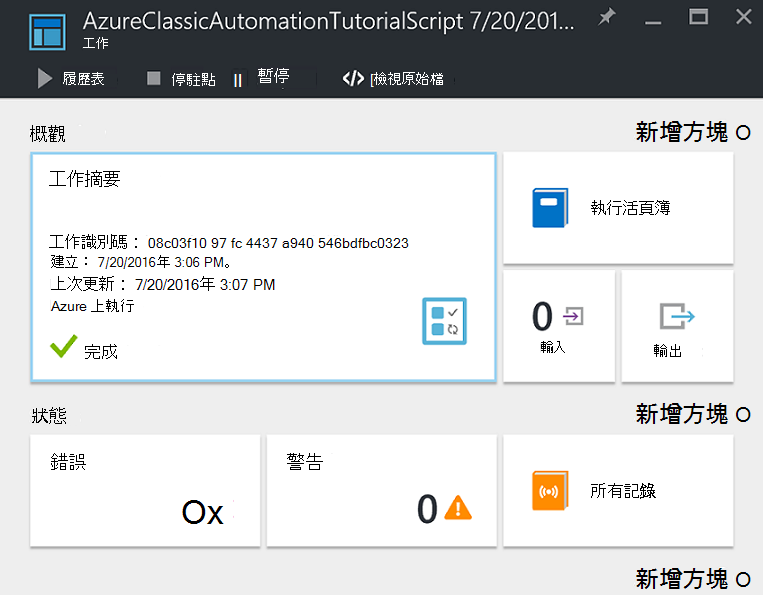
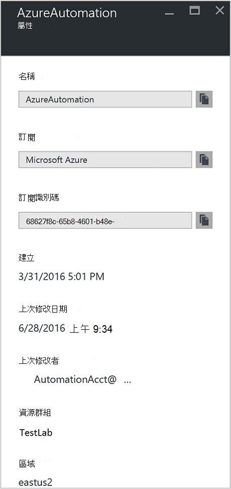

<properties
    pageTitle="為帳戶設定 Azure 執行 |Microsoft Azure"
    description="教學課程的引導您建立、 測試和範例使用 Azure 自動化中的安全性原則驗證。"
    services="automation"
    documentationCenter=""
    authors="mgoedtel"
    manager="jwhit"
    editor=""
    keywords="服務主體名稱、 setspn azure 驗證"/>
<tags
    ms.service="automation"
    ms.workload="tbd"
    ms.tgt_pltfrm="na"
    ms.devlang="na"
    ms.topic="get-started-article"
    ms.date="08/17/2016"
    ms.author="magoedte"/>

# Azure 執行為帳戶驗證方法 Runbooks

本主題說明如何設定自動化帳戶從 Azure 使用執行為帳戶功能來驗證 runbooks 管理資源 Azure 資源管理員或 Azure 服務管理中的入口網站。

當您建立新的自動化帳戶 Azure 入口網站中時，它會自動建立︰

- 執行以建立新的服務主要 Azure Active Directory 憑證，並將指派參與者的角色型存取控制 (RBAC)，將會用來管理資源管理員資源使用 runbooks 帳戶。   
- 傳統執行為帳戶上傳管理憑證，會用來管理 Azure 服務管理或使用 runbooks 傳統的資源。  

這會簡化程序，您可協助您快速開始建立並部署 runbooks 支援您自動化的需求。      

使用執行以及傳統執行的帳戶，您可以︰

- 提供標準化時從 runbooks Azure 入口網站中管理 Azure 資源管理員或 Azure 服務管理資源 Azure 驗證方法。  
- 自動設定 Azure 通知中的全域 runbooks 使用。

>[AZURE.NOTE] 自動化全域 Runbooks Azure[通知的整合功能](../monitoring-and-diagnostics/insights-receive-alert-notifications.md)需要自動化帳戶設定的執行方式和傳統執行為帳戶。 您可以選取自動化帳戶已經定義執行以及傳統執行帳戶，或選擇 [建立新的。

我們會告訴您如何從 Azure 入口網站中建立的自動化帳戶，請更新自動化帳戶使用 PowerShell，並示範如何在您 runbooks 進行驗證。

這是之前，有您應該瞭解並繼續進行之前，請考慮的一些事項。

1. 在 [傳統] 或 [資源管理員部署模型早已建立的現有自動化帳戶不會影響。  
2. 這會僅適用於透過 Azure 入口網站建立的自動化帳戶。  嘗試從 [傳統] 入口網站中建立帳戶並不會複寫執行為帳戶設定。
3. 如果您目前擁有 runbooks 和資產 （也就是排程、 變數等） 先前建立管理傳統的資源，且您想要這些 runbooks 傳統執行為帳戶驗證方法，您必須移轉至新的自動化帳戶或更新現有的帳戶使用下列 PowerShell 指令碼。  
4. 若要驗證使用新的執行方式帳戶與傳統執行為自動化帳戶，您需要修改您現有的 runbooks 使用以下的範例程式碼。  **請注意**的執行方式帳戶是針對資源管理員資源使用主體的憑證服務與傳統執行為帳戶驗證適用於驗證的服務管理資源管理憑證。     

## 從 Azure 入口網站中建立新的自動化帳戶

在此區段中，您將會執行下列步驟，以從 Azure 入口網站中建立新的 Azure 自動化帳戶。  這樣會建立執行方式和傳統的執行方式帳戶。  

>[AZURE.NOTE] 執行這些步驟，*必須*訂閱的管理員角色的成員和訂閱的授與使用者的存取權訂閱的共同管理員的使用者。  使用者必須也會新增為使用者的訂閱預設值。帳戶不需要指派給有權限的角色。

1. Azure 入口網站所訂閱的管理員角色的成員和訂閱的共同管理員帳戶登入。
2. 選取 [**自動化帳戶**。
3. 在自動化帳戶刀中，按一下 [**新增**]。 

    >[AZURE.NOTE]如果您看到下列警告中**新增自動化帳戶**刀，這是因為您的帳戶不是訂閱的管理員角色的成員和訂閱的共同管理員。 

4. 在 [**新增自動化帳戶**刀，在 [**名稱**] 方塊中輸入您的新自動化帳戶的名稱。
5. 如果您有多個訂閱，可以指定一個新的帳戶，以及新的或現有的**資源群組**和 Azure 資料中心**的位置**。
6. 確認已選取 [**是****建立 Azure 執行為帳戶**] 選項中的值，然後按一下 [**建立**] 按鈕。  

    >[AZURE.NOTE] 如果您選擇不執行方式可以建立帳戶選取 [**否**] 選項，您就會顯示警告訊息中**新增自動化帳戶**刀。  時 Azure 入口網站中建立帳戶之後，不會在您的訂閱有相對應的驗證身分識別內您傳統或資源管理員訂閱目錄服務，因此，沒有資源的存取權。  這可防止任何 runbooks 參照此帳戶無法進行驗證，並執行這些部署模型中針對資源的工作。

    > 
不建立服務主要時不會有的參與者角色。

7. 時 Azure 建立自動化帳戶，您可以從功能表來追蹤進度**通知**底下。

### 包含的資源

自動化帳戶已成功建立時，會自動為您建立多項資源。  下表摘要列出資源的執行方式帳戶。 

資源|描述
--------|-----------
AzureAutomationTutorial Runbook|範例 PowerShell runbook 示範如何使用的執行方式帳戶進行驗證，並取得所有資源管理員資源。
AzureAutomationTutorialScript Runbook|範例 PowerShell runbook 示範如何使用的執行方式帳戶進行驗證，並取得所有資源管理員資源。
AzureRunAsCertificate|自動建立時自動化帳戶建立，或使用下列 PowerShell 指令碼的現有帳戶的憑證資產。  可以讓您可以從 runbooks 管理 Azure 資源管理員資源 Azure 驗證方法。  這個憑證都有一年為單位的週期。
AzureRunAsConnection|自動建立時自動化帳戶建立，或使用下列 PowerShell 指令碼的現有帳戶的連線資產。

下表摘要列出傳統執行為帳戶的資源。 

資源|描述
--------|-----------
AzureClassicAutomationTutorial Runbook|範例 runbook 訂閱，使用傳統執行為帳戶 （憑證） 中取得所有傳統 Vm 和然後輸出 VM 名稱和狀態。
AzureClassicAutomationTutorial 指令碼 Runbook|範例 runbook 訂閱，使用傳統執行為帳戶 （憑證） 中取得所有傳統 Vm 和然後輸出 VM 名稱和狀態。
AzureClassicRunAsCertificate|憑證資產自動建立用來讓您可以從 runbooks 管理 Azure 傳統資源 Azure 驗證方法。  這個憑證都有一年為單位的週期。
AzureClassicRunAsConnection|連線資產自動建立用來讓您可以從 runbooks 管理 Azure 傳統資源 Azure 驗證方法。  

## 確認執行身分驗證

接下來我們將執行小型測試，以確認您可以使用新的執行方式帳戶已成功進行驗證。     

1. 在 [Azure 入口網站中，開啟先前建立的自動化帳戶。  
2. 按一下 [ **Runbooks** ] 方塊，以開啟 runbooks 清單。
3. 選取**AzureAutomationTutorialScript** runbook，然後再按一下 [開始 runbook 的 [**開始**]。  您會收到的驗證您要啟動 runbook 的提示。
4. 建立[runbook 工作](automation-runbook-execution.md)時，即會顯示刀，工作，顯示在 [**工作摘要**] 方塊中的工作狀態。  
5. 工作狀態就會開始為*佇列*指出等待在雲端 runbook 工作者，才可供使用。 當工作者宣告工作，然後*執行*runbook 實際開始執行時，它然後會移到*開始*。  
6. Runbook 工作完成時，我們應該會看到狀態為 [**已完成]**。   
7. 若要查看詳細 runbook 的結果，請按一下 [**輸出**圖磚上。
8. 在 [**輸出**刀中，您應該會看到順利驗證並傳回的所有資源的 [資源] 群組中，您可以使用清單。
9. 關閉**輸出**刀，若要返回**工作摘要**刀。
13. 關閉**工作摘要**與對應**AzureAutomationTutorialScript** runbook。

## 驗證傳統執行身分驗證

下一步我們會執行小型的測試，以確認您可以使用新的傳統執行為帳戶已成功進行驗證。     

1. 在 [Azure 入口網站中，開啟先前建立的自動化帳戶。  
2. 按一下 [ **Runbooks** ] 方塊，以開啟 runbooks 清單。
3. 選取**AzureClassicAutomationTutorialScript** runbook，然後再按一下 [開始 runbook 的 [**開始**]。  您會收到的驗證您要啟動 runbook 的提示。
4. 建立[runbook 工作](automation-runbook-execution.md)時，即會顯示刀，工作，顯示在 [**工作摘要**] 方塊中的工作狀態。  
5. 工作狀態就會開始為*佇列*指出等待在雲端 runbook 工作者，才可供使用。 當工作者宣告工作，然後*執行*runbook 實際開始執行時，它然後會移到*開始*。  
6. Runbook 工作完成時，我們應該會看到狀態為 [**已完成]**。   
7. 若要查看詳細 runbook 的結果，請按一下 [**輸出**圖磚上。
8. 在 [**輸出**刀中，您應該會看到順利驗證並傳回的所有傳統 VM 清單的訂閱中。
9. 關閉**輸出**刀，若要返回**工作摘要**刀。
13. 關閉**工作摘要**與對應**AzureClassicAutomationTutorialScript** runbook。

## 更新自動化帳戶使用 PowerShell

以下我們會提供使用 PowerShell 來更新現有的自動化帳戶的選項︰

1. 您建立自動化帳戶，但若要建立的執行方式帳戶拒絕
2. 您已經擁有自動化帳戶管理資源管理員的資源，而您想要更新以包含 runbook 驗證的執行方式帳戶
2. 您已經有自動化帳戶管理傳統的資源，並想將其作為傳統執行，而非建立新帳戶，以便移轉您的 runbooks 和資產更新   

在進行之前，請確認下列動作︰

1. 您必須下載並安裝[Windows 管理 Framework (WMF) 4.0](https://www.microsoft.com/download/details.aspx?id=40855) ，如果您執行的 Windows 7。   
    如果您正在執行 Windows Server 2012 R2、 Windows Server 2012、 Windows 2008 R2、 Windows 8.1 和 Windows 7 SP1， [Windows 管理架構 5.0](https://www.microsoft.com/download/details.aspx?id=50395)是可用的安裝。
2. Azure PowerShell 1.0。 此版本，以及如何將其安裝的相關資訊，請參閱[如何安裝和設定 PowerShell 的 Azure](../powershell-install-configure.md)。
3. 您已經建立自動化帳戶。  此帳戶會參照做為參數的值-AutomationAccountName 和-ApplicationDisplayName 在下列兩個指令碼。

取得*SubscriptionID* *ResourceGroup*，與*AutomationAccountName*的值，哪些是必要的參數的指令碼，Azure 入口網站中選取您的自動化帳戶**自動化帳戶**刀從並選取**所有設定**。  從**所有設定**刀中，選取 [在 [**帳戶設定**的 [**屬性**]。  在**屬性**刀中，您可以記下這些值。    

### 建立執行帳戶 PowerShell 指令碼

下列 PowerShell 指令碼會設定下列項目︰

- 將自我簽署憑證，以驗證的 Azure AD 應用程式中 Azure AD，建立這個應用程式的本金帳戶給服務，指定在您目前的訂閱此帳戶的參與者角色 （您可能會變更此擁有者或任何其他角色）。  如需詳細資訊，請檢閱[Azure 自動化中的角色型存取控制](../automation/automation-role-based-access-control.md)文件。
- 自動化憑證資產在指定的自動化帳戶命名**AzureRunAsCertificate**，它會保留原則服務所使用的憑證。
- 自動化連線資產在指定的自動化帳戶命名**AzureRunAsConnection**，它會保留 applicationId、 tenantId、 subscriptionId 及憑證指紋。    

下列步驟會引導您執行指令碼的程序執行。

1. 儲存在您的電腦上的下列指令碼。  在此範例中，請將其儲存**新增 AzureServicePrincipal.ps1**檔名。  

        #Requires -RunAsAdministrator
        Param (
        [Parameter(Mandatory=$true)]
        [String] $ResourceGroup,

        [Parameter(Mandatory=$true)]
        [String] $AutomationAccountName,

        [Parameter(Mandatory=$true)]
        [String] $ApplicationDisplayName,

        [Parameter(Mandatory=$true)]
        [String] $SubscriptionId,

        [Parameter(Mandatory=$true)]
        [String] $CertPlainPassword,

        [Parameter(Mandatory=$false)]
        [int] $NoOfMonthsUntilExpired = 12
        )

        Login-AzureRmAccount
        Import-Module AzureRM.Resources
        Select-AzureRmSubscription -SubscriptionId $SubscriptionId

        $CurrentDate = Get-Date
        $EndDate = $CurrentDate.AddMonths($NoOfMonthsUntilExpired)
        $KeyId = (New-Guid).Guid
        $CertPath = Join-Path $env:TEMP ($ApplicationDisplayName + ".pfx")

        $Cert = New-SelfSignedCertificate -DnsName $ApplicationDisplayName -CertStoreLocation cert:\LocalMachine\My -KeyExportPolicy Exportable -Provider "Microsoft Enhanced RSA and AES Cryptographic Provider"

        $CertPassword = ConvertTo-SecureString $CertPlainPassword -AsPlainText -Force
        Export-PfxCertificate -Cert ("Cert:\localmachine\my\" + $Cert.Thumbprint) -FilePath $CertPath -Password $CertPassword -Force | Write-Verbose

        $PFXCert = New-Object -TypeName System.Security.Cryptography.X509Certificates.X509Certificate -ArgumentList @($CertPath, $CertPlainPassword)
        $KeyValue = [System.Convert]::ToBase64String($PFXCert.GetRawCertData())

        $KeyCredential = New-Object  Microsoft.Azure.Commands.Resources.Models.ActiveDirectory.PSADKeyCredential
        $KeyCredential.StartDate = $CurrentDate
        $KeyCredential.EndDate= $EndDate
        $KeyCredential.KeyId = $KeyId
        $KeyCredential.Type = "AsymmetricX509Cert"
        $KeyCredential.Usage = "Verify"
        $KeyCredential.Value = $KeyValue

        # Use Key credentials
        $Application = New-AzureRmADApplication -DisplayName $ApplicationDisplayName -HomePage ("http://" + $ApplicationDisplayName) -IdentifierUris ("http://" + $KeyId) -KeyCredentials $keyCredential

        New-AzureRMADServicePrincipal -ApplicationId $Application.ApplicationId | Write-Verbose
        Get-AzureRmADServicePrincipal | Where {$_.ApplicationId -eq $Application.ApplicationId} | Write-Verbose

        $NewRole = $null
        $Retries = 0;
        While ($NewRole -eq $null -and $Retries -le 6)
        {
           # Sleep here for a few seconds to allow the service principal application to become active (should only take a couple of seconds normally)
           Sleep 5
           New-AzureRMRoleAssignment -RoleDefinitionName Contributor -ServicePrincipalName $Application.ApplicationId | Write-Verbose -ErrorAction SilentlyContinue
           Sleep 10
           $NewRole = Get-AzureRMRoleAssignment -ServicePrincipalName $Application.ApplicationId -ErrorAction SilentlyContinue
           $Retries++;
        }

        # Get the tenant id for this subscription
        $SubscriptionInfo = Get-AzureRmSubscription -SubscriptionId $SubscriptionId
        $TenantID = $SubscriptionInfo | Select TenantId -First 1

        # Create the automation resources
        New-AzureRmAutomationCertificate -ResourceGroupName $ResourceGroup -AutomationAccountName $AutomationAccountName -Path $CertPath -Name AzureRunAsCertificate -Password $CertPassword -Exportable | write-verbose

        # Create a Automation connection asset named AzureRunAsConnection in the Automation account. This connection uses the service principal.
        $ConnectionAssetName = "AzureRunAsConnection"
        Remove-AzureRmAutomationConnection -ResourceGroupName $ResourceGroup -AutomationAccountName $AutomationAccountName -Name $ConnectionAssetName -Force -ErrorAction SilentlyContinue
        $ConnectionFieldValues = @{"ApplicationId" = $Application.ApplicationId; "TenantId" = $TenantID.TenantId; "CertificateThumbprint" = $Cert.Thumbprint; "SubscriptionId" = $SubscriptionId}
        New-AzureRmAutomationConnection -ResourceGroupName $ResourceGroup -AutomationAccountName $AutomationAccountName -Name $ConnectionAssetName -ConnectionTypeName AzureServicePrincipal -ConnectionFieldValues $ConnectionFieldValues

2. 在電腦上，請從**[開始**] 畫面，以提高權限的使用者權限啟動**Windows PowerShell** 。
3. 從較高的 PowerShell 命令列殼層，瀏覽至資料夾會包含在步驟 1 建立的指令碼，並執行指令碼變更參數的值*-ResourceGroup* *-AutomationAccountName*、 *-ApplicationDisplayName*、 *-SubscriptionId*，與*-CertPlainPassword*。 

    >[AZURE.NOTE] 系統會提示後執行指令碼 Azure 驗證方法。 您必須登入帳戶所訂閱的管理員角色的成員共同管理者的訂閱。

        .\New-AzureServicePrincipal.ps1 -ResourceGroup <ResourceGroupName>
        -AutomationAccountName <NameofAutomationAccount> `
        -ApplicationDisplayName <DisplayNameofAutomationAccount> `
        -SubscriptionId <SubscriptionId> `
        -CertPlainPassword "<StrongPassword>"  
 

指令碼順利完成後，請參閱[範例](#sample-code-to-authenticate-with-resource-manager-resources)以驗證與資源管理員資源和驗證認證設定。

### 建立傳統執行為帳戶 PowerShell 指令碼

下列 PowerShell 指令碼會設定下列項目︰

- 自動化憑證資產在指定的自動化帳戶命名**AzureClassicRunAsCertificate**，它會保留用來驗證您 runbooks 的憑證。
- 自動化連線資產在指定的自動化帳戶命名**AzureClassicRunAsConnection**，它會保留的訂閱名稱 」、 「 subscriptionId 與憑證資產名稱。

指令碼會建立自我簽署的管理憑證，並將它儲存到暫存檔案資料夾中，用來執行 PowerShell 工作階段- *%USERPROFILE%\AppData\Local\Temp*使用者設定檔] 下您電腦上。  後執行指令碼，您必須建立自動化帳戶的訂閱管理存放區上傳 Azure 管理憑證。  下列步驟會引導您執行指令碼及上傳憑證的程序執行。  

1. 儲存在您的電腦上的下列指令碼。  在此範例中，請將其儲存**新增 AzureClassicRunAsAccount.ps1**檔名。

        #Requires -RunAsAdministrator
        Param (
        [Parameter(Mandatory=$true)]
        [String] $ResourceGroup,

        [Parameter(Mandatory=$true)]
        [String] $AutomationAccountName,

        [Parameter(Mandatory=$true)]
        [String] $ApplicationDisplayName,

        [Parameter(Mandatory=$true)]
        [String] $SubscriptionId,

        [Parameter(Mandatory=$true)]
        [String] $CertPlainPassword,

        [Parameter(Mandatory=$false)]
        [int] $NoOfMonthsUntilExpired = 12
        )

        Login-AzureRmAccount
        Import-Module AzureRM.Resources
        $Subscription = Select-AzureRmSubscription -SubscriptionId $SubscriptionId
        $SubscriptionName = $subscription.Subscription.SubscriptionName

        $CurrentDate = Get-Date
        $EndDate = $CurrentDate.AddMonths($NoOfMonthsUntilExpired)
        $KeyId = (New-Guid).Guid
        $CertPath = Join-Path $env:TEMP ($ApplicationDisplayName + ".pfx")
        $CertPathCer = Join-Path $env:TEMP ($ApplicationDisplayName + ".cer")

        $Cert = New-SelfSignedCertificate -DnsName $ApplicationDisplayName -CertStoreLocation cert:\LocalMachine\My -KeyExportPolicy Exportable -Provider "Microsoft Enhanced RSA and AES Cryptographic Provider"

        $CertPassword = ConvertTo-SecureString $CertPlainPassword -AsPlainText -Force
        Export-PfxCertificate -Cert ("Cert:\localmachine\my\" + $Cert.Thumbprint) -FilePath $CertPath -Password $CertPassword -Force | Write-Verbose
        Export-Certificate -Cert ("Cert:\localmachine\my\" + $Cert.Thumbprint) -FilePath $CertPathCer -Type CERT | Write-Verbose

        # Create the automation resources
        $ClassicCertificateAssetName = "AzureClassicRunAsCertificate"
        New-AzureRmAutomationCertificate -ResourceGroupName $ResourceGroup -AutomationAccountName $AutomationAccountName -Path $CertPath -Name $ClassicCertificateAssetName  -Password $CertPassword -Exportable | write-verbose

        # Create a Automation connection asset named AzureClassicRunAsConnection in the Automation account. This connection uses the ClassicCertificateAssetName.
        $ConnectionAssetName = "AzureClassicRunAsConnection"
        Remove-AzureRmAutomationConnection -ResourceGroupName $ResourceGroup -AutomationAccountName $AutomationAccountName -Name $ConnectionAssetName -Force -ErrorAction SilentlyContinue
        $ConnectionFieldValues = @{"SubscriptionName" = $SubscriptionName; "SubscriptionId" = $SubscriptionId; "CertificateAssetName" = $ClassicCertificateAssetName}
        New-AzureRmAutomationConnection -ResourceGroupName $ResourceGroup -AutomationAccountName $AutomationAccountName -Name $ConnectionAssetName -ConnectionTypeName AzureClassicCertificate -ConnectionFieldValues $ConnectionFieldValues

        Write-Host -ForegroundColor red "Please upload the cert $CertPathCer to the Management store by following the steps below."
        Write-Host -ForegroundColor red "Log in to the Microsoft Azure Management portal (https://manage.windowsazure.com) and select Settings -> Management Certificates."
        Write-Host -ForegroundColor red "Then click Upload and upload the certificate $CertPathCer"

2. 在電腦上，請從**[開始**] 畫面，以提高權限的使用者權限啟動**Windows PowerShell** 。  
3. 從較高的 PowerShell 命令列殼層，瀏覽至資料夾會包含在步驟 1 建立的指令碼，並執行指令碼變更參數的值*-ResourceGroup* *-AutomationAccountName*、 *-ApplicationDisplayName*、 *-SubscriptionId*，與*-CertPlainPassword*。 

    >[AZURE.NOTE] 系統會提示後執行指令碼 Azure 驗證方法。 您必須登入帳戶所訂閱的管理員角色的成員共同管理者的訂閱。

        .\New-AzureClassicRunAsAccount.ps1 -ResourceGroup <ResourceGroupName>
        -AutomationAccountName <NameofAutomationAccount> `
        -ApplicationDisplayName <DisplayNameofAutomationAccount> `
        -SubscriptionId <SubscriptionId> `
        -CertPlainPassword "<StrongPassword>"

指令碼順利完成後，您必須將複製的使用者設定檔**Temp**資料夾中建立的憑證。  Azure 傳統入口網站中遵循的步驟[上傳管理 API 憑證](../azure-api-management-certs.md)，然後指向 [[程式碼範例](#sample-code-to-authenticate-with-service-management-resources)，以驗證與服務管理資源的認證設定。

## 資源管理員資源的驗證的程式碼範例

您可以使用更新的範例程式碼，從**AzureAutomationTutorialScript**範例 runbook，取得驗證使用的執行方式帳戶來管理您的 runbooks 與資源管理員資源。   

    $connectionName = "AzureRunAsConnection"
    $SubId = Get-AutomationVariable -Name 'SubscriptionId'
    try
    {
       # Get the connection "AzureRunAsConnection "
       $servicePrincipalConnection=Get-AutomationConnection -Name $connectionName         

       "Logging in to Azure..."
       Add-AzureRmAccount `
         -ServicePrincipal `
         -TenantId $servicePrincipalConnection.TenantId `
         -ApplicationId $servicePrincipalConnection.ApplicationId `
         -CertificateThumbprint $servicePrincipalConnection.CertificateThumbprint
       "Setting context to a specific subscription"  
       Set-AzureRmContext -SubscriptionId $SubId             
    }
    catch {
        if (!$servicePrincipalConnection)
        {
           $ErrorMessage = "Connection $connectionName not found."
           throw $ErrorMessage
         } else{
            Write-Error -Message $_.Exception
            throw $_.Exception
         }
    }

指令碼包含兩個額外的程式碼來支援，因此您可以輕鬆地使用之間的多個訂閱，請參考的訂閱內容。 名為 SubscriptionId 變數資產包含的識別碼的訂閱，並新增 AzureRmAccount cmdlet 陳述式之後[設定 AzureRmContext 指令程式](https://msdn.microsoft.com/library/mt619263.aspx)所述的參數設定*-SubscriptionId*。 如果太一般變數的名稱，您可以修改包含 [首碼] 或 [其他命名慣例，使其更易於找出您的目的變數的名稱。 或者，您可以使用參數設定，而不是-SubscriptionId-SubscriptionName 對應的變數資產。  

請注意 cmdlet 用於驗證中 runbook-**新增 AzureRmAccount**，使用 [ *ServicePrincipalCertificate*參數設定。  它會驗證使用的服務本金憑證，不認證。  

## 驗證服務管理資源的程式碼範例

您可以使用下列，更新的範例程式碼取自**AzureClassicAutomationTutorialScript**範例 runbook 中，使用傳統執行為帳戶管理傳統的資源，與您 runbooks 進行驗證。

    $ConnectionAssetName = "AzureClassicRunAsConnection"
    # Get the connection
    $connection = Get-AutomationConnection -Name $connectionAssetName        

    # Authenticate to Azure with certificate
    Write-Verbose "Get connection asset: $ConnectionAssetName" -Verbose
    $Conn = Get-AutomationConnection -Name $ConnectionAssetName
    if ($Conn -eq $null)
    {
       throw "Could not retrieve connection asset: $ConnectionAssetName. Assure that this asset exists in the Automation account."
    }

    $CertificateAssetName = $Conn.CertificateAssetName
    Write-Verbose "Getting the certificate: $CertificateAssetName" -Verbose
    $AzureCert = Get-AutomationCertificate -Name $CertificateAssetName
    if ($AzureCert -eq $null)
    {
       throw "Could not retrieve certificate asset: $CertificateAssetName. Assure that this asset exists in the Automation account."
    }

    Write-Verbose "Authenticating to Azure with certificate." -Verbose
    Set-AzureSubscription -SubscriptionName $Conn.SubscriptionName -SubscriptionId $Conn.SubscriptionID -Certificate $AzureCert
    Select-AzureSubscription -SubscriptionId $Conn.SubscriptionID

## 後續步驟

- 如需服務原則的詳細資訊，請參閱[應用程式與服務主要物件](../active-directory/active-directory-application-objects.md)。
- 如需在 Azure 自動化角色型存取控制的詳細資訊，請參閱[Azure 自動化中的角色型存取控制](../automation/automation-role-based-access-control.md)。
- 如需有關憑證和 Azure 服務的詳細資訊，請參閱[Azure 雲端服務的憑證概觀](../cloud-services/cloud-services-certs-create.md)
