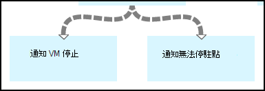

<properties 
    pageTitle="啟動和停止虛擬機器-圖形 |Microsoft Azure"
    description="Azure 自動化案例包括 runbooks 來啟動和停止傳統的虛擬機器 PowerShell 工作流程版本。"
    services="automation"
    documentationCenter=""
    authors="mgoedtel"
    manager="jwhit"
    editor="tysonn" />
<tags 
    ms.service="automation"
    ms.devlang="na"
    ms.topic="article"
    ms.tgt_pltfrm="na"
    ms.workload="infrastructure-services"
    ms.date="07/06/2016"
    ms.author="bwren" />

# Azure 自動化案例-啟動和停止虛擬機器

這個案例中 Azure 自動化包含 runbooks 來啟動和停止傳統的虛擬機器。  您可以使用這個案例中的下列任何一項︰  

- 您自己的環境中使用不需要修改 runbooks。 
- 若要執行的自訂的功能 runbooks [修改]。  
- 呼叫 runbooks 從另一個 runbook 整體解決方案的一部分。 
- 若要瞭解 runbook 撰寫概念作為教學課程 runbooks。 

> [AZURE.SELECTOR]
- [圖形](automation-solution-startstopvm-graphical.md)
- [PowerShell 工作流程](automation-solution-startstopvm-psworkflow.md)

這是這種情況的圖形化 runbook 版本。 也會有該使用[PowerShell 工作流程 runbooks](automation-solution-startstopvm-psworkflow.md)。

## 快速分析藍本

此案例包含兩個兩個圖形 runbooks，您可以從下列連結下載。  請參閱這個案例中的連結 PowerShell 工作流程 runbooks [PowerShell 工作流程版本](automation-solution-startstopvm-psworkflow.md)。

| Runbook | 連結 | 類型 | 描述 |
|:---|:---|:---|:---|
| StartAzureClassicVM | [啟動 Azure 傳統 VM 圖形 Runbook](https://gallery.technet.microsoft.com/scriptcenter/Start-Azure-Classic-VM-c6067b3d) | 圖形 | 啟動 Azure 的訂閱或使用特定的服務名稱的所有虛擬機器中的所有傳統的虛擬機器。 |
| StopAzureClassicVM | [停止 Azure 傳統 VM 圖形 Runbook](https://gallery.technet.microsoft.com/scriptcenter/Stop-Azure-Classic-VM-397819bd) | 圖形 | 停止在自動化帳戶中的所有虛擬機器或所有的虛擬機器使用特定的服務名稱。  |

## 安裝及設定此案例

### 1.安裝 runbooks

下載之後 runbooks，您可以將它們使用[圖形 runbook 程序](automation-graphical-authoring-intro.md#graphical-runbook-procedures)中的程序匯入。

### 2.檢閱的描述與需求
Runbooks 包含**讀我檔案**包含描述所需的資產的活動。  您可以藉由選取**讀我檔案**活動的**工作流程指令碼**參數來檢視這項資訊。  您也可以從這篇文章取得相同的資訊。 

### 3.設定資產
Runbooks 要求動作的資產，您必須建立並填入適當的值。  名稱是預設值。  如果啟動 runbook 時，[輸入的參數](#using-the-runbooks)中指定的名稱，您可以使用不同名稱的資產。

| 資產類型 | 預設名稱 | 描述 |
|:---|:---|:---|:---|
| [認證](automation-credentials.md) | AzureCredential | 包含具有啟動和停止虛擬機器 Azure 訂閱中的權限的帳戶認證。  |
| [變數](automation-variables.md) | AzureSubscriptionId | 包含您的 Azure 訂閱訂閱 ID。 |

## 使用此案例

### 參數

每個 runbooks 有下列[輸入的參數](automation-starting-a-runbook.md#runbook-parameters)。  您必須提供的任何必要的參數的值，並可以選擇性地為提供的值其他參數根據您的需求。

| 參數 | 類型 | 強制性 | 描述 |
|:---|:---|:---|:---|
| ServiceName | 字串 | 無 | 如果提供值，然後使用該服務名稱的所有虛擬機器會啟動或停止。  如果未不提供任何值，然後 Azure 訂閱中的所有傳統虛擬機器會啟動或停止。 |
| AzureSubscriptionIdAssetName | 字串 | 無 | 包含的[變數資產](#installing-and-configuring-the-scenario)，包含訂閱 ID Azure 訂閱的名稱。  如果您不指定的值，則會使用*AzureSubscriptionId* 。  |
| AzureCredentialAssetName | 字串 | 無 | 包含的[認證資產](#installing-and-configuring-the-scenario)包含使用 runbook 認證的名稱。  如果您不指定的值，則會使用*AzureCredential* 。  |

### 啟動 runbooks

您可以在[啟動 Azure 自動化中 runbook](automation-starting-a-runbook.md)使用任何一種方法來啟動其中一個 runbooks 本文中。

下列範例命令會使用 Windows PowerShell 來執行**StartAzureClassicVM**與服務名稱*MyVMService*進行所有虛擬機器。

    $params = @{"ServiceName"="MyVMService"}
    Start-AzureAutomationRunbook –AutomationAccountName "MyAutomationAccount" –Name "StartAzureClassicVM" –Parameters $params

### 輸出

Runbooks 將[輸出郵件](automation-runbook-output-and-messages.md)的每個虛擬機器指出已成功提交啟動或停止指示。  您可以尋找輸出來決定的每個 runbook 結果中的特定字串。  下表列出可能的輸出字串。

| Runbook | 條件 | 訊息 |
|:---|:---|:---|
| StartAzureClassicVM | 虛擬機器已執行  | MyVM 正在執行 |
| StartAzureClassicVM | 啟動要求成功送出的虛擬機器 | 已啟動 MyVM |
| StartAzureClassicVM | 虛擬機器開始要求失敗  | MyVM 無法啟動 |
| StopAzureClassicVM | 虛擬機器已執行  | 已經停止 MyVM |
| StopAzureClassicVM | 啟動要求成功送出的虛擬機器 | 已啟動 MyVM |
| StopAzureClassicVM | 虛擬機器開始要求失敗  | MyVM 無法啟動 |

下列是使用**StartAzureClassicVM**為[子 runbook](automation-child-runbooks.md)範例的圖形化 runbook 中的圖像。  下表中使用的條件的連結。

| 連結 | 準則 |
|:---|:---|
| 成功連結 | $ActivityOutput ['StartAzureClassicVM']-例如 「\*已經啟動 」    |
| 錯誤的連結   | $ActivityOutput ['StartAzureClassicVM']-notlike 」\*已經啟動 」 |

## 詳細的分析

以下是在這個案例中 runbooks 詳細的解說。  您可以使用這項資訊至自訂 runbooks 或只是想瞭解從他們的撰寫您自己的自動化案例。
 

### 驗證

Runbook 活動來設定[認證](automation-configuring.md#configuring-authentication-to-azure-resources)] 和 [Azure 訂閱用於 runbook 的其餘部分的開頭。

**取得訂閱識別碼**和**取得 Azure 認證**的前兩個活動擷取[資產](#installing-the-runbook)所使用的兩個活動。  這些活動無法直接指定資產，但其所需的資產名稱。  我們會讓使用者在[輸入的參數](#using-the-runbooks)中指定的名稱，因為我們需要這些活動來擷取資產指定輸入參數的名稱。

**新增 AzureAccount**設定將會用於 runbook 的其餘部分中的認證。  它會從**取得 Azure 認證**擷取認證資產必須啟動和停止虛擬機器中的 Azure 訂閱的存取權。  **選取 AzureSubscription**使用訂閱 Id**取得訂閱識別碼**會選取用的訂閱。

### 取得虛擬機器

Runbook 必須決定哪些虛擬機器將會使用和是否已經啟動或停止 （根據 runbook)。   兩個活動的其中一個會擷取 Vm。  如果*ServiceName*輸入的參數的 runbook 包含的值，會執行**服務中的取得 Vm** 。  **取得所有 Vm**會都執行 runbook 的*ServiceName*輸入的參數未包含的值。  執行此邏輯條件前面每一個活動的連結。

這兩種活動使用**取得 AzureVM**指令程式。  **取得所有 Vm**都使用**ListAllVMs**參數傳回所有虛擬機器設定。  **取得的 Vm 服務中**使用**GetVMByServiceAndVMName**參數設定，並提供**ServiceName**參數**ServiceName**輸入的參數。  

### 合併 Vm

若要提供**開始 AzureVM**需要啟動 vm(s) 服務名稱與名稱的輸入需要**合併 Vm**活動。  來自該輸入**取得所有 Vm**或**取得服務中的 Vm**，但**開始 AzureVM**只能指定其輸入一個活動。   

此案例是，建立**合併 Vm**執行**寫入輸出**指令程式。  該指令程式的**InputObject**參數是結合的上一個兩個活動輸入 PowerShell 運算式。  只有一個活動會執行，只讓一組輸出的預期。  **開始 AzureVM**可以使用該輸出其輸入參數。 

### 啟動停止虛擬機器

 

根據 runbook 下, 一個活動嘗試啟動或停止使用**開始 AzureVM**或**停止 AzureVM**runbook。  活動會以管線連結，因為它會執行一次從**合併 Vm**傳回每一個物件。  連結是條件，讓*停止*的**開始 AzureVM**和*入門*的**停駐點 AzureVM**的虛擬機器*RunningState*時，才會執行的活動。 如果不符合這種情況，然後**通知已經啟動**，或**通知已經停止**執行使用**寫入輸出**將訊息傳送。

### 將輸出

 

Runbook 的最後一個步驟是將輸出傳送是否已成功提交每個虛擬機器啟動或停止要求。 有不同的**寫入輸出**活動的每一個，我們判斷哪一個要執行的條件的連結。  如果*OperationStatus*是*成功*，執行**通知 VM 啟動**或**停止通知 VM** 。  如果*OperationStatus*是任何其他的值，然後**通知失敗，若要啟動**或**停止通知無法**執行。

## 後續步驟

- [圖形化撰寫中 Azure 自動化](automation-graphical-authoring-intro.md)
- [在 Azure 自動化子 runbooks](automation-child-runbooks.md) 
- [Runbook 輸出和 Azure 自動化中的郵件](automation-runbook-output-and-messages.md)