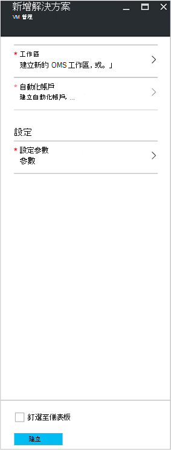
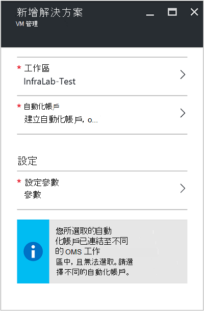
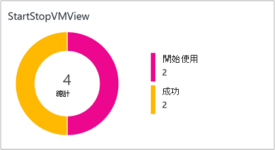
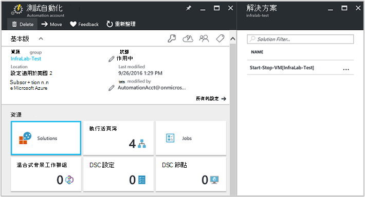
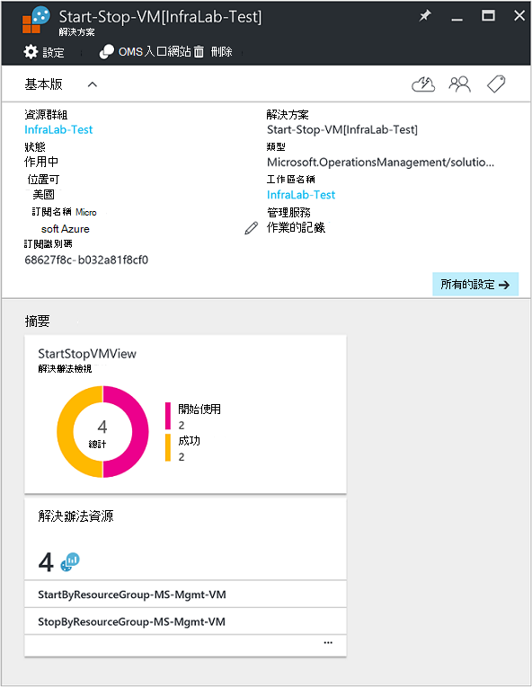

<properties
    pageTitle="在離峰時間 [預覽] 解決方案期間的開始/停止 Vm |Microsoft Azure"
    description="VM 管理解決方案啟動和停止資源管理員 Azure 虛擬機器排程並主動監視從記錄分析。"
    services="automation"
    documentationCenter=""
    authors="MGoedtel"
    manager="jwhit"
    editor=""
    />
<tags
    ms.service="automation"
    ms.workload="tbd"
    ms.tgt_pltfrm="na"
    ms.devlang="na"
    ms.topic="get-started-article"
    ms.date="10/07/2016"
    ms.author="magoedte"/>

# 在離峰時間 [預覽] 解決方案中自動化期間的開始/停止 Vm

開始/停止 Vm 在離峰時間 [預覽] 解決方案時啟動和停止 Azure 資源管理員虛擬機器使用者定義的排程，並提供深入了解啟動和停止與 OMS 記錄分析虛擬機器的自動化工作的成功。  

## 必要條件

- Runbooks 使用[Azure 執行為帳戶](automation-sec-configure-azure-runas-account.md)。  執行為帳戶是慣用的驗證方法，因為它會使用憑證驗證]，而不是密碼到期或經常變更。  

- 此方案只能管理 Vm 會在同一份訂閱及資源群組為自動化帳戶的所在位置。  

- 此方案僅部署至下列 Azure 區域內的澳大利亞 Southeast 與東亞美國、 東南亞，西歐。  管理 VM 排程 runbooks 可以針對 Vm 任何區域中。  

- 若要開始及停止 VM runbooks 完成時，傳送電子郵件通知，是必要的 Office 365 商務級訂閱。  

## 解決方案元件

此方案包含下列資源可匯入及新增至您的自動化帳戶。

### Runbooks

Runbook | 描述|
--------|------------|
CleanSolution MS-管理 VM | 當您移至您的訂閱刪除解決方案，其中包含的所有資源及排程將會移除此 runbook。|  
SendMailO365-MS-管理 | 此 runbook 會傳送到 Office 365 Exchange 電子郵件。|
StartByResourceGroup MS-管理 VM | 此 runbook 要開始 Vm (兩個傳統而 ARM Vm) 的所在指定清單中的 Azure 資源群組。
StopByResourceGroup MS-管理 VM | 此 runbook 要停止 Vm (兩個傳統而 ARM Vm) 的所在指定清單中的 Azure 資源群組。|
 

### 變數

變數 | 描述|
---------|------------|
**SendMailO365-MS-管理**Runbook ||
SendMailO365 IsSendEmail MS-管理 | 指定 StartByResourceGroup MS-管理 VM 和 StopByResourceGroup MS-管理 VM runbooks 是否可以傳送電子郵件通知，完成時。  選取 [ **True**啟用和**False**停用電子郵件提醒]。 預設值為**False**。| 
**StartByResourceGroup MS-管理 VM**Runbook ||
StartByResourceGroup-ExcludeList-MS-管理-VM | 輸入 VM 名稱來排除管理作業。使用 semi-colon(;) 分隔名稱。 值會區分大小寫，支援萬用字元 （星號）。|
StartByResourceGroup-SendMailO365-EmailBodyPreFix-MS-管理 | 可以附加到電子郵件訊息本文開頭的文字。|
StartByResourceGroup-SendMailO365-EmailRunBookAccount-MS-管理 | 指定包含電子郵件 runbook 自動化帳戶的名稱。  **請勿修改此變數。**|
StartByResourceGroup-SendMailO365-EmailRunbookName-MS-管理 | 指定的電子郵件 runbook 的名稱。  這用來的 StartByResourceGroup MS-管理 VM 和 StopByResourceGroup MS-管理 VM runbooks 來傳送電子郵件。  **請勿修改此變數。**|
StartByResourceGroup-SendMailO365-EmailRunbookResourceGroup-MS-管理 | 指定包含電子郵件 runbook 的資源群組的名稱。  **請勿修改此變數。**|
StartByResourceGroup-SendMailO365-EmailSubject-MS-管理 | 指定電子郵件的主旨行的文字。|  
StartByResourceGroup-SendMailO365-EmailToAddress-MS-管理 | 指定的電子郵件的收件者。  使用 semi-colon(;) 輸入不同的名稱。|
StartByResourceGroup-TargetResourceGroups-MS-管理-VM | 輸入 VM 名稱來排除管理作業。使用 semi-colon(;) 分隔名稱。 值會區分大小寫，支援萬用字元 （星號）。  預設值 （星號） 會包含在訂閱中的所有資源群組。|
StartByResourceGroup-TargetSubscriptionID-MS-管理-VM | 指定包含 Vm 為受此方案的訂閱。  這必須是同一份訂閱此方案的自動化帳戶的所在位置。|
**StopByResourceGroup MS-管理 VM**Runbook ||
StopByResourceGroup-ExcludeList-MS-管理-VM | 輸入 VM 名稱來排除管理作業。使用 semi-colon(;) 分隔名稱。 值會區分大小寫，支援萬用字元 （星號）。|
StopByResourceGroup-SendMailO365-EmailBodyPreFix-MS-管理 | 可以附加到電子郵件訊息本文開頭的文字。|
StopByResourceGroup-SendMailO365-EmailRunBookAccount-MS-管理 | 指定包含電子郵件 runbook 自動化帳戶的名稱。  **請勿修改此變數。**|
StopByResourceGroup-SendMailO365-EmailRunbookResourceGroup-MS-管理 | 指定包含電子郵件 runbook 的資源群組的名稱。  **請勿修改此變數。**|
StopByResourceGroup-SendMailO365-EmailSubject-MS-管理 | 指定電子郵件的主旨行的文字。|  
StopByResourceGroup-SendMailO365-EmailToAddress-MS-管理 | 指定的電子郵件的收件者。  使用 semi-colon(;) 輸入不同的名稱。|
StopByResourceGroup-TargetResourceGroups-MS-管理-VM | 輸入 VM 名稱來排除管理作業。使用 semi-colon(;) 分隔名稱。 值會區分大小寫，支援萬用字元 （星號）。  預設值 （星號） 會包含在訂閱中的所有資源群組。|
StopByResourceGroup-TargetSubscriptionID-MS-管理-VM | 指定包含 Vm 為受此方案的訂閱。  這必須是同一份訂閱此方案的自動化帳戶的所在位置。|  
 

### 排程

排程 | 描述|
---------|------------|
StartByResourceGroup 排程 MS-管理 | StartByResourceGroup runbook，會執行啟動 Vm 此方案所管理的排程。|
StopByResourceGroup 排程 MS-管理 | StopByResourceGroup runbook，會關閉此方案所管理的 Vm 排程。|

### 認證

認證 | 描述|
-----------|------------|
O365Credential | 指定有效的 Office 365 使用者帳戶傳送電子郵件。  只需變數 SendMailO365-IsSendEmail-MS-管理如果設為**True**。

## 設定

執行下列步驟，以新增離峰時間 [預覽] 解決方案期間的開始/停止 Vm 自動化帳戶，然後設定 [自訂解決方案變數。

1. 從主-畫面 Azure 入口網站中，選取 [ **Marketplace** ] 磚。  如果磚已不再釘選到您主畫面，從左側的導覽窗格中，選取 [**新增**]。  
2. 服務商場刀中，在 [搜尋] 方塊中輸入**開始 VM** ，然後選取方案**在離峰時間 [預覽] 的 [開始/停止 Vm**從搜尋結果。  
3. 在選取方案**在離峰時間 [預覽] 的 [開始/停止 Vm**刀，檢閱摘要資訊，然後按一下 [**建立**]。  
4. **新增解決方案**刀會出現在系統提示您設定之前，您可以將其匯入自動化訂閱的方案。     
5.  在**新增解決方案**刀中，選取**工作區**，您在這裡選擇 OMS 工作區的已連結至自動化帳戶是在同一份 Azure 訂閱，或建立新的 OMS 工作區。  如果您沒有 OMS 工作區，您可以選取 [**建立新工作區**，並在**OMS 工作區**刀上執行下列步驟︰ 
   - 指定新**OMS 工作區**的名稱。
   - 選取**訂閱**從下拉式清單選取 [如果選取預設不適當連結。
   - [**資源] 群組**中，您可以建立新的資源群組，或選取現有的資源群組。  
   - 選取的**位置**。  目前僅提供的選取範圍的位置會是**澳大利亞 Southeast**、**東亞美國**、**東南亞**和**西歐**。
   - 選取 [**價格層**]。  解決方案提供兩層︰ 空閒和 OMS 支付層。  每日保留週期及 runbook 工作執行階段分鐘免費層收集的資料量有限制。  所支付的 OMS 層沒有每天收集的資料量的限制。  

        > [AZURE.NOTE]
        > 獨立的支付層會顯示為其中一個選項，而不適用。  如果您選取它，繼續到建立此方案中您的訂閱，它將會失敗。  這將會解決此方案正式發行時。 如果您使用此方案時，它只會使用自動化工作分鐘，並登入 ingestion。  方案不會新增至您的環境的其他 OMS 節點。  

6. 之後提供**OMS 工作區**刀所需的資訊，請按一下 [**建立**]。  驗證資訊，並建立工作區，您可以從功能表來追蹤進度**通知**底下。  您會回到**新增解決方案**刀。  
7. 在 [**新增方案**刀中，選取 [**自動化帳戶**]。  如果您要建立新的 OMS 工作區，您必須同時建立新的自動化帳戶會相關聯的新 OMS 指定工作區，包括您 Azure 訂閱、 資源群組和區域。  您可以選取 [**建立自動化帳戶**，然後在 [**新增自動化帳戶**刀，提供下列︰ 
  - 在 [**名稱**] 欄位中，輸入自動化帳戶的名稱。

    所有其他選項會自動顯示根據選取 OMS 工作區，而且無法修改這些選項。  Azure 執行為帳戶是包含在此方案 runbooks 的預設驗證方法。  一旦您按一下**[確定]**，[設定] 選項會進行驗證，並建立自動化帳戶。  您可以從功能表來追蹤進度下**通知**。 

    否則，您可以選取現有的自動化執行為帳戶。  請注意，您所選取的帳戶無法已連結至另一個 OMS 工作區，否則郵件呈現刀通知您。  如果已經連結，您必須選取不同的自動化執行為帳戶或建立新的結果。    

8. 最後上**新增解決方案**刀中，選取 [**設定**，並**參數**刀顯示。  在**參數**刀，系統會提示您︰  
   - 指定**目標 ResourceGroup 名稱**，其中包含 Vm 為受此方案的資源群組名稱。  您可以輸入一個以上的名稱，然後分隔每個使用的分號 （值會區分大小寫）。  如果您想要在訂閱中的所有資源群組中的目標 Vm，則會支援使用萬用字元。
   - 選取 [**排程**這是週期性的日期和時間啟動和停止 VM 就在目標資源群組]。  

10. 當您完成設定方案所需的初始設定之後時，請選取 [**建立**]。  所有設定將會都驗證，然後將會在您的訂閱方案部署。  此程序可能需要幾秒鐘完成，您可以從功能表來追蹤進度下**通知**。 

## 集合頻率

每隔五分鐘時，會將 OMS 存放庫 ingested 自動化工作記錄與工作串流資料。  

## 使用解決方案

當您新增 VM 管理解決方案時，OMS 工作區**StartStopVM 檢視**中並排顯示便會新增至您 OMS 儀表板。  此圖磚顯示的計數與解決方案 runbooks 工作的開始或已順利完成的圖形化表示。     

在您的自動化帳戶，您可以存取及管理方案，選取 [**解決方案**] 方塊，然後從**解決方案**刀中，從清單中選取方案**開始停駐點 VM [工作區]** 。     

選取方案，就會顯示**開始停駐點 VM [工作區]**解決方案刀位置，您可以像檢閱重要的詳細資料，例如 [ **StartStopVM** ] 方塊中，在您 OMS 區中，顯示計算及解決方案 runbooks 工作的開始或已順利完成的圖形化表示。     

從這裡開始您也可以開啟 OMS 工作區，並進行進一步分析的工作記錄。  只要按一下**所有設定**]，並中**設定**刀中，選取 [**快速入門**，然後選取 [**快速入門**刀中的 [ **OMS 入口網站**。   這會開啟新的索引標籤或新的瀏覽器工作階段，並顯示您與您的自動化帳戶與訂閱相關聯的 OMS 工作區。  

### 設定電子郵件通知

若要啟用電子郵件通知時開始及停止 VM runbooks 完成之後，您會需要修改**O365Credential**認證,，然後在 [最小值，下列變數︰

 - SendMailO365 IsSendEmail MS-管理
 - StartByResourceGroup-SendMailO365-EmailToAddress-MS-管理
 - StopByResourceGroup-SendMailO365-EmailToAddress-MS-管理

若要設定**O365Credential**認證，請執行下列步驟︰

1. 從您的自動化帳戶，按一下 [在視窗頂端的**所有設定**]。 
2. 在**設定**刀**自動化資源**之下，選取 [**資產**]。 
3. 在**資產**刀中，選取 [**認證**] 方塊，然後從**認證**刀中，選取 [ **O365Credential**]。  
4. 輸入有效的 Office 365 使用者名稱和密碼，然後按一下 [**儲存**] 儲存變更。  

若要設定反白顯示較舊版本的變數，執行下列步驟︰

1. 從您的自動化帳戶，按一下 [在視窗頂端的**所有設定**]。 
2. 在**設定**刀**自動化資源**之下，選取 [**資產**]。 
3. 在**資產**刀中，選取 [**變數**] 方塊和**變數**防禦，以選取列於上方的變數，然後修改描述先前指定[變數](##variables)] 區段中的值，下列。  
4. 按一下 [儲存變更至變數的 [**儲存**]。   

### 修改啟動和關閉排程

管理啟動和關閉排程在本方案中的追蹤相同的步驟，[排程中 Azure 自動化 runbook](automation-scheduling-a-runbook.md)所述。  請記住，您無法修改排程設定。  您必須停用現有的排程，然後建立新的項目，然後連結至**StartByResourceGroup MS-管理 VM**或您想要套用至排程**StopByResourceGroup MS-管理 VM** runbook。   

## 記錄狀況分析

自動化 OMS 存放庫中建立兩種類型的記錄。

### 工作記錄檔

屬性 | 描述|
----------|----------|
來電者 |  使用者發起的租用戶作業。  可能的值會在電子郵件地址 」 或 「 系統已排程的工作。|
類別 | 分類的資料類型。  自動化，該值 JobLogs。|
相互關聯識別碼 | 是 runbook 工作的相互關聯識別碼的 GUID。|
JobId | GUID 的 runbook 作業的識別碼。|
operationName | 指定 Azure 中執行的作業的類型。  自動化、 值會工作。|
預設 | Azure 中指定的資源類型。  自動化，該值 runbook 相關聯的自動化帳戶。|
ResourceGroup | 指定 runbook 工作資源群組名稱。|
ResourceProvider | 指定提供的資源，您可以部署及管理的 Azure 服務。  自動化，該值 Azure 自動化。|
ResourceType | Azure 中指定的資源類型。  自動化，該值 runbook 相關聯的自動化帳戶。|
resultType | Runbook 工作的狀態。  可能的值為︰ 啟動 停止 -擱置 失敗 -成功|
resultDescription | 說明 runbook 工作結果狀態。  可能的值為︰ 開始工作 -工作失敗 -已完成的工作|
RunbookName | 指定 runbook 的名稱。|
SourceSystem | 指定提交的資料來源系統。  自動化、 的值就是︰ OpsManager|
StreamType | 指定事件的類型。 可能的值為︰ 詳細資訊 輸出 錯誤 -警告|
SubscriptionId | 指定工作的訂閱識別碼。
時間 | 日期及時間 runbook 工作時執行。|

### 工作資料流時

屬性 | 描述|
----------|----------|
來電者 |  使用者發起的租用戶作業。  可能的值會在電子郵件地址 」 或 「 系統已排程的工作。|
類別 | 分類的資料類型。  自動化，該值 JobStreams。|
JobId | GUID 的 runbook 作業的識別碼。|
operationName | 指定 Azure 中執行的作業的類型。  自動化、 值會工作。|
ResourceGroup | 指定 runbook 工作資源群組名稱。|
預設 | Azure 中指定的資源識別碼。  自動化，該值 runbook 相關聯的自動化帳戶。|
ResourceProvider | 指定提供的資源，您可以部署及管理的 Azure 服務。  自動化，該值 Azure 自動化。|
ResourceType | Azure 中指定的資源類型。  自動化，該值 runbook 相關聯的自動化帳戶。|
resultType | 在產生的事件的時間 runbook 工作的結果。  可能的值為︰ -InProgress|
resultDescription | 包含 runbook 的輸出資料流。|
RunbookName | Runbook 名稱。|
SourceSystem | 指定提交的資料來源系統。  自動化，值為 OpsManager|
StreamType | 工作串流類型。 可能的值為︰ 進行 輸出 -警告 錯誤 偵錯 詳細資訊|
時間 | 日期及時間 runbook 工作時執行。|

當您執行任何記錄搜尋，傳回**JobLogs**或**JobStreams**類別的記錄時，您可以選取 [ **JobLogs**或**JobStreams** ] 檢視會顯示一組並排摘要搜尋傳回的更新。

## 範例記錄搜尋

下表提供範例記錄搜尋此方案所收集到的工作記錄。 

查詢 | 描述|
----------|----------|
尋找 runbook StartVM 已順利完成的工作 | 類別 = JobLogs RunbookName_s = 」 StartByResourceGroup-MS-管理-VM 」 ResultType = 成功 & #124;以 JobId_g 量值 count （)|
尋找 runbook StopVM 已順利完成的工作 | 類別 = JobLogs RunbookName_s = 」 StartByResourceGroup-MS-管理-VM 」 ResultType = 失敗 & #124;以 JobId_g 量值 count （)
顯示一段時間的 StartVM 和 StopVM runbooks 的工作狀態 | 類別 = JobLogs RunbookName_s = 」 StartByResourceGroup-MS-管理-VM 」 或者 「 StopByResourceGroup-MS-管理-VM 」 NOT(ResultType="started") | 依 ResultType 間隔 1 天測量 count （）|

## 後續步驟

- 若要進一步瞭解如何建立不同的搜尋查詢，並檢閱與記錄分析自動化工作記錄，請參閱[記錄分析中的記錄檔搜尋](../log-analytics/log-analytics-log-searches.md)
- 若要瞭解更多有關 runbook 執行如何監控 runbook 工作，及其他技術的詳細資訊，請參閱[追蹤 runbook 工作](automation-runbook-execution.md)
- 若要進一步瞭解 OMS 記錄分析及資料集合來源，請參閱[收集 Azure 儲存體中的資料記錄分析概觀](../log-analytics/log-analytics-azure-storage.md)

   

