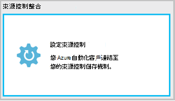
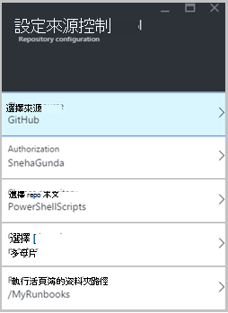
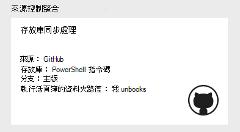
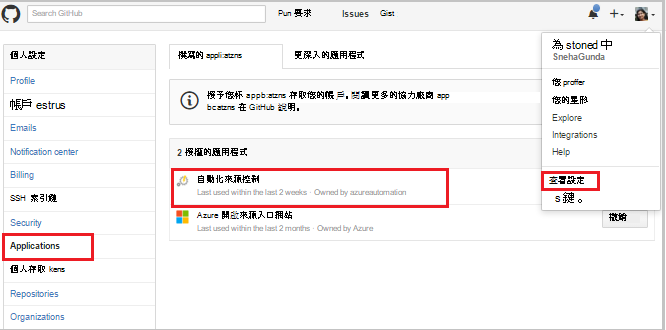
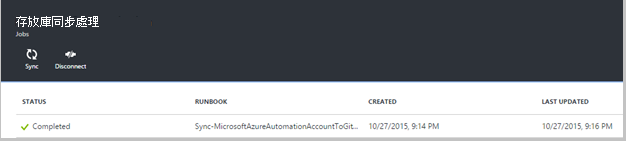
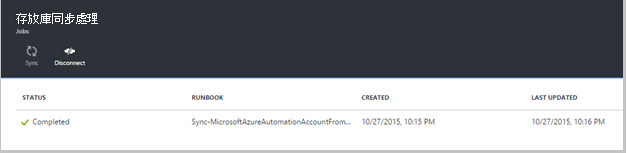
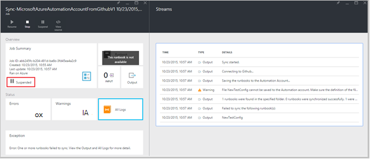

<properties 
    pageTitle=" 來源控制整合在 Azure 自動化 |Microsoft Azure"
    description="本文將說明在 Azure 自動化 GitHub 來源控制整合。"
    services="automation"
    documentationCenter=""
    authors="mgoedtel"
    manager="jwhit"
    editor="tysonn" />    
<tags 
    ms.service="automation"
    ms.devlang="na"
    ms.topic="article"
    ms.tgt_pltfrm="na"
    ms.workload="infrastructure-services"
    ms.date="09/12/2016"
    ms.author="magoedte;sngun" />

# 在 Azure 自動化來源控制整合

來源控制整合功能可讓您將 runbooks 自動化帳戶至 GitHub 來源控制存放庫中的建立關聯。 來源控制 」 可以讓您輕鬆地與您的小組共同作業、 追蹤修訂，以及回復為舊版您 runbooks。 例如，來源控制可讓您同步處理至您的開發、 測試或生產自動化帳戶，幫助您輕鬆升階您生產自動化帳戶至您的開發環境中測試過的程式碼的來源控制項中不同的分支。

來源控制 」 可以讓您從 Azure 自動化的程式碼發送來源控制或提取您 runbooks 從來源控制 Azure 自動化。 本文將說明如何設定 Azure 自動化環境中的來源控制。 我們會先設定 Azure 自動化，以存取您 GitHub 存放庫及逐步瞭解不同的作業，可以使用來源控制整合。 

>[AZURE.NOTE]來源控制項支援抽取和推入[PowerShell 工作流程 runbooks](automation-runbook-types.md#powershell-workflow-runbooks) ，以及[PowerShell runbooks](automation-runbook-types.md#powershell-runbooks)。 [圖形化 runbooks](automation-runbook-types.md#graphical-runbooks)還不受支援。  

有兩個簡單的步驟，設定您的自動化帳戶，並僅有一個的來源控制，如果您已經有 GitHub 帳戶所需。 它們是︰
## 步驟 1︰ 建立 GitHub 存放庫

如果您已經有 GitHub 帳戶和您想要連結至 Azure 自動化，然後登入現有的帳戶，並開始步驟 2 下列存放庫。 否則，請瀏覽至[GitHub](https://github.com/)，登註冊新帳戶與[建立新的儲存機制](https://help.github.com/articles/create-a-repo/)。

## 步驟 2-設定中 Azure 自動化來源控制項

1. 按一下 [從 Azure 入口網站中自動化帳戶刀，**設定來源控制。** 
 
    

2. **來源控制**刀隨即開啟，您可以在此設定的 GitHub 帳戶詳細資料。 以下是設定參數的清單︰  

  	|**參數**            |**描述** |
  	|:---|:---| 
  	|選擇來源   | 選取 [來源]。 目前， **GitHub**功能受支援。 |
  	|授權 | 按一下 [授與您 GitHub 存放庫 Azure 自動化存取 [**授權**] 按鈕。 如果您已經登入您的 GitHub 帳戶不同的視窗中，會使用該帳戶的認證。 授權成功後，刀會顯示您 GitHub 的使用者名稱底下**授權屬性**。 |
  	|選擇儲存機制 | 從可用的存放庫的清單中選取 [GitHub 存放庫]。 |
  	|選擇分支 | 從可用的分支的清單中選取分支。 如果您還沒有建立任何分支顯示**主版**的分支。 |
  	|Runbook 資料夾路徑 | Runbook 資料夾路徑指定您要擷取您的程式碼或 GitHub 存放庫中的路徑。 必須在格式**/foldername/subfoldername**方式輸入。 只在 runbook 資料夾路徑 runbooks 會同步處理至您的自動化帳戶。 同步處理 Runbooks runbook 資料夾路徑會**不**的子資料夾中。 使用**/**同步處理存放庫底下的所有 runbooks。 |

3. 例如，如果您有名為**PowerShellScripts**包含一個名為**RootFolder**資料夾存放庫，其中包含資料夾命名**子資料夾**。 若要同步處理的每個資料夾層級，您可以使用下列字串︰

    1. 若要同步處理 runbooks 從**存放庫**，是 runbook 資料夾路徑*/*
    2. 若要同步處理從**RootFolder**runbooks runbook 資料夾路徑是*/RootFolder*
    3. 若要同步處理 runbooks 從**子資料夾**，runbook 資料夾路徑是*/RootFolder/SubFolder*。
  

4. 設定參數之後，他們會顯示在**設定來源控制刀。**  
 
    

5. 一旦您按一下 [確定]，來源控制整合正在設定您的自動化帳戶，並應以您 GitHub 資訊更新。 您現在可以按一下此檢視原始檔控制同步處理工作記錄的所有的組件。  

    

6. 設定來源控制項後，在您的自動化帳戶會建立下列自動化資源︰  
 建立兩個[變數的資產](automation-variables.md)。  
      
    * 變數**Microsoft.Azure.Automation.SourceControl.Connection**包含的連接字串，如下所示。  

  	|**參數**            |**值** |
  	|:---|:---|
  	| 名稱  | Microsoft.Azure.Automation.SourceControl.Connection |
  	| 類型 | 字串 |
  	| 值  | {」 分支 」:\<*分支名稱*>，「 RunbookFolderPath 」:\<*Runbook 資料夾路徑*>，「 提供者 」 類型︰\<*值 1 GitHub*>，「 存放庫 」:\<*您存放庫的名稱*>，「 使用者名稱 」:\<*您 GitHub 使用者名稱*>} |   

    * 變數**Microsoft.Azure.Automation.SourceControl.OAuthToken**，包含您 OAuthToken 安全加密的值。  

  	|**參數**            |**值** |
  	|:---|:---|
  	| 名稱  | Microsoft.Azure.Automation.SourceControl.OAuthToken |
  	| 類型 | Unknown(Encrypted) |
  	| 值 | <*加密的 OAuthToken*> |  

      

    * **自動化來源控制**會新增至您的 GitHub 帳戶授權應用程式。 若要檢視應用程式︰ 從 GitHub 首頁，瀏覽您**的設定檔** > **設定** > **應用程式**。 這個應用程式可讓 Azure 自動化同步處理您的 GitHub 存放庫自動化帳戶。  

    

## 使用來源控制項中自動化

### 存回從 Azure 自動化 runbook 來源控制

Runbook 存回可讓您推入到您的來源控制存放庫的 runbook Azure 自動化中所做的變更。 以下是存回 runbook 的步驟︰

1. 從您自動化帳戶、[建立新的文字 runbook](automation-first-runbook-textual.md)或[編輯現有的文字 runbook](automation-edit-textual-runbook.md)。 此 runbook 可以 PowerShell 工作流程或 PowerShell 指令碼 runbook。  

2. 編輯您 runbook 之後，將其儲存，然後按一下 [**存回**從**編輯**刀。  

    ![存回] 按鈕](media/automation-source-control-integration/automation_06_CheckinButton.png)

     >[AZURE.NOTE] 存回從 Azure 自動化會覆寫目前來源控制項中存在的程式碼。 給相同的命令列指示要存回是**給新增 + 給認可 + 給推入**  

3. 當您按一下 [**存回**時，您會提示您確認訊息時，按一下 [是] 以繼續進行。  

    

4. 存回啟動來源控制 runbook︰**同步處理 MicrosoftAzureAutomationAccountToGitHubV1**。 此 runbook 連線到 GitHub，並從 Azure 自動化變更推入到您儲存機制。 若要檢視的存回工作歷程記錄，請返回**原始檔控制整合**] 索引標籤，然後按一下以開啟存放庫同步處理刀。 此刀會顯示所有您的來源控制作業。  選取您想要檢視，然後按一下 [檢視詳細資料的工作。  

    

    >[AZURE.NOTE] 來源控制 runbooks 是選擇性的自動化 runbooks，您無法檢視或編輯。 時，不會顯示 runbook 清單上，您會看到 [同步處理工作的工作清單上顯示。
 
5. 修改 runbook 的名稱會以存回 runbook 傳送作為輸入參數。 您可以[檢視工作詳細資料](automation-runbook-execution.md#viewing-job-status-using-the-azure-management-portal)展開 runbook**存放庫同步處理**刀中。  

    

6. 若要檢視所做的變更完成作業之後，請重新整理您 GitHub 存放庫。  將存放庫內的認可郵件應該會有認可︰**更新*Runbook 名稱*中 Azure Automation.* *  

### 從來源控制項的同步處理 runbooks Azure 自動化 

存放庫同步處理刀上的 [同步處理] 按鈕可讓您 runbook 資料夾的路徑您存放庫中的所有 runbooks 都提取您自動化的帳戶。 將相同的存放庫可以同步處理到一個以上的自動化帳戶。 以下是同步處理 runbook 的步驟︰

1. 從自動化帳戶，您可以在這裡設定來源控制、 開啟**來源控制整合/存放庫同步處理刀**及系統將會提示您確認訊息，然後按一下 [**同步處理**，請按一下 [ **** ，繼續]。  

    ![同步處理] 按鈕](media/automation-source-control-integration/automation_10_SyncButtonwithMessage.png)

2. 同步處理啟動 runbook︰**同步處理 MicrosoftAzureAutomationAccountFromGitHubV1**。 此 runbook 連線到 GitHub，並從您的存放庫擷取所做的變更，Azure 自動化。 您應該會看到新的工作上**存放庫同步處理**刀，這個動作。 若要檢視同步處理工作的相關詳細資料，請按一下 [開啟工作詳細資料刀。  
 
    

 
    >[AZURE.NOTE] 從來源控制同步處理會覆寫目前存在於目前來源控制項中的**所有**runbooks 您自動化帳戶 runbooks 的草稿版本。 同步處理的給相同的命令列指令是**給提取**

## 來源控制問題的疑難排解

如果有任何錯誤與存回或同步處理工作，應該暫停工作狀態，您可以檢視工作刀錯誤相關的更多詳細資料。  **所有記錄檔**中的組件會顯示該工作相關聯的所有 PowerShell 資料流。 這會提供您需要協助您修正任何您存回或同步處理問題的詳細資料。 它也會顯示您的同步處理或檢查集 runbook 時所發生的動作順序。  

## 中斷連線來源控制

若要中斷 GitHub 帳戶，請開啟存放庫同步處理刀並按一下 [**中斷連線**。 一旦您中斷連線來源控制，先前已同步處理的 runbooks 仍會保留在您的自動化帳戶，但存放庫同步處理刀將不會啟用。  

  ![中斷連線] 按鈕](media/automation-source-control-integration/automation_12_Disconnect.png)

## 後續步驟

如需來源控制整合的詳細資訊，請參閱下列資源︰  
- [在 Azure 自動化 azure 自動化︰ 來源控制整合](https://azure.microsoft.com/blog/azure-automation-source-control-13/)  
- [您最愛的來源控制系統投票](https://www.surveymonkey.com/r/?sm=2dVjdcrCPFdT0dFFI8nUdQ%3d%3d)  
- [Azure 自動化︰ 整合使用 Visual Studio 小組服務 Runbook 來源控制項](https://azure.microsoft.com/blog/azure-automation-integrating-runbook-source-control-using-visual-studio-online/)  
