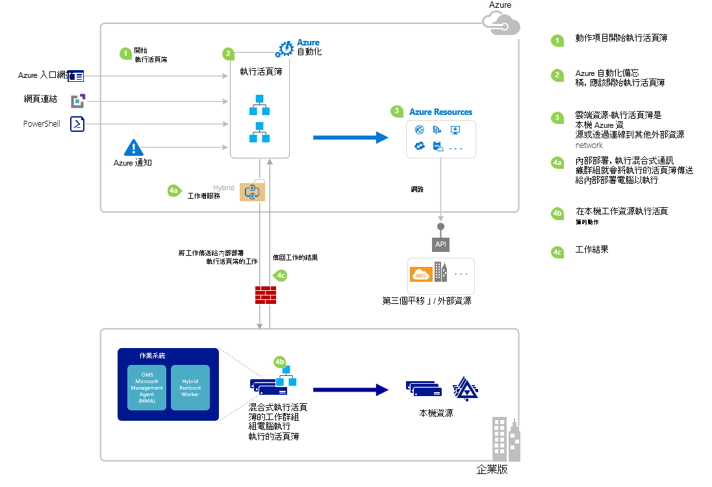

<properties
   pageTitle="啟動 Azure 自動化 runbook |Microsoft Azure"
   description="摘要列出的不同方法可啟動 Azure 自動化 runbook，並提供使用 Azure 入口網站和 Windows PowerShell 的詳細資訊。"
   services="automation"
   documentationCenter=""
   authors="mgoedtel"
   manager="jwhit"
   editor="tysonn" />
<tags
   ms.service="automation"
   ms.devlang="na"
   ms.topic="article"
   ms.tgt_pltfrm="na"
   ms.workload="infrastructure-services"
   ms.date="10/08/2016"
   ms.author="magoedte;bwren"/>

# <a name="starting-a-runbook-in-azure-automation"></a>啟動 Azure 自動化 runbook

下表將協助您決定啟動 runbook 最適合您的特定案例的 Azure 自動化的方法。 本文包含使用 Windows PowerShell 的 Azure 入口網站與啟動 runbook 的詳細資訊。 您可以從下列連結，存取其他文件提供其他方法的詳細資訊。

| **方法**                                                                    | **特性**                                                                                                                                                                                                                                                                                                                                                |
|-------------------------------------------------------------------------------|--------------------------------------------------------------------------------------------------------------------------------------------------------------------------------------------------------------------------------------------------------------------------------------------------------------------------------------------------------------------|
| [Azure 入口網站](#starting-a-runbook-with-the-azure-portal)                     | <li>互動式的使用者介面簡單的方法。<br> <li>若要提供簡單的參數值的表單。<br> <li>輕鬆地追蹤工作狀態。<br> <li>Azure 登入以驗證的存取權。                                                                                                                                                                               |
| [Windows PowerShell](https://msdn.microsoft.com/library/dn690259.aspx)        | <li>使用 Windows PowerShell cmdlet 的命令列的來電。<br> <li>可以包含多個步驟自動化方案中。<br> <li>要求已驗證憑證的主體 / 服務的 OAuth 使用者主體。<br> <li>提供簡單及複雜的參數值。<br> <li>追蹤工作狀態。<br> <li>支援 PowerShell 指令程式所需的用戶端。 |
| [Azure 自動化 API](https://msdn.microsoft.com/library/azure/mt662285.aspx) | <li>最有彈性的方法，但也大部分的複數。<br> <li>來電可以進行 HTTP 要求的任何自訂程式碼。<br> <li>驗證憑證，或 Oauth 使用者主體 / 服務的要求本金。<br> <li>提供簡單及複雜的參數值。<br> <li>追蹤工作狀態。                                                                          |
| [Webhooks](automation-webhooks.md)                                            | <li>從單一 HTTP 要求開始 runbook。<br> <li>驗證在 URL 中的安全性 token。<br> <li>用戶端無法覆寫 webhook 建立時所指定的參數值。 Runbook 可以定義單一參數，會填入 HTTP 要求詳細資料。<br> <li>沒有追蹤透過 webhook URL 工作狀態的能力。                                      |
| [回應 Azure 通知](../log-analytics/log-analytics-alerts.md)               | <li>啟動 runbook Azure 警示。<br> <li>設定 webhook runbook 及提醒的連結。<br> <li>驗證在 URL 中的安全性 token。<br> <li>目前只在計量支援通知。                                                                                                                                                       |
| [排程](automation-schedules.md)                                | <li>自動啟動 runbook 每小時、 每日，或 [每週排程。<br> <li>管理透過 Azure 入口網站、 PowerShell cmdlet 或 Azure API 的排程。<br> <li>提供用於排程的參數值。                                                                                                                                               |
| [從另一個 Runbook](automation-child-runbooks.md)                          | <li>您可以使用 runbook 作為其他 runbook 中的活動。<br> <li>使用多個 runbooks 功能很有用。<br> <li>提供子 runbook 的參數值並使用輸出中父 runbook。                                                                                                                                                               |

下圖顯示 runbook 的生命週期的詳細逐步程序。 其包含不同 runbook 中啟動 Azure 自動化元件所需的混合式 Runbook 工作者執行 Azure 自動化 runbooks 和不同元件間的互動的方式。 若要深入了解資料中心的執行自動化 runbooks，請參閱[混合式 runbook 同事](automation-hybrid-runbook-worker.md)



## <a name="starting-a-runbook-with-the-azure-portal"></a>開始 runbook Azure 入口網站

1.  在 Azure 入口網站中，選取 [**自動化**，然後按一下 [自動化帳戶的名稱。
2.  選取 [ **Runbooks** ] 索引標籤。
3.  選取 runbook，然後再按一下 [**開始**]。
4.  如果 runbook 參數，系統會提示您提供文字方塊中的值，每個參數。 如需進一步參數的詳細資訊，請參閱下方的[Runbook 參數](#Runbook-parameters)。
5.  選取**開始**runbook 封郵件旁邊的**檢視工作**或選取的檢視 runbook 工作狀態的 runbook [**工作**] 索引標籤。

## <a name="starting-a-runbook-with-the-azure-portal"></a>開始 runbook Azure 入口網站

1.  從您自動化的帳戶，按一下 [開啟**Runbooks**刀**Runbooks**組件]。
2.  按一下 [開啟**Runbook**刀 runbook]。
3.  按一下 [**開始**]。
4.  如果 runbook 沒有參數，系統會提示您確認您是否要啟動它。 如果 runbook 參數，以便您提供的參數值，將會開啟**啟動 Runbook**刀。 如需進一步參數的詳細資訊，請參閱下方的[Runbook 參數](#Runbook-parameters)。
5.  **工作**刀隨即會開啟，讓您可以追蹤工作的狀態。

## <a name="starting-a-runbook-with-windows-powershell"></a>開始使用 Windows PowerShell 的 runbook

若要開始使用 Windows PowerShell 的 runbook，您可以使用[開始 AzureRmAutomationRunbook](https://msdn.microsoft.com/library/mt603661.aspx) 。 下列範例會啟動稱為測試 Runbook runbook。

```
Start-AzureRmAutomationRunbook -AutomationAccountName "MyAutomationAccount" -Name "Test-Runbook" -ResourceGroupName "ResourceGroup01"
```

開始 AzureRmAutomationRunbook 傳回可用來追蹤其狀態，一旦 runbook 開始工作物件。 然後，您可以使用與[取得 AzureRmAutomationJob](https://msdn.microsoft.com/library/mt619440.aspx)此工作物件來判斷工作及[取得 AzureRmAutomationJobOutput](https://msdn.microsoft.com/library/mt603476.aspx)取得輸出的狀態。 下列範例會啟動稱為測試-等候，直到它完成後，並顯示輸出 Runbook runbook。

```
$runbookName = "Test-Runbook"
$ResourceGroup = "ResourceGroup01"
$AutomationAcct = "MyAutomationAccount"

$job = Start-AzureRmAutomationRunbook –AutomationAccountName $AutomationAcct -Name $runbookName -ResourceGroupName $ResourceGroup

$doLoop = $true
While ($doLoop) {
   $job = Get-AzureRmAutomationJob –AutomationAccountName $AutomationAcct -Id $job.JobId -ResourceGroupName $ResourceGroup
   $status = $job.Status
   $doLoop = (($status -ne "Completed") -and ($status -ne "Failed") -and ($status -ne "Suspended") -and ($status -ne "Stopped"))
}

Get-AzureRmAutomationJobOutput –AutomationAccountName $AutomationAcct -Id $job.JobId -ResourceGroupName $ResourceGroup –Stream Output
```

如果 runbook 需要參數，就必須提供其為[hashtable](http://technet.microsoft.com/library/hh847780.aspx)位置表的索引鍵符合參數名稱及值參數值。 下列範例會示範如何 runbook 開始兩個字串參數名稱為名字與姓氏、 整數名為 RepeatCount 和一個名為顯示的布林值參數。 如需有關參數的詳細資訊，請參閱[Runbook 參數](#Runbook-parameters)下方。

```
$params = @{"FirstName"="Joe";"LastName"="Smith";"RepeatCount"=2;"Show"=$true}
Start-AzureRmAutomationRunbook –AutomationAccountName "MyAutomationAccount" –Name "Test-Runbook" -ResourceGroupName "ResourceGroup01" –Parameters $params
```

## <a name="runbook-parameters"></a>Runbook 參數

當您從 Windows PowerShell 的 Azure 入口網站開始 runbook 時，指令會傳送透過 Azure 自動化 web 服務。 這項服務不支援複雜的資料類型的參數。 如果您需要提供複雜的參數的值，然後您必須呼叫它直接從另一個 runbook[子 runbooks Azure 自動化中的](automation-child-runbooks.md)所述。

Azure 自動化 web 服務會提供參數使用的特定資料類型，下列各節所述的特殊的功能。

### <a name="named-values"></a>命名的值

如果參數是資料型別 [物件]，然後您可以使用下列 JSON 格式加以傳送命名值的清單︰ *{Name1: 「 Value1 」、 Name2: 「 Value2'、 Name3: 'Value3'}*。 這些值必須是簡單的類型。 Runbook 會收到參數為[PSCustomObject](https://msdn.microsoft.com/library/system.management.automation.pscustomobject%28v=vs.85%29.aspx)屬性對應至每個命名的值。

請考慮下列測試 runbook 可接受稱為使用者參數。

```
Workflow Test-Parameters
{
   param (
      [Parameter(Mandatory=$true)][object]$user
   )
    $userObject = $user | ConvertFrom-JSON
    if ($userObject.Show) {
        foreach ($i in 1..$userObject.RepeatCount) {
            $userObject.FirstName
            $userObject.LastName
        }
    }
}
```

下列文字無法用於使用者參數。

```
{FirstName:'Joe',LastName:'Smith',RepeatCount:'2',Show:'True'}
```

這會導致下列輸出。

```
Joe
Smith
Joe
Smith
```

### <a name="arrays"></a>陣列

如果參數值是陣列，例如 [陣列] 或 [字串 []]，然後您可以使用下列 JSON 格式，將它傳送值的清單: *[Value1，Value2，Value3]*。 這些值必須是簡單的類型。

請考慮下列測試 runbook 可接受稱為*使用者*參數。

```
Workflow Test-Parameters
{
   param (
      [Parameter(Mandatory=$true)][array]$user
   )
    if ($user[3]) {
        foreach ($i in 1..$user[2]) {
            $ user[0]
            $ user[1]
        }
    }
}
```

下列文字無法用於使用者參數。

```
["Joe","Smith",2,true]
```

這會導致下列輸出。

```
Joe
Smith
Joe
Smith
```

### <a name="credentials"></a>認證

如果將參數資料類型**PSCredential**，您就可以提供 Azure 自動化[認證資產](automation-credentials.md)的名稱。 Runbook 會擷取您指定的名稱與認證。

請考慮下列測試 runbook 可接受參數稱為認證。

```
Workflow Test-Parameters
{
   param (
      [Parameter(Mandatory=$true)][PSCredential]$credential
   )
   $credential.UserName
}
```

下列文字無法用於使用者參數，假設稱為*「 我的認證*認證資產。

```
My Credential
```

假設認證中的使用者名稱*jsmith*，會產生下列輸出。

```
jsmith
```

## <a name="next-steps"></a>後續步驟

-   Runbook 架構目前文件中的提供的高層級管理資源在 Azure 及內部部署與混合式 Runbook 工作者 runbooks 概觀。  若要瞭解執行自動化 runbooks 資料中心的請參閱[混合式 Runbook 同事](automation-hybrid-runbook-worker.md)。
-   若要進一步瞭解建立的模組化 runbooks 用於其他 runbooks 特定或常用的函數，請參閱[子 Runbooks](automation-child-runbooks.md)。
