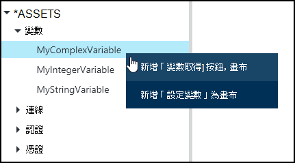
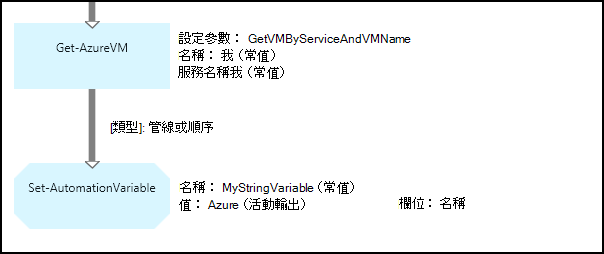
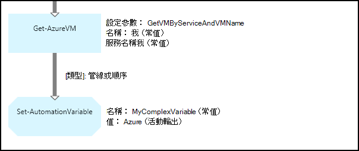
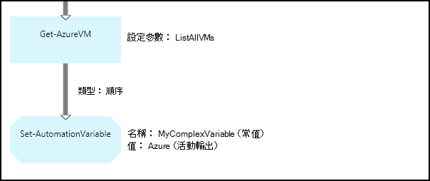
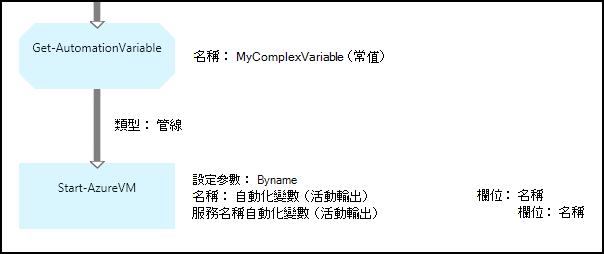
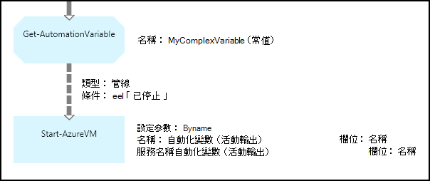

<properties 
   pageTitle="Azure 自動化變數資產 |Microsoft Azure"
   description="變數資產是適用於所有 runbooks 和 Azure 自動化中的 DSC 設定的值。  本文說明變數，以及如何使用這些文字和圖形撰寫的詳細資料。"
   services="automation"
   documentationCenter=""
   authors="mgoedtel"
   manager="jwhit"
   editor="tysonn" />
<tags 
   ms.service="automation"
   ms.devlang="na"
   ms.topic="article"
   ms.tgt_pltfrm="na"
   ms.workload="infrastructure-services"
   ms.date="05/24/2016"
   ms.author="magoedte;bwren" />

# Azure 自動化變數資產

變數資產是適用於所有 runbooks 和 DSC 設定自動化帳戶中的值。 他們可以建立、 修改及擷取從 Azure 入口網站中，在 Windows PowerShell 和中 runbook 或 DSC 設定文件。 自動化變數是適合以下情況︰

- 共用多個 runbooks 或 DSC 設定之間的值。

- 共用相同的 runbook 或 DSC 設定多個工作之間的值。

- 從入口網站，或從 Windows PowerShell 命令列使用 runbooks 或 DSC 設定的 [管理] 值。

自動化變數會保存，讓他們繼續設為可用，即使 runbook 或 DSC 設定就會失敗。  這也可讓使用相同的 runbook 或 DSC 設定下一次執行時，將由另一個，或使用一個 runbook 可設定的值。

建立一個變數時，您可以指定會儲存加密。  當變數已加密時，安全地儲存在 Azure 自動化，其值無法從 Azure PowerShell 模組的一部分隨附[取得 AzureAutomationVariable](http://msdn.microsoft.com/library/dn913772.aspx)指令程式。  加密的值，可以擷取的唯一方式是從 runbook 或 DSC 設定文件中的**取得 AutomationVariable**活動。

>[AZURE.NOTE]Azure 自動化安全資產包含認證、 憑證、 連線及加密的變數。 這些資產會加密及儲存的每個自動化帳戶使用會產生的唯一索引鍵 Azure 自動化。 此按鍵母片的憑證來加密並儲存於 Azure 自動化。 前，先將安全的資產，自動化帳戶金鑰解密使用母片的憑證，然後用來加密資產。

## 變數類型

當您建立一個變數 Azure 入口網站時，您必須先指定資料類型，從下拉式清單，讓入口網站可顯示適當的控制項來輸入變數的值。 變數不會套用至此資料類型，但您必須設定使用 Windows PowerShell，如果您想要指定其值為其他類型的變數。 如果您**未定義**] 指定變數的值會設**$null**，然後，您必須設定[設定 AzureAutomationVariable](http://msdn.microsoft.com/library/dn913767.aspx) cmdlet 或**設定 AutomationVariable**活動的值。  您無法建立或變更在入口網站中的複數變數類型的值，但您可以使用 Windows PowerShell 任何類型的值。 將會傳回[PSCustomObject](http://msdn.microsoft.com/library/system.management.automation.pscustomobject.aspx)複雜的類型。

您可以藉由建立陣列或 hashtable，並將其儲存至變數儲存多重值的單一變數。

## Cmdlet 和工作流程活動

下表中的指令程式可用來建立並管理使用 Windows PowerShell 的自動化變數。 他們出貨[Azure PowerShell 模組](../powershell-install-configure.md)可用於自動化 runbooks 和 DSC 設定的一部分。

|Cmdlet|描述|
|:---|:---|
|[取得 AzureAutomationVariable](http://msdn.microsoft.com/library/dn913772.aspx)|擷取的值的現有的變數。|
|[新 AzureAutomationVariable](http://msdn.microsoft.com/library/dn913771.aspx)|建立新的變數並設定其值。|
|[移除 AzureAutomationVariable](http://msdn.microsoft.com/library/dn913775.aspx)|移除現有的變數。|
|[設定 AzureAutomationVariable](http://msdn.microsoft.com/library/dn913767.aspx)|設定現有變數的值。|

下表中的工作流程活動用來存取 runbook 中的自動化變數。 他們只適用於 runbook 或 DSC 設定文件中，不要使用尚未發行 Azure PowerShell 模組的一部分。

|工作流程活動|描述|
|:---|:---|
|取得 AutomationVariable|擷取的值的現有的變數。|
|設定 AutomationVariable|設定現有變數的值。|

>[AZURE.NOTE] 您應避免使用變數 – 名稱參數中的 [**取得 AutomationVariable** runbook 或 DSC 設定，因為這可在設計階段複雜探索 runbooks 或 DSC 設定與自動化變數之間的相依性。

## 建立新的自動化變數

### 若要建立新的變數 Azure 入口網站

1. 從您自動化的帳戶，按一下 [**資產**頂端的視窗]。
1. 在視窗底部，按一下 [**新增設定**]。
1. 按一下 [**新增變數**。
1. 完成精靈，然後按一下 [儲存新的變數的核取方塊。

### 若要建立新的變數 Azure 入口網站

1. 從您自動化的帳戶，按一下 [開啟**資產**刀**資產**組件]。
1. 按一下以開啟**變數**刀**變數**部分。
1. 按一下 [**新增一個變數**刀頂端。
1. 填寫表單，然後按一下 [**建立**]，儲存新的變數。

### 若要使用 Windows PowerShell 中建立新的變數

[新增 AzureAutomationVariable](http://msdn.microsoft.com/library/dn913771.aspx)指令程式會建立新的變數，並設定其起始值。 您可以擷取使用[取得 AzureAutomationVariable](http://msdn.microsoft.com/library/dn913772.aspx)的值。 如果該值為簡單的類型，則會傳回相同類型。 如果這是複雜的類型，則會傳回**PSCustomObject** 。

下列範例命令顯示如何建立字串類型變數，然後再將 [其值。

    New-AzureAutomationVariable –AutomationAccountName "MyAutomationAccount" –Name 'MyStringVariable' –Encrypted $false –Value 'My String'
    $string = (Get-AzureAutomationVariable –AutomationAccountName "MyAutomationAccount" –Name 'MyStringVariable').Value

下列範例命令顯示如何建立具有複雜類型的變數，然後再將 [其內容。 在此情況下，會使用**取得 AzureVM**虛擬機器物件。

    $vm = Get-AzureVM –ServiceName "MyVM" –Name "MyVM"
    New-AzureAutomationVariable –AutomationAccountName "MyAutomationAccount" –Name "MyComplexVariable" –Encrypted $false –Value $vm
    
    $vmValue = (Get-AzureAutomationVariable –AutomationAccountName "MyAutomationAccount" –Name "MyComplexVariable").Value
    $vmName = $vmValue.Name
    $vmIpAddress = $vmValue.IpAddress

## 使用 runbook 或 DSC 設定文件中的變數

使用**設定 AutomationVariable**活動 runbook 或 DSC 設定，並以擷取其**取得 AutomationVariable**設定自動化變數的值。  因為它們是不如工作流程活動，您不應使用 runbook 或 DSC 設定文件中的**設定 AzureAutomationVariable**或**取得 AzureAutomationVariable**指令程式。  您也無法擷取**取得 AzureAutomationVariable**安全變數的值。  若要建立從 runbook 或 DSC 設定文件中的新變數的唯一方法是使用[新 AzureAutomationVariable](http://msdn.microsoft.com/library/dn913771.aspx)指令程式。

### 文字 runbook 範例

#### 設定和變數擷取簡單的值

下列範例命令顯示如何設定和擷取文字的 runbook 中的變數。 在此範例中，則假設*NumberOfIterations*和*NumberOfRunnings*及已建立命名的*SampleMessage*字串類型變數，名為類型為整數的變數。

    $NumberOfIterations = Get-AutomationVariable -Name 'NumberOfIterations'
    $NumberOfRunnings = Get-AutomationVariable -Name 'NumberOfRunnings'
    $SampleMessage = Get-AutomationVariable -Name 'SampleMessage'
    
    Write-Output "Runbook has been run $NumberOfRunnings times."
    
    for ($i = 1; $i -le $NumberOfIterations; $i++) {
       Write-Output "$i`: $SampleMessage"
    }
    Set-AutomationVariable –Name NumberOfRunnings –Value ($NumberOfRunnings += 1)

#### 設定和擷取複雜物件在變數

下列範例會顯示如何更新變數中文字的 runbook 複雜值。 在此範例中，是以**取得 AzureVM**擷取 Azure 虛擬機器，並將其儲存至現有自動化變數中。  [變數類型](#variable-types)所述，這儲存為 PSCustomObject。

    $vm = Get-AzureVM -ServiceName "MyVM" -Name "MyVM"
    Set-AutomationVariable -Name "MyComplexVariable" -Value $vm

下列程式碼，會擷取自變數值，並將其用於啟動虛擬機器中。

    $vmObject = Get-AutomationVariable -Name "MyComplexVariable"
    if ($vmObject.PowerState -eq 'Stopped') {
       Start-AzureVM -ServiceName $vmObject.ServiceName -Name $vmObject.Name
    }

#### 設定和擷取集合中的變數

下列範例示範如何使用中文字的 runbook 複雜值的集合中的變數。 在此範例中，會以**取得 AzureVM**擷取多個 Azure 虛擬機器，並將其儲存現有自動化變數中。  [變數類型](#variable-types)所述，這儲存為 PSCustomObjects 的集合。

    $vms = Get-AzureVM | Where -FilterScript {$_.Name -match "my"}     
    Set-AutomationVariable -Name 'MyComplexVariable' -Value $vms

下列程式碼，是擷取自變數集合，並將其用於啟動每個虛擬機器中。

    $vmValues = Get-AutomationVariable -Name "MyComplexVariable"
    ForEach ($vmValue in $vmValues)
    {
       if ($vmValue.PowerState -eq 'Stopped') {
          Start-AzureVM -ServiceName $vmValue.ServiceName -Name $vmValue.Name
       }
    }

### 圖形化 runbook 範例

在圖形的 runbook，您新增的**取得 AutomationVariable**或**設定 AutomationVariable**的圖形化編輯器的 [文件庫] 窗格中的變數上按一下滑鼠右鍵，然後選取您想要的活動。

#### 在變數中的設定值

下圖顯示圖形的 runbook 為簡單值更新變數範例活動。 在此範例中，在單一 Azure 虛擬機器會擷取與**取得 AzureVM**並電腦名稱會儲存到現有的自動化變數與字串的類型。  不論是否[連結是管道的郵件或順序](automation-graphical-authoring-intro.md#links-and-workflow)由於我們只在輸出預期的單一物件。

下圖顯示用來更新變數複雜圖形的 runbook 中值的活動。 讓物件儲存，而不是只物件的屬性上述範例中的唯一變更不**設定 AutomationVariable**活動的**活動輸出**指定**欄位的路徑**。  [變數類型](#variable-types)所述，這儲存為 PSCustomObject。

下圖顯示搭配多個變數儲存的虛擬機器的上一個範例中，類似的功能。  以下必須使用[順序連結](automation-graphical-authoring-intro.md#links-and-workflow)，以便**設定 AutomationVariable**活動收到的虛擬機器整個設成一個集合。  如果使用[管線連結](automation-graphical-authoring-intro.md#links-and-workflow)，然後**設定 AutomationVariable**活動會分別每個物件具有結果在於想儲存集合中僅最後一個虛擬機器。  [變數類型](#variable-types)所述，這儲存為 PSCustomObjects 的集合。

#### 從一個變數擷取的值

下圖顯示的擷取及圖形的 runbook 中使用變數範例活動。  第一個活動擷取虛擬機器中的已儲存到上一個範例中的變數。  連結必須是[管道的郵件](automation-graphical-authoring-intro.md#links-and-workflow)，如此一來**開始 AzureVM**活動執行一次為每個寄件者**取得 AutomationVariable**活動的物件。  這會的運作方式相同是否儲存在變數中的單一物件或多個物件。  **開始 AzureVM**活動使用代表每個虛擬機器 PSCustomObject 內容。 

下圖顯示如何篩選會儲存在變數中的圖形化 runbook 的物件。  [條件](automation-graphical-authoring-intro.md#links-and-workflow)會新增至前一個範例篩選變數設定時停止虛擬機器中的連結。

## 後續步驟

- 若要進一步瞭解連線活動共同撰寫的圖形，請參閱[連結的圖形化撰寫](automation-graphical-authoring-intro.md#links-and-workflow)
- 若要開始使用圖形 runbooks，請參閱[我的第一個圖形 runbook](automation-first-runbook-graphical.md) 
