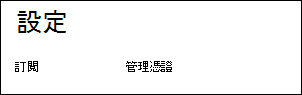
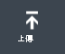
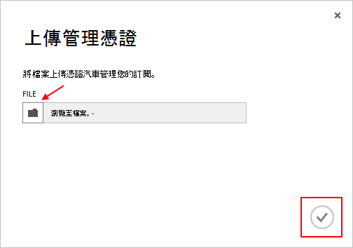

<properties 
    pageTitle="上傳 Azure 管理 API 憑證 |Azure Microsoft" 
    description="瞭解如何用 Azure 傳統入口網站上傳 athe 管理 API 憑證。" 
    services="cloud-services" 
    documentationCenter=".net" 
    authors="Thraka" 
    manager="timlt" 
    editor=""/>

<tags 
    ms.service="na" 
    ms.workload="tbd" 
    ms.tgt_pltfrm="na" 
    ms.devlang="na" 
    ms.topic="article" 
    ms.date="04/18/2016"
    ms.author="adegeo"/>

# 上傳的 Azure 管理 API 管理憑證

管理憑證可讓您提供的 Azure 服務管理 API 驗證方法。 多個程式和工具 （例如 Visual Studio 或 Azure SDK） 會使用這些是自動設定及部署各種 Azure 服務。 **這只適用於 Azure 傳統入口網站**。 

>[AZURE.WARNING] 請小心 ！ 這些類型的憑證允許驗證，來管理的訂閱相關的任何人。 

您需要時，您[可以使用](cloud-services/cloud-services-certs-create.md#what-are-management-certificates)Azure 憑證 （包括建立自我簽署的憑證） 的相關詳細資訊。

您也可以使用[Azure Active Directory](/services/active-directory/)驗證用戶端程式碼的自動化用途。

## 上傳管理憑證

一旦您有建立管理憑證、 （只有公開金鑰.cer 檔案） 您上傳其入入口網站。 憑證入口網站中可以使用時，具有相符的 certficiate （私密金鑰） 的任何人都可以透過管理 API，並存取相關聯的訂閱的資源。

1. 登入[Azure 傳統入口網站](http://manage.windowsazure.com)。

2. 確認已選取正確的訂閱，您想要建立關聯的憑證。 在右上方的入口網站中按住**訂閱**文字。

    

3. 您已選取正確訂閱之後，請按**設定**，在入口網站 （您可能需要向下捲動） 的左側。 
    
    

4. 按下 [**管理認證**] 索引標籤。

    
    
5. 按 [**上傳**] 按鈕。

    
    
6. 填寫 [資訊] 對話方塊，然後按 [完成]**核取記號**。

    

## 後續步驟

現在，您有訂閱相關聯的管理憑證，您可以 （您已安裝至本機相符的憑證之後） 以程式設計方式連線到[服務管理 REST API](https://msdn.microsoft.com/library/azure/mt420159.aspx)並自動化也會與該訂閱相關聯的各種 Azure 資源。 