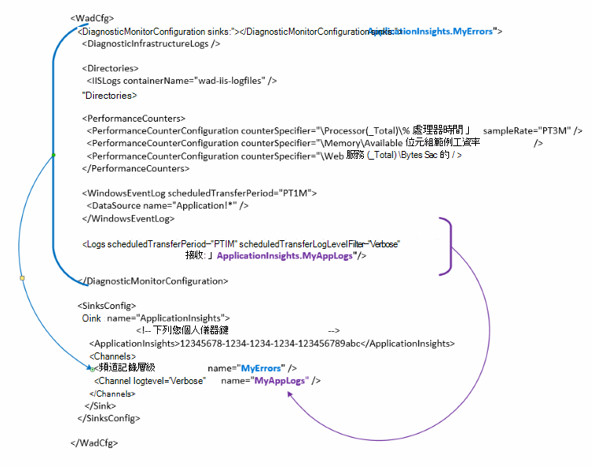

<properties
   pageTitle="設定傳送資料至應用程式的深入見解的 Azure 診斷 |Microsoft Azure"
   description="更新 Azure 診斷公用設定傳送資料至應用程式的深入見解。"
   services="multiple"
   documentationCenter=".net"
   authors="sbtron"
   manager="douge"
   editor="" />
<tags
   ms.service="application-insights"
   ms.devlang="na"
   ms.topic="article"
   ms.tgt_pltfrm="na"
   ms.workload="na"
   ms.date="12/15/2015"
   ms.author="saurabh" />

# 設定 Azure 診斷傳送資料至應用程式的深入見解

Azure 診斷儲存至 Azure 儲存體資料表的資料。  不過，您也可以垂直線所有或應用程式獲得深入見解的資料子集 「 接收 」 和 「 頻道 」 中設定您的設定時使用 Azure 診斷副檔名 1.5 或更新版本。

本文將說明如何建立公用 Azure 診斷擴充功能的設定，讓其設定為傳送資料至應用程式的深入見解。

## 為接收設定應用程式的深入見解

Azure 診斷副檔名為 1.5 來計算介紹**<SinksConfig>**公用設定中的項目。 定義其他*接收*可以傳送 Azure 診斷資料的位置。 您可以指定您要傳送 Azure 診斷資料屬於此應用程式的深入見解資源的詳細資料**<SinksConfig>**。
範例**SinksConfig**看起來像這樣-  

    <SinksConfig>
        <Sink name="ApplicationInsights">
          <ApplicationInsights>{Insert InstrumentationKey}</ApplicationInsights>
          <Channels>
            <Channel logLevel="Error" name="MyTopDiagData"  />
            <Channel logLevel="Verbose" name="MyLogData"  />
          </Channels>
        </Sink>
      </SinksConfig>

**接收**項目的*名稱*屬性會指定字串值，將會用於唯一參照至接收。
**ApplicationInsights**項目會指定 Azure 診斷資料將會傳送的應用程式的深入見解資源儀器鍵。 如果您沒有安裝現有的應用程式的深入見解資源，請參閱[建立新的應用程式的深入見解資源](./application-insights/app-insights-create-new-resource.md)，如需有關建立資源，儀器鍵。

如果您開發 Azure SDK 2.8 雲端服務的專案儀器該鍵會自動填入的公用包裝雲端服務專案時，根據**APPINSIGHTS_INSTRUMENTATIONKEY**服務設定的設定。 請參閱[使用應用程式的深入見解的 Azure 診斷以雲端服務問題進行疑難排解](./cloud-services/cloud-services-dotnet-diagnostics-applicationinsights.md)。

**頻道**元素可讓您定義的資料，將會傳送至接收的一或多個**頻道**項目。 頻道媲美篩選，並可讓您選擇您想要傳送至接收的特定記錄層級。 例如您可以在此處收集詳細資訊的記錄，傳送給儲存空間，但您可以選擇以定義記錄層級的錯誤，當您傳送到記錄頻道只錯誤記錄將會傳送給該接收頻道。
**頻道**的*名稱*屬性用來唯一參照該頻道。
*Loglevel*屬性可讓您指定記錄層級，讓該頻道。 可用的記錄中的層級的最小順序是資訊的
 - 詳細資訊
 - 資訊
 - 警告
 - 錯誤
 - 要徑

## 傳送資料至應用程式的深入見解接收
已定義的應用程式的深入見解接收後可以*接收*屬性新增**DiagnosticMonitorConfiguration**節點下的項目，以傳送給該接收資料。 將*接收*的項目新增至每個節點，指定您想要從該節點，並將其傳送至指定的接收底下的任何節點收集的資料。

比方說，如果您想要傳送所有 Azure 診斷來收集資料，您可以將新增*接收*屬性直接到**DiagnosticMonitorConfiguration**節點。 接收名稱**SinkConfig**中所指定的設定*接收*的值。

    <DiagnosticMonitorConfiguration overallQuotaInMB="4096" sinks="ApplicationInsights">

如果您想要傳送只應用程式獲得深入見解的錯誤記錄檔接收然後您可以設定接收名稱後面加句點隔開的頻道名稱*接收*值 (「。 」)。 以傳送只錯誤記錄檔給應用程式的深入見解接收使用上述 SinksConfig 中定義 MyTopDiagdata 頻道。  

    <DiagnosticMonitorConfiguration overallQuotaInMB="4096" sinks="ApplicationInsights.MyTopDiagdata">

如果您只想要傳送應用程式獲得深入見解的詳細資訊的應用程式記錄您想要**記錄**的節點新增*接收*的屬性。

    <Logs scheduledTransferPeriod="PT1M" scheduledTransferLogLevelFilter="Verbose" sinks="ApplicationInsights.MyLogData"/>

您也可以包含多個接收的階層中的不同層級設定。 在此情況下，指定在階層的最上層的接收做為通用的設定，指定在個別的項目項目動作和通用設定覆寫相同。    

以下是完成的範例公用的設定檔應用程式獲得深入見解 （指定**DiagnosticMonitorConfiguration**節點） 和此外詳細層級的記錄檔所傳送的所有錯誤的應用程式記錄 （在 [**記錄**] 節點指定）。

    <WadCfg>
      <DiagnosticMonitorConfiguration overallQuotaInMB="4096"
           sinks="ApplicationInsights.MyTopDiagData"> <!-- All info below sent to this channel -->
        <DiagnosticInfrastructureLogs />
        <PerformanceCounters>
          <PerformanceCounterConfiguration counterSpecifier="\Processor(_Total)\% Processor Time" sampleRate="PT3M" sinks="ApplicationInsights.MyLogData/>
          <PerformanceCounterConfiguration counterSpecifier="\Memory\Available MBytes" sampleRate="PT3M" />
          <PerformanceCounterConfiguration counterSpecifier="\Web Service(_Total)\Bytes Total/Sec" sampleRate="PT3M" />
        </PerformanceCounters>
        <WindowsEventLog scheduledTransferPeriod="PT1M">
          <DataSource name="Application!*" />
        </WindowsEventLog>
        <Logs scheduledTransferPeriod="PT1M" scheduledTransferLogLevelFilter="Verbose"
                sinks="ApplicationInsights.MyLogData"/> <!-- This specific info sent to this channel -->
      </DiagnosticMonitorConfiguration>

    <SinksConfig>
        <Sink name="ApplicationInsights">
          <ApplicationInsights>{Insert InstrumentationKey}</ApplicationInsights>
          <Channels>
            <Channel logLevel="Error" name="MyTopDiagData"  />
            <Channel logLevel="Verbose" name="MyLogData"  />
          </Channels>
        </Sink>
      </SinksConfig>
    </WadCfg>

有一些限制，瞭解使用此功能

- 頻道只是要使用的記錄類型和不效能計數器。 如果您指定頻道與效能計數器項目也會忽略。
- 頻道記錄層級不得超過什麼收集的 Azure 診斷記錄層的級。 例如︰ 您無法收集記錄項目中的應用程式記錄檔錯誤，並嘗試傳送詳細資訊給應用程式充分接收的記錄。 *ScheduledTransferLogLevelFilter*屬性必須永遠收集等於或大於記錄其他記錄想要傳送至接收。
- 您無法傳送任何 blob 資料收集 Azure 診斷延伸到應用程式獲得深入見解。 例如指定的任何內容下*目錄*節點。 當機傾印的實際當機傾印則仍會傳送給 blob 儲存體，只產生損毀傾印通知將會傳送至應用程式的深入見解。

## 後續步驟

- 使用[PowerShell](./cloud-services/cloud-services-diagnostics-powershell.md)來啟用您的應用程式的 Azure 診斷副檔名。 
- 若要啟用您的應用程式的 Azure 診斷副檔名使用[Visual Studio](vs-azure-tools-diagnostics-for-cloud-services-and-virtual-machines.md)
