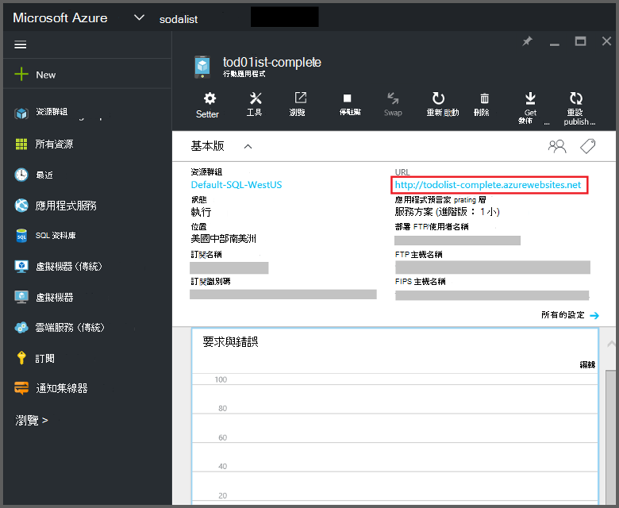
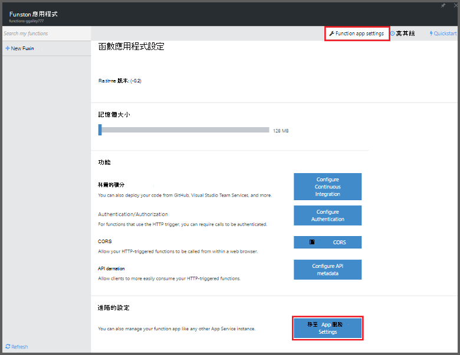
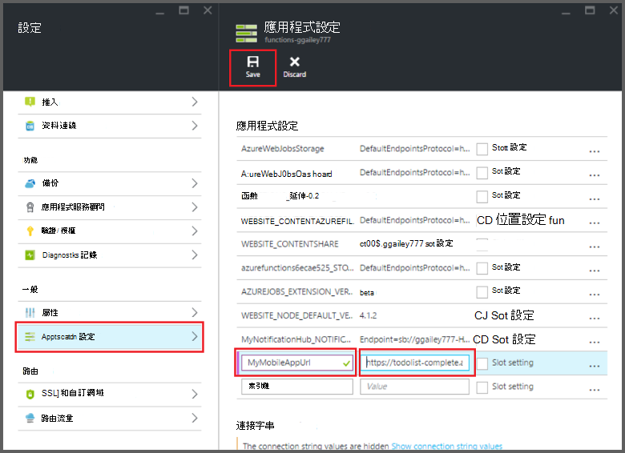

<properties
    pageTitle="Azure 函數 Mobile 應用程式繫結 |Microsoft Azure"
    description="瞭解如何使用 Azure Mobile 應用程式繫結 Azure 函數中。"
    services="functions"
    documentationCenter="na"
    authors="ggailey777"
    manager="erikre"
    editor=""
    tags=""
    keywords="azure 函數，如函數、 事件處理，動態計算，無架構"/>

<tags
    ms.service="functions"
    ms.devlang="multiple"
    ms.topic="reference"
    ms.tgt_pltfrm="multiple"
    ms.workload="na"
    ms.date="08/30/2016"
    ms.author="glenga"/>

# Azure 函數 Mobile 應用程式繫結

[AZURE.INCLUDE [functions-selector-bindings](../../includes/functions-selector-bindings.md)]

本文說明如何設定和 Azure 函數中的 [程式碼 Azure Mobile 應用程式繫結。 

[AZURE.INCLUDE [intro](../../includes/functions-bindings-intro.md)] 

Azure 應用程式服務行動應用程式可讓您行動用戶端的表格結束點資料的方式公開。 此相同的表格式資料可以使用兩個輸入與輸出 Azure 函數中的連結。 因為它支援動態結構描述，Node.js 後端行動應用程式會非常適合用於公開您函數搭配使用的表格式資料。 動態結構描述預設會啟用，並應生產行動應用程式中停用。 如需有關中 Node.js 後端的資料表端點的詳細資訊，請參閱[概觀︰ 表格作業](../app-service-mobile/app-service-mobile-node-backend-how-to-use-server-sdk.md#TableOperations)。 在行動應用程式，Node.js 後端支援在入口網站瀏覽和編輯的資料表。 如需詳細資訊，請參閱 Node.js SDK 主題中的 [[編輯在入口網站](../app-service-mobile/app-service-mobile-node-backend-how-to-use-server-sdk.md#in-portal-editing)。 當您使用 Azure 函數使用.NET 後端行動應用程式時，您必須手動更新您的資料模型所需的函數。 如需有關.NET 的後端行動應用程式中的表格端點的詳細資訊，請參閱[如何︰ 定義表格控制器](../app-service-mobile/app-service-mobile-dotnet-backend-how-to-use-server-sdk.md#define-table-controller).NET 後端 SDK 主題。 

## 建立您的行動應用程式後端 URL 環境變數

行動應用程式繫結目前您需要建立環境變數會傳回行動應用程式後端本身的 URL。 此 URL 可以找到[Azure 入口網站](https://portal.azure.com)中尋找您的行動應用程式，然後開啟刀。

若要將此 URL 設定環境變數函數應用程式中︰

1. 在應用程式函數的[Azure 函數入口網站](https://functions.azure.com/signin)中，按一下 [**函數應用程式設定** > **移至 [應用程式服務設定**。 

    

2. 在您函數應用程式中，按一下 [**所有設定**、 向下捲動**應用程式設定**]，然後在 [**應用程式設定**類型底下環境變數新的**名稱**，將 URL 貼入**值**，並確定使用的 HTTPS 配置，然後都按一下 [**儲存**並關閉函數應用程式刀若要返回 [函數] 入口網站。   

    

現在，您可以設定 [*連線*] 欄位為這個新環境變數在您的繫結。

## 使用您的行動應用程式表格結束點的安全存取 API 金鑰。

Azure 函數的行動裝置的資料表繫結可讓您指定的 API 金鑰，這是可以用來防止未經授權的存取您的函數以外的應用程式的共用的密碼。 行動應用程式沒有內建的 API 金鑰驗證支援。 不過，您也可以追蹤中[實作 API 金鑰 Azure 應用程式服務 Mobile 應用程式後端](https://github.com/Azure/azure-mobile-apps-node/tree/master/samples/api-key)的範例，以執行 API 金鑰 Node.js 後端行動應用程式中。 您同樣可以實作 API 金鑰[.NET 後端行動應用程式](https://github.com/Azure/azure-mobile-apps-net-server/wiki/Implementing-Application-Key)中。

>[AZURE.IMPORTANT] 此 API 鍵不會散發與您的行動應用程式用戶端，您應該只將它發佈安全地服務端的用戶端，例如 Azure 函數。 

## Azure Mobile 應用程式輸入繫結

輸入繫結可以從行動裝置的表格端點載入一筆記錄，並將其直接傳遞給繫結。 取決於 ID 的記錄會根據叫用函數的觸發程序。 C# 函數中記錄所做的任何變更會自動傳送回資料表函數成功結束時。

#### 行動應用程式輸入繫結 function.json

*Function.json*檔案支援下列屬性︰

- `name`︰ 用於函數的程式碼，在新記錄的名稱變數。
- `type`︰ *mobileTable*必須設定飛過類型。
- `tableName`︰ 建立新記錄的位置資料表。
- `id`︰ 擷取識別碼的記錄。 此屬性支援繫結類似`{queueTrigger}`，其中會使用佇列中郵件的字串值作為記錄識別碼。
- `apiKey`︰ 是指定的選用的 API 金鑰行動應用程式的應用程式設定的字串。 當您的行動應用程式使用 API 金鑰限制的用戶端存取時，這是必要。
- `connection`: 環境變數應用程式設定] 中，指定您的行動應用程式後端的 URL 名稱的字串。
- `direction`︰ 繫結方向，必須設定為 [*中*。

範例*function.json*檔案︰

    {
      "bindings": [
        {
          "name": "record",
          "type": "mobileTable",
          "tableName": "MyTable",
          "id" : "{queueTrigger}",
          "connection": "My_MobileApp_Url",
          "apiKey": "My_MobileApp_Key",
          "direction": "in"
        }
      ],
      "disabled": false
    }

#### Azure C# 佇列中觸發程序的行動應用程式碼範例

根據範例 function.json，請輸入繫結擷取行動應用程式的記錄表格的符合佇列中郵件的字串，然後傳送到*記錄*參數的識別碼的結束點。 找不到記錄時, 的參數為 null。 記錄然後會更新為新的*文字*值函式結束時。

    #r "Newtonsoft.Json"    
    using Newtonsoft.Json.Linq;
    
    public static void Run(string myQueueItem, JObject record)
    {
        if (record != null)
        {
            record["Text"] = "This has changed.";
        }    
    }

#### Azure Node.js 佇列中觸發程序的行動應用程式碼範例

根據範例 function.json，請輸入繫結擷取行動應用程式的記錄表格的符合佇列中郵件的字串，然後傳送到*記錄*參數的識別碼的結束點。 Node.js 函數中更新的記錄，不會傳送至資料表。 此範例中的程式碼會將擷取的記錄寫入記錄檔。

    module.exports = function (context, input) {    
        context.log(context.bindings.record);
        context.done();
    };

## Azure Mobile 應用程式的輸出繫結

您函數可以使用輸出繫結的行動應用程式表格端點寫入記錄。 

#### Mobile 應用程式的 function.json 輸出繫結

Function.json 檔案支援下列屬性︰

- `name`︰ 用於函數的程式碼，在新記錄的名稱變數。
- `type`︰ 必須設定為 [ *mobileTable*繫結類型。
- `tableName`︰ 建立新記錄的位置資料表。
- `apiKey`︰ 是指定的選用的 API 金鑰行動應用程式的應用程式設定的字串。 當您的行動應用程式使用 API 金鑰限制的用戶端存取時，這是必要。
- `connection`: 環境變數應用程式設定] 中，指定您的行動應用程式後端的 URL 名稱的字串。
- `direction`︰ 繫結方向，必須設定為 [*出*。

範例 function.json:

    {
      "bindings": [
        {
          "name": "record",
          "type": "mobileTable",
          "tableName": "MyTable",
          "connection": "My_MobileApp_Url",
          "apiKey": "My_MobileApp_Key",
          "direction": "out"
        }
      ],
      "disabled": false
    }

#### Azure C# 佇列中觸發程序的行動應用程式碼範例

這個 C# 程式碼範例*文字*屬性將上述繫結中指定之資料表的行動應用程式表格端點中插入新的記錄。

    public static void Run(string myQueueItem, out object record)
    {
        record = new {
            Text = $"I'm running in a C# function! {myQueueItem}"
        };
    }

#### Azure Node.js 佇列中觸發程序的行動應用程式碼範例

這個 Node.js 程式碼範例*文字*屬性將上述繫結中指定之資料表的行動應用程式表格端點中插入新的記錄。

    module.exports = function (context, input) {
    
        context.bindings.record = {
            text : "I'm running in a Node function! Data: '" + input + "'"
        }   
    
        context.done();
    };

## 後續步驟

[AZURE.INCLUDE [next steps](../../includes/functions-bindings-next-steps.md)]
