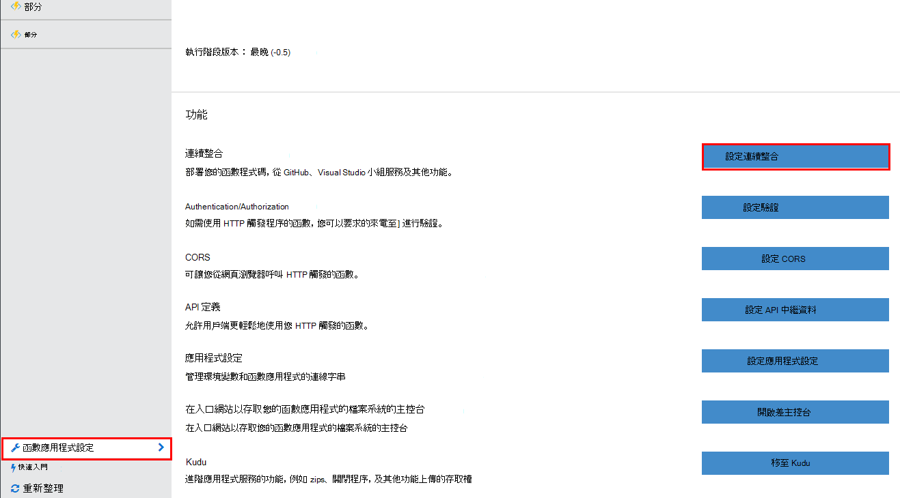
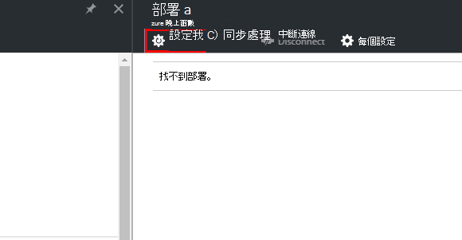
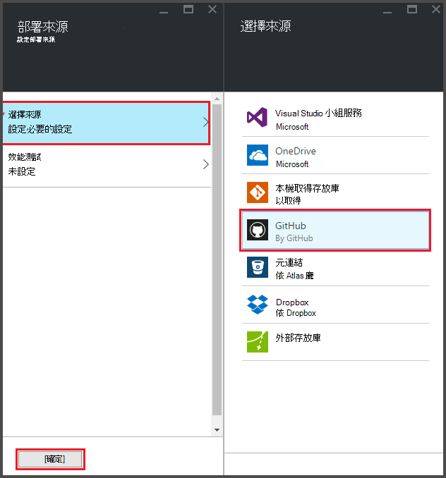
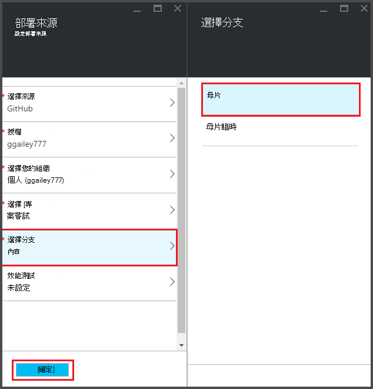
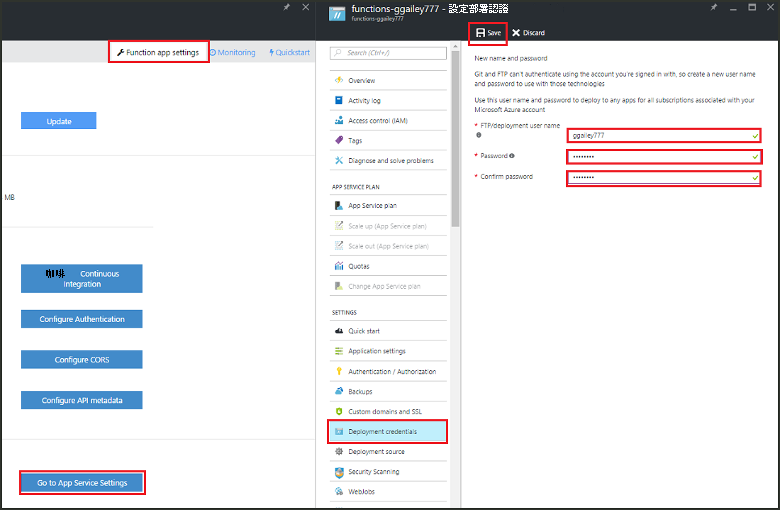
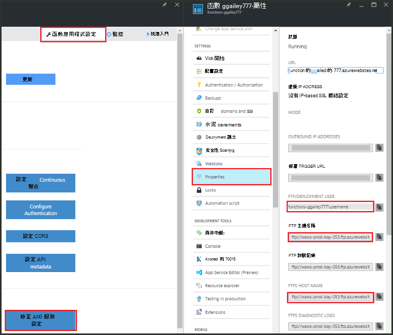
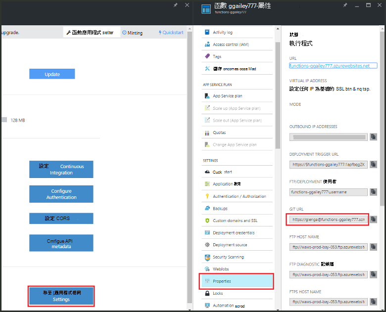

<properties
   pageTitle="Azure 函數的連續部署 |Microsoft Azure"
   description="發佈您的 Azure 函數使用連續的部署設備的 Azure 應用程式服務。"
   services="functions"
   documentationCenter="na"
   authors="ggailey777"
   manager="erikre"
   editor=""
   tags=""
   />

<tags
   ms.service="functions"
   ms.devlang="multiple"
   ms.topic="article"
   ms.tgt_pltfrm="multiple"
   ms.workload="na"
   ms.date="09/25/2016"
   ms.author="glenga"/>

# 連續部署 Azure 函數 

Azure 函數可以輕鬆設定連續部署函數應用程式。 函數會運用 Azure 應用程式服務整合 BitBucket、 Dropbox、 GitHub，與 Visual Studio 小組服務 (VSTS) 若要啟用位置 Azure 提取更新您的函數程式碼時其發佈至其中一個服務連續部署工作流程。 如果您是新 Azure 函數，開始[Azure 功能概觀](functions-overview.md)。

連續部署就非常有用的專案位置多個與經常捐贈會被整合。 也可讓您維護來源控制您函數的程式碼。 目前支援下列部署來源︰

+ [Bitbucket](https://bitbucket.org/)
+ [Dropbox](https://bitbucket.org/)
+ [給本機 repo](../app-service-web/app-service-deploy-local-git.md)
+ 給外部 repo
+ [GitHub]
+ 水星外部 repo
+ [OneDrive](https://onedrive.live.com/)
+ Visual Studio 小組服務

部署設定每個函數 app 為基礎。 啟用連續部署後，存取入口網站中的函數程式碼設定為*唯讀*。

## 連續的部署需求

您必須設定部署來源和函數程式碼部署之前，先您安排連續部署來源中。 在指定的函數應用程式部署中，每個函數放在命名子目錄，有目錄名稱的函數名稱。 此資料夾結構是基本上您網站的程式碼。 

[AZURE.INCLUDE [functions-folder-structure](../../includes/functions-folder-structure.md)]

## 設定連續部署

若要設定現有函數應用程式的連續的部署使用下列程序︰

1. 在應用程式函數的[Azure 函數入口網站](https://functions.azure.com/signin)中，按一下 [**函數應用程式設定** > **設定持續整合** > **設定**。

    
    
    
    
    您也可以前往部署刀從函數快速入門即可**開始從來源控制項**。

2. 在部署刀中，按一下 [**選擇來源**，然後填入所選的部署來源的資訊，按一下**[確定]**。

    

設定連續部署之後，您部署來源中的所有變更檔案都複製到 [函數] 應用程式，然後觸發的完整網站部署。 更新來源中的檔案時，會重新部署網站。

##部署選項

以下是一些常見的部署案例︰

+ 

###建立暫存的部署

函數應用程式還不支援部署的位置。 不過，您還是可以使用連續整合管理個別執行與生產部署。

設定及使用暫存的部署的程序通常會像這樣︰

1. 在您的訂閱，一個用於實際執行程式碼，一個用於臨時中建立兩個函數應用程式。 

2. 如果您還沒有其中一個，請建立部署來源。 我們會使用[GitHub]。
 
3. 生產函數應用程式，完成上述步驟，**設定連續部署**中的，設定部署分支為您 GitHub repo 的主版分支。

    

4. 重複此步驟的暫存的函數應用程式，但這次選擇暫存的分支中您 GitHub repo。 如果您的部署來源不支援分支，使用不同的資料夾。
 
5. 進行更新程式碼中的暫存的分支或資料夾，然後確認了暫存部署中反映那些變更。

6. 測試之後，合併變更暫存的分支至主版分支。 這樣會觸發部署生產函數應用程式。 如果您的部署來源不支援分支，覆寫生產資料夾中的檔案的暫存資料夾中的檔案。

###將現有的函數移至 [接續本頁] 分部署

當您有現有已經建立和維護在入口網站，您必須下載您現有函數的程式碼的檔案使用 FTP 或之前本機給存放庫可以設定連續部署，如上述的函數。 您可以在應用程式服務設定函數應用程式。 下載檔案之後，您可以您所選的連續部署來源上載它們。

>[AZURE.NOTE]設定持續整合後，您會無法編輯 [函數] 入口網站中的來源檔案。

####如何︰ 設定部署認證
您可以將檔案下載您函數應用程式之前，您必須設定您的認證以存取網站，您可以從入口網站。 在函數應用程式層級已設定認證。

1. 在應用程式函數的[Azure 函數入口網站](https://functions.azure.com/signin)中，按一下 [**函數應用程式設定** > **移至 [應用程式服務設定** > **部署認證**。

    

2. 輸入使用者名稱和密碼，然後按一下 [**儲存**]。 您現在可以存取 FTP 或內建給 repo 函數應用程式中使用這些認證。

####如何︰ 使用 FTP 下載檔案

1. 在應用程式函數的[Azure 函數入口網站](https://functions.azure.com/signin)中，按一下 [**函數應用程式設定** > **移至 [應用程式服務設定** > **屬性**和**FTP/部署使用者**、 **FTP 主機名稱**，及**FTP 主機名稱]**的值，複製。  
顯示在入口網站，包括應用程式的名稱，才能為 FTP 伺服器提供適當的內容，則必須輸入**FTP/部署使用者**。

    
    
2. 從您的 FTP 用戶端，使用 [連接資訊您收集連線到您的應用程式，並下載來源檔案以供您函數。

####如何︰ 使用本機給存放庫下載檔案

1. 在應用程式函數的[Azure 函數入口網站](https://functions.azure.com/signin)中，按一下 [**函數應用程式設定** > **設定持續整合** > **設定**。

2. 在部署刀中，按一下 [**選擇來源****本機給存放庫**，然後按一下**[確定]**。
 
3. 按一下 [**移至 [應用程式服務設定** > **屬性**和記事給 URL 的值。 
    
    

4. 複製您使用給注意命令或您偏好使用的給工具的本機電腦上 repo。 給複製命令看起來如下所示︰

        git clone https://username@my-function-app.scm.azurewebsites.net:443/my-function-app.git

5. 擷取檔案從您的函數應用程式複製到本機電腦，如下列範例所示︰

        git pull origin master

    如果要求，請提供使用者名稱和密碼函數應用程式部署。  

[GitHub]: https://github.com/
