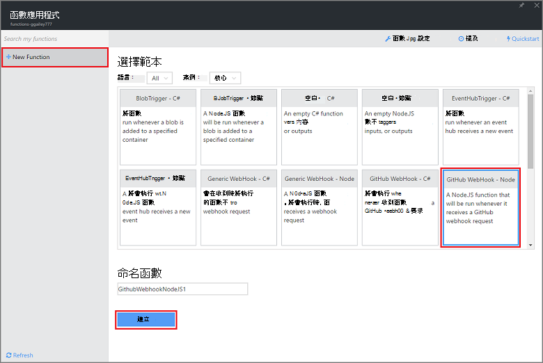
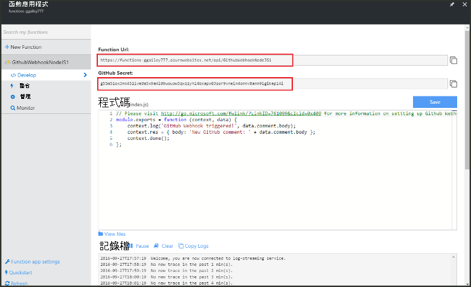
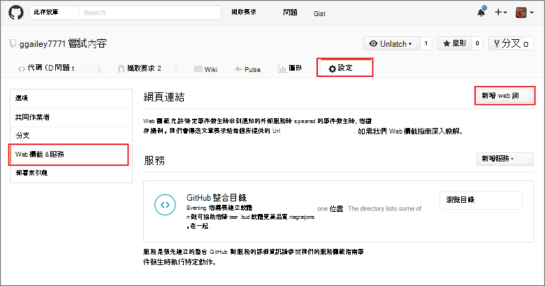
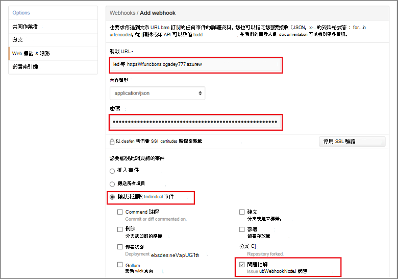

<properties
   pageTitle="建立 web 鉤或 API Azure 函數 |Microsoft Azure"
   description="若要建立 WebHook 或 API 叫用的函數使用 Azure 函數呼叫。"
   services="azure-functions"
   documentationCenter="na"
   authors="ggailey777"
   manager="erikre"
   editor=""
   tags=""
   />

<tags
   ms.service="functions"
   ms.devlang="multiple"
   ms.topic="get-started-article"
   ms.tgt_pltfrm="multiple"
   ms.workload="na"
   ms.date="08/30/2016"
   ms.author="glenga"/>
   
# 建立 webhook 或 API Azure 函數

Azure 函數是一種事件導向、 計算指定體驗，可讓您建立排程，或是觸發單位的程式碼實作各種不同的語言。 若要瞭解關於 Azure 函數的詳細資訊，請參閱[Azure 功能概觀](functions-overview.md)。

本主題說明如何建立 GitHub webhook 叫用新 Node.js 函數。 根據 Azure 函數入口網站中預先定義的範本建立新的函數。 您也可以觀看短片，瞭解如何在入口網站執行這些步驟。

## 觀看影片

以下影片說明如何在本教學課程中執行基本步驟 

[AZURE.VIDEO create-a-web-hook-or-api-azure-function]

##從範本建立 webhook 觸發函數

在函數應用程式裝載您 Azure 中的函數的執行。 您可以建立函數之前，必須有一個作用中的 Azure 帳戶。 如果您還沒有 Azure 帳戶，[可使用免費的帳戶](https://azure.microsoft.com/free/)。 

1. 移至[Azure 函數入口網站](https://functions.azure.com/signin)並使用您的 Azure 帳戶登入。

2. 如果您有現有的函數應用程式使用，請選取 [**函數**應用程式，然後按一下 [**開啟**。 若要建立新的函數應用程式，請輸入新的函數應用程式的唯一**名稱**或接受產生的一個、 選取您慣用的**區域**，然後按一下 [**建立 + 開始**。 

3. 在您函數應用程式中，按一下 [ **+ 新函數** > **GitHub Webhook-節點** > **建立**。 這會建立函數以指定的範本為基礎的預設名稱。 

     

4. 在**開發**，請注意**程式碼**視窗中的範例 express.js 函數。 此函數從問題註解 webhook 接收 GitHub 要求、 記錄的問題文字及傳送的回應為 webhook `New GitHub comment: <Your issue comment text>`。

     

5. 複製**函數 URL** ] 與 [ **GitHub 私人**值。 當您建立 GitHub webhook 時，您將需要這些。 

6. 向下**執行**捲動，請注意問題註解在邀請內文中的預先定義的 JSON 本文，然後按一下 [**執行**]。 
 
    您隨時都可以測試新範本為基礎的函數提供任何**開發**] 索引標籤中的向右預期本文 JSON 資料，然後按一下 [**執行**] 按鈕。 在此情況下，範本具有預先定義的本文問題註解。 
 
接下來，您將建立實際 webhook 您 GitHub 存放庫內。

##設定 webhook

1. 在 GitHub，瀏覽到您所擁有的; 存放庫這包含有分叉任何存放庫。
 
2. 按一下 [**設定** > **Webhooks 與服務** > **新增 webhook**。

       

3. 貼上您函數的 URL] 與 [私人**裝載 URL** ] 與 [**私人**]，然後按一下 [**讓我選取個別的事件****問題註解**，然後選取按一下 [**新增 webhook**。

     

此時，GitHub webhook 設定為 [當新增新的問題註解時觸發您函數。  
現在就來測試它。

##測試函數

1. 在您 GitHub repo，在新的瀏覽器視窗中開啟 [**問題**] 索引標籤，按一下 [**新的問題**、 輸入標題然後按一下**提交新的問題**。 您也可以開啟現有的問題。

2. 在問題，請輸入註解，然後按一下 [**註解**。 此時，您就可以回到您新 webhook 中 GitHub 下**最近傳送**webhook 邀請傳送和回應的本文所`New GitHub comment: <Your issue comment text>`。

3. 在 [函數] 入口網站中，向下捲動記錄和已觸發函數，請參閱以及的值`New GitHub comment: <Your issue comment text>`寫入串流的記錄。

##後續步驟

請參閱下列主題 Azure 函數的相關詳細資訊。

+ [Azure 函數開發人員參考](functions-reference.md)  
程式設計參考編碼函數。
+ [測試 Azure 函數](functions-test-a-function.md)  
說明各種工具和技術來測試您的函數。
+ [如何調整 Azure 函數](functions-scale.md)  
討論 Azure 功能，包括動態服務方案，以及如何選擇正確的計劃提供的服務方案。  

[AZURE.INCLUDE [Getting Started Note](../../includes/functions-get-help.md)]
