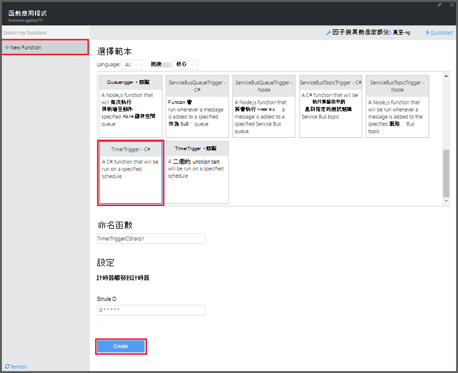
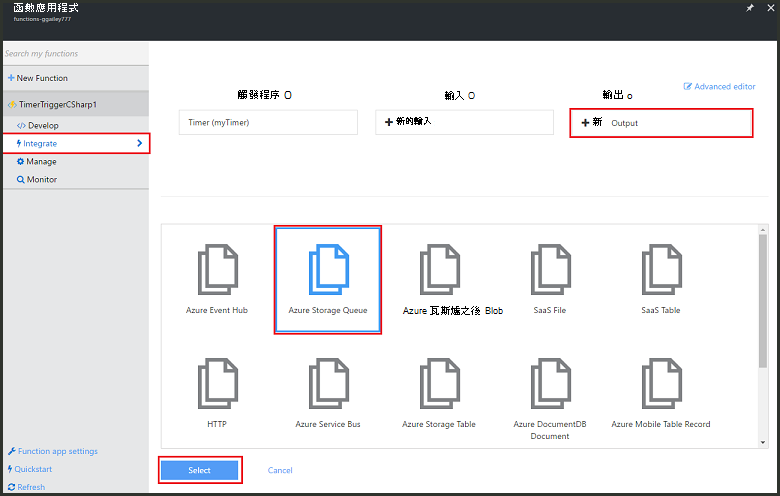
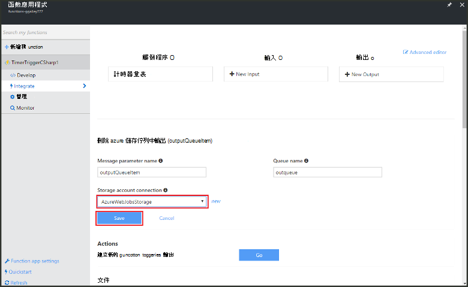

<properties
   pageTitle="建立事件處理函數 |Microsoft Azure"
   description="使用 Azure 函數建立事件計時器執行根據 C# 函數。"
   services="functions"
   documentationCenter="na"
   authors="ggailey777"
   manager="erikre"
   editor=""
   tags=""
   />

<tags
   ms.service="functions"
   ms.devlang="multiple"
   ms.topic="get-started-article"
   ms.tgt_pltfrm="multiple"
   ms.workload="na"
   ms.date="09/25/2016"
   ms.author="glenga"/>
   
# 建立事件處理 Azure 函數

Azure 函數是一種事件導向、 計算指定體驗，可讓您建立排程，或是觸發的程式碼的單位實作各種不同的語言。 若要瞭解關於 Azure 函數的詳細資訊，請參閱[Azure 功能概觀](functions-overview.md)。

本主題說明如何在 C# 程式跟根據事件計時器，若要新增的郵件儲存空間佇列中建立新的函數。 

## 必要條件 

您可以建立函數之前，必須有一個作用中的 Azure 帳戶。 如果您還沒有 Azure 帳戶，[可使用免費的帳戶](https://azure.microsoft.com/free/)。

## 從範本建立計時器觸發函數

在函數應用程式裝載您 Azure 中的函數的執行。 您可以建立函數之前，必須有一個作用中的 Azure 帳戶。 如果您還沒有 Azure 帳戶，[可使用免費的帳戶](https://azure.microsoft.com/free/)。 

1. 移至[Azure 函數入口網站](https://functions.azure.com/signin)並使用您的 Azure 帳戶登入。

2. 如果您有現有的函數應用程式使用，請選取 [**函數**應用程式，然後按一下 [**開啟**。 若要建立新的函數應用程式，請輸入新的函數應用程式的唯一**名稱**或接受產生的一個、 選取您慣用的**區域**，然後按一下 [**建立 + 開始**。 

3. 在您函數應用程式中，按一下 [ **+ 新函數** > **TimerTrigger-C#** > **建立**。 這樣會函數建立與執行一次每分鐘的預設排程的預設名稱。 

    

4. 在您的新功能，按一下 [**整合**] 索引標籤 >**新的輸出** > **Azure 儲存佇列中** > **選取**。

    

5. 在**Azure 儲存佇列中輸出**中，選取現有的**儲存空間帳戶連線**，或建立一個新，然後按一下 [**儲存**]。 

    

6. 回**開發**] 索引標籤中，用下列程式碼來取代現有 C# 指令碼的**程式碼**視窗中︰

        using System;
        
        public static void Run(TimerInfo myTimer, out string outputQueueItem, TraceWriter log)
        {
            // Add a new scheduled message to the queue.
            outputQueueItem = $"Ping message added to the queue at: {DateTime.Now}.";
            
            // Also write the message to the logs.
            log.Info(outputQueueItem);
        }

    將此程式碼加入佇列中的目前日期和時間函數執行時的新郵件。

7. 按一下 [**儲存**]，並觀看下一個函數執行的**記錄**視窗。

8. （選用）瀏覽至儲存帳戶，並確認郵件新增到佇列。

9. 回到 [**整合**] 索引標籤，並變更排程欄位以`0 0 * * * *`。 函數現在會執行一次每小時。 

這是最簡單的計時器觸發程序與儲存佇列中的範例輸出繫結。 如需詳細資訊，請參閱[Azure 函數計時器觸發程序](functions-bindings-timer.md)和[Azure 函數引動程序和 Azure 儲存體繫結](functions-bindings-storage.md)主題。

##後續步驟

請參閱下列主題 Azure 函數的相關詳細資訊。

+ [Azure 函數開發人員參考](functions-reference.md)  
編碼函數和定義引動程序和繫結的程式設計參考。
+ [測試 Azure 函數](functions-test-a-function.md)  
說明各種工具和技術來測試您的函數。
+ [如何調整 Azure 函數](functions-scale.md)  
討論 Azure 功能，包括動態服務方案，以及如何選擇正確的計劃提供的服務方案。  

[AZURE.INCLUDE [Getting Started Note](../../includes/functions-get-help.md)]
