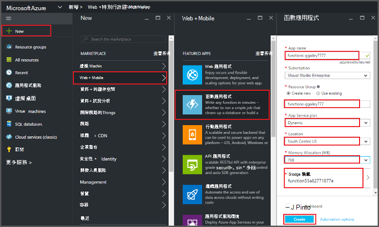

<properties
   pageTitle="從 Azure 入口網站中建立函數 |Microsoft Azure"
   description="建立您第一份 Azure 函數、 無伺服器的應用程式，在兩分鐘。"
   services="functions"
   documentationCenter="na"
   authors="ggailey777"
   manager="erikre"
   editor=""
   tags=""
/>

<tags
   ms.service="functions"
   ms.devlang="multiple"
   ms.topic="article"
   ms.tgt_pltfrm="multiple"
   ms.workload="na"
   ms.date="09/08/2016"
   ms.author="glenga"/>

#從 Azure 入口網站中建立函數

##概觀
Azure 函數是一種事件導向、 計算指定體驗延伸至現有的 Azure 應用程式平台實作觸發事件發生的其他 Azure 服務、 SaaS 產品和內部部署系統的程式碼的功能。 Azure 函數，您的應用程式不按比例縮放根據的需求與您支付僅適用於您所使用的資源。 Azure 函數可讓您建立排程或觸發實作程式設計使用不同語言的程式碼的單位。 若要瞭解關於 Azure 函數的詳細資訊，請參閱[Azure 功能概觀](functions-overview.md)。

本主題說明如何建立簡單的 「 好 「 使用 Azure 入口網站的 HTTP 觸發叫用 Node.js Azure 函數。 Azure 入口網站中建立函數之前，您必須明確建立函數應用程式，在 Azure 應用程式服務。 若要讓會自動為您建立的函數應用程式，請參閱[其他 Azure 函數快速入門教學課程](functions-create-first-azure-function.md)，這是更簡單的快速入門體驗，包括視訊。

##建立函數應用程式

在函數應用程式裝載您 Azure 中的函數的執行。 請遵循這些步驟來建立 Azure 入口網站中的函數應用程式。

您可以建立您的第一個函數之前，必須有一個作用中的 Azure 帳戶。 如果您還沒有 Azure 帳戶，[可使用免費的帳戶](https://azure.microsoft.com/free/)。

1. 移至[Azure 入口網站](https://portal.azure.com)並使用您的 Azure 帳戶登入。

2. 按一下 [ **+ 新增** > **Web + 行動** > **函數應用程式**，選取您的**訂閱**，輸入唯一的**應用程式的名稱**來識別您函數應用程式，然後指定下列設定︰

    + **[資源群組](../azure-portal/resource-group-portal.md/)**︰ 選取 [**建立新**，然後輸入新的資源群組的名稱。 您也可以選擇現有的資源群組，但是您可能無法建立動態應用程式服務計畫函數應用程式。
    + **[應用程式服務計劃](../app-service/azure-web-sites-web-hosting-plans-in-depth-overview.md)**︰ 選擇*動態*] 或 [*傳統*。 
        + **動態**︰ Azure 函數的預設計劃類型。 當您選擇的動態計劃時，您也必須選擇**位置**，並設定**記憶體配置**（以 mb 計）。 有關如何影響記憶體配置成本，請參閱[Azure 函數價格](https://azure.microsoft.com/pricing/details/functions/)。 
        + **傳統**︰ 傳統的應用程式服務方案需要您建立**應用程式服務方案/位置**，或選取現有的項目。 這些設定會決定[成本，並計算資源的位置，功能，](https://azure.microsoft.com/pricing/details/app-service/)您的應用程式。  
    + **儲存帳戶**︰ 每一個函數應用程式需要儲存帳戶。 您可以選擇現有的儲存空間帳戶或建立一個。 

    

3. 按一下 [**建立**]，請進行佈建和部署新的函數應用程式。  

[函數] 應用程式會佈建後，您可以建立您的第一個函數。

## 建立函數

這些步驟建立函數從 Azure 函數快速入門。

1. 在 [**快速入門**] 索引標籤中，按一下 [ **WebHook + API**和**JavaScript**]，然後按一下 [**建立函數**。 建立新的預先定義的 Node.js 函數。 

    

2. （選用）此時，快速入門中，您可以選擇在入口網站 Azure 函數功能快速導覽。   一旦您已完成，或略過導覽，您可以使用 HTTP 觸發程序來測試您的新功能。

##測試函數

由於 Azure 函數快速入門包含功能程式碼，您可以立即測試您的新功能。

1. 在**開發**] 索引標籤上，檢閱**程式碼**視窗，請注意，此 Node.js 碼預期 HTTP 要求傳遞郵件本文中，或是查詢字串中的*名稱*值。 函數在執行時，此值會傳回回應訊息中。

    

2. 向下捲動**要求內文**] 文字方塊中，*名稱*屬性的值變更為您的名稱，然後按一下 [**執行**]。 您會看到測試 HTTP 要求，就會觸發執行，資訊會寫入串流的記錄，，"hello"回應會顯示在 [**輸出**。 

3. 若要觸發執行相同的功能，從另一個瀏覽器視窗或] 索引標籤，複製**函數 URL**值**開發**] 索引標籤並將其貼於瀏覽器網址列中，然後附加查詢字串值`&name=yourname`然後按下 enter。 相同的資訊會寫入記錄檔，並在瀏覽器顯示"hello"回應做之前。

##後續步驟

此快速入門示範非常簡單函式的執行基本 HTTP 觸發。 請參閱下列主題，如需有關使用 Azure 函數在您的應用程式中的強大。

+ [Azure 函數開發人員參考](functions-reference.md)  
編碼函數和定義引動程序和繫結的程式設計參考。
+ [測試 Azure 函數](functions-test-a-function.md)  
說明各種工具和技術來測試您的函數。
+ [如何調整 Azure 函數](functions-scale.md)  
討論 Azure 功能，包括動態服務方案，以及如何選擇正確的計劃提供的服務方案。 
+ [什麼是 Azure 應用程式服務？](../app-service/app-service-value-prop-what-is.md)  
Azure 函數使用核心功能，例如部署、 環境變數和診斷 Azure 應用程式服務平台。 

[AZURE.INCLUDE [Getting Started Note](../../includes/functions-get-help.md)]
