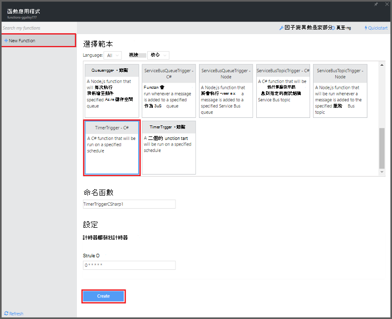

<properties
   pageTitle="使用 Azure 函數來執行排程的清理工作 |Microsoft Azure"
   description="使用 Azure 函數建立事件計時器執行根據 C# 函數。"
   services="functions"
   documentationCenter="na"
   authors="ggailey777"
   manager="erikre"
   editor=""
   tags=""
   />

<tags
   ms.service="functions"
   ms.devlang="multiple"
   ms.topic="article"
   ms.tgt_pltfrm="multiple"
   ms.workload="na"
   ms.date="09/26/2016"
   ms.author="glenga"/>
   
# 使用 Azure 函數來執行排程的清理工作

本主題說明如何使用 Azure 函數來建立新函數的 C# 程式清除事件計時器執行根據資料庫資料表中的資料列。 根據 Azure 函數入口網站中預先定義的範本建立新的函數。 若要支援這種情況下，您也必須設定資料庫連線字串為應用程式服務函數應用程式中設定。 

## 必要條件 

您可以建立函數之前，必須有一個作用中的 Azure 帳戶。 如果您還沒有 Azure 帳戶，[可使用免費的帳戶](https://azure.microsoft.com/free/)。

本主題示範名為*TodoItems*在 SQL 資料庫資料表中執行大量清理作業 TRANSACT-SQL 命令。 當您完成[Azure 應用程式服務行動應用程式快速入門教學課程](../app-service-mobile/app-service-mobile-ios-get-started.md)，會建立此相同的 TodoItems 表格。 您也可以使用範例資料庫，如果您選擇使用不同的表格，您需要修改的命令。

您可以取得用來在入口網站中**設定**行動應用程式後端的連接字串 > **應用程式設定** > **連接字串** > **顯示連接字串值** > **MS_TableConnectionString**。 您也可以取得連線字串直接從 SQL 資料庫**設定**入口網站中 > **屬性** > **顯示資料庫連接字串** > **ADO.NET （SQL 驗證）**。

這種情況下使用大量作業對資料庫。 若要讓您個別函數程序的 CRUD 作業 Mobile 應用程式表格中，您應該改用行動表格繫結。

## 在 [函數] 應用程式中設定 SQL 資料庫連線字串

在函數應用程式裝載您 Azure 中的函數的執行。 最好的連接字串和其他密碼儲存在您函數的應用程式設定。 如此可避免意外洩漏時函數程式碼結束上 repo 某處。 

1. 移至[Azure 函數入口網站](https://functions.azure.com/signin)並使用您的 Azure 帳戶登入。

2. 如果您有現有的函數應用程式使用，請選取 [**函數**應用程式，然後按一下 [**開啟**。 若要建立新的函數應用程式，請輸入新的函數應用程式的唯一**名稱**或接受產生的一個、 選取您慣用的**區域**，然後按一下 [**建立 + 開始**。 

3. 在您函數應用程式中，按一下 [**函數應用程式設定** > **移至 [應用程式服務設定**。 

    

4. 在您函數應用程式中，按一下**所有設定**，捲動至 [**應用程式設定**]，接著在 [**連接字串**類型下`sqldb_connection`**名稱**，連接字串貼上**值**、 都按一下 [**儲存**]，然後關閉函數應用程式刀若要返回 [函數] 入口網站。

    

現在，您可以新增至您的 SQL 資料庫連線 C# 函數程式碼。

## 從範本建立計時器觸發函數

1. 在您函數應用程式中，按一下 [ **+ 新函數** > **TimerTrigger-C#** > **建立**。 這樣會函數建立與執行一次每分鐘的預設排程的預設名稱。 

    

2. 在 [**程式碼**] 窗格中 [**開發**] 索引標籤，新增下列的組件參考頂端的 [現有的函數程式碼︰

        #r "System.Configuration"
        #r "System.Data"

3. 新增下列`using`函數的陳述式︰

        using System.Configuration;
        using System.Data.SqlClient;
        using System.Threading.Tasks; 

4. 下列程式碼取代現有的**執行**函數︰

        public static async Task Run(TimerInfo myTimer, TraceWriter log)
        {
            var str = ConfigurationManager.ConnectionStrings["sqldb_connection"].ConnectionString;
            using (SqlConnection conn = new SqlConnection(str))
            {
                conn.Open();
                var text = "DELETE from dbo.TodoItems WHERE Complete='True'";
                using (SqlCommand cmd = new SqlCommand(text, conn))
                {
                    // Execute the command and log the # rows deleted.
                    var rows = await cmd.ExecuteNonQueryAsync();
                    log.Info($"{rows} rows were deleted");
                }
            }
        }

5. 按一下 [**儲存**]，監看式**記錄**視窗，在下一個函數執行，然後從 TodoItems 資料表刪除的列數。

6. （選用）使用[行動應用程式快速入門應用程式](../app-service-mobile/app-service-mobile-ios-get-started.md)，將標記其他項目，為 「 完成 」 然後返回 [**記錄**] 視窗，然後在下一次執行時函數刪除監看式相同的列數。 

##後續步驟

請參閱下列主題 Azure 函數的相關詳細資訊。

+ [Azure 函數開發人員參考](functions-reference.md)  
編碼函數和定義引動程序和繫結的程式設計參考。
+ [測試 Azure 函數](functions-test-a-function.md)  
說明各種工具和技術來測試您的函數。
+ [如何調整 Azure 函數](functions-scale.md)  
討論 Azure 功能，包括動態服務方案，以及如何選擇正確的計劃提供的服務方案。  

[AZURE.INCLUDE [Getting Started Note](../../includes/functions-get-help.md)]