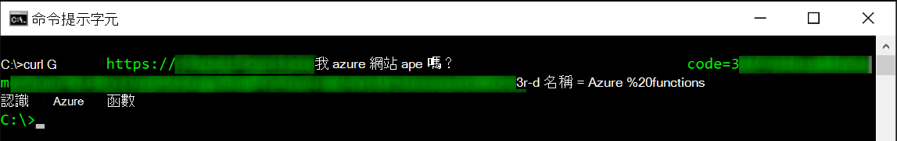
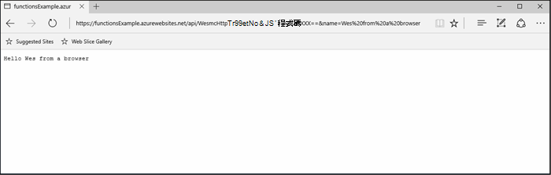
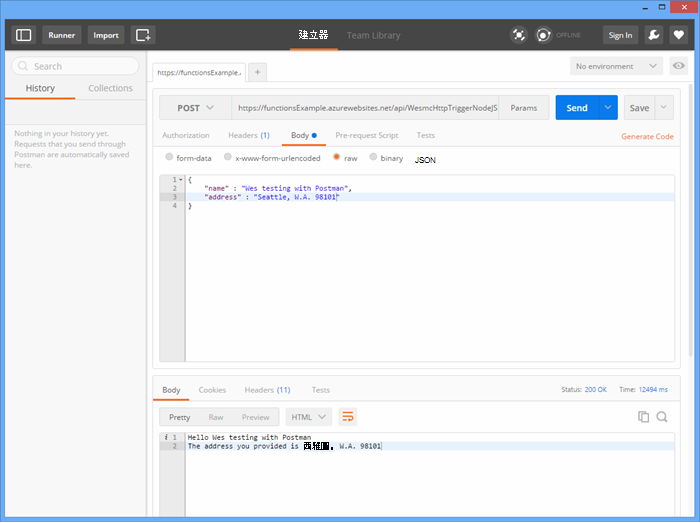
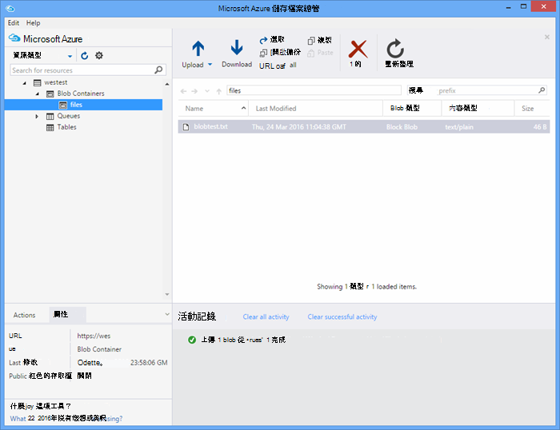

<properties
   pageTitle="測試 Azure 函數 |Microsoft Azure"
   description="測試您使用郵差、 捲曲和 Node.js 的 Azure 函數。"
   services="functions"
   documentationCenter="na"
   authors="wesmc7777"
   manager="erikre"
   editor=""
   tags=""
   keywords="azure 函數、 函數、 事件處理、 webhooks、 動態計算、 無結構，測試"/>

<tags
   ms.service="functions"
   ms.devlang="multiple"
   ms.topic="article"
   ms.tgt_pltfrm="multiple"
   ms.workload="na"
   ms.date="08/19/2016"
   ms.author="wesmc"/>

# 測試 Azure 函數

## 概觀

在本教學課程中，我們會逐步不同的方法來測試函數。 我們會定義 http 觸發程序函數可接受輸入查詢字串參數，或是邀請內文。 預設**HttpTrigger Node.js 函數**範本的程式碼支援`name`查詢字串參數。 我們也會加入支援沿著使用該參數的程式碼`address`邀請內文中的使用者資訊。

## 建立以進行測試函數

大部分的本教學課程中，我們將使用也經過小幅修改的**HttpTrigger Nodejs 函數**範本建立新的函數時可用的版本。  如果您需要協助建立新的函數，您可以檢閱[建立您的第一個 Azure 函數教學課程](functions-create-first-azure-function.md)。  在 [ [Azure 入口網站]中建立測試函數時，只選擇**HttpTrigger Nodejs 函數**範本。

預設函數範本基本上是認識全球函數回應從邀請內文或查詢字串參數名稱`name=<your name>`。  我們會更新程式碼，也可讓您提供的名稱及地址作為 JSON 邀請內文中的內容。 然後函數會傳回這些上一步] 時使用的用戶端。   

下列程式碼，我們將用來測試更新函數︰

    module.exports = function(context, req) {
        context.log("Node.js HTTP trigger function processed a request. RequestUri=%s", req.originalUrl);
        context.log("Request Headers = " + JSON.stringify(req.headers));    
    
        if (req.query.name || (req.body && req.body.name)) {
            if (typeof req.query.name != "undefined") {
                context.log("Name was provided as a query string param..."); 
                ProcessNewUserInformation(context, req.query.name);
            }
            else {
                context.log("Processing user info from request body..."); 
                ProcessNewUserInformation(context, req.body.name, req.body.address);
            }
        }
        else {
            context.res = {
                status: 400,
                body: "Please pass a name on the query string or in the request body"
            };
        }
        context.done();
    };
    
    function ProcessNewUserInformation(context, name, address)
    {    
        context.log("Processing User Information...");            
        context.log("name = " + name);            
        echoString = "Hello " + name;
        
        if (typeof address != "undefined")
        {
            echoString += "\n" + "The address you provided is " + address;
            context.log("address = " + address);            
        }
        
        context.res = {
                // status: 200, /* Defaults to 200 */
                body: echoString
            };
    }

## 測試工具函數

### 使用捲曲測試

通常在測試軟體時，不需要任何進一步命令列可協助偵錯應用程式的外觀，這是沒有不同的函數。

若要測試上述的函數，請從入口網站複製**函數 Url** 。 會有下列格式︰ 

    https://<Your Function App>.azurewebsites.net/api/<Your Function Name>?code=<your access code>
    
這是觸發您函數的 Url，我們可以使用命令列上的 [捲曲] 命令，以取得測試此 (`-G`或`--get`) 針對我們函數的要求︰

    curl -G https://<Your Function App>.azurewebsites.net/api/<Your Function Name>?code=<your access code>
    
上述此特定範例需要可做為資料傳遞查詢字串參數 (`-d`) 捲曲命令中︰

    curl -G https://<Your Function App>.azurewebsites.net/api/<Your Function Name>?code=<your access code> -d name=<Enter a name here>
    
點擊輸入，您會看到函數的輸出命令列上。

在入口網站的 [**記錄**] 視窗中，類似以下的輸出會記錄時執行函式︰

    2016-04-05T21:55:09  Welcome, you are now connected to log-streaming service.
    2016-04-05T21:55:30.738 Function started (Id=ae6955da-29db-401a-b706-482fcd1b8f7a)
    2016-04-05T21:55:30.738 Node.js HTTP trigger function processed a request. RequestUri=https://functionsExample.azurewebsites.net/api/HttpTriggerNodeJS1?code=XXXXXXX&name=Azure Functions
    2016-04-05T21:55:30.738 Function completed (Success, Id=ae6955da-29db-401a-b706-482fcd1b8f7a)

### 使用瀏覽器測試

函數不需要的參數，或只需要查詢字串參數，可以使用瀏覽器測試。

若要測試我們上方所定義的函數，請從入口網站複製**函數 Url** 。 會有下列格式︰

    https://<Your Function App>.azurewebsites.net/api/<Your Function Name>?code=<your access code>

附加`name`查詢字串參數，如下所示，使用實際名稱`<Enter a name here>`版面配置區。

    https://<Your Function App>.azurewebsites.net/api/<Your Function Name>?code=<your access code>&name=<Enter a name here>

將 URL 貼到您的瀏覽器，您應該獲得回應類似下列。

在入口網站的 [**記錄**] 視窗中，類似以下的輸出會記錄時執行函式︰

    2016-03-23T07:34:59  Welcome, you are now connected to log-streaming service.
    2016-03-23T07:35:09.195 Function started (Id=61a8c5a9-5e44-4da0-909d-91d293f20445)
    2016-03-23T07:35:10.338 Node.js HTTP trigger function processed a request. RequestUri=https://functionsExample.azurewebsites.net/api/WesmcHttpTriggerNodeJS1?code=XXXXXXXXXX==&name=Wes from a browser
    2016-03-23T07:35:10.338 Request Headers = {"cache-control":"max-age=0","connection":"Keep-Alive","accept":"text/html","accept-encoding":"gzip","accept-language":"en-US"}
    2016-03-23T07:35:10.338 Name was provided as a query string param.
    2016-03-23T07:35:10.338 Processing User Information...
    2016-03-23T07:35:10.369 Function completed (Success, Id=61a8c5a9-5e44-4da0-909d-91d293f20445)

### 使用郵差測試

若要測試大部分您函數的建議的工具是郵差。 若要安裝郵差，請參閱[取得郵差](https://www.getpostman.com/)。 郵差可讓您控制 HTTP 要求的多個其他屬性。

> [AZURE.TIP] 使用您可以執行的其他用戶端。 以下是一些郵差︰  
> 
> * [Fiddler](http://www.telerik.com/fiddler)  
> * [爪](https://luckymarmot.com/paw)  

若要在郵差測試邀請本文的函數︰ 

1. 啟動郵差從左上角的 Chrome 瀏覽器視窗中的 [**應用程式**] 按鈕。
2. 複製您**函數 Url** ，並將它貼到郵差。 其包含存取碼查詢字串參數。
3. 變更 HTTP 方法**文章**。
4. 按一下 [**本文** > **原始**並新增 JSON 要求主體類似下列︰

        {
            "name" : "Wes testing with Postman",
            "address" : "Seattle, W.A. 98101"
        }

5. 按一下 [**傳送**]。

下圖顯示在本教學課程測試簡單回音函數範例。 

在入口網站的 [**記錄**] 視窗中，類似以下的輸出會記錄時執行函式︰

    2016-03-23T08:04:51  Welcome, you are now connected to log-streaming service.
    2016-03-23T08:04:57.107 Function started (Id=dc5db8b1-6f1c-4117-b5c4-f6b602d538f7)
    2016-03-23T08:04:57.763 Node.js HTTP trigger function processed a request. RequestUri=https://functions841def78.azurewebsites.net/api/WesmcHttpTriggerNodeJS1?code=XXXXXXXXXX==
    2016-03-23T08:04:57.763 Request Headers = {"cache-control":"no-cache","connection":"Keep-Alive","accept":"*/*","accept-encoding":"gzip","accept-language":"en-US"}
    2016-03-23T08:04:57.763 Processing user info from request body...
    2016-03-23T08:04:57.763 Processing User Information...
    2016-03-23T08:04:57.763 name = Wes testing with Postman
    2016-03-23T08:04:57.763 address = Seattle, W.A. 98101
    2016-03-23T08:04:57.795 Function completed (Success, Id=dc5db8b1-6f1c-4117-b5c4-f6b602d538f7)
    
### 測試 blob 觸發程序使用儲存的檔案總管

您可以測試 blob 觸發程序函數使用[Microsoft Azure 儲存檔案總管]](http://storageexplorer.com/)。

1. 在[Azure 入口網站]函數應用程式，建立新 C#、 F # 或節點 blob 觸發程序函數。 設定您 blob 容器的名稱來監控路徑。 例如︰

        files

2. 按一下 [ **+** ] 按鈕，選取或建立您想要使用的儲存空間帳戶。 然後按一下 [**建立**。

3. 使用下列文字建立文字檔案並將其儲存︰

        A text file for blob trigger function testing.

4. 執行[Microsoft Azure 儲存檔案總管](http://storageexplorer.com/)]，並連線到 blob 容器監視儲存帳戶。

5. 按一下 [**上傳**] 按鈕，然後上傳的文字檔案。

    

    預設 blob 觸發程序的函數程式碼會報告記錄中 blob 的處理︰

        2016-03-24T11:30:10  Welcome, you are now connected to log-streaming service.
        2016-03-24T11:30:34.472 Function started (Id=739ebc07-ff9e-4ec4-a444-e479cec2e460)
        2016-03-24T11:30:34.472 C# Blob trigger function processed: A text file for blob trigger function testing.
        2016-03-24T11:30:34.472 Function completed (Success, Id=739ebc07-ff9e-4ec4-a444-e479cec2e460)

## 測試函數中函數

### 使用 [執行] 按鈕的 [函數] 入口網站測試

入口網站提供可讓您執行某些有限的測試**執行**] 按鈕。 您可以使用 [執行] 按鈕邀請本文，但是，無法提供查詢字串參數或更新要求標頭。

測試我們先前建立的**邀請內文**] 欄位中加入 JSON 字串類似以下的 HTTP 觸發程序函數，然後按一下 [**執行**] 按鈕。

    {
        "name" : "Wes testing Run button",
        "address" : "USA"
    } 

在入口網站的 [**記錄**] 視窗中，類似以下的輸出會記錄時執行函式︰

    2016-03-23T08:03:12  Welcome, you are now connected to log-streaming service.
    2016-03-23T08:03:17.357 Function started (Id=753a01b0-45a8-4125-a030-3ad543a89409)
    2016-03-23T08:03:18.697 Node.js HTTP trigger function processed a request. RequestUri=https://functions841def78.azurewebsites.net/api/wesmchttptriggernodejs1
    2016-03-23T08:03:18.697 Request Headers = {"connection":"Keep-Alive","accept":"*/*","accept-encoding":"gzip","accept-language":"en-US"}
    2016-03-23T08:03:18.697 Processing user info from request body...
    2016-03-23T08:03:18.697 Processing User Information...
    2016-03-23T08:03:18.697 name = Wes testing Run button
    2016-03-23T08:03:18.697 address = USA
    2016-03-23T08:03:18.744 Function completed (Success, Id=753a01b0-45a8-4125-a030-3ad543a89409)

### 測試計時器引動程序

部分函數無法真正測試先前所述的工具。 例如，佇列中觸發程序函數執行時郵件放入[Azure 佇列中的儲存空間](../storage/storage-dotnet-how-to-use-queues.md)。 您隨時都可以撰寫碼放到您的佇列中的 [郵件和主控台專案中的範例如下。 不過，就是您可以使用直接測試函數與另一種方法。  

您可以使用計時器觸發程序設定與佇列輸出繫結。 該計時器觸發程序程式碼無法再寫入佇列中測試訊息。 本節將逐步範例。 

在繫結使用 Azure 函數的更多深入資訊，請參閱[Azure 函數開發人員參考](functions-reference.md)。 

#### 建立佇列中的觸發程序，以進行測試

若要示範這種方法，我們將第一次建立我們想要測試名為佇列中的佇列中觸發程序函數`queue-newusers`。 此函數會處理放入 Azure 佇列中儲存新的使用者名稱和地址資訊。 

> [AZURE.NOTE] 如果您使用不同的佇列名稱，請確定您使用的名稱符合的[命名佇列和中繼資料](https://msdn.microsoft.com/library/dd179349.aspx)的規則。  否則，您會收到 HTTP 狀態碼 400︰ 錯誤的要求。 

1. 在[Azure 入口網站]函數應用程式，按一下 [**新的函數** > **QueueTrigger-C#**。
2. 輸入要監視佇列函數的佇列名稱 

        queue-newusers 

3. 按一下 [**+**選取或建立您想要使用的儲存空間帳戶] （新增） 按鈕。 然後按一下 [**建立**。
4. 保持開啟，您可以監視預設佇列函數範本程式碼的記錄項目，讓此入口網站瀏覽器視窗。

#### 建立計時器觸發程序放在佇列中的郵件

1. 在新的瀏覽器視窗中開啟[Azure 入口網站]，然後瀏覽至您的函數應用程式。
2. 按一下 [**新的函數** > **TimerTrigger-C#**。 輸入 cron 運算式設定頻率計時器執行程式碼會測試您的佇列函數。 然後按一下 [**建立**。 如果您想要執行每隔 30 秒的測試您可以使用下列[CRON 運算式](https://wikipedia.org/wiki/Cron#CRON_expression)︰

        */30 * * * * *

2. 按一下新計時器觸發程序的**整合**索引標籤。
3. 在 [**輸出**] 底下，按一下 [ **+ 新輸出**] 按鈕。 然後按**佇列中**的 [**選取**] 按鈕。
4. 請注意您的**佇列中的訊息物件**使用您的名稱會使用此計時器函數程式碼。

        myQueue

4. 輸入將會傳送郵件的佇列名稱︰ 

        queue-newusers 

3. 按一下 [ **+** （新增） 按鈕，選取儲存您所用的帳戶先前的佇列中觸發程序。 然後按一下 [**儲存**]。
4. 按一下您計時器觸發程序的**開發**索引標籤。
5. 只要使用如上所示的相同佇列訊息物件名稱，您可以使用下列程式碼的 C# timer 函數。 然後按一下 [**儲存**

        using System;
        
        public static void Run(TimerInfo myTimer, out String myQueue, TraceWriter log)
        {
            String newUser = 
            "{\"name\":\"User testing from C# timer function\",\"address\":\"XYZ\"}";
        
            log.Verbose($"C# Timer trigger function executed at: {DateTime.Now}");   
            log.Verbose($"{newUser}");   
            
            myQueue = newUser;
        }

如果您使用範例 cron 運算式 C# timer 函數會在此時執行每隔 30 秒。 Timer 函數的記錄會報告每次執行︰

    2016-03-24T10:27:02  Welcome, you are now connected to log-streaming service.
    2016-03-24T10:27:30.004 Function started (Id=04061790-974f-4043-b851-48bd4ac424d1)
    2016-03-24T10:27:30.004 C# Timer trigger function executed at: 3/24/2016 10:27:30 AM
    2016-03-24T10:27:30.004 {"name":"User testing from C# timer function","address":"XYZ"}
    2016-03-24T10:27:30.004 Function completed (Success, Id=04061790-974f-4043-b851-48bd4ac424d1)

在瀏覽器視窗中佇列函數，您會看到正在處理的每一封郵件︰

    2016-03-24T10:27:06  Welcome, you are now connected to log-streaming service.
    2016-03-24T10:27:30.607 Function started (Id=e304450c-ff48-44dc-ba2e-1df7209a9d22)
    2016-03-24T10:27:30.607 C# Queue trigger function processed: {"name":"User testing from C# timer function","address":"XYZ"}
    2016-03-24T10:27:30.607 Function completed (Success, Id=e304450c-ff48-44dc-ba2e-1df7209a9d22)
    
## 測試程式碼函數

### 測試程式碼的 HTTP 觸發程序函式︰ Node.js

您可以執行的 http 要求測試 Azure 函數使用 Node.js 程式碼。 

請確定設定︰

- `host`中要求選項，您函數的應用程式主機
- 您的函數名稱`path`。
- 您存取碼 (`<your code>`) 中`path`。

程式碼範例︰

    var http = require("http");
    
    var nameQueryString = "name=Wes%20Query%20String%20Test%20From%20Node.js";
    
    var nameBodyJSON = {
        name : "Wes testing with Node.JS code",
        address : "Dallas, T.X. 75201"
    };
    
    var bodyString = JSON.stringify(nameBodyJSON);
    
    var options = {
      host: "functions841def78.azurewebsites.net",
      //path: "/api/HttpTriggerNodeJS2?code=sc1wt62opn7k9buhrm8jpds4ikxvvj42m5ojdt0p91lz5jnhfr2c74ipoujyq26wab3wk5gkfbt9&" + nameQueryString,
      path: "/api/HttpTriggerNodeJS2?code=sc1wt62opn7k9buhrm8jpds4ikxvvj42m5ojdt0p91lz5jnhfr2c74ipoujyq26wab3wk5gkfbt9",
      method: "POST",
      headers : {
          "Content-Type":"application/json",
          "Content-Length": Buffer.byteLength(bodyString)
        }    
    };
    
    callback = function(response) {
      var str = ""
      response.on("data", function (chunk) {
        str += chunk;
      });
    
      response.on("end", function () {
        console.log(str);
      });
    }
    
    var req = http.request(options, callback);
    console.log("*** Sending name and address in body ***");
    console.log(bodyString);
    req.end(bodyString);

輸出︰

    C:\Users\Wesley\testing\Node.js>node testHttpTriggerExample.js
    *** Sending name and address in body ***
    {"name" : "Wes testing with Node.JS code","address" : "Dallas, T.X. 75201"}
    Hello Wes testing with Node.JS code
    The address you provided is Dallas, T.X. 75201
        
在入口網站的 [**記錄**] 視窗中，類似以下的輸出會記錄時執行函式︰

    2016-03-23T08:08:55  Welcome, you are now connected to log-streaming service.
    2016-03-23T08:08:59.736 Function started (Id=607b891c-08a1-427f-910c-af64ae4f7f9c)
    2016-03-23T08:09:01.153 Node.js HTTP trigger function processed a request. RequestUri=http://functionsExample.azurewebsites.net/api/WesmcHttpTriggerNodeJS1/?code=XXXXXXXXXX==
    2016-03-23T08:09:01.153 Request Headers = {"connection":"Keep-Alive","host":"functionsExample.azurewebsites.net"}
    2016-03-23T08:09:01.153 Name not provided as query string param. Checking body...
    2016-03-23T08:09:01.153 Request Body Type = object
    2016-03-23T08:09:01.153 Request Body = [object Object]
    2016-03-23T08:09:01.153 Processing User Information...
    2016-03-23T08:09:01.215 Function completed (Success, Id=607b891c-08a1-427f-910c-af64ae4f7f9c)
    

### 測試佇列中的觸發程序函式的程式碼︰ C# #

我們先前所述，您可以使用程式碼，放在您的佇列中的郵件來測試佇列中觸發程序。 在下列程式碼以關閉 [[快速入門 Azure 佇列中儲存](../storage/storage-dotnet-how-to-use-queues.md)的教學課程中所呈現的 C# 程式碼。 其他語言的程式碼也有從該連結。

若要測試此程式碼，您必須在主控台應用程式︰

- [設定您 app.config 檔案中的儲存空間連接字串](../storage/storage-dotnet-how-to-use-queues.md#setup-a-storage-connection-string)。
- 將此程式碼接受 [名稱] 和 [地址的新使用者的命令列引數為在執行階段。 傳遞`name`和`address`做為參數應用程式。 例如，`C:\myQueueConsoleApp\test.exe "Wes testing queues" "in a console app"`

範例 C# 程式碼︰

    static void Main(string[] args)
    {
        string name = null;
        string address = null;
        string queueName = "queue-newusers";
        string JSON = null;

        if (args.Length > 0)
        {
            name = args[0];
        }
        if (args.Length > 1)
        {
            address = args[1];
        }

        // Retrieve storage account from connection string
        CloudStorageAccount storageAccount = CloudStorageAccount.Parse(ConfigurationManager.AppSettings["StorageConnectionString"]);

        // Create the queue client
        CloudQueueClient queueClient = storageAccount.CreateCloudQueueClient();

        // Retrieve a reference to a queue
        CloudQueue queue = queueClient.GetQueueReference(queueName);

        // Create the queue if it doesn't already exist
        queue.CreateIfNotExists();

        // Create a message and add it to the queue.
        if (name != null)
        {
            if (address != null)
                JSON = String.Format("{{\"name\":\"{0}\",\"address\":\"{1}\"}}", name, address);
            else
                JSON = String.Format("{{\"name\":\"{0}\"}}", name);
        }

        Console.WriteLine("Adding message to " + queueName + "...");
        Console.WriteLine(JSON);

        CloudQueueMessage message = new CloudQueueMessage(JSON);
        queue.AddMessage(message);
    }

在瀏覽器視窗中佇列函數，您會看到正在處理的每一封郵件︰

    2016-03-24T10:27:06  Welcome, you are now connected to log-streaming service.
    2016-03-24T10:27:30.607 Function started (Id=e304450c-ff48-44dc-ba2e-1df7209a9d22)
    2016-03-24T10:27:30.607 C# Queue trigger function processed: {"name":"Wes testing queues","address":"in a console app"}
    2016-03-24T10:27:30.607 Function completed (Success, Id=e304450c-ff48-44dc-ba2e-1df7209a9d22)

<!-- URLs. -->

[Azure 入口網站]: https://portal.azure.com
