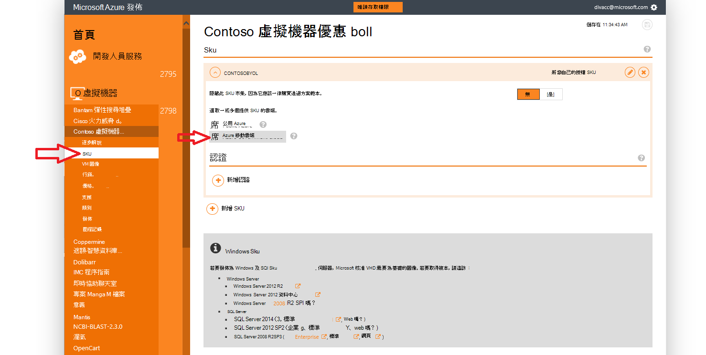
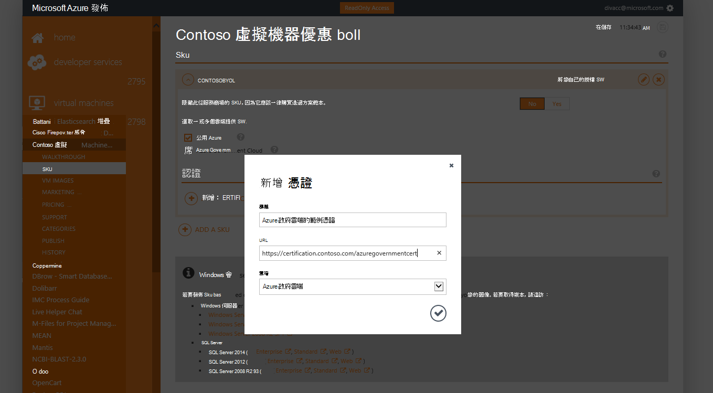
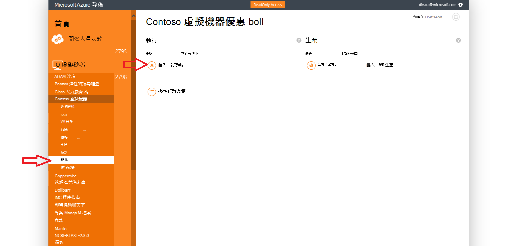
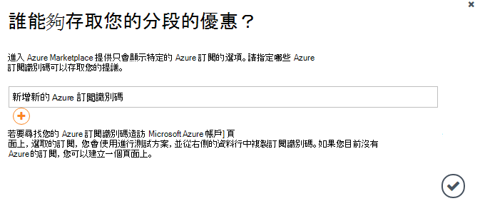
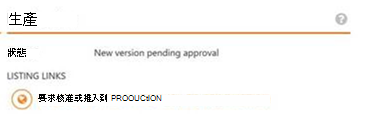

<properties
            pageTitle="Azure 政府文件 |Microsoft Azure"
            description="以下提供功能及的比較開發 Azure 政府版的應用程式。"
            services="Azure-Government"
            cloud="gov"
            documentationCenter=""
            authors="tsingh"
            manager="asimm"
            editor=""/>
 
<tags    ms.service="multiple"
            ms.devlang="na"
            ms.topic="article"
            ms.tgt_pltfrm="na"
            ms.workload="azure-government"
            ms.date="10/20/2016"
            ms.author="zakramer;tsingh;divacc"/> 

# Azure 政府版服務商場
協力廠商感興趣的政府 Azure 服務商場發佈您的方案，找出下列詳細資料。

## 發佈
>[AZURE.NOTE] 如果您不是現有的 Azure 認證 Marketplace 合作夥伴，完成的步驟，[在這裡](../marketplace-publishing/marketplace-publishing-getting-started.md)，再繼續執行。

### 步驟 1  
登入[https://publish.windowsazure.com](https://publish.windowsazure.com)

### 步驟 2
按一下您想要發佈的優惠

### 步驟 3
按一下 [ **SKU** ，按一下 [Azure 政府雲端] 方塊

>[AZURE.NOTE] 只顯示您的授權 (BYOL) Sku 都支援。  這個選項不適用於 Pay-as-You-Go (PayG) sku 皆可。

### 步驟 4
按一下 [+ 新增憑證連結將連結新增至您的提議任何認證。

### 步驟 5
Microsoft Azure 政府雲端試用帳戶，讓您測試圖像發佈入口網站中的要求︰ [https://azuregov.microsoft.com/trial/azuregovtrial](https://azuregov.microsoft.com/trial/azuregovtrial)

為合作夥伴負責美國聯邦、 狀態、 區域或成員發揮善意實體您資格會驗證並確認會提供透過電子郵件。  將可使用您的試用帳戶中是 3-5 個工作日。

### 步驟 6
按一下 [發佈]，然後按一下要執行的推入。 

會提示您輸入的有權存取分段提供 whitelisted 訂閱。 輸入新的 Azure 政府試用帳戶訂閱識別碼。

### 步驟 7
一旦優惠成功分段安裝，您可以測試圖像的登入[https://portal.azure.us](https://portal.azure.us)使用 Azure 政府試用版帳戶。

### 步驟 8
一旦您驗證使用試用訂閱圖像，您可以提供優惠 live，按一下 [發佈]，並要求生產核准。 

## 後續步驟

補充資訊，更新的訂閱[Microsoft Azure 政府部落格](https://blogs.msdn.microsoft.com/azuregov/)。
