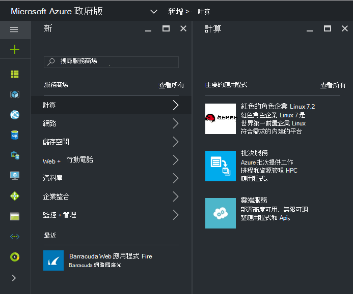
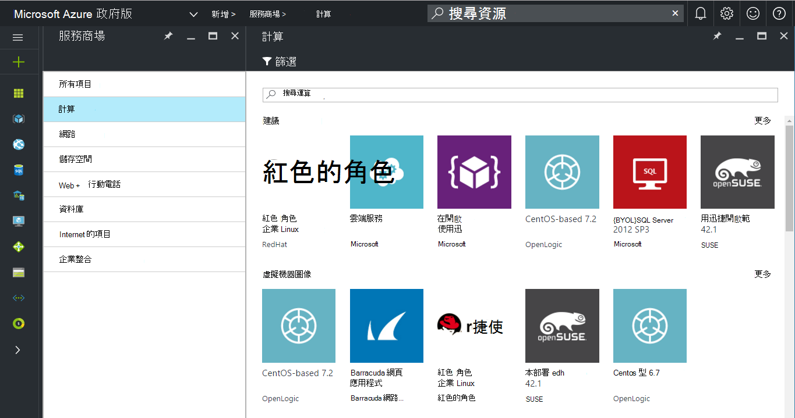
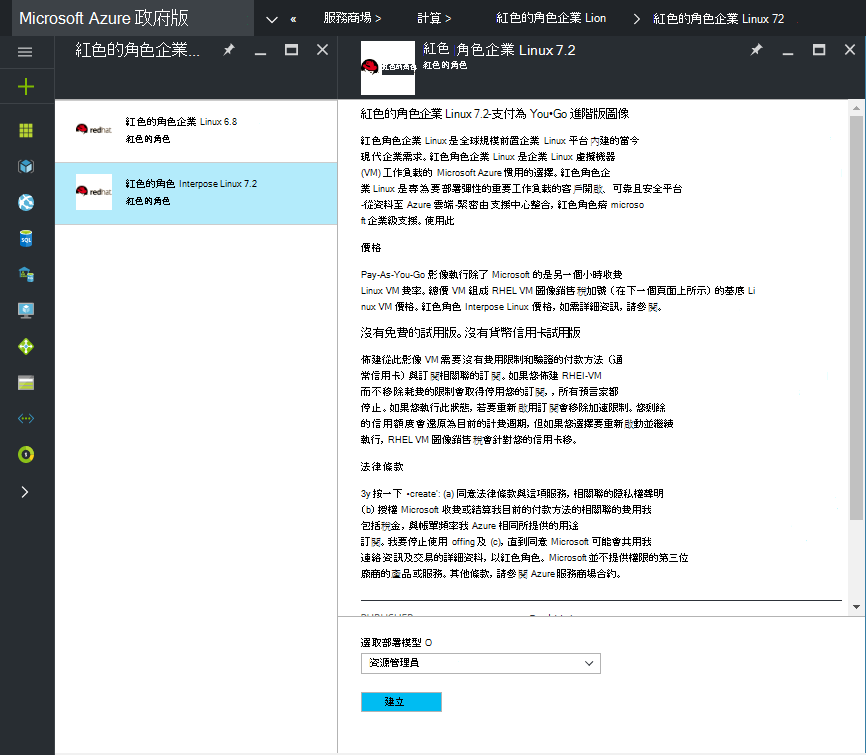
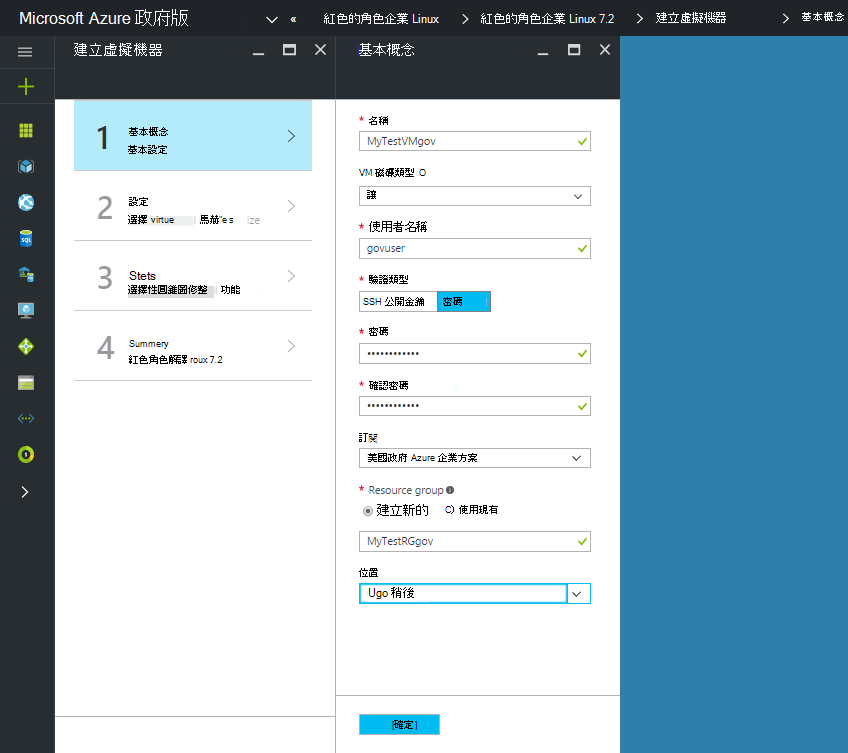
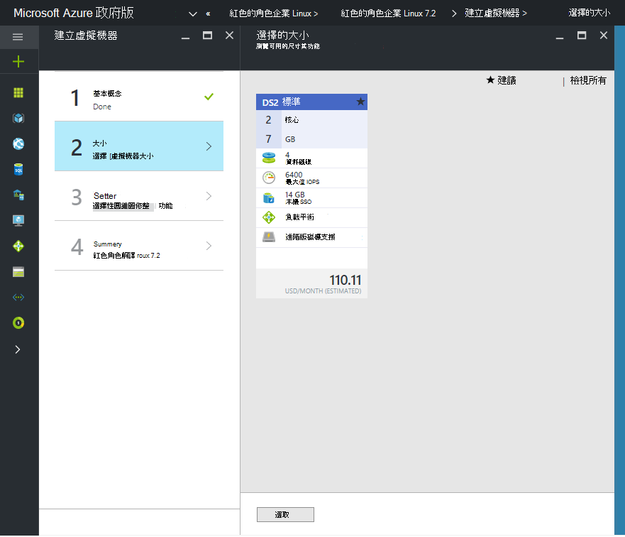

 <properties
    pageTitle="Azure 政府文件 |Microsoft Azure"
    description="以下提供功能及的比較開發 Azure 政府版的應用程式。"
    services="Azure-Government"
    cloud="gov"
    documentationCenter=""
    authors="VybavaRamadoss"
    manager="asimm"
    editor=""/>

<tags   ms.service="multiple"
    ms.devlang="na"
    ms.topic="article"
    ms.tgt_pltfrm="na"
    ms.workload="azure-government"
    ms.date="10/20/2016"
    ms.author="zakramer;vybavar"/>

# Azure 服務商場政府版
Azure Marketplace 時可使用 Azure 政府與更新的圖像我們服務商場的發行者清單。 

## 變化
使用 Azure Marketplace 政府版時，以下是一些考量︰

- 只顯示您的授權 (BYOL) 圖像可供使用。 您無法存取任何需要購買交易透過 Azure Marketplace 的影像
- 目前使用公用服務商場與圖像的子集。 您可以找到使用圖像的清單[以下](../azure-government-image-gallery.md) 
- 前佈建圖像，您的企業系統管理員必須先啟用 Azure 訂閱服務商場購買
  - 入口網站以企業系統管理員身分登入
  - 瀏覽至*管理*
  - 按一下 [*註冊的詳細資料*] 下的 [ *Azure Marketplace*線條項目旁的 [鉛筆] 圖示
  - 視切換*啟用/停用*
  - 按一下 [*儲存*]

>[AZURE.NOTE] 如果您想要在進行中用於 Azure 政府圖像請參閱[合作夥伴登入指導方針](documentation-government-manage-marketplace-partners.md)，如需詳細資訊。

### 步驟 1
啟動服務商場

  

### 步驟 2
瀏覽不同的產品，若要尋找正確無誤。

服務商場 publisher 提供屬於產品描述，以協助您進行適合認證的清單。 

### 步驟 3
選擇 product\image

### 步驟 4
啟動建立流程，並輸入所需的參數，以供部署

>[AZURE.NOTE] 在 [位置] 下拉式功能表中，只有 Azure 政府位置會顯示

### 步驟 5
觀察價格

### 步驟 6
完成所有步驟，然後按一下 [確定] 以開始佈建程序

## 後續步驟

補充資訊，更新的訂閱[Microsoft Azure 政府部落格](https://blogs.msdn.microsoft.com/azuregov/)。
