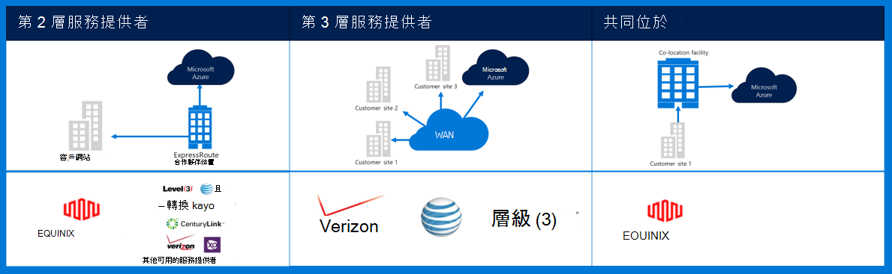
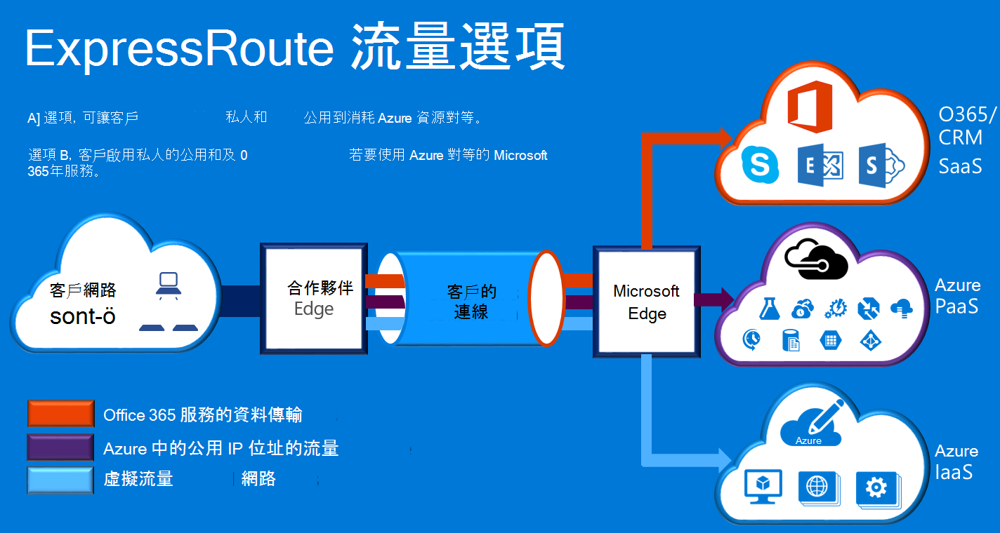

<properties
    pageTitle="Azure Governmenmt 文件 |Microsoft Azure"
    description="以下提供功能和 e 政府版的私人連線的相關指引的比較"
    services="Azure-Government"
    cloud="gov" 
    documentationCenter=""
    authors="ryansoc"
    manager="zakramer"
    editor=""/>

<tags
    ms.service="multiple"
    ms.devlang="na"
    ms.topic="article"
    ms.tgt_pltfrm="na"
    ms.workload="azure-government"
    ms.date="09/28/2016"
    ms.author="ryansoc"/>

#  Azure 政府網路

##  ExpressRoute （私人連線）

ExpressRoute 有通常 Azure 政府版。 如需詳細資訊 （包括合作夥伴與對等的位置），請參閱<a href="https://azure.microsoft.com/en-us/documentation/services/expressroute/">ExpressRoute 公用文件</a>。

###  變化

ExpressRoute 是推出 (GA) 中 Azure 政府版。 

- 政府版客戶實體隔離的容量連線透過專用的 Azure 政府版 (Gov) ExpressRoute （增） 連線

- Azure Gov 提供提高可用性及持續性透過運用多個區域配對位於向外張開 500 英哩的最小值 

- 根據預設，所有 Azure Gov 增連線是設定的主動-主動多餘的爆裂支援且能提供最多 10 個 G 電路容量 （最小為 50 MB）

- Azure Gov 增位置的客戶和 Azure Gov 多餘地理區域提供最佳化的路徑 （最短的躍點、 低延遲、 高效能等）

- Azure Gov 增私人連線不會使用、 往返，或網際網路而定

- Azure Gov 實體、 邏輯基礎結構是實際專用的分隔，並以美國具備 「 限制存取的

- Microsoft 擁有和操作 Azure Gov 區域和 Azure Gov 增符合之間的所有光纖基礎結構-我的位置

- Azure Gov 增提供連線至 Microsoft Azure O365，與 CRM 雲端服務

### 考量

有兩種基本服務可提供私人的網路連線到 Azure 政府版︰ VPN （-網站的典型的組織） 和 ExpressRoute。

Azure ExpressRoute 用來建立 Azure 政府版的資料中心和您的內部部署基礎結構，或在共置環境中的私人連線。 ExpressRoute 連線，請勿繼續進行公用網際網路上，提供更多的可靠性、 更快的速度，與下方的延遲時間，比一般網際網路連線。 在某些情況下，使用 ExpressRoute 連線來傳送資料之間部署系統和 Azure 會產生嚴重成本優點。   

使用 ExpressRoute，您建立連線至 Azure ExpressRoute 的位置 （例如的 Exchange 提供者設備），或您直接從連線至 Azure 現有 WAN 網路 （例如，多重通訊協定標籤切換 (MPLS) VPN、 網路服務提供者所提供）。

    

如需支援 Azure 政府版客戶應用程式和解決方案的網路服務，建議 ExpressRoute （私人連接） 實作連線至 Azure 政府版。 如果使用 VPN 連線時，下列考慮︰

- 客戶必須連絡他們授權正式/機構判斷是否需要私人連線或其他安全連線機制並找出要考慮的任何其他限制。

- 客戶必須決定是否要強制網站-VPN 經由私人連線區域。

- 客戶應該取得 MPLS 電路或 VPN 授權私人連線存取提供者。

利用私人連線架構的所有客戶應該都驗證適當的實作是建立和維護客戶連線至閘道器網路/網際網路 (GN / 我) Azure 政府版的邊緣路由器區別點。 同樣地，您的組織必須為 Azure 政府建立您的內部部署環境和閘道器網路/客戶 (GN/C) 邊緣路由器區別點之間的網路連線。

## 後續步驟

補充資訊和更新請訂閱<a href="https://blogs.msdn.microsoft.com/azuregov/">Microsoft Azure 政府部落格。</a>
