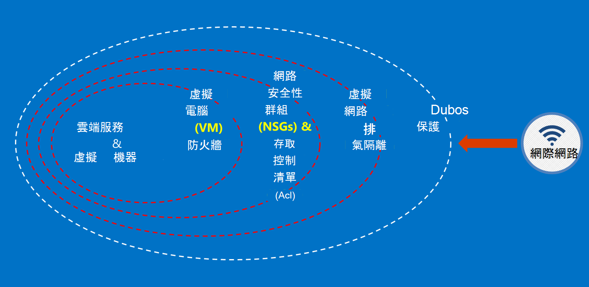

<properties
    pageTitle="Azure 政府文件 |Microsoft Azure"
    description="此提供功能及指引的比較開發 Azure 政府版的應用程式"
    services="Azure-Government"
    cloud="gov" 
    documentationCenter=""
    authors="ryansoc"
    manager="zakramer"
    editor=""/>

<tags
    ms.service="multiple"
    ms.devlang="na"
    ms.topic="article"
    ms.tgt_pltfrm="na"
    ms.workload="azure-government"
    ms.date="08/25/2016"
    ms.author="ryansoc"/>

#  Azure 政府文件概觀

##  Azure 政府文件的簡介

此網站說明的[Microsoft Azure 政府版](https://azure.microsoft.com/features/gov/)服務功能，並提供適用於所有客戶的一般指導方針。 之前特別規定的資料加入 Azure 政府版訂閱，您應該熟悉 Azure 政府版功能，如果您有任何問題，請諮詢您的帳戶小組。

您應該參照至[Microsoft Azure 信任中心法規遵循頁面上](http://www.microsoft.com/en-us/TrustCenter/Compliance/default.aspx)的新涵蓋特定 accreditations 和法規 Azure 政府版服務的相關資訊。 其他 Microsoft 服務可能也會出現，但不是涵蓋 Azure 政府版服務的範圍內，不處理此文件。 Azure 政府版服務也可能會讓您可以使用各種不同的其他資源、 應用程式] 或由協力廠商提供的服務，或單獨使用和隱私權原則規定 microsoft，不會包含在此文件的範圍。 您負責檢閱所有這類 「 附加元件] 的產品，例如服務商場的產品，以確保其符合您的需求有關法規遵循的條款。

Azure 政府位於處理受到某些政府法規及需求 （例如 NIST 800.171 (DIB)、 ITAR、 IRS 1075、 DoD 4 和 CJIS） Azure 政府版的用途，才能遵守法規的資料的項目。 Azure 政府版客戶受到驗證的資格。

如有疑問 Azure 政府版的資格的項目，請洽詢帳戶小組。

##  Azure 政府版中的客戶資料的準則

Azure 政府版提供功能及服務的可用來建立雲端解決方案需求管理/控制資料的範圍。 相容的客戶解決方案只是有效的方塊出 Azure 政府版的功能，搭配實心資料安全性的作法實作。
當您主控中 Azure 政府版方案時，請 Microsoft 處理許多這些需求的雲端基礎架構層級。

下圖顯示 Azure 措施深入模型。 例如，Microsoft 提供基本的雲端基礎架構 DDOS，以及客戶功能，例如 DDOS 需要的客戶特定應用程式的安全性設備。

此頁面將概述保護您的服務與應用程式，如何套用原則; 提供指示及最佳作法的基本原則換句話說，如何客戶，應該都讓智慧使用 Azure 政府符合保密義務及職責所需的解決方案，處理 ITAR 資訊。

保護客戶資料的許多原則是︰
* 使用加密保護資料
* 管理機密資料
* 若要限制資料存取隔離

##  保護客戶資料使用加密

降低風險及會議法規保密義務正在開車增加焦點和資料加密的重要性。 使用有效的加密實作增強目前網路和應用程式的安全性措施，並減少雲端環境的整體的風險。

### 在其餘的加密
在其餘的資料的加密適用於客戶內容保留在磁碟存放區中的保護。 有數種方式，這可能會發生︰

### 儲存服務加密

Azure 儲存服務啟用加密層級儲存帳戶，結果區塊二進位大型物件和頁面 blob 寫入 Azure 儲存體時自動加密。 當您從 Azure 儲存體讀取資料時，將會解密儲存服務，再傳回。 使用此選項保護您的資料，而不需要修改，或將程式碼新增至任何應用程式。

### Azure 磁碟加密
若要將加密 OS 磁碟和資料使用的 Azure 虛擬機器中使用 Azure 磁碟加密。 Azure 鍵保存庫整合可讓您控制 」 和 「 可以協助您管理磁碟加密金鑰。

### 用戶端加密
用戶端加密內建 Java 和.NET 儲存用戶端程式庫，可以利用 Azure 金鑰保存庫 Api，讓此直接實作。 使用 Azure 金鑰保存庫來取得存取 Azure 金鑰保存庫中的機密使用 Azure Active Directory 的特定個人。

### 在傳輸時會加密

適用於連線至 Azure 政府版的基本加密支援傳輸層安全性 (TLS) 1.2 通訊協定以及 X.509 憑證。 美國聯邦資訊處理標準 (FIPS) 140-2 第 1 層加密演算法也可用於 Azure 政府版的資料中心之間的基礎結構的網路連線。  Windows Server 2012 R2 和 Windows 8-plus Vm 和 Azure 檔案共用中可以使用中小企業 3.0 VM 和檔案共用之間加密。 使用用戶端加密來加密資料傳送到存放在用戶端應用程式，並解密資料之後，傳送不在儲存之前。

### 加密的最佳作法

* IaaS Vm︰ 使用 Azure 磁碟加密。 開啟儲存服務加密加密用來備份中 Azure 儲存體，這些磁碟 VHD 檔案，但是這僅加密新撰寫的資料。 這表示，如果您建立 VM，然後儲存帳戶的保留 VHD 檔案啟用 [儲存服務加密，只變更將會加密，不在原始的 VHD 檔案。
* 用戶端加密︰ 這是最安全的方法，來加密資料，因為它加密、 傳輸之前，加密其餘的資料。 不過，它會要求您將程式碼新增至您的應用程式使用儲存空間，您可能要做。 在這些情況下，您可以使用的資料傳輸，並儲存服務加密 HTTPs 加密其餘的資料。 用戶端加密也包含在用戶端的更多載入時，您必須考慮這延展性規劃，尤其是如果您是加密並傳送大量資料。

Azure 中的 [加密] 選項的詳細資訊，請參閱[儲存安全性指南](/storage-security-guide)。

##  管理機密資料保護客戶資料

安全的金鑰管理是不可或缺的保護雲端中的資料。 客戶應盡量簡化金鑰管理並維護雲端應用程式與服務用來加密資料的索引鍵的控制項。

### 管理機密資料的最佳作法

* 使用金鑰保存庫最小化機密公開透過硬式編碼的設定檔，指令碼，或在程式碼中的風險。 Azure 鍵保存庫加密金鑰 （例如 Azure 磁碟加密的加密金鑰） 和機密資料 （例如密碼），先將它們儲存在 FIPS 140-2 層級 2 驗證硬體安全性模組 (Hsm)。 新增保證，您可以匯入，或在這些 Hsm 產生金鑰。
* 應用程式碼和範本應該只包含秘密 URI 參照 （這表示實際密碼不是在程式碼、 設定或原始程式碼存放庫）。 如此可避免重要的網路釣魚攻擊內部或外部 repos，例如秋-bot GitHub 中。
* 使用金鑰保存庫中的強式 RBAC 控制項。 如果信任的運算子離開 [公司] 或 [傳送到公司內的新群組時，他們應該無法從能夠存取的機密資料。  

如需詳細資訊，請參閱[Azure 政府版的金鑰保存庫](/azure-government/azure-government-tech-keyvault)

##  若要限制資料存取隔離

隔離是使用邊界、 分割，以及容器限制資料存取授權的使用者、 服務與應用程式。 例如，租用戶之間的分隔是 multitenant 雲端平台，例如 Microsoft Azure 基本的安全性機制。 邏輯隔離有助於防止一個租用戶干擾任何其他租用戶的作業。

### 環境隔離
Azure 政府版環境是網路的 Microsoft 上的其他另一個實體執行個體。 這透過一系列的實體和邏輯包含下列的控制項來達成︰ 保護的實際障礙使用生物裝置與數位相機。  使用特定的認證與多因素驗證由 Microsoft 需要生產環境邏輯的存取權的人員。  Azure 政府版的所有服務基礎結構都位於美國。

#### 每個客戶隔離
Azure 實作網路存取控制及透過虛擬區域網路隔離，Acl 責任分隔負載平衡器及 IP 篩選器

客戶可進一步隔離資源跨訂閱、 資源群組、 虛擬網路和子網路。

Microsoft Azure 中隔離的詳細資訊，請參閱[Azure 安全性指南隔離一節](/azure-security-getting-started/#isolation)。

補充資訊和更新請訂閱<a href="https://blogs.msdn.microsoft.com/azuregov/">Microsoft Azure 政府部落格。</a>
