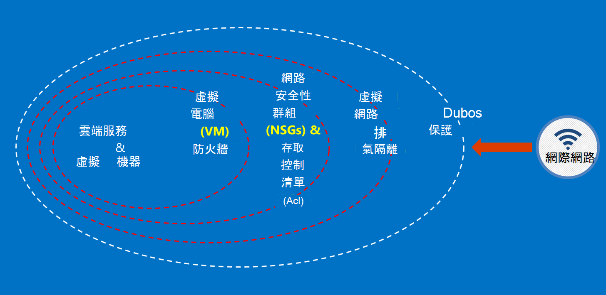

<properties
    pageTitle="Azure 政府版服務 |Microsoft Azure"
    description="提供和 Azure 政府版中可用的服務的概觀"
    services="Azure-Government"
    cloud="gov"
    documentationCenter=""
    authors="zakramer"
    manager="liki"
    editor="" />

<tags
    ms.service="multiple"
    ms.devlang="na"
    ms.topic="article"
    ms.tgt_pltfrm="na"
    ms.workload="azure-government"
    ms.date="10/18/2016"
    ms.author="ryansoc" />

#  安全性

##  Azure 政府版中的客戶資料的準則

Azure 政府版提供功能及服務的可用來建立雲端解決方案需求管理/控制資料的範圍。 相容的客戶解決方案只是有效的方塊出 Azure 政府版的功能，搭配實心資料安全性的作法實作。

當您主控中 Azure 政府版方案時，請 Microsoft 處理許多這些需求的雲端基礎架構層級。

下圖顯示 Azure 措施深入模型。 例如，Microsoft 提供基本的雲端基礎架構 DDOS，以及客戶功能，例如 DDOS 需要的客戶特定應用程式的安全性設備。

此頁面將概述保護您的服務與應用程式，如何套用原則; 提供指示及最佳作法的基本原則換句話說，如何客戶，應該都讓智慧使用 Azure 政府符合保密義務及職責所需的解決方案，處理 ITAR 資訊。

 保護客戶資料的許多原則是︰

- 使用加密保護資料
- 管理機密資料
- 若要限制資料存取隔離

###  保護客戶資料使用加密

降低風險及會議法規保密義務正在開車增加焦點和資料加密的重要性。 使用有效的加密實作增強目前網路和應用程式的安全性措施，並減少雲端環境的整體的風險。

#### 在其餘的加密
在其餘的資料的加密適用於客戶內容保留在磁碟存放區中的保護。 有數種方式，這可能會發生︰

#### 儲存服務加密

Azure 儲存服務啟用加密層級儲存帳戶，結果區塊二進位大型物件和頁面 blob 寫入 Azure 儲存體時自動加密。 當您從 Azure 儲存體讀取資料時，將會解密儲存服務，再傳回。 使用此選項保護您的資料，而不需要修改，或將程式碼新增至任何應用程式。

#### 用戶端加密
用戶端加密內建 Java 和.NET 儲存用戶端程式庫，可以利用 Azure 金鑰保存庫 Api，讓此直接實作。 使用 Azure 金鑰保存庫來取得存取 Azure 金鑰保存庫中的機密使用 Azure Active Directory 的特定個人。

#### 在傳輸時會加密

適用於連線至 Azure 政府版的基本加密支援傳輸層安全性 (TLS) 1.2 通訊協定以及 X.509 憑證。 美國聯邦資訊處理標準 (FIPS) 140-2 第 1 層加密演算法也可用於 Azure 政府版的資料中心之間的基礎結構的網路連線。  Windows Server 2012 R2 和 Windows 8-plus Vm 和 Azure 檔案共用中可以使用中小企業 3.0 VM 與檔案共用之間的加密。 使用用戶端加密來加密資料傳送到存放在用戶端應用程式，並解密資料之後，傳送不在儲存之前。

#### 加密的最佳作法

- IaaS Vm︰ 使用 Azure 磁碟加密。 開啟儲存服務加密加密用來備份中 Azure 儲存體，這些磁碟 VHD 檔案，但是這僅加密新撰寫的資料。 這表示，如果您建立 VM，然後儲存帳戶的保留 VHD 檔案啟用 [儲存服務加密，只變更將會加密，不在原始的 VHD 檔案。
- 用戶端加密︰ 這是最安全的方法，來加密資料，因為它加密、 傳輸之前，加密其餘的資料。 不過，它會要求您將程式碼新增至您的應用程式使用儲存空間，您可能要做。 在這些情況下，您可以使用的資料傳輸，並儲存服務加密 HTTPs 加密其餘的資料。 用戶端加密也包含在用戶端的更多載入時，您必須考慮這延展性規劃，尤其是如果您是加密並傳送大量資料。

###  管理機密資料保護客戶資料

安全的金鑰管理是不可或缺的保護雲端中的資料。 客戶應盡量簡化金鑰管理並維護雲端應用程式與服務用來加密資料的索引鍵的控制項。

#### 管理機密資料的最佳作法

- 使用金鑰保存庫最小化機密公開透過硬式編碼的設定檔，指令碼，或在程式碼中的風險。 Azure 鍵保存庫加密金鑰 （例如 Azure 磁碟加密的加密金鑰） 和機密資料 （例如密碼），先將它們儲存在 FIPS 140-2 層級 2 驗證硬體安全性模組 (Hsm)。 新增保證，您可以匯入，或在這些 Hsm 產生金鑰。
- 應用程式碼和範本應該只包含秘密 URI 參照 （這表示實際密碼不是在程式碼、 設定或原始程式碼存放庫）。 如此可避免重要的網路釣魚攻擊內部或外部 repos，例如秋-bot GitHub 中。
- 使用金鑰保存庫中的強式 RBAC 控制項。 如果信任的運算子離開 [公司] 或 [傳送到公司內的新群組時，他們應該無法從能夠存取的機密資料。

如需詳細資訊<a href="https://azure.microsoft.com/documentation/services/key-vault">Azure 金鑰保存庫公用文件。</a>

###  若要限制資料存取隔離

隔離是使用界限、 分割，以及容器限制資料存取授權的使用者、 服務與應用程式。 例如，租用戶之間的分隔是 multitenant 雲端平台，例如 Microsoft Azure 基本的安全性機制。 邏輯隔離有助於防止一個租用戶干擾任何其他租用戶的作業。

#### 環境隔離
Azure 政府版環境是網路的 Microsoft 上的其他不同的實體執行個體。 這被達成透過一系列的實體和邏輯的控制項，包括下列各項︰

- 保護的實際障礙使用生物裝置與數位相機。
- 使用特定的認證與多因素驗證由 Microsoft 需要生產環境邏輯的存取權的人員。
- Azure 政府版的所有服務基礎結構都位於美國。

#### 每個客戶隔離
Azure 實作網路存取控制及透過虛擬區域網路隔離，Acl 責任分隔負載平衡器及 IP 篩選器

客戶可進一步隔離資源跨訂閱、 資源群組、 虛擬網路和子網路。

## 篩選

[最近公告的 FedRAMP 高並措施部門 (DoD) 影響層級 4 履歷表。 此具有透過 Azure 政府版環境引發安全性和法規遵循的列。

現在我們的法律與信用卡 (NACLC) 篩選在國際機構檢查所有我們運算子，區段 5.6.2.2 的 DoD 雲端運算的安全性需求指南 (SRG) 中所定義︰

>[AZURE.NOTE] 最小的背景調查所需的 CSP 人員無法存取層級 4 和 5 個根據 「 非要徑機密 」 (例如 DoD 的 ADP-2) 的資訊是國際機構核取法律與信用卡 (NACLC) （適用於 「 非要徑機密 」 承包商），或中等風險背景調查 (MBI) 的 「 中等風險 」 位置指定。

下表摘要列出 Azure 政府運算子我們目前篩選︰

Azure Gov screenings 和背景檢查 | 描述|
---|---|
美國公民 |美國公民的驗證。
Microsoft 雲端背景核取 （每兩年）|美國社會安全號碼搜尋，刑事歷程記錄的核取、 Office 的外部索引資產控制清單 (OFAC)、 部門的產業和安全性] 清單 (BIS)，Office 的措施貿易控制項 Debarred 的人員清單。
美國國家機構核取法律與信用卡 (NACLC) （每個五年） | 新增指紋背景的核取針對 fbi 機關的資料庫。 其他資訊，請移至<a href="https://www.opm.gov/investigations/background-investigations/federal-investigations-notices/1997/fin97-02/">Office 人員管理網站</a>。 | 
<a href="https://www.microsoft.com/en-us/TrustCenter/Compliance/CJIS">刑事正義 Information Services (CJIS)</a> | CJIS 是本機的狀態和篩選的程序指紋 fbi 機關政府記錄，以及驗證刑事歷程記錄上操作可能會提供要徑罪犯正義資訊 (CJI) 資料的存取權的人員。  每個狀態會自己的背景核取及後續的 「 核准 」 的潛在 CJI 存取所有員工。|

Azure 作業人員套用下列存取原則︰

- 明確定義之責任，與要求、 核准及部署變更個別責任。
- Access 是透過定義介面的特定功能。
- Access 會只的時間 (JIT)，以及是只為每個事件基礎或特定進行的維修作業事件，以及一律有限的持續時間。
- Access 是規則為基礎，以定義只指派疑難排解所需的權限的角色。

篩選標準包含所有 Microsoft 支援服務和操作人員美國公民的驗證之前 Azure 政府裝載系統授與存取權。 需要將傳送資料的支援人員使用 Azure 政府版中的安全性功能。 安全的資料傳輸需要驗證認證，即可存取另一個組。 例如，若要存取系統中繼資料，作業人員使用特定的 web 式內部管理工具、 唯讀 Api 和 JIT 提高權限。

## 後續步驟

補充資訊和更新請訂閱<a href="https://blogs.msdn.microsoft.com/azuregov/">Microsoft Azure 政府部落格。</a>
