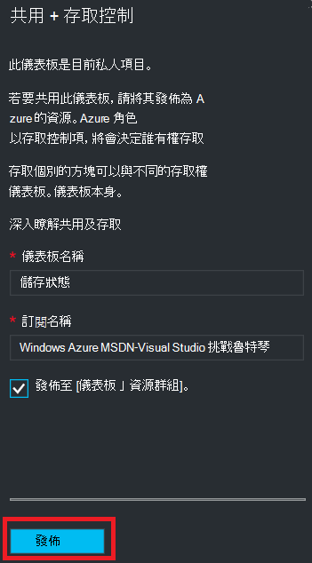
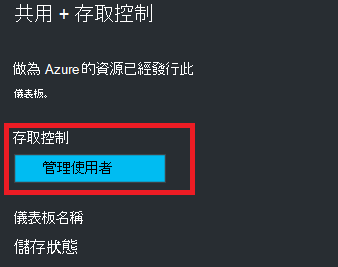
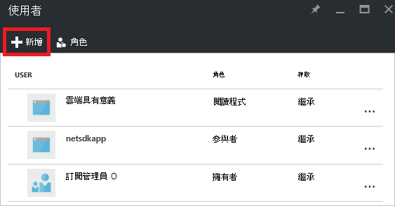
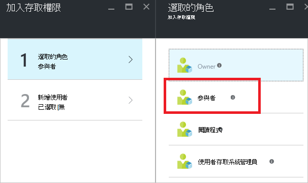
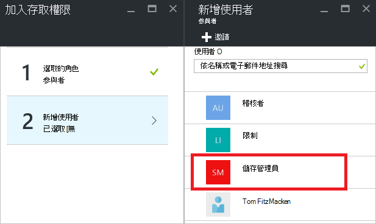
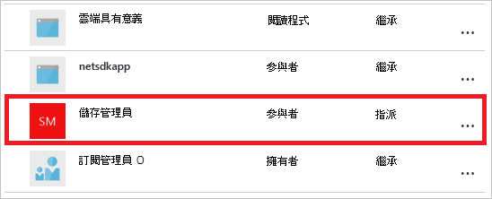

<properties
   pageTitle="Azure 入口網站的儀表板存取 |Microsoft Azure"
   description="本文說明如何共用 Azure 入口網站中的儀表板的存取權。"
   services="azure-portal"
   documentationCenter=""
   authors="tfitzmac"
   manager="timlt"
   editor="tysonn"/>

<tags
   ms.service="multiple"
   ms.devlang="NA"
   ms.topic="article"
   ms.tgt_pltfrm="NA"
   ms.workload="na"
   ms.date="08/01/2016"
   ms.author="tomfitz"/>

# 共用 Azure 儀表板

設定後儀表板，您可以將它發佈並與其他使用者共用您的組織中。 您允許其他人存取您的儀表板使用 Azure[基礎存取控制的角色](../active-directory/role-based-access-control-configure.md)。 您指派給角色的使用者或群組的使用者，該角色定義這些使用者可以檢視或修改已發佈儀表板。 

所有已發佈儀表板實作為 Azure 資源，這表示其存在於更容易管理您的訂閱中的項目，並包含在 [資源] 群組中。  從 access 控制項觀點來看，儀表板是不不同於其他的資源，例如虛擬機器或儲存帳戶。

> [AZURE.TIP] 儀表板上的個別磚強制根據他們所顯示的資源自己存取控制需求。  因此，您可以設計儀表板的人共用時仍保護個別的圖磚上的資料。

## 瞭解存取控制的儀表板

使用角色型存取控制，您可以為使用者指派角色三個不同層級的範圍︰

- 訂閱
- 資源群組
- 資源

您指派的權限繼承自下資源的訂閱。 已發佈儀表板為資源。 因此，您可能已經有使用者指派給角色的訂閱這也適用於發佈儀表板。 

以下是範例。  假設您有 Azure 訂閱，並已指派各種小組成員的角色的**擁有人**、**參與者**或**閱讀程式**的訂閱。 擁有者或參與者的使用者都能清單、 檢視、 建立、 修改或刪除訂閱中的儀表板。  讀者使用者能夠使用清單及檢視儀表板，但無法修改或刪除它們。  閱讀程式存取的使用者就可以對已發佈儀表板中的本機的編輯內容 (例如，疑難排解問題時)，但無法將這些變更發佈至伺服器。  他們必須自行進行儀表板的私人複本的選項

不過，您也可以指派權限，包含數個儀表板的資源群組或個別儀表板。 例如，您可能會決定的一組使用者應有限的權限跨訂閱，但更大的存取權的特定的儀表板。 您將這些使用者指派至的儀表板的角色。 

## 發佈儀表板

例如，假設您完成設定您想要共用您的訂閱中的一組使用者使用的儀表板。 下列步驟說明稱為儲存管理員的自訂的群組，但您可以將名稱群組您想要的項目。 建立 Active Directory 群組，並將使用者新增至該群組的相關資訊，請參閱[Azure Active Directory 中的管理群組](../active-directory/active-directory-accessmanagement-manage-groups.md)。

1. 在儀表板中，選取 [**共用**]。

     ![選取 [共用]](./media/azure-portal-dashboard-share-access/select-share.png)

2. 前指派存取，您必須發佈儀表板。 根據預設，儀表板會發佈到 [資源群組**儀表板**。 選取 [**發佈**]。

     

現在已發佈儀表板。 如果適當權限繼承自訂閱，您不需要執行任何動作。 其他組織中的使用者將能夠存取及修改其訂閱層級角色為基礎的儀表板。 不過，在此教學課程中，讓我們來指派一的組使用者角色該儀表板。

## 指派存取的儀表板

1. 發佈儀表板之後, 選取 [**管理使用者**]。

     

2. 您會看到此儀表板的角色所已指派的現有使用者清單。 您的現有的使用者清單會不同於下方圖像。 工作分派很可能會繼承訂閱。 若要新增新的使用者或群組，選取 [**新增**。

     

3. 選取代表您想要授與的權限的角色。 此範例中，選取 [**參與者**]。

     

4. 選取您想要指派給角色的群組或使用者。 如果您沒有看到這個使用者或群組，您要尋找清單中，使用 [搜尋] 方塊。 可用的群組清單取決於您的 Active Directory 中建立的群組。

      

5. 當您完成新增使用者或群組時，請選取**[確定]**。 

6. 新的工作分派會新增至清單中的使用者。 請注意，是將其**存取**會列為**指派**，而不是**繼承**。

     

## 後續步驟

- 如需角色清單，請參閱[RBAC︰ 內建的角色](../active-directory/role-based-access-built-in-roles.md)。
- 若要瞭解管理資源，請參閱[透過入口網站管理 Azure 資源](resource-group-portal.md)。