<properties
   pageTitle="Azure 入口網站的儀表板 |Microsoft Azure"
   description="本文說明如何建立及編輯儀表板中 Azure 入口網站。"
   services="azure-portal"
   documentationCenter=""
   authors="sewatson"
   manager="timlt"
   editor="tysonn"/>

<tags
   ms.service="multiple"
   ms.devlang="NA"
   ms.topic="article"
   ms.tgt_pltfrm="NA"
   ms.workload="na"
   ms.date="09/06/2016"
   ms.author="sewatson"/>

# 建立與共用 Azure 入口網站中的儀表板

您可以建立多個儀表板，並與其他人有權存取您的 Azure 訂閱共用這些內容。  這篇文章會經歷的建立/編輯、 發佈和管理儀表板的存取基本概念。

## 自訂與刀儀表板

啟動儀表板幾個月之內，因為有刀自訂穩定增加衰退和儀表板的自訂快速增加。 此強式的使用狀況趨勢會顯示您想要透過刀自訂儀表板。 若要支援的趨勢，我們將會移除自訂刀以及所我們的工作，以增強儀表板功能的功能。 如果自訂刀，很快就會移除您的自訂。 若要保留的自訂，固定的儀表板的自訂的方塊。 只要以滑鼠右鍵按一下 [] 方塊，然後選取**釘選至儀表板**，如下圖所示。

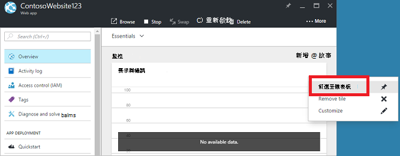

## 建立儀表板

若要建立儀表板，請選取 [目前儀表板名稱旁的 [**新的儀表板**] 按鈕。  

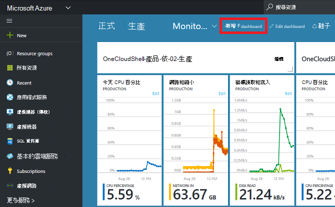

這個動作會建立新的、 空的私人儀表板，並讓您將自訂模式您可以在其中命名儀表板及新增或重新排列方塊。  在此模式下，可摺疊磚庫接手左側的導覽功能表。  磚圖庫可讓您以各種方式 Azure 資源尋找磚︰ 您可以瀏覽依[資源群組](../azure-resource-manager/resource-group-overview.md#resource-groups)、 資源類型、[標籤](../resource-group-using-tags.md)，或依名稱搜尋資源。  

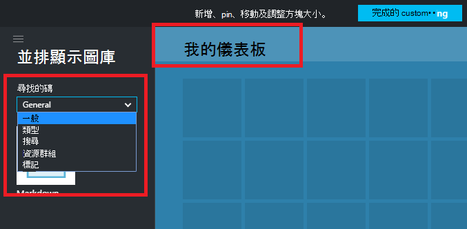

新增方塊拖曳拖放至儀表板介面的地方。

有新的類別要求**一般**不是特定的資源與相關聯的圖磚。  在此範例中，我們會固定 Markdown 磚。  您可以使用這個並排顯示自訂內容新增至您的儀表板。  磚支援純文字、 [Markdown 語法](https://daringfireball.net/projects/markdown/syntax)和有限的 HTML。  (安全，您無法執行的動作包括注入`<script>`標籤或使用特定樣式的項目可能會干擾入口網站的 CSS。) 

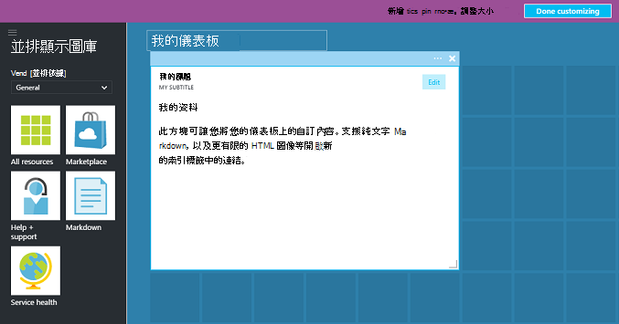

## 編輯儀表板

建立您的儀表板之後，您可以固定方塊從 [並排顯示] 圖庫或刀磚表示。 現在就讓我們固定的表示我們資源群組。 瀏覽項目，或從 [資源群組刀，您可以有 pin。 釘選 [資源] 群組的磚表示導致這兩種方法。

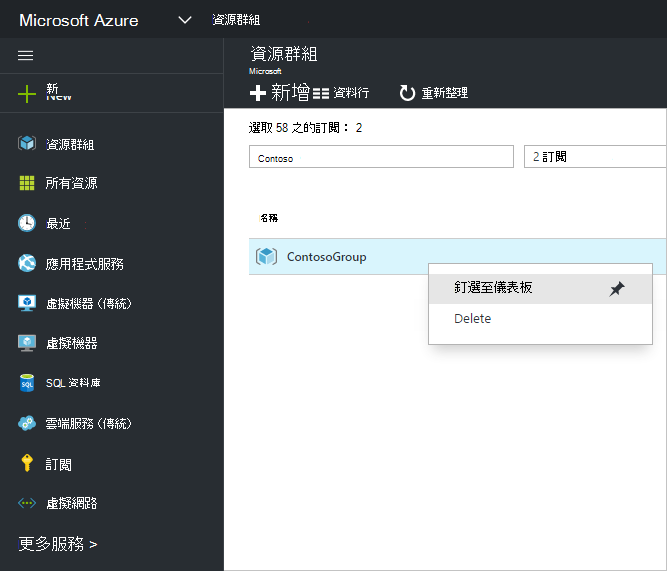

釘選的項目，它就會出現在儀表板上。

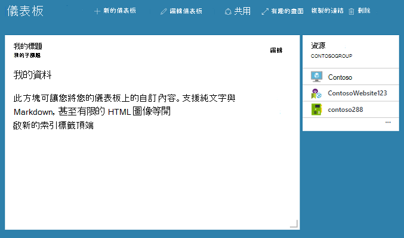

現在，我們有 Markdown 磚資源群組釘選到儀表板，我們可以調整大小，並重新排列成適當的版面配置的圖磚。

游標和選取...] 或以滑鼠右鍵按一下方塊中，您可以看到該磚的所有內容命令。 根據預設，有兩個項目︰

1. **從 [儀表板取消固定**– 移除儀表板方塊
2.  **自訂**– 輸入自訂模式

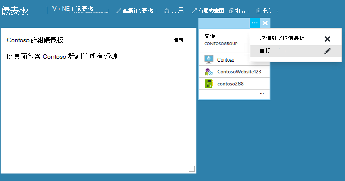

選取 [自訂，您可以調整大小及重新排列方塊。 若要調整大小] 方塊下, 圖所示，從關聯式功能表中，選取新的大小。

![調整大小] 方塊](./media/azure-portal-dashboards/resize-tile.png)

或者，如果磚支援的任何大小，您可以拖曳右下角所要的大小。

![調整大小] 方塊](./media/azure-portal-dashboards/resize-corner.png)

調整磚之後, 檢視儀表板。

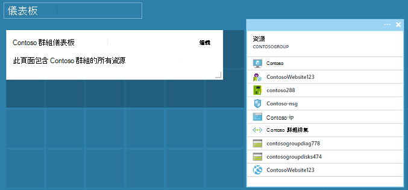

當您完成自訂儀表板，只要選取**完成自訂**結束自訂模式或以滑鼠右鍵按一下與從內容功能表選取 [**完成自訂**。

## 發佈儀表板與管理存取控制

當您建立儀表板時，則根據預設，這表示您是唯一能看到的私人。  若要看到其他人，請使用 [顯示在儀表板命令旁邊的 [**共用**] 按鈕。

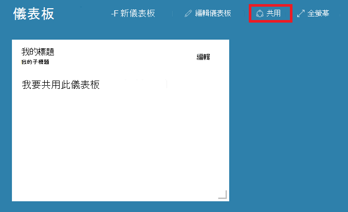

系統要求您選擇的訂閱及發佈儀表板的資源群組。 完美地整合到生態的儀表板，我們已為 Azure 資源實作共用儀表板 （讓您無法共用輸入電子郵件地址）。  大部分的入口網站中並排顯示資訊的存取權會受到[Azure 角色基礎的 Access 控制項](../active-directory/role-based-access-control-configure.md )。 從 access 控制項觀點來看，共用儀表板是與虛擬機器或儲存帳戶。  

假設您有 Azure 訂閱，並已指派的小組成員的**擁有者**」、 「**參與者**或 「**讀取**訂閱的角色。  擁有者或參與者的使用者都能清單、 檢視、 建立、 修改或刪除該訂閱中的儀表板。  讀者使用者能夠使用清單及檢視儀表板，但無法修改或刪除它們。  閱讀程式存取的使用者能夠本機的編輯內容對共用儀表板，但無法將這些變更發佈至伺服器。  不過，他們可進行供自己使用的儀表板的私人複本。  如往常個別的方塊，在儀表板上強制執行自己存取控制規則，根據對應的資源。  

為了方便，入口網站的發佈體驗會引導您圖樣根據您放置儀表板中名為**儀表板**的資源群組。  

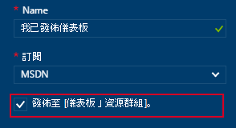

您也可以選擇以特定的資源群組發佈儀表板。  該儀表板的存取控制比對 access 控制項的 [資源] 群組。  管理資源群組中的資源的使用者也可以存取儀表板。

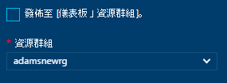

發佈儀表板之後，會重新整理**共用 + access**的 [控制項] 窗格，並顯示您已發佈的儀表板，包括管理使用者存取權的儀表板的連結的相關資訊。  這個連結會啟動用來管理存取任何 Azure 資源的標準角色以存取控制刀。  您可以隨時返回此檢視選取 [**共用]**。

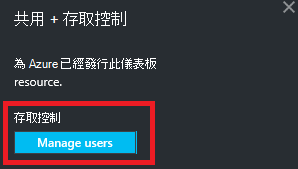

## 後續步驟

- 若要管理資源，請參閱[透過入口網站管理 Azure 資源](resource-group-portal.md)。
- 若要部署資源，請參閱[使用資源管理員範本和 Azure 入口網站的部署資源](../resource-group-template-deploy-portal.md)。