<properties 
    pageTitle="使用 Azure 入口網站管理 Azure 資源 |Microsoft Azure" 
    description="使用 Azure 入口網站和 Azure 資源管理來管理您的資源。 顯示如何使用儀表板監控資源。" 
    services="azure-resource-manager,azure-portal" 
    documentationCenter="" 
    authors="tfitzmac" 
    manager="timlt" 
    editor="tysonn"/>

<tags 
    ms.service="azure-resource-manager" 
    ms.workload="multiple" 
    ms.tgt_pltfrm="na" 
    ms.devlang="na" 
    ms.topic="article" 
    ms.date="09/12/2016" 
    ms.author="tomfitz"/>

# 管理透過入口網站的 Azure 資源

> [AZURE.SELECTOR]
- [Azure PowerShell](../powershell-azure-resource-manager.md)
- [Azure CLI](../xplat-cli-azure-resource-manager.md)
- [入口網站](resource-group-portal.md) 
- [REST API](../resource-manager-rest-api.md)

本主題說明如何使用[Azure 資源管理員](../azure-resource-manager/resource-group-overview.md)中的[Azure 入口網站](https://portal.azure.com)，來管理 Azure 資源。 若要瞭解部署透過入口網站的資源，請參閱[使用資源管理員範本和 Azure 入口網站的部署資源](../resource-group-template-deploy-portal.md)。

目前不是每個服務支援入口網站或資源管理員。 如需這些服務，您需要使用[傳統的入口網站](https://manage.windowsazure.com)。 針對每個服務的狀態，請參閱[Azure 入口網站的可用性圖表](https://azure.microsoft.com/features/azure-portal/availability/)。

## 管理資源群組

1. 若要查看您的訂閱中的所有資源群組，選取 [**資源群組**]。

    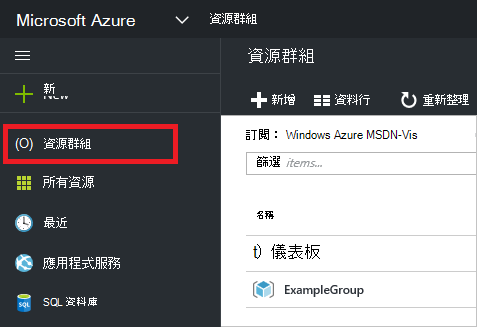

1. 若要建立空白的資源] 群組中，選取 [**新增**。

    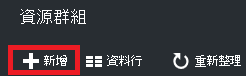

1. 提供的名稱和新的資源群組的位置。 選取 [**建立**]。

    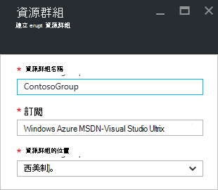

1. 若要選取 [若要查看最近建立的資源群組的 [**重新整理**。

    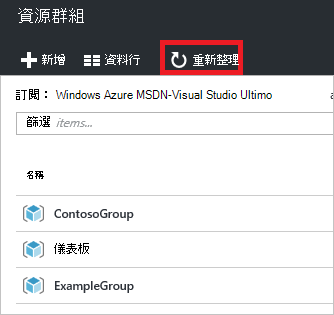

1. 若要自訂您的資源群組顯示的資訊，請選取**資料行**。

    

1. 選取要新增的欄，然後選取 [**更新**。

    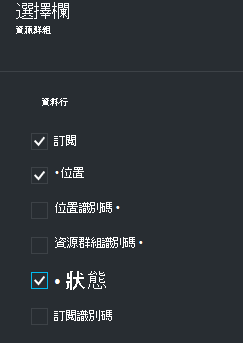

1. 若要瞭解部署到新的資源群組的資源，請參閱[使用資源管理員範本和 Azure 入口網站的部署資源](../resource-group-template-deploy-portal.md)。

1. 資源群組的快速存取，您可以將刀固定儀表板。

    ![釘選 [資源] 群組](./media/resource-group-portal/pin-group.png)

1. 資源群組和它的資源，則會顯示儀表板。 您可以選取 [資源群組或任何的資源，瀏覽至項目。

    ![釘選 [資源] 群組](./media/resource-group-portal/show-resource-group-dashboard.png)

## 標記資源

您可以將標籤套用至 [資源群組與資源，組織您的資產。 使用標籤的相關資訊，請參閱[使用標籤以組織 Azure 資源](../resource-group-using-tags.md)。

[AZURE.INCLUDE [resource-manager-tag-resource](../../includes/resource-manager-tag-resources.md)]

## 監視器資源

當您選取資源時，資源刀呈現預設圖表及資料表監控的資源類型。

1. 選取資源，並注意的 「**監控**」 區段。 其包含相關的資源類型的圖形。 下圖顯示預設監視儲存帳戶的資料。

    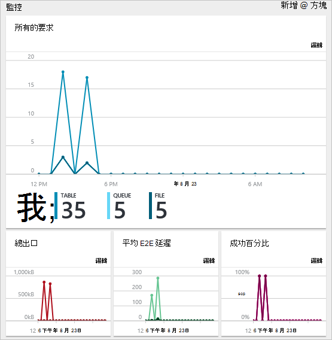

1. 您可以將固定刀段落儀表板選取省略符號 （...），在區段的上方。 您也可以自訂的一節中刀的大小，或完全移除。 下圖顯示如何將其釘選、 自訂，或移除 [CPU 和記憶體] 區段。

    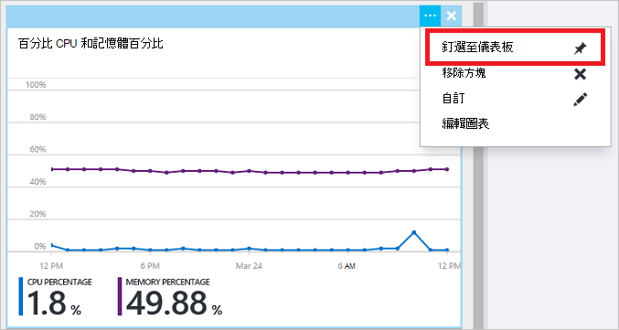

1. 之後釘選至儀表板區段，您會看到儀表板上的摘要。 然後，選取其立即會帶您到更多詳細資料。

    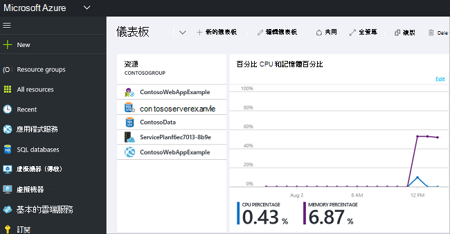

1. 若要完全自訂資料您可以監視透過網站、 瀏覽至您預設的儀表板，並選取**新的儀表板**。

    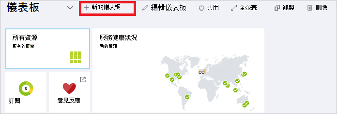

1. 為新儀表板名稱，然後拖曳至儀表板的 [並排]。 並排經過篩選以不同的選項。

    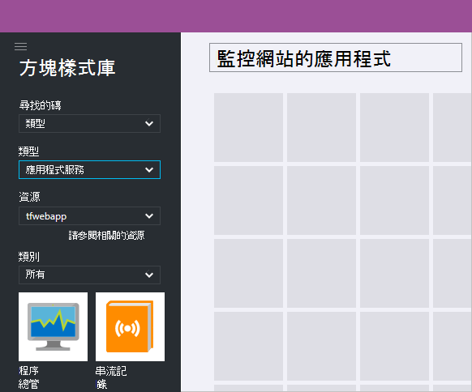

     若要瞭解如何使用儀表板，請參閱[建立和共用 Azure 入口網站中的儀表板](azure-portal-dashboards.md)。

## 管理資源

在 [資源刀，您會看到管理資源的選項。 入口網站提供特定的資源類型的管理選項。 您會看到 [管理] 命令上方的資源刀和左側。

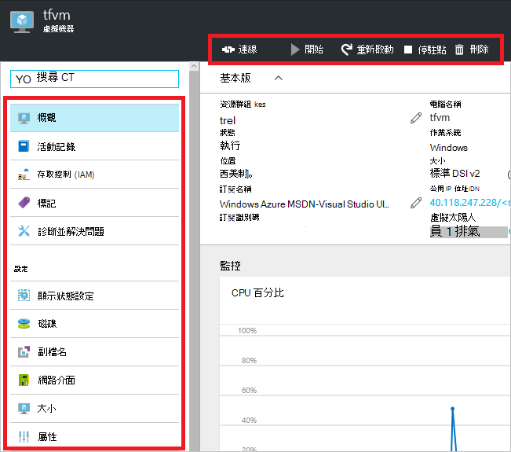

從這些選項，您可以執行的作業，例如啟動和停止虛擬機器，或重新設定的虛擬機器屬性。

## 移動資源

如果您需要將資源移至另一個資源群組或另一個訂閱，請參閱[移動到新的資源群組或訂閱的資源](../resource-group-move-resources.md)。

## 鎖定資源

您可以鎖定，防止其他使用者不小心刪除或修改重要的資源，您組織中的訂閱、 資源] 群組中或資源。 如需詳細資訊，請參閱[鎖定資源與 Azure 資源管理員](../resource-group-lock-resources.md)。

[AZURE.INCLUDE [resource-manager-lock-resources](../../includes/resource-manager-lock-resources.md)]

## 檢視您的訂閱和成本

您可以檢視您的訂閱和上顯型成本的相關資訊，所有資源的。 選取**訂閱**，而且您想要查看的訂閱。 您可能只選取一個訂閱。

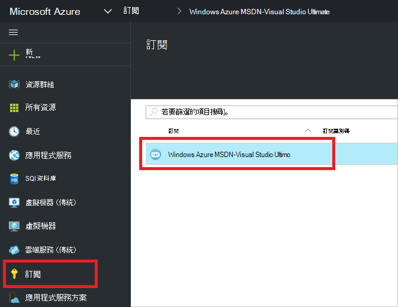

在訂閱刀中，您會看到燒錄工資率。

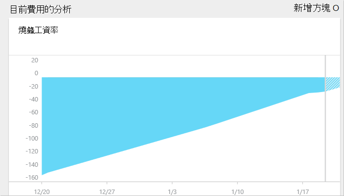

與資源的成本的分析。

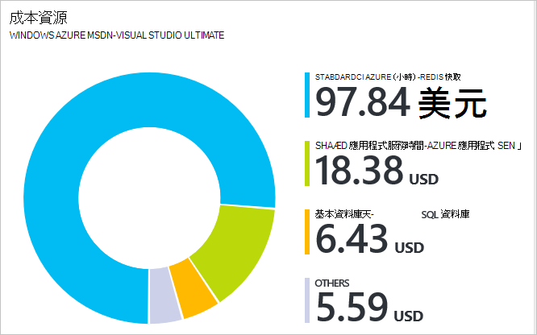

## 匯出範本

設定後資源群組，您可能會想要檢視 [資源] 群組的資源管理員範本。 匯出範本提供兩個優點︰

1. 您可以輕鬆地自動化未來部署解決方案的因為範本包含完整的基礎結構。

2. 您可以熟悉範本語法尋找在 JavaScript 物件標記法 (JSON)，表示您的方案。

如需逐步指引，請參閱[匯出 Azure 資源管理員範本從現有的資源](../resource-manager-export-template.md)。

## 刪除資源群組] 或 [資源

資源群組刪除其包含的所有資源。 您也可以刪除資源群組內的個別資源。 您想要一因為可能需要資源所連結的其他資源群組中，刪除資源群組時必須小心謹慎。 資源管理員並不會刪除連結的資源，但是他們可能無法正常運作不預期的資源。

## 後續步驟

- 若要檢視稽核記錄，請參閱[稽核作業與資源管理員](../resource-group-audit.md)。
- 若要疑難排解部署錯誤，請參閱[Azure 入口網站與疑難排解資源群組部署](../resource-manager-troubleshoot-deployments-portal.md)。
- 若要部署透過入口網站的資源，請參閱[使用資源管理員範本和 Azure 入口網站的部署資源](../resource-group-template-deploy-portal.md)。
- 若要管理資源的存取權，請參閱[使用角色指派管理 Azure 訂閱資源的存取權](../active-directory/role-based-access-control-configure.md)。

