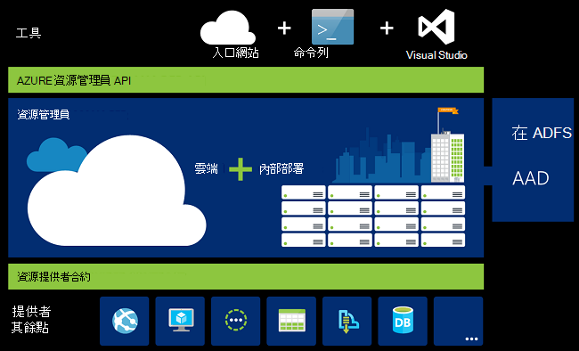
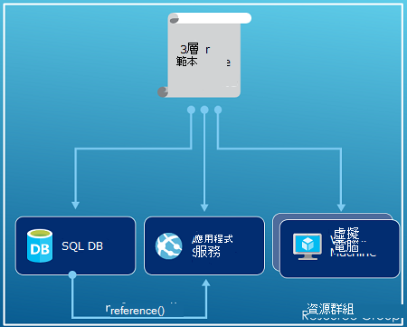
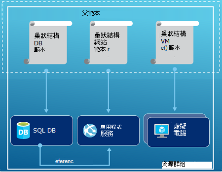

<properties
   pageTitle="Azure 資源管理員的概觀 |Microsoft Azure"
   description="說明如何使用 Azure 資源管理員，以供部署，管理和存取資源的 Azure 上的控制項。"
   services="azure-resource-manager"
   documentationCenter="na"
   authors="tfitzmac"
   manager="timlt"
   editor="tysonn"/>

<tags
   ms.service="azure-resource-manager"
   ms.devlang="na"
   ms.topic="get-started-article"
   ms.tgt_pltfrm="na"
   ms.workload="na"
   ms.date="10/21/2016"
   ms.author="tomfitz"/>

# Azure 資源管理員的概觀

您的應用程式的基礎結構通常組成許多元件-也許虛擬機器、 儲存帳戶和虛擬網路或 web 應用程式、 資料庫、 資料庫伺服器，以及第 3 廠商服務。 您沒有看到這些元件以獨立的實體，而您看到這些為相關及互相部分單一項目。 您想要部署、 管理及監視這些群組。 Azure 資源管理員可讓您使用的資源群組方案中。 您可以部署、 更新或刪除的所有資源在單一、 協同作業解決方案。 使用範本，以供部署，該範本能不同環境中測試、 臨時和生產等。 資源管理員會提供安全性、 稽核和標記功能，協助您部署後，管理您的資源。 

## 詞彙

如果您是新至 Azure 資源管理員，有一些您可能不熟悉的字詞。

- **資源**-可透過 Azure 的管理項目。 一般資源虛擬機器、 儲存帳戶、 web 應用程式、 資料庫及虛擬網路，但是有其他資訊。
- **資源群組**-保留 Azure 解決方案的相關的資源的容器。 資源群組可以包含所有資源的方案或僅在您想要管理群組的資源。 您決定要如何根據什麼最適合貴組織的資源群組配置資源。 請參閱[資源群組](#resource-groups)。
- **資源提供者**的服務，提供您可以部署及管理透過資源管理員的資源。 每個資源提供者提供的部署資源所使用的作業。 一些常見的資源提供者是 Microsoft.Compute 提供的虛擬機器資源、 Microsoft.Storage，提供儲存帳戶資源及 Microsoft.Web 提供 web 應用程式相關的資源。 請參閱[資源提供者](#resource-providers)。
- **資源管理員範本**-定義要部署至此資源群組的一或多個資源的 JavaScript 物件標記法 (JSON) 檔案。 也會定義部署資源之間的相依性。 範本可用於一致的方式和重複部署資源。 請參閱[範本部署](#template-deployment)。
- **宣告語法**-可讓您狀態 」 以下是我要建立 」 而不需撰寫的程式設計順序命令建立的語法。 資源管理員範本是語法的宣告式範例。 在檔案中，您可以定義要部署至此 Azure 基礎結構的屬性。 

## 使用資源管理員的好處

資源管理員提供幾項優點︰

- 您可以部署、 管理及監視的所有資源的方案，為群組，而不是個別處理這些資源。
- 您可以重複部署在開發週期方案並部署資源一致的信賴度。
- 您可以管理您的基礎結構，透過宣告式的範本，而不是指令碼。
- 您可以定義資源，因此部署順序正確無誤之間的相依性。
- 您可以套用存取控制的所有服務資源群組中由於角色型存取控制 (RBAC) 原本整合管理平台。
- 您可以將標籤套用至，組織您的訂閱中的所有資源的資源。
- 您可以檢視] 群組中的共用相同標籤的資源的成本，以釐清貴組織的帳單。  

資源管理員提供部署及管理您的方案的新方法。 如果您使用的舊版的部署模型，且想要瞭解所做的變更，請參閱[瞭解資源管理員部署及傳統部署](../resource-manager-deployment-model.md)。

## 一致的管理圖層

資源管理員提供您透過 PowerShell 的 Azure、 Azure CLI、 Azure 入口網站、 REST API，以及開發工具執行的工作一致的管理圖層。 所有工具都使用一組通用的作業。 您使用的工具，最適合您，以及使用交替不混淆。 

下列圖像顯示相同的 Azure 資源管理員 api 的所有工具都互動的方式。 API 的要求傳遞至資源管理員服務，其中的驗證及授權要求。 資源管理員然後傳送邀請到適當的資源提供者。

## 指導方針

下列建議有助於您發揮充分利用的資源管理員，使用您的解決方案時。

1. 定義及部署基礎結構透過資源管理員範本中的宣告語法，而非透過必要的命令。
2. 定義所有的部署及設定步驟中的範本。 您應該已設定您的方案不手動步驟。
3. 執行必要的命令，來管理您的資源，例如啟動或停止應用程式或機器。
4. 在 [資源] 群組中的相同生命週期排列資源。 使用標記的所有其他組織的資源。

更多的建議，請參閱[建立 Azure 資源管理員範本的最佳作法](../resource-manager-template-best-practices.md)。

## 資源群組

有定義資源群組時的考量一些重要因素︰

1. 在群組中的所有資源應該都共用相同的生命週期。 您部署、 更新及刪除它們放在一起。 如果某個資源，例如 [資料庫伺服器，必須在不同的部署循環存在於應該會在另一個資源群組。
2. 每個資源只能存在於某個資源] 群組中。
3. 您可以新增或移除任何時間資源群組中的資源。
4. 您可以資源從某個資源群組移到另一個群組。 如需詳細資訊，請參閱[移動到新的資源群組或訂閱的資源](../resource-group-move-resources.md)。
4. 資源群組可以包含位於不同區域的資源。
5. 資源群組可用來設定存取控制系統管理動作的列印範圍。
6. 資源可以與其他資源群組中的資源進行互動。 這種互動，就常見的兩個資源相關，但不是共用相同的生命週期 （例如，web 應用程式連線至資料庫）。

建立資源群組時，您需要提供的資源群組的位置。 您可能會好奇，「 為什麼資源群組必須位置？ 如果資源可以有不同的位置，於 [資源] 群組，為什麼沒有資源群組位置影響完全嗎？ 」 資源群組儲存的資源相關的中繼資料。 因此，當您指定的資源群組的位置，並指定的中繼資料儲存的位置。 基於規範，您可能需要以確保您的資料儲存在特定區域。

## 資源提供者

每個資源提供者提供的資源和 Azure 服務所使用的作業。 例如，如果您想要儲存索引鍵和密碼，您使用的**Microsoft.KeyVault**資源提供者。 此資源提供者提供的一部分**保存庫**建立索引鍵的保存庫及索引鍵保存庫中建立密碼的一部分**保存庫/機密資料**的資源類型的資源類型。 

之前開始使用部署資源，您應該瞭解的可用的資源提供者。 了解資源提供者和資源的名稱，可協助您定義您想要部署至 Azure 的資源。

您擷取所有資源的提供者，使用下列 PowerShell 指令程式︰

    Get-AzureRmResourceProvider -ListAvailable

或者，您也可以使用 Azure CLI 擷取所有資源的提供者，使用下列命令︰

    azure provider list

您需要使用資源提供者，您可以查詢所傳回的清單。

若要取得資源提供者的相關資訊，請新增者命名空間至您的命令。 命令傳回資源提供者，和支援的位置，以及每個資源類型的 API 版本支援的資源類型。 下列 PowerShell 指令程式取得 Microsoft.Compute 的詳細資料︰

    (Get-AzureRmResourceProvider -ProviderNamespace Microsoft.Compute).ResourceTypes

或者，您也可以使用 Azure CLI 擷取支援的資源類型、 位置及 API 版本 Microsoft.Compute，使用下列命令︰

    azure provider show Microsoft.Compute --json > c:\Azure\compute.json

如需詳細資訊，請參閱[資源管理員提供者、 區域、 API 版本和結構描述](../resource-manager-supported-services.md)。

## 部署範本

使用資源管理員，您可以建立的範本 （JSON 格式），以定義的基礎結構和 Azure 方案的設定。 使用範本，您可以重複部署生命週期方案，並部署資源一致的信賴度。 當您從入口網站中建立的解決方案時，方案會自動包含部署範本。 您不必因為您可以開始使用範本解決方案，以符合您特定需求自訂從頭開始建立您的範本。 您可以匯出目前狀態的 [資源] 群組中，或檢視特定的部署使用的範本來擷取現有的資源群組的範本。 檢視[匯出範本](../resource-manager-export-template.md)的方法很有幫助瞭解範本語法。

若要進一步瞭解範本及如何建構它的格式，請參閱[撰寫 Azure 資源管理員範本](../resource-group-authoring-templates.md)與[資源管理員範本逐步解說](../resource-manager-template-walkthrough.md)。

資源管理員處理像其他任何要求的範本 （[一致的管理](#consistent-management-layer)圖層，請參閱圖像）。 它會剖析範本，並將它的語法轉換成適當的資源提供者的 REST API 作業。 例如，當資源管理員會收到下列資源定義的範本︰

    "resources": [
      {
        "apiVersion": "2016-01-01",
        "type": "Microsoft.Storage/storageAccounts",
        "name": "mystorageaccount",
        "location": "westus",
        "sku": {
          "name": "Standard_LRS"
        },
        "kind": "Storage",
        "properties": {
        }
      }
      ]

定義轉換為下列的 REST API 作業會傳送至 Microsoft.Storage 資源提供者︰

    PUT
    https://management.azure.com/subscriptions/{subscriptionId}/resourceGroups/{resourceGroupName}/providers/Microsoft.Storage/storageAccounts/mystorageaccount?api-version=2016-01-01
    REQUEST BODY
    {
      "location": "westus",
      "properties": {
      }
      "sku": {
        "name": "Standard_LRS"
      },   
      "kind": "Storage"
    }

如何定義範本與資源群組完全是由您和您想要管理您的方案的方式。 例如，透過單一範本將三個層應用程式部署到單一資源群組。

但您不需要在單一範本定義整個基礎結構。 通常，讓將您的部署需求，將一組目標、 特定用途的範本。 您可以輕鬆地重複使用不同的解決方案的這些範本。 若要部署的特定的解決方案，建立主版範本的連結所有必要的範本。 下圖顯示部署到包含三個巢狀的範本的上層範本的三個層解決方案的方式。

如果您構想您有另一個週期的各個層時，您可以部署您三層來分隔資源群組。 請注意資源仍然可以連結至其他的資源群組中的資源。

如需更多關於設計範本的建議，請參閱[設計 Azure 資源管理員範本的圖樣](../best-practices-resource-manager-design-templates.md)。 巢狀範本的相關資訊，請參閱[使用連結的範本與 Azure 資源管理員](../resource-group-linked-templates.md)。

Azure 資源管理員分析相依性，以確保正確的順序會建立資源。 如果某個資源依賴的其他資源 （例如虛擬機器磁碟需要儲存帳戶），您可以設定相依性。 如需詳細資訊，請參閱[Azure 資源管理員範本中的定義相依性](../resource-group-define-dependencies.md)。

您也可以使用範本為基礎結構的更新。 例如，您可以將資源新增至您的方案，並新增已部署的資源設定規則。 如果範本指定建立資源，但的資源已經存在，Azure 資源管理員會執行，而不是建立新的資產的更新。 Azure 資源管理員更新現有的資產相同的狀態就會為新。  

資源管理員在您需要其他作業，例如安裝特定的軟體，不會包含在安裝時，會提供案例的副檔名。 如果您已經在使用組態管理服務，例如 DSC、 主廚或傀儡，您可以繼續使用該服務使用副檔名。 虛擬機器擴充功能的相關資訊，請參閱[瞭解虛擬機器副檔名和功能](../virtual-machines/virtual-machines-windows-extensions-features.md)。 

最後，範本成為您的應用程式的程式碼的一部分。 您可以檢查您的來源程式碼存放庫，並為您的應用程式中發展更新。 您可以編輯透過 Visual Studio 範本。

定義您的範本之後, 您準備好要 Azure 部署資源。 如要部署資源中的命令，請參閱︰

- [部署資源管理員範本與 PowerShell 的 Azure 資源](../resource-group-template-deploy.md)
- [部署資源與資源管理員範本和 Azure CLI](../resource-group-template-deploy-cli.md)
- [部署資源管理員範本與 Azure 入口網站的資源](../resource-group-template-deploy-portal.md)
- [部署資源與資源管理員範本與資源管理員 REST API](../resource-group-template-deploy-rest.md)

## 標記

資源管理員提供標記功能可讓您將根據您的需求管理或帳單資源分類。 當您複雜集合的資源群組和資源，並以視覺化方式呈現最適合您的資產需要請使用 [標記。 例如，您可能標記作為類似的角色，您組織中或屬於相同的部門的資源。 沒有標記，您組織中的使用者可以建立多個資源，可能難以識別及管理。 例如，您可能會想要刪除的特定專案的所有資源。 如果這些資源不會標記專案中，您必須以手動方式找到。 標記是重要的方法，以減少不必要的成本，在您的訂閱。 

不需要的資源位於相同的資源群組，若要共用的標籤。 您可以建立標籤分類，以確保貴組織中的所有使用者都使用一般的標籤，而不是使用者不小心套用稍有不同的標籤 （例如 「 部門 」，而不是 「 部門 」）。

下列範例顯示套用至虛擬機器中的標籤。

    "resources": [    
      {
        "type": "Microsoft.Compute/virtualMachines",
        "apiVersion": "2015-06-15",
        "name": "SimpleWindowsVM",
        "location": "[resourceGroup().location]",
        "tags": {
            "costCenter": "Finance"
        },
        ...
      }
    ]

若要擷取標籤值的所有資源，請使用下列 PowerShell 指令程式︰

    Find-AzureRmResource -TagName costCenter -TagValue Finance

或者，下列 Azure CLI 命令︰

    azure resource list -t costCenter=Finance --json

您也可以檢視標記透過 Azure 入口網站的資源。

[使用情況報告](../billing/billing-understand-your-bill.md)，您的訂閱包含標籤名稱和值，這可讓您依標籤分成本。 如需標記的詳細資訊，請參閱[使用標籤以組織 Azure 資源](../resource-group-using-tags.md)。

## 存取控制

資源管理員可讓您控制可存取特定的動作，為您的組織。 原生整合到管理平台上的角色型存取控制 (RBAC)，然後適用於您的 [資源] 群組中的所有服務的存取控制。 

有兩個主要的概念，若要了解使用角色型存取控制時︰

- 角色定義-描述一組權限，並可在多任務分派。
- 角色指派-關聯與身分識別 （使用者或群組） 的定義的特定範圍 （[訂閱]、 [資源] 群組中或 [資源）。 工作分派繼承較低的範圍。

您可以加入預先定義的平台和資源特定角色的使用者。 例如，您也可以利用稱為助讀程式，可讓使用者檢視資源，但不是變更的預先定義的角色。 您需要此類型的讀取者角色的存取您組織中新增使用者並將該角色套用至訂閱、 資源] 群組中或資源。

Azure 提供下列四種平台角色︰

1.  擁有者-管理所有項目，包括存取
2.  管理參與者-access 以外的所有內容
3.  閱讀程式-可以檢視所有項目，但無法進行變更
4.  使用者存取管理員可以管理 Azure 資源的使用者存取權

Azure 也會提供多項資源特定角色。 一些常見的是︰

1.  虛擬機器參與者-管理虛擬機器，但不是授與存取權，並無法管理虛擬網路] 或 [儲存帳戶連線到
2.  網路參與者-可以管理所有網路資源，但不是授與存取權
3.  儲存帳戶參與者-可以管理儲存空間帳戶，但不是授與存取權
4. SQL Server 參與者-管理 SQL server 資料庫，但不是其相關的安全性原則
5. 管理網站參與者的網站，但無法連線到 web 方案

角色與允許的動作的完整清單，請參閱[RBAC︰ 內建於角色](../active-directory/role-based-access-built-in-roles.md)。 如需有關角色型存取控制的詳細資訊，請參閱[Azure 角色型存取控制](../active-directory/role-based-access-control-configure.md)。 

在某些情況下，您想要執行的程式碼或指令碼存取資源，但不是想執行之使用者的認證。 不過，您會想要建立稱為 「 服務應用程式的本金身分識別和主要服務的適當的角色指派。 資源管理員可讓您建立應用程式的認證，並以程式設計方式驗證應用程式。 若要瞭解建立服務原則，請參閱下列主題︰

- [若要建立 access 資源服務主要使用 PowerShell 的 Azure](../resource-group-authenticate-service-principal.md)
- [使用 Azure CLI 建立服務主體存取資源](../resource-group-authenticate-service-principal-cli.md)
- [若要建立 Active Directory 應用程式與服務的主要可以存取資源的使用入口網站](../resource-group-create-service-principal-portal.md)

您可以同時明確地鎖定重要的資源，以防止使用者刪除或修改。 如需詳細資訊，請參閱[鎖定資源與 Azure 資源管理員](../resource-group-lock-resources.md)。

## 活動記錄

資源管理員記錄建立、 修改或刪除資源的所有作業。 若要尋找錯誤的疑難排解，或監控您的組織中的使用者如何修改資源，您可以使用活動記錄。 若要查看的記錄，選取**活動記錄**中的 [資源群組**設定**刀。 您可以篩選許多不同的值，包括使用者發起的租用戶作業的記錄。 瞭解如何使用 [活動記錄的資訊，請參閱[稽核作業與資源管理員](../resource-group-audit.md)。

## 自訂的原則

資源管理員可讓您建立自訂的原則管理您的資源。 您建立的原則的類型可以包含各種不同的案例。 您可以強制上資源，可以部署哪些類型和資源的執行個體或限制的區域可以主控資源類型的命名慣例。 您可以要求資源，以便組織部門帳單上的標記值。 您建立原則，以協助降低成本與維護您的訂閱的一致性。 

定義使用 JSON 原則，並套用在您的訂閱，或資源群組內套用這些原則。 原則是不同的角色型存取控制，因為它們會套用到資源類型。

下列範例顯示的原則，藉由指定的所有資源都包括 costCenter 標記能確保標籤一致性。

    {
      "if": {
        "not" : {
          "field" : "tags",
          "containsKey" : "costCenter"
        }
      },
      "then" : {
        "effect" : "deny"
      }
    }

有許多種更多您可以建立的原則。 如需詳細資訊，請參閱[使用原則管理資源，並控制存取權](../resource-manager-policy.md)。

## Sdk

Azure Sdk 有多個語言與平台。
這些語言實作都可透過其生態封裝管理員和 GitHub。

在每一個這些 Sdk 的程式碼會產生從 Azure RESTful API 規格。
這些規格是開啟的來源，並根據 Swagger 2.0 規格。
SDK 程式碼會產生透過稱為 AutoRest 開啟來源專案。
AutoRest 轉換成多種語言的用戶端程式庫這些 RESTful API 規格。
如果您想要改善 Sdk 產生的程式任何的碼部分，整組的工具來建立 Sdk 是開啟]、 [免費，及 [根據廣泛採用的 API 規格格式。

以下是我們開啟來源 SDK 存放庫。 我們歡迎使用意見反應，問題，並擷取要求。

[.NET](https://github.com/Azure/azure-sdk-for-net) | [Java](https://github.com/Azure/azure-sdk-for-java) | [Node.js](https://github.com/Azure/azure-sdk-for-node) | [PHP](https://github.com/Azure/azure-sdk-for-php) | [Python](https://github.com/Azure/azure-sdk-for-python) | [並列文字](https://github.com/Azure/azure-sdk-ruby)

> [AZURE.NOTE]如果 SDK 提供所需的功能，您也可以呼叫[Azure REST API](https://msdn.microsoft.com/library/azure/dn790568.aspx)直接。

## 範例

### .NET

- [管理 Azure 資源與資源群組](https://azure.microsoft.com/documentation/samples/resource-manager-dotnet-resources-and-groups/)
- [部署 SSH 啟用 VM 範本](https://azure.microsoft.com/documentation/samples/resource-manager-dotnet-template-deployment/)

### Java

- [管理 Azure 資源](https://azure.microsoft.com/documentation/samples/resources-java-manage-resource/)
- [管理 Azure 資源群組](https://azure.microsoft.com/documentation/samples/resources-java-manage-resource-group/)
- [部署 SSH 啟用 VM 範本](https://azure.microsoft.com/documentation/samples/resources-java-deploy-using-arm-template/)

### Node.js

- [管理 Azure 資源與資源群組](https://azure.microsoft.com/documentation/samples/resource-manager-node-resources-and-groups/)
- [部署 SSH 啟用 VM 範本](https://azure.microsoft.com/documentation/samples/resource-manager-node-template-deployment/)

### Python

- [管理 Azure 資源與資源群組](https://azure.microsoft.com/documentation/samples/resource-manager-python-resources-and-groups/)
- [部署 SSH 啟用 VM 範本](https://azure.microsoft.com/documentation/samples/resource-manager-python-template-deployment/)

### [注音標示

- [管理 Azure 資源與資源群組](https://azure.microsoft.com/documentation/samples/resource-manager-ruby-resources-and-groups/)
- [部署 SSH 啟用 VM 範本](https://azure.microsoft.com/documentation/samples/resource-manager-ruby-template-deployment/)

除了這些範例中，您可以搜尋庫範例。

[.NET](https://azure.microsoft.com/documentation/samples/?service=azure-resource-manager&platform=dotnet) | [Java](https://azure.microsoft.com/documentation/samples/?service=azure-resource-manager&platform=java) | [Node.js](https://azure.microsoft.com/documentation/samples/?service=azure-resource-manager&platform=nodejs) | [Python](https://azure.microsoft.com/documentation/samples/?service=azure-resource-manager&platform=python) | [並列文字](https://azure.microsoft.com/documentation/samples/?service=azure-resource-manager&platform=ruby)

## 後續步驟

- 使用範本的簡單簡介資訊，請參閱[匯出從現有的資源 Azure 資源管理員範本](../resource-manager-export-template.md)。
- 建立範本的更完整的逐步解說，請參閱[資源管理員範本逐步解說](../resource-manager-template-walkthrough.md)。
- 若要瞭解您可以使用範本中的功能，請參閱[範本函數](../resource-group-template-functions.md)
- 使用 Visual Studio 與資源管理員的相關資訊，請參閱[建立及部署 Visual Studio 透過 Azure 資源群組](../vs-azure-tools-resource-groups-deployment-projects-create-deploy.md)。
- 使用與程式碼資源管理員的相關資訊，請參閱[使用 Visual Studio 程式碼中的 Azure 資源管理員範本](../resource-manager-vs-code.md)。

以下是本概觀的示範短片︰

[AZURE.VIDEO azure-resource-manager-overview]

[powershellref]: https://msdn.microsoft.com/library/azure/dn757692(v=azure.200).aspx
