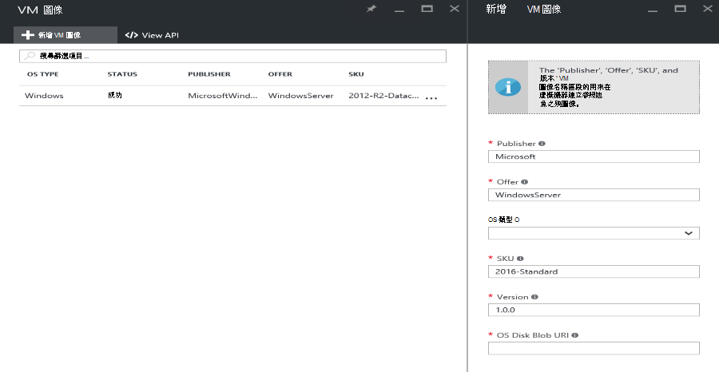

<properties
    pageTitle="將 VM 圖像新增至 Azure 堆疊 |Microsoft Azure"
    description="新增您組織的自訂 Windows 或 Linux VM 圖像的租用戶使用"
    services="azure-stack"
    documentationCenter=""
    authors="mattmcg"
    manager="darmour"
    editor=""/>

<tags
    ms.service="azure-stack"
    ms.workload="na"
    ms.tgt_pltfrm="na"
    ms.devlang="na"
    ms.topic="get-started-article"
    ms.date="09/26/2016"
    ms.author="mattmcg"/>

# <a name="make-a-custom-virtual-machine-image-available-in-azure-stack"></a>Azure 堆疊的可自訂的虛擬機器圖像


Azure 堆疊可讓系統管理員可讓 VM 圖像，例如組織的自訂 VHD，其租用戶。 圖像可以參考的 Azure 資源管理員範本，或新增至 Azure 服務商場 UI 服務商場的項目建立。 Azure 堆疊 Technical Preview 中的預設會包含的 Windows Server 2012 R2 圖像。

> [AZURE.NOTE] 在 ui 上，選取 [**新增**，然後選取 [**虛擬機器**類別，可以部署 VM 圖像服務商場的項目。 VM 圖像項目會列出。


## <a name="add-a-vm-image-to-marketplace-with-powershell"></a>新增 VM 圖像至使用 PowerShell 服務商場

如果 VM 圖像 VHD 本機主控台 VM （或另一個外部連接的裝置） 上使用，請使用下列步驟︰

1. 準備的 Windows 或 Linux 作業系統虛擬硬碟圖像 VHD 格式 (不 VHDX)。
    -   Windows 影像[上, 傳至 Azure 資源管理員部署的 Windows VM 圖像](virtual-machines-windows-upload-image.md)的文件會包含在**準備 VHD 上傳**] 區段中的圖像準備指示。
    -   Linux 圖像，請依照下列準備圖像或使用現有的 Azure 堆疊 Linux 圖像，請參閱[Azure 堆疊上的部署 Linux 虛擬機器](azure-stack-linux.md)所述的步驟。

2. 複製[Azure 堆疊工具存放庫](https://aka.ms/azurestackaddvmimage)中，然後再匯入**ComputeAdmin**模組

    ```powershell
    Import-Module .\ComputeAdmin\AzureStack.ComputeAdmin.psm1
    ```

3. 新增 VM 圖像叫用新增 VMImage 指令程式。
    -  包含 publisher、 優惠、 SKU 及 VM 圖像的版本。 參照 VM 圖像的 Azure 資源管理員範本會使用這些參數。
    -  在 Windows 或 Linux 指定 osType。
    -  在表單中加入您的 Azure Active Directory 租用戶識別碼*&lt;myaadtenant&gt;*。 onmicrosoft.com。
    - 以下是範例呼叫的指令碼︰

    ```powershell
       Add-VMImage -publisher "Canonical" -offer "UbuntuServer" -sku "14.04.3-LTS" -version "1.0.0" -osType Linux -osDiskLocalPath 'C:\Users\AzureStackAdmin\Desktop\UbuntuServer.vhd' -tenantID <myaadtenant>.onmicrosoft.com
    ```

    > [AZURE.NOTE] 指令程式會要求認證新增 VM 圖像。 提供管理員的 Azure Active Directory 認證，例如serviceadmin@ * &lt;myaadtenant&gt;*。 onmicrosoft.com，提示。  

命令執行下列動作︰
- 驗證 Azure 堆疊環境
- 上傳至新建立的暫存帳戶本機 VHD
- 將 VM 圖像新增到 VM 圖像儲存機制
- 建立服務商場的項目

若要確認已順利執行] 命令，在入口網站中移至 [服務商場，然後確認 VM 圖像是**虛擬機器**] 類別提供使用。

> 

下列是命令參數的描述。


| 參數 | 描述 |
|----------| ------------ |
|**tenantID** | 您在表單中的 Azure Active Directory 租用戶識別碼*&lt;AADTenantID*。 onmicrosoft.com&gt;。 |
|**publisher** | 部署圖像時，租用戶使用 VM 影像的 「 publisher 名稱 」 區段。 例如，「 Microsoft 」。 在此欄位中包含空格或其他特殊字元。|
|**優惠** | 部署 VM 圖像時，租用戶使用 VM 影像的 「 優惠名稱 」 區段。 例如，「 WindowsServer 」。 在此欄位中包含空格或其他特殊字元。 |
| **sku** | 部署 VM 圖像時，租用戶使用 VM 影像的 「 SKU 名稱 」 區段。 例如，「 Datacenter2016 」。 在此欄位中包含空格或其他特殊字元。 |
|**版本** | 部署 VM 圖像時，租用戶使用 VM 影像的版本。 此版本是格式*\#。\#。\#*.例如，「 1.0.0 」。 在此欄位中包含空格或其他特殊字元。|
| **osType** | 圖像的 osType 必須是 「 Windows' 或 'Linux 」。 |
|**osDiskLocalPath** | OS 磁碟您上傳當作 VM 圖像至 Azure 堆疊的 VHD 本機路徑。 |
|**dataDiskLocalPaths**| 選擇性陣列可以上傳屬於 VM 圖像的資料磁碟的本機路徑。|
|**CreateGalleryItem**| 布林值旗標，決定是否要在服務商場中建立項目。 設定預設值為 true。|
|**標題**| 顯示名稱 Marketplace 項目。 預設會設定為 Publisher 優惠 Sku VM 圖像。|
|**描述**| 服務商場項目的描述。 |
|**osDiskBlobURI**| 您也可以這個指令碼也會接受 osDisk Blob 儲存體 URI。|
|**dataDiskBlobURIs**| 您也可以這個指令碼也會接受 Blob 儲存體 Uri 的陣列，將圖像中加入資料磁碟。|


## <a name="add-a-vm-image-through-the-portal"></a>新增透過網站 VM 圖像

> [AZURE.NOTE] 此方法需要分別建立服務商場項目。

圖像的其中一個需求是的您可以參考 Blob 儲存體 URI。 準備的 Windows 或 Linux 作業系統虛擬硬碟圖像 VHD 格式 (不 VHDX)，然後上傳到儲存的帳戶或 Azure 堆疊 Azure 中的圖像。 如果您的影像已上傳至 Azure 或堆疊 Azure Blob 儲存體可以略過此步驟。

請依照從[上傳至 Azure 資源管理員部署的 Windows VM 圖像](https://azure.microsoft.com/documentation/articles/virtual-machines-windows-upload-image/)的文件**上傳您儲存的帳戶 VM 圖像**的步驟執行。 請記住下列事項︰

-   Linux 圖像，請依照下列指示準備圖像，或使用現有 Azure 堆疊 Linux 圖像，請參閱[Azure 堆疊上的部署 Linux 虛擬機器](azure-stack-linux.md)所述。

- 它會更有效率至 Azure 堆疊 Blob 儲存體比至 Azure Blob 儲存體中上傳圖像，因為發送 VM 圖像至 Azure 堆疊圖像存放庫時間。 時的上傳指示執行，請務必替代[與 Microsoft Azure 堆疊的項目會驗證 PowerShell](azure-stack-deploy-template-powershell.md)步驟，「 登入 Azure 」 步驟。

- 記下 Blob 儲存體 URI 您上傳圖像。 有下列格式︰ * &lt;storageAccount&gt;/&lt;blobContainer&gt;/&lt;targetVHDName&gt;*.vhd

2.  若要讓 blob 匿名存取，移至儲存帳戶 blob 容器位置 VM 圖像 VHD 已上傳至**Blob，**然後再選取**存取原則**。 如果您想，可以改為產生容器共用的 access 簽章，並將其做為一部分 blob URI 加入。


1.  以系統管理員身分登入 Azure 堆疊。 移至 [**地區管理**。 然後在 [**每秒要求數量**，選取 [**計算資源提供者** > **VM 圖像** > **新增]。**

    

2.  在下列刀，輸入 publisher、 優惠、 SKU 及 VM 圖像的版本。 Azure 資源管理員範本 VM 圖像參考這些名稱 」 區段。 請務必選取**osType**正確。 **OsDiskBlobURI**，在 [步驟 1 中輸入的 URI 圖像已上傳所在位置。 按一下 [**建立**]，開始建立 VM 圖像]。

    

3.  當在成功新增圖像，VM 圖像狀態會變更為 「 成功 」。

4.  租用戶可以指定 publisher、 優惠、 SKU 和 VM 圖像新版 Azure 資源管理員範本中部署 VM 圖像。 若要讓使用者介面中更容易使用的租用戶消耗 VM 圖像，最好[建立服務商場項目](azure-stack-create-and-publish-marketplace-item.md)。
