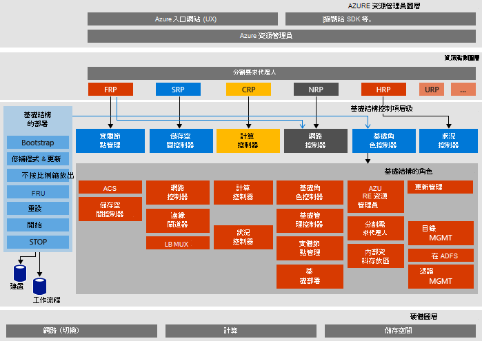

<properties
    pageTitle="Microsoft Azure 堆疊證明的概念 (POC) 架構 |Microsoft Azure"
    description="檢視 Microsoft Azure 堆疊 POC 架構。"
    services="azure-stack"
    documentationCenter=""
    authors="heathl17"
    manager="byronr"
    editor=""/>

<tags
    ms.service="azure-stack"
    ms.workload="na"
    ms.tgt_pltfrm="na"
    ms.devlang="na"
    ms.topic="article"
    ms.date="10/25/2016"
    ms.author="helaw"/>

# Microsoft Azure 堆疊 POC 架構

Azure 堆疊 POC 是一個節點的部署 Azure 堆疊技術預覽 2。 在單一主機電腦上執行的虛擬機器中安裝所有元件。 

## 邏輯架構圖表
下圖說明邏輯 Azure 堆疊 POC 和元件架構。

## 虛擬機器角色
Azure 堆疊 POC 提供使用下列 Vm POC 主機上的服務︰

 - **MAS ACS01**虛擬機器主機 Azure 堆疊儲存服務。

 - **MAS ADFS01**虛擬機器裝載 Active Directory Federation Services。  技術預覽 2] 中，不會使用這個虛擬機器。  

 - **MAS ASQL01** 虛擬機器提供內部的資料存放區 Azure 堆疊基礎結構的角色。  

 - **MAS BGPNAT01**虛擬機器擔任邊緣路由器，並提供 Azure 堆疊 NAT 和 VPN 功能。

 - **MAS CA01**虛擬機器提供 Azure 堆疊角色服務的憑證授權單位服務。

 - **MAS CON01**虛擬機器才能安裝 PowerShell、 Visual Studio 中及其他工具開發人員。

 - **MAS DC01**虛擬機器主機的 Microsoft Azure 堆疊的 Active Directory、 DNS 及 DHCP 服務。

 - **MAS GWY01**虛擬機器提供邊緣閘道器服務，例如租用戶網路的 VPN 至網站的連線。

 - **MAS NC01** 虛擬機器主機管理 Azure 堆疊網路服務的網路控制器服務。  

 - **MAS SLB01** 虛擬機器提供負載平衡服務 Azure 堆疊的租用戶和 Azure 堆疊基礎結構服務兩者均適用。  

 - **MAS SUS01** 虛擬機器主機 Windows Server 更新服務，和負責提供其他堆疊 Azure 虛擬機器的更新。

 - **MAS WAS01** 虛擬機器裝載入口網站和 Azure 資源管理員服務。

 - **MAS XRP01**主控的 Microsoft Azure 堆疊，包括計算、 網路和儲存資源提供者的核心資源提供者的虛擬機器。

## 儲存服務
儲存服務的實體主機上的作業系統包括︰

 - **ACS Blob 服務**Azure 一致的儲存空間 Blob 服務，提供 blob 和資料表儲存體服務。

 - **SoFS**擴充檔案伺服器。

 - **參照 CSV**有彈性的檔案系統叢集共用音量。

 - **虛擬磁碟**、**儲存空間**，並**直接儲存空格**會啟用 Microsoft Azure 堆疊核心儲存資源提供者的 Windows Server 的個別基礎的儲存空間技術。

## 後續步驟

[部署 Azure 堆疊](azure-stack-deploy.md)

[嘗試的第一個案例](azure-stack-first-scenarios.md)

