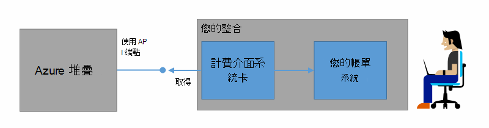
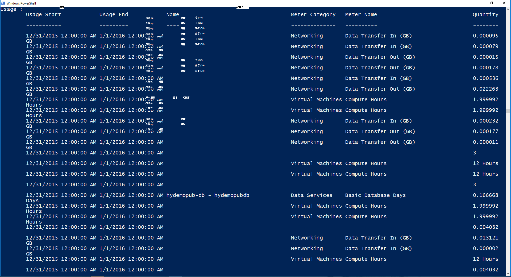

<properties
    pageTitle="客戶帳單與 Azure 堆疊的 Chargeback |Microsoft Azure"
    description="瞭解如何從 Azure 堆疊擷取資源使用狀況資訊。"
    services="azure-stack"
    documentationCenter=""
    authors="AlfredoPizzirani"
    manager="byronr"
    editor=""/>

<tags
    ms.service="azure-stack"
    ms.workload="na"
    ms.tgt_pltfrm="na"
    ms.devlang="na"
    ms.topic="article"
    ms.date="10/18/2016"
    ms.author="alfredop"/>

# 帳單寄送的客戶及 chargeback Azure 堆疊中

現在，您使用的 Azure 堆疊，最好先思考如何追蹤使用方式。 服務提供者依賴結算客戶，並瞭解成本提供服務的使用狀況資訊。
企業，，通常是使用以追蹤部門。

Azure 堆疊不是帳單系統。 它不會收費您租用戶對他們所使用的資源。 不過，Azure 堆疊沒有來收集及彙總的每個單一資源提供者的使用情況資料的基礎結構。 您可以存取此資料和帳單的系統匯出使用帳單介面卡，或將其匯出至商務智慧工具，例如 Microsoft Power BI。

## 可以找到使用狀況資訊，以及如何？

Azure 堆疊資源提供者會在每小時的時間間隔產生使用記錄。 記錄顯示的使用狀況，每個資源的訂閱耗用資源的數量。 此資料會儲存。 您可以存取透過 REST API 的資料。

服務管理員可以擷取所有租用戶訂閱的使用情況資料。 個別的租用戶可以擷取自己的資訊。

使用記錄具有存放裝置、 網路和計算的使用方式的相關資訊。 如需計量器清單，請參閱[本文](azure-stack-usage-related-faq.md)。

## 擷取使用狀況資訊

若要產生記錄，則您必須執行，而且正在使用系統資源。 如果您不確定是否有任何執行中的資源，請在 Azure 堆疊 Marketplace 部署，然後再執行虛擬機器 (VM)。 查看 VM 監控刀，確保它正在執行。

我們建議您執行 Windows PowerShell cmdlet 來檢視使用情況資料。
PowerShell 通話資源使用狀況 Api。

1.  [安裝及設定 PowerShell 的 Azure](https://azure.microsoft.com/en-us/documentation/articles/powershell-install-configure/)。

2.  若要登入至 Azure 資源管理員，請使用 PowerShell 指令程式**的登入 AzureRmAccount**。

3.  若要選取您用來建立資源的訂閱，請輸入 [**取得 AzureRmSubscription – SubscriptionName"sub"|選取 AzureRmSubscription**。

4.  若要擷取資料，請使用 PowerShell 指令程式[**取得 UsageAggregates**](https://msdn.microsoft.com/en-us/library/mt619285.aspx)。
    如果使用情況資料使用，在下列範例會傳回 PowerShell 中。 PowerShell 傳回 1000 行的每個呼叫的使用方式。
    您可以使用*接續*引數來擷取的限制，超出前 1000 的線條。 如需有關使用情況資料的詳細資訊，請參閱[資源使用狀況 API 參考](azure-stack-provider-resource-api.md)。

    

## 後續步驟

[提供者資源使用狀況 API](azure-stack-provider-resource-api.md)

[租用戶資源使用狀況 API](azure-stack-tenant-resource-usage-api.md)

[使用狀況相關的常見問題集](azure-stack-usage-related-faq.md)
