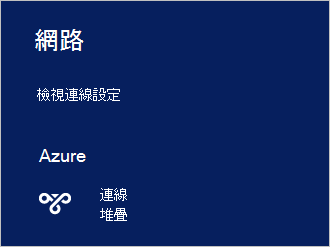

<properties
    pageTitle="連線至 Azure 堆疊 |Microsoft Azure"
    description="瞭解如何連線 Azure 堆疊"
    services="azure-stack"
    documentationCenter=""
    authors="ErikjeMS"
    manager="byronr"
    editor=""/>

<tags
    ms.service="azure-stack"
    ms.workload="na"
    ms.tgt_pltfrm="na"
    ms.devlang="na"
    ms.topic="get-started-article"
    ms.date="10/18/2016"
    ms.author="erikje"/>

# <a name="connect-to-azure-stack"></a>連線至 Azure 堆疊
若要管理資源，您必須連線至 Azure 堆疊 POC 電腦。 您可以使用下列的連線選項其中一項︰

 - 遠端桌面︰ 可讓您快速地從 POC 電腦連線的單一同時使用者。
 - 虛擬私人網路 (VPN): 可讓多位使用者同時從 Azure 堆疊基礎結構 （需要設定） 以外的用戶端連線。

## <a name="connect-with-remote-desktop"></a>使用遠端桌面連線
使用遠端桌面連線，同時單一使用者可以使用入口網站管理資源。 您也可以使用工具 MAS CON01 虛擬機器上。

1.  登入 Azure 堆疊 POC 實體機器。

2.  開啟遠端桌面連線，然後連線到 MAS CON01。 輸入**AzureStack\AzureStackAdmin**使用者名稱和管理您 Azure 堆疊安裝期間所提供的密碼。  

3.  MAS CON01 桌面上按兩下以開啟[入口網站](azure-stack-key-features.md#portal)的**Microsoft Azure 堆疊入口網站**圖示 (https://portal.azurestack.local/)。

    ![Azure 堆疊入口網站] 圖示](media/azure-stack-connect-azure-stack/image2.png)

4.  使用在安裝期間所指定的 Azure Active Directory 認證登入。

## <a name="connect-with-vpn"></a>使用 VPN 連線
虛擬私人網路連線可讓多位使用者同時從 Azure 堆疊基礎結構以外的用戶端連線。 您可以使用入口網站管理資源。 您也可以使用您的本機用戶端上的工具，例如 Visual Studio 與 PowerShell。

1.  安裝 AzureRM 模組使用下列命令︰
   
    ```PowerShell
    Install-Module -Name AzureRm -RequiredVersion 1.2.6 -Scope CurrentUser
    ```   
   
2. 下載 Azure 堆疊工具指令碼。  支援 [ [GitHub 存放庫](https://github.com/Azure/AzureStack-Tools)中，瀏覽] 或 [以系統管理員身分執行下列 Windows PowerShell 指令碼，就可以下載檔案︰
    
    >[AZURE.NOTE]  下列步驟可要求 PowerShell 5.0。  若要檢查您的版本，請執行 $PSVersionTable.PSVersion 並比較 「 主要 」 的版本。  

    ```PowerShell
       
       #Download the tools archive
       invoke-webrequest https://github.com/Azure/AzureStack-Tools/archive/master.zip -OutFile master.zip

       #Expand the downloaded files. 
       expand-archive master.zip -DestinationPath . -Force

       #Change to the tools directory
       cd AzureStack-Tools-master
    ````

3.  在相同的 PowerShell 工作階段，瀏覽至 [**連線**] 資料夾中，並匯入 AzureStack.Connect.psm1 模組︰

    ```PowerShell
    cd Connect
    import-module .\AzureStack.Connect.psm1
    ```

4.  若要建立 Azure 堆疊 VPN 連線，請執行下列 Windows PowerShell。 後再繼續執行，填入的管理員密碼和 Azure 堆疊主機地址欄位。 
    
    ```PowerShell
    #Change the IP Address below to match your Azure Stack host
    $hostIP = "<HostIP>"

    # Change password below to reference the password provided for administrator during Azure Stack installation
    $Password = ConvertTo-SecureString "<Admin Password>" -AsPlainText -Force

    # Add Azure Stack One Node host & CA to the trusted hosts on your client computer
    Set-Item wsman:\localhost\Client\TrustedHosts -Value $hostIP -Concatenate
    Set-Item wsman:\localhost\Client\TrustedHosts -Value mas-ca01.azurestack.local -Concatenate  

    # Update Azure Stack host address to be the IP Address of the Azure Stack POC Host
    $natIp = Get-AzureStackNatServerAddress -HostComputer $hostIP -Password $Password

    # Create VPN connection entry for the current user
    Add-AzureStackVpnConnection -ServerAddress $natIp -Password $Password

    # Connect to the Azure Stack instance. This command (or the GUI steps in step 5) can be used to reconnect
    Connect-AzureStackVpn -Password $Password 
    ```

5. 出現提示時，允許 Azure 堆疊主機。

6. 出現提示時，安裝 （後 Powershell 工作階段視窗出現提示） 的憑證。

7. 若要測試入口網站的連線，在網際網路瀏覽器中，瀏覽至*https://portal.azurestack.local*。

8. 若要檢閱，並管理 Azure 堆疊連線，請使用**網路**上您的用戶端︰

    

>[AZURE.NOTE] 這個 VPN 連線不提供 Vm 或其他資源的連線。 連線至 [資源資訊，請參閱[一個節點 VPN 連線](azure-stack-create-vpn-connection-one-node-tp2.md)


## <a name="next-steps"></a>後續步驟
[第一個工作](azure-stack-first-scenarios.md)

[安裝並使用 PowerShell 連線](azure-stack-connect-powershell.md)

[安裝並使用 CLI 連線](azure-stack-connect-cli.md)


