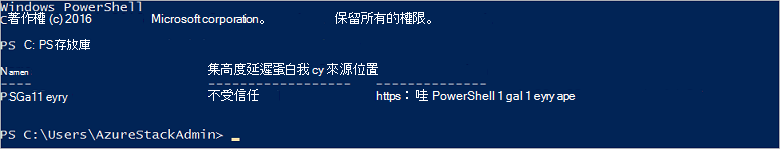

<properties
    pageTitle="連線到使用 PowerShell 的 Azure 堆疊 |Microsoft Azure"
    description="瞭解如何管理使用 PowerShell 的 Azure 堆疊"
    services="azure-stack"
    documentationCenter=""
    authors="HeathL17"
    manager="byronr"
    editor=""/>

<tags
    ms.service="azure-stack"
    ms.workload="na"
    ms.tgt_pltfrm="na"
    ms.devlang="na"
    ms.topic="article"
    ms.date="10/19/2016"
    ms.author="helaw"/>

# 安裝 PowerShell，並連線到 Azure 堆疊
本指南中，我們會逐步執行連線到使用 PowerShell 的 Azure 堆疊的步驟。 完成時，這些步驟也可以協助您管理並部署資源。

## 安裝 Azure 堆疊 PowerShell cmdlet

1.  從 [PowerShell 庫安裝 AzureRM cmdlet。 若要開始，請開啟 PowerShell 主控台 MAS CON01 上並執行下列命令以傳回 PowerShell 存放庫的清單︰

        Get-PSRepository

      

2.  執行下列命令以安裝 AzureRM 模組︰

        Install-Module -Name AzureRM -RequiredVersion 1.2.6 -Scope CurrentUser

    >[AZURE.NOTE] *-範圍 CurrentUser*為選用步驟。 如果您目前的使用者超過想要有權存取模組，請使用提高權限的命令提示字元，並關閉*範圍*參數離開。

3.  若要確認 AzureRM 模組的安裝，請執行下列命令︰

        Get-Command -Module AzureRM.AzureStackAdmin

## 連線至 Azure 堆疊
使用控點的設定為您 Azure 堆疊 PowerShell 連線的下載的模組。  模組和額外的步驟，請造訪[Azure 堆疊工具](http://aka.ms/ConnectToAzureStackPS)。 

## 擷取訂閱的清單
在 [此節]，檢查 PowerShell cmdlet 來擷取，並選取用於訂閱執行針對 Azure 堆疊。

執行下列命令以擷取 Azure 堆疊訂閱與您的帳戶相關聯的清單︰

    Get-AzureRmSubscription

## 後續步驟
[部署使用 PowerShell 範本](azure-stack-deploy-template-powershell.md)

[Azure CLI 與連線](azure-stack-connect-cli.md)

[以 Visual Studio 中部署範本](azure-stack-deploy-template-visual-studio.md)

