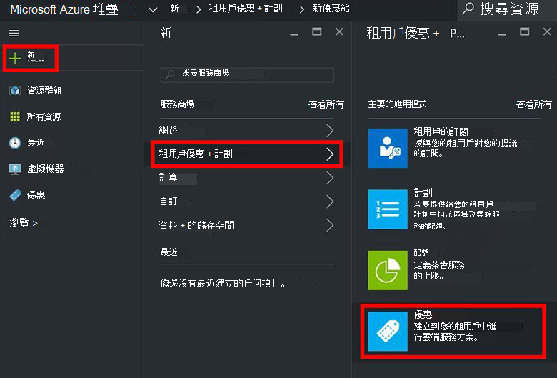
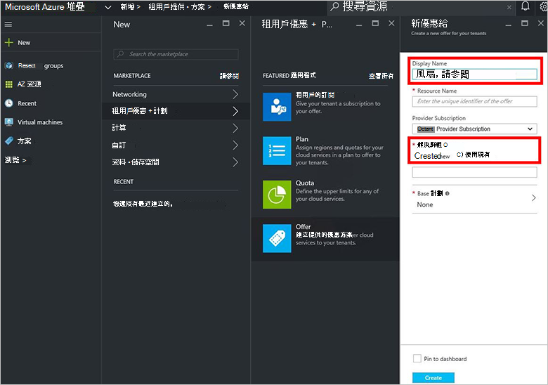
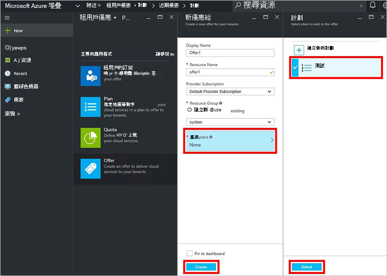
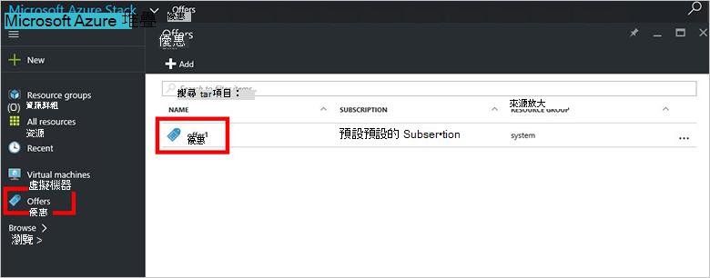
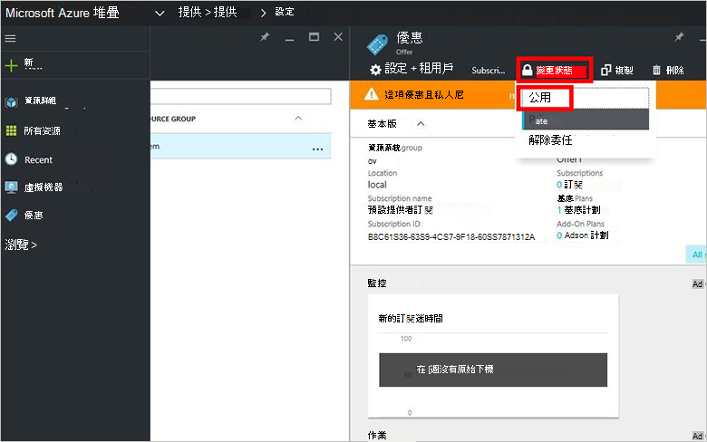

<properties
    pageTitle="Azure 堆疊中建立提議 |Microsoft Azure"
    description="服務管理員瞭解如何建立您的租用戶 Azure 堆疊中提供。"
    services="azure-stack"
    documentationCenter=""
    authors="ErikjeMS"
    manager="byronr"
    editor=""/>

<tags
    ms.service="azure-stack"
    ms.workload="na"
    ms.tgt_pltfrm="na"
    ms.devlang="na"
    ms.topic="get-started-article"
    ms.date="09/26/2016"
    ms.author="erikje"/>

# Azure 堆疊中建立優惠

[提供](azure-stack-key-features.md#services-plans-offers-and-subscriptions)是群組的一或多個提供者展示到租用戶購買或訂閱的方案。 這份文件會顯示如何建立包含[您所建立的計劃](azure-stack-create-plan.md)最後一個步驟中提供。 這項優惠讓訂閱者能夠佈建虛擬機器。

1.  服務管理員的身分入口網站[登入](azure-stack-connect-azure-stack.md#log-in-as-a-service-administrator)，然後按一下 [**新增** > **租用戶提供 + 方案** > **提供**。
    

2.  在**新提供**刀，填入 [**顯示名稱**和**資源名稱**]，然後選取新的或現有的**資源群組**。 顯示名稱是優惠易記的名稱。 僅限管理員可以看到資源的名稱。 則管理員使用優惠做為 Azure 資源管理員資源所使用的名稱。

    

3.  按一下**以方案**中**規劃**刀，, 選取您想要包含在優惠的方案，然後按一下**選取**。 按一下 [**建立**]，建立優惠]。

    
    
4. 按一下 [**提供**，然後按一下 [您剛剛建立的優惠。

    

5.  按一下 [**變更狀態**]，然後按一下 [**公用**。
  
    

優惠必須進行公用的租用戶訂閱時，取得完整的檢視。 提供您可以︰

- **公用**︰ 租用戶可看到。

- **私人**︰ 僅可看到服務系統管理員。 實用時製圖方案或服務，或如果想要核准每個訂閱的服務系統管理員。

- **Decommissioned**︰ 關閉，以新的訂閱。 服務系統管理員可以使用可防止未來的訂閱，但延用目前訂閱者解除委任。

優惠的變更而無法立即顯示租用戶。 若要查看所做的變更，您可能必須登出/登入即可在 [訂閱選擇器] 中新的訂閱時建立資源/資源群組。

## 後續步驟

[訂閱優惠，然後佈建 VM](azure-stack-subscribe-plan-provision-vm.md)
