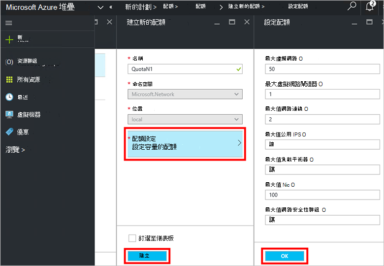

<properties
    pageTitle="建立計劃中 Azure 堆疊 |Microsoft Azure"
    description="服務管理員，建立可讓訂閱者佈建虛擬機器的計劃。"
    services="azure-stack"
    documentationCenter=""
    authors="ErikjeMS"
    manager="byronr"
    editor=""/>

<tags
    ms.service="azure-stack"
    ms.workload="na"
    ms.tgt_pltfrm="na"
    ms.devlang="na"
    ms.topic="get-started-article"
    ms.date="09/26/2016"
    ms.author="erikje"/>

# Azure 堆疊中建立計劃

[計劃](azure-stack-key-features.md#services-plans-offers-and-subscriptions)是一或多個服務的群組。 為提供者，您可以建立要提供給您的租用戶的方案。 接著，您的租用戶訂閱您使用的計劃和其包含的服務提供。 此範例為您示範如何建立包含運算、 網路和儲存資源提供者的計劃。 本方案讓訂閱者能夠佈建虛擬機器。

1.  網際網路瀏覽器中瀏覽至 https://portal.azurestack.local。

2.  Azure 堆疊入口網站服務系統管理員身分[登入](azure-stack-connect-azure-stack.md#log-in-as-a-service-administrator)並輸入您的服務系統管理員認證 （您在步驟 5 中的 [[執行的 PowerShell 指令碼](azure-stack-run-powershell-script.md)] 區段中所建立的帳戶，），然後再按一下 [**登入**。

    服務系統管理員可以優惠和計劃、 建立及管理使用者。

3.  若要建立的計劃和租用戶可以訂閱的方案，請按一下 [**新增** > **租用戶提供 + 方案** > **計劃**。

    

4.  在**新的計劃**刀，填入**顯示名稱**和**資源名稱**。 顯示名稱是計劃的好記的名稱，請參閱租用戶。 僅限管理員可以看到資源的名稱。 它是系統管理員使用處理 Azure 資源管理員資源的方案名稱。

    

5.  建立新的**資源群組**，或選取現有的項目，為容器的計劃 (例如 「 OffersAndPlans 」)

    

6.  按一下 [**服務**]，選取 [ **Microsoft.Compute**、 **Microsoft.Network**及**Microsoft.Storage**，，再按一下 [**選取**。

    

7.  按一下**配額**、 按一下**Microsoft.Storage （本機）**，然後選取 [預設配額或按一下 [**建立新的配額**自訂配額]。

    

8.  輸入配額的名稱**配額設定**、 設定配額值並按一下 [**確定**]，然後按一下然後按一下 [**建立**]。

    

9. 按一下**Microsoft.Network （本機）**，然後選取 [預設配額，或按一下 [**建立新的配額**自訂配額]。

    

10. 輸入配額的名稱**配額設定**、 設定配額值並按一下 [**確定**]，然後按一下然後按一下 [**建立**]。

    

11. 按一下**Microsoft.Compute （本機）**，然後選取 [預設配額，或按一下 [**建立新的配額**自訂配額]。

    

12.  輸入配額的名稱**配額設定**、 設定配額值並按一下 [**確定**]，然後按一下然後按一下 [**建立**]。

    

13. 在**配額**刀中，按一下**[確定**]，然後在**新的計劃**刀中，按一下 [**建立**]，建立計劃。

    

14. 若要查看您的新方案，按一下 [**所有資源**]，然後搜尋方案並按一下其名稱。

    

## 後續步驟

[建立優惠](azure-stack-create-offer.md)
