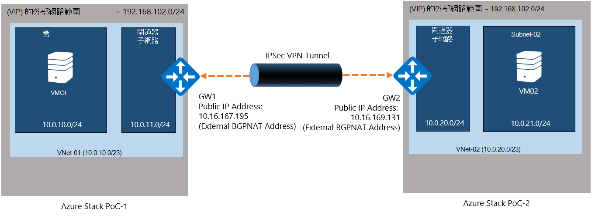
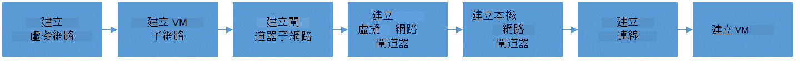
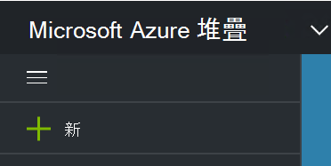
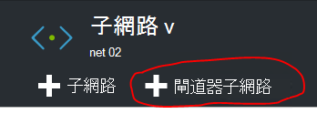
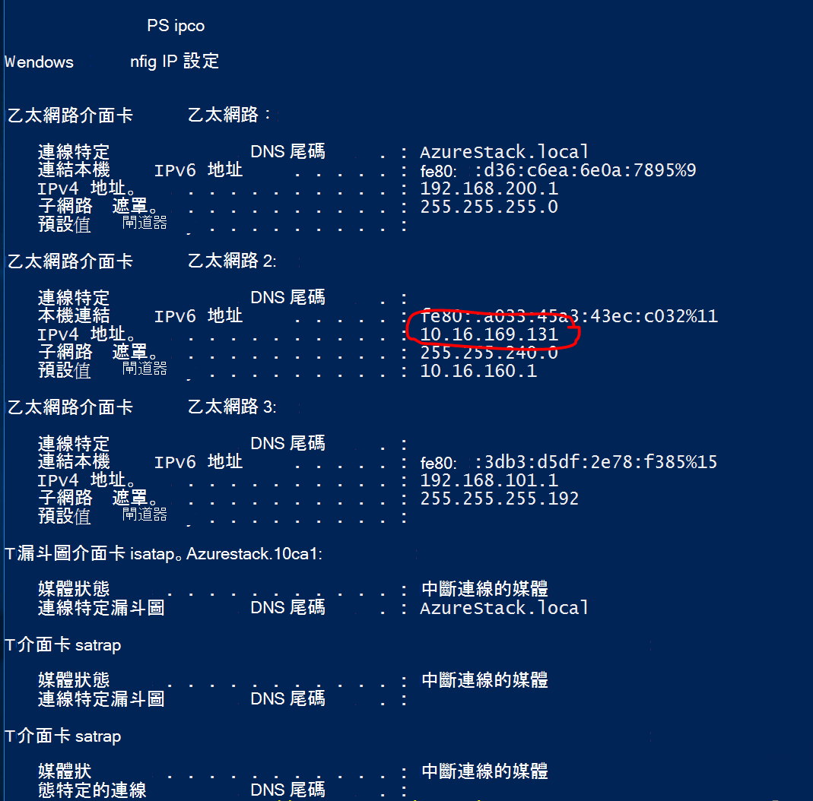
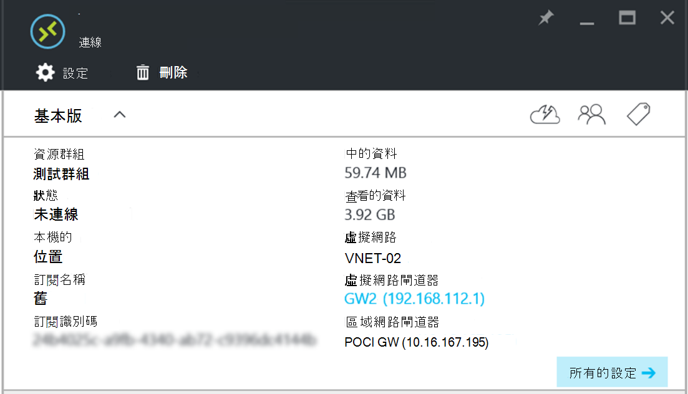

<properties
    pageTitle="建立網站-VPN 連線之間的不同 Azure 堆疊 PoC 環境中的兩個虛擬網路 |Microsoft Azure"
    description="允許建立兩個項目節點 POC 環境中 TP2 之間的網站-VPN 連線的雲端管理員的逐步程序。"
    services="azure-stack"
    documentationCenter=""
    authors="ScottNapolitan"
    manager="darmour"
    editor=""/>

<tags
    ms.service="azure-stack"
    ms.workload="na"
    ms.tgt_pltfrm="na"
    ms.devlang="na"
    ms.topic="get-started-article"
    ms.date="09/26/2016"
    ms.author="scottnap"/>

# 建立兩個不同的 Azure 堆疊 PoC 環境中的虛擬網路之間網站-VPN 連線

## 概觀

本文會引導您建立網站-VPN 連線在兩個不同的 Azure 堆疊的概念 (POC) 環境中的兩個虛擬網路之間的步驟。 目的是可協助人員正在評估網站-閘道器瞭解如何設定在兩個不同的 Azure 堆疊部署中的虛擬網路之間的 VPN 連線。  程序如此一來，您將瞭解 VPN 閘道 Azure 堆疊中的運作方式。

>[AZURE.NOTE] 這份文件特別適用於 Azure 堆疊 TP2 POC。

### 連線的圖表

下列是圖表可顯示我們設定應該看起來很完畢。

### 開始之前

若要完成此設定，您會需要下列項目，請確定您有這些項目您開始之前。

-   兩個伺服器符合所定義的[Azure 堆疊部署先決條件](azure-stack-deploy.md)Azure 堆疊 POC 硬體需求及其他文件所定義的先決條件。

-   Azure 堆疊 Technical Preview 2 部署套件。

## 部署 POC 環境

您會部署完成這項設定的兩種 Azure 堆疊 POC 環境。

-   針對每個 POC 部署，您可以只要遵循詳細說明，請參閱[部署 Azure 堆疊 POC](azure-stack-run-powershell-script.md)部署指示。
    我們會參照代為 POC1 和 POC2 文件中每個 POC 環境。

## 設定的計算、 網路和儲存配額

您需要設定配額計算、 網路和儲存空間，好讓這些服務可相關聯的計劃，然後租用戶優惠可以訂閱。

>[AZURE.NOTE] 您需要執行下列步驟，為每個 Azure 堆疊 POC 環境。

若要建立的服務配額體驗已經從 TP1。 如何建立配額 TP2 中的步驟位於<http://aka.ms/mas-create-quotas>。 您可以接受預設值，此練習中的所有配額設定。

## 計劃與優惠

[計劃](azure-stack-key-features.md)是一或多個服務的群組。 為提供者，您可以建立要提供給您的租用戶的方案。 接著，您的租用戶訂閱您使用的計劃和其包含的服務提供。

>[AZURE.NOTE] 您必須針對每個 Azure 堆疊 POC 環境中執行這些步驟。

1.  第一次建立計劃。 若要這麼做，您可以依照[建立計劃](azure-stack-create-plan.md)的線上文件中的步驟。

2.  建立提供[建立優惠 Azure 堆疊中](azure-stack-create-offer.md)所述的步驟進行。

3.  入口網站的租用戶管理員身分登入和 [訂閱您建立的優惠] (azure-堆疊-訂閱-計劃-佈建-vm.md。

## 在 [POC 1 中建立的網路資源

現在我們實際建立我們需要進行我們設定設定的資源。 下列步驟說明我們會能做什麼。 這些指示將會顯示如何建立資源透過入口網站，但可以透過 PowerShell 完成同樣的動作。

### 租用戶身分登入

服務管理員可以為租用戶測試方案優惠，與他們租用戶可能會使用訂閱登入。 如果您還沒有[建立的租用戶帳戶](azure-stack-add-new-user-aad.md)您登入前一個。

### 建立虛擬網路與 VM 子網路

1.  使用的租用戶帳戶登入。

2.  在 Azure 入口網站中，按一下 [**新增**] 圖示。

     
3.  選取 [市集] 功能表上的 [**網路**]。

4.  按一下 [在功能表上的**虛擬網路**項目]。

5.  按一下 [資源描述刀底部附近的 [**建立**] 按鈕。 輸入適當的欄位，請根據下表中的下列的值。

  	| **功能變數**             | **值** |
  	|----------------------- | ------ |
  	| 名稱                  |vnet-01 |
  	| 位址空間         | 10.0.10.0/23 |
  	| 子網路名稱           | 子網路-01 |
  	| 子網路位址範圍  | 10.0.10.0/24 |

6.  您應該會看到您所建立的舊版填入 [**訂閱**] 欄位中的訂閱。

7.  資源群組，您可以建立新的資源群組，或如果您已經有一個，請選取 [使用現有。

8.  驗證的預設位置。

9.  按一下 [**建立**] 按鈕。

### 建立閘道器子網路

1.  開啟您剛剛建立的儀表板 (Vnet-01) 的虛擬網路資源。

2.  在 [設定刀中，選取 [子網路

3.  按一下 [**閘道器子網路**] 按鈕新增至虛擬網路的閘道器子網路。

     
4.  根據預設，子網路的名稱會設**GatewaySubnet** 。
    閘道器子網路是特殊，而且必須擁有此特定的名稱，才能正常運作。

5.  在 [**位址**] 欄位中，輸入**10.0.11.0/24**。

6.  按一下 [**建立**] 按鈕，以建立閘道器子網路。

### 建立虛擬網路閘道器

1.  在 Azure 入口網站中，按一下 [**新增**] 圖示。

    

2.  選取 [市集] 功能表上的 [**網路**]。

3.  從網路資源的清單中選取**虛擬網路閘道器**。

4.  檢閱描述，然後按一下 [**建立**]。

5.  在 [**名稱**] 欄位中輸入**GW1**。

6.  按一下 [選擇虛擬網路的**虛擬網路**項目]。
    從清單中選取**Vnet-01** 。

7.  按一下 [**公用 IP 位址**功能表項目。 選擇公用 IP 位址刀開啟時按一下 [建立新的] 按鈕。

8.  在 [**名稱**] 欄位中輸入**GW1 PiP** ，然後按一下**確定。**

9.  **閘道器類型**應該要有**VPN**預設為已選取。 保留這項設定。

10. **傳送型**預設為已選取應該要有**VPN 類型**。
    保留這項設定。

11. 請確認您**的訂閱**和**位置**都正確。 您可以視固定至儀表板的資源。 按一下 [**建立**]。

### 建立區域網路閘道器

本機網路閘道資源是有點奇怪，我們的情境中。
不過，代表實際的內部部署裝置通常是用的 Azure 中您想要使用連線至 Azure 虛擬網路閘道器，則您在 Azure 中找到相同的資源。 在我們的範例，連線的兩端會是實際虛擬網路閘道器 ！

考量下列事項這更普遍本機的網路閘道資源永遠指遠端閘道器另一端連接的方式。 由於 POC 的設計的方式，我們真的需要的其他 POC NAT VM 上提供的外部網路介面卡的地址，本機網路閘道器的公用 IP 位址。 然後，我們就會建立 NAT 對應，請確定已正確連接兩端 NAT VM 上。

### 取得的 NAT VM 外部介面卡的 IP 位址

1.  登入 Azure 堆疊實體機器版 POC2。

2.  [Windows 鍵] + R 以開啟 [**執行**] 功能表，並輸入**mstsc**和按下 enter。

3.  在 [**電腦**] 欄位中輸入名稱**MAS BGPNAT01** ，然後按一下 [**連線**] 按鈕。

4.  按一下 [開始] 功能表中，以滑鼠右鍵按一下 PowerShell 並選取 [**以系統管理員身分執行**。

5.  輸入**IPConfig/所有**。

6.  尋找已連線至您的內部部署網路乙太網路介面卡，並記下該介面卡繫結的 IPv4 位址。 在我的環境中，則**10.16.167.195** ，但卻會不同。

7.  錄製至此地址。 這是我們會使用我們在 POC1 中建立的本機網路閘道資源的公用 IP 位址。

### 建立區域網路閘道器資源

1.  登入 Azure 堆疊實體機器版 POC1。

2.  在 [**電腦**] 欄位中，輸入**MAS CON01**的名稱，然後按一下 [**連線**] 按鈕。

3.  在 Azure 入口網站中，按一下 [**新增**] 圖示。

    

4.  選取 [市集] 功能表上的 [**網路**]。

5.  從資源的清單中選取 [**區域網路閘道器**]。

6.  在 [**名稱**] 欄位中輸入**POC2 GW**。

7.  我們不知道我們閘道器的 IP 位址，但這確定是因為我們可以回來，並在稍後變更其。 現在，請在**IP 位址] 欄位**中輸入**10.16.167.195** 。

8.  在 [**地址空間**] 欄位中輸入，我們將建立在 POC2 Vnet 的位址空間。 這要**10.0.20.0/23** ，因此請輸入這個值。

9.  請確認您的**訂閱**，**資源群組**和**位置**都正確無誤，然後按一下 [**建立**]。

### 建立連線

1.  在 Azure 入口網站中，按一下 [**新增**] 圖示。

     

2.  選取 [市集] 功能表上的 [**網路**]。

3.  選取清單中的資源的**連線**。

4.  在 [**基本**設定刀中，選擇**連線類型****網站網站 (IPSec)** 。

5.  選取 [**訂閱**、**資源群組**和**位置**，然後按一下 [**確定**]。

6.  在**設定**刀中，選擇 [**虛擬網路閘道器**(**GW1**) 您先前建立]。

7.  選擇 [**區域****網路閘道器**(**POC2 GW**) 先前所建立。

8.  在 [**連線名稱**] 欄位中，輸入**POC1 POC2**。

9.  在 [**共用索引鍵 (PSK)**欄位中輸入**12345**。 按一下 [**確定**]。

### 建立 VM

要驗證在移動中透過 VPN 連線的資料，您需要傳送及接收資料中每個 POC Vm。 現在就讓我們現在建立 VM POC1 中，將其放在我們的虛擬網路我們 VM 子網路上。

1. 在 Azure 入口網站中，按一下 [ **新增**] 圖示。

     

2.  從 [市集] 功能表中選取**虛擬機器**。

3.  在虛擬機器圖像的清單中，選取 [ **Windows Server 2012 R2 資料中心**圖像]。

4.  在**基本概念**刀中，在 [**名稱**] 欄位中輸入值**VM01**。

5.  輸入有效的使用者名稱和密碼。 登入 VM 之後建立之後，您將使用此帳戶。

6.  提供的**訂閱**，**資源群組**及**位置**，然後按一下 [**確定]**。

7.  在**大小**刀中，選擇針對此執行個體虛擬記憶體大小，然後按一下 [**選取**。

8.  在設定刀中，您可以接受預設值，只需確定已選取的虛擬網路**VNET 01** ，而且子網路設定為 [ **10.0.10.0/24**。 按一下 [**確定**]。

9.  檢閱**摘要**刀] 的設定，然後按一下 [**確定**]。

## 建立網路資源 POC 2

### 租用戶身分登入

服務管理員可以為租用戶測試方案優惠，與他們租用戶可能會使用訂閱登入。 如果您還沒有[建立的租用戶帳戶](azure-stack-add-new-user-aad.md)您登入前一個。

### 建立虛擬網路與 VM 子網路

1. 使用的租用戶帳戶登入。

2. 在 Azure 入口網站中，按一下 [ **新增**] 圖示。

     

3.  選取 [市集] 功能表上的 [**網路**]。

4.  按一下 [**虛擬網路**上的項目] 功能表上。

5.  按一下 [資源描述刀底部附近的 [**建立**] 按鈕。 下表列出的適當的欄位中輸入下列值。

  	|**功能變數**              |**值** |
  	| ----------------------|----------|
  	| 名稱                  | vnet 02 |
  	| 位址空間         | 10.0.20.0/23 |
  	| 子網路名稱           | 子網路 02 |
  	| 子網路位址範圍  | 10.0.20.0/24 |

6.  您應該會看到您所建立的舊版填入 [**訂閱**] 欄位中的訂閱。

7.  資源群組，您可以建立新的資源群組，或如果您已經有一個，請選取 [使用現有。

8.  驗證的預設**位置**。 如果您想，您可以固定虛擬網路的儀表板，以方便存取。

9.  按一下 [**建立**] 按鈕。

### 建立閘道器子網路

1.  開啟您建立 (**Vnet 02**) 從儀表板的虛擬網路資源。

2.  在**設定**刀中，選取 [**子網路。**

3.  按一下 [**閘道器子網路**] 按鈕新增至虛擬網路的閘道器子網路。

     

4.  根據預設，子網路的名稱會設**GatewaySubnet** 。
    閘道器子網路是特殊，而且必須擁有此特定的名稱，才能正常運作。

5.  在 [**位址**] 欄位中，輸入**10.0.20.0/24**。

6.  按一下 [**建立**] 按鈕，以建立閘道器子網路。

### 建立虛擬網路閘道器

1. 在 Azure 入口網站中，按一下 [ **新增**] 圖示。

     

2.  選取 [市集] 功能表上的 [**網路**]。

3.  從網路資源的清單中選取**虛擬網路閘道器**。

4.  檢閱描述，然後按一下 [**建立**]。

5.  在 [**名稱**] 欄位中輸入**GW2**。

6.  按一下 [選擇虛擬網路的**虛擬網路**項目]。
    從清單中選取**Vnet 02** 。

7.  按一下 [**公用 IP 位址**功能表項目。 選擇公用 IP 位址刀開啟時按一下 [建立新的] 按鈕。

8.  在 [**名稱**] 欄位中輸入**GW2 PiP** ，然後按一下**確定。**

9.  **閘道器類型**應該要有**VPN**預設為已選取。 保留這項設定。

10. **傳送型**預設為已選取應該要有**VPN 類型**。
    保留這項設定。

11. 請確認您**的訂閱**和**位置**都正確。 您可以視固定至儀表板的資源。 按一下 [**建立**]。

### 建立區域網路閘道器

#### 取得的 NAT VM 外部介面卡的 IP 位址

1.  登入 Azure 堆疊實體機器版 POC1。

2.  按下並按住 [Windows 鍵] + R 以開啟 [**執行**] 功能表，並輸入**mstsc**和點擊輸入。

3.  在 [**電腦**] 欄位中輸入名稱**MAS BGPNAT01** ，然後按一下 [**連線**] 按鈕。

4.  按一下 [開始] 功能表上，以滑鼠右鍵按一下 PowerShell 並選取 [**以系統管理員身分執行**。

5.  輸入**IPConfig/所有**。

6.  尋找已連線至您的內部部署網路乙太網路介面卡，並記下該介面卡繫結的 IPv4 位址。 我環境中是**10.16.169.131** ，但卻會不同。

7.  錄製至此地址。 這是什麼我們會稍後使用我們在 POC1 中建立的本機網路閘道資源的公用 IP 位址。

#### 建立區域網路閘道器資源

1.  登入 Azure 堆疊實體機器版 POC2。

2.  在 [**電腦**] 欄位中輸入名稱**MAS CON01** ，然後按一下 [**連線**] 按鈕。

3. 在 Azure 入口網站中，按一下 [**新增**] 圖示。

     

4.  選取 [市集] 功能表上的 [**網路**]。

5.  從資源的清單中選取 [**區域網路閘道器**]。

6.  在 [**名稱**] 欄位中輸入**POC1 GW**。

7.  現在我們需要 POC1 的虛擬網路閘道器我們錄製的公用 IP 位址。 在**IP 位址] 欄位**中輸入**10.16.169.131** 。

8.  [**地址空間**] 欄位中輸入地址的**Vnet-01**從 POC1- **10.0.0.0/16**。

9.  請確認您的**訂閱**，**資源群組**和**位置**都正確無誤，然後按一下 [**建立**]。

## 建立連線

1. 在 Azure 入口網站中，按一下 [ **新增**] 圖示。

     

2.  選取 [市集] 功能表上的 [**網路**]。

3.  選取清單中的資源的**連線**。

4.  在 [**基本**設定刀中，選擇**連線類型****網站網站 (IPSec)** 。

5.  選取 [**訂閱**、**資源群組**和**位置**，然後按一下 [**確定**]。

6.  在**設定**刀中，選擇 [**虛擬網路閘道器**(**GW1**) 您先前建立]。

7.  選擇 [**區域****網路閘道器**(**POC1 GW**) 先前所建立。

8.  在 [**連線名稱**] 欄位中，輸入**POC2 POC1**。

9.  在 [**共用索引鍵 (PSK)**欄位中輸入**12345**。 如果您選擇不同的值，請記住，必須符合您指定在 POC1 共用金鑰值。 按一下 [**確定**]。

## 建立 VM

現在建立 VM POC1 中，將其放在我們的虛擬網路我們 VM 子網路上。

1.  在 Azure 入口網站中，按一下 [**新增**] 圖示。

     

2.  從 [市集] 功能表中選取**虛擬機器**。

3.  在虛擬機器圖像的清單中，選取 [ **Windows Server 2012 R2 資料中心**圖像]。

4.  在**基本概念**刀中，在 [**名稱**] 欄位中輸入值**VM02**。

5.  輸入有效的使用者名稱和密碼。 登入 VM 之後建立之後，您將使用此帳戶。

6.  提供的**訂閱**，**資源群組**及**位置**，然後按一下 [**確定]**。

7.  在**大小**刀中，選擇針對此執行個體虛擬記憶體大小，然後按一下 [**選取**。

8.  在設定刀中，您可以接受預設值，請確定已選取的虛擬網路**VNET 02** ，而且子網路設定為 [ **20.0.0.0/24**。 按一下 [**確定**]。

9.  檢閱**摘要**刀] 的設定，然後按一下 [**確定**]。

## 在每個 POC 的閘道器橫越設定 NAT VM

因為 POC 的設計是獨立和隔離從網路部署實體主機時，「 外部 」 VIP 網路的閘道器連線至不是外部，，但改為隱藏路由器執行網路位址轉譯 (NAT) 後面。 路由器是實際 Windows Server VM (**MAS BGPNAT01**) POC 基礎結構中執行的路由及遠端存取服務 (RRAS) 的角色。 我們需要設定 NAT MAS BGPNAT01 VM 允許網站-VPN 連線連線兩端上。

>[AZURE.NOTE] 此設定時需要只 POC 環境。

### 設定 NAT

您必須遵循這些步驟，在兩個 POC 環境中。

1.  登入 Azure 堆疊實體機器版 POC1。

2.  按下並按住 [Windows 鍵] + R 以開啟 [**執行**] 功能表，並輸入**mstsc**和點擊輸入。

3.  在 [**電腦**] 欄位中輸入名稱**MAS BGPNAT01** ，然後按一下 [**連線**] 按鈕。

4.  按一下 [開始] 功能表上，以滑鼠右鍵按一下 PowerShell 並選取 [**以系統管理員身分執行**。

5.  輸入**IPConfig/所有**。

6.  尋找已連線至您的內部部署網路乙太網路介面卡，並記下該介面卡繫結的 IPv4 位址。 在我的環境， **10.16.169.131** （圈起來紅色下方），但是卻會不同。

     

7.  輸入下列的 PowerShell 命令，以指定外部 NAT 位址的連接埠 IKE 驗證。 請記住，若要變更一個符合您的環境的 IP 位址。

        Add-NetNatExternalAddress -NatName BGPNAT -IPAddress 10.16.169.131 PortStart 499 -PortEnd 501

8. 接下來，我們會建立靜態 NAT 對應至閘道器公用 IP 位址對應 ISAKMP 連接埠 500 個階段 1 的 IPSEC 通道對應的外部的地址。

        Add-NetNatStaticMapping -NatName BGPNAT -Protocol UDP -ExternalIPAddress 10.16.169.131 -InternalIPAddress 192.168.102.1 -ExternalPort 500 -InternalPort 500

9.  最後，我們需要執行 NAT 橫越會使用連接埠 4500 順利建立 NAT 裝置上的 [完成 IPEC 通道。

         Add-NetNatStaticMapping -NatName BGPNAT -Protocol UDP -ExternalIPAddress 10.16.169.131 -InternalIPAddress 192.168.102.1 -ExternalPort 4500 -InternalPort 4500

10.  重複步驟 1-9 POC2 中。

## 測試連線

既然您已建立的網站-連線我們應該驗證，我們可以取得瀏覽流量。 這項任務很簡單，只包含其中一個 Vm 我們任一 POC 環境中所建立的記錄功能和 ping VM 我們其他環境中所建立的方式如下。 若要確保我們會將流量放到網站的連線，我們要確認我們 ping 遠端子網路不 VIP VM 的直接 IP (DIP) 地址。 若要這麼做，我們需要知道的地址是另一端的連線。

### 登入的租用戶中 POC1 VM

1.  登入 Azure 堆疊實體機器版 POC1，並登入入口網站使用的租用戶帳戶。

3.  按一下左側的導覽列中的 [**虛擬機器**] 圖示。

4.  尋找**VM01**您之前在 Vm 的清單中建立的然後按一下。

5. 在虛擬機器刀按一下 [**連線**]。

     

6.  開啟命令提示字元從內 VM]，然後輸入**IPConfig/所有**。

7.  輸出中尋找**IPv4 位址**，請注意，它。 這是您將會從 POC2 ping 的地址。 在此環境中，地址是**10.0.10.4**，但您的環境中可能會不同。 不過應該落在先前建立的**10.0.10.0/24**子網路。

### 登入的租用戶中 POC2 VM

1.  登入 Azure 堆疊實體機器 POC2 和登入入口網站使用的租用戶帳戶。

3.  按一下左側的導覽列中的 [**虛擬機器**] 圖示。

4.  尋找**VM02**您之前在 Vm 的清單中建立的然後按一下。

5.  在虛擬機器刀按一下 [**連線**]。

     

6.  開啟命令提示字元從內 VM]，然後輸入**IPConfig/所有**。

7.  您應該會看到內 10.0.20.0/24 IPv4 位址。 在我的測試實驗室地址是 10.0.20.4，但您的帳戶可能會不同。

8.  現在從中 POC2 VM 我們想要透過通道 ping 中 POC1，VM。 若要這麼做我們我們錄製從 VM01 DIP 偵測 （ping）。
    在 [我的實驗中，這是 10.0.10.4，但請務必偵測 （ping） 您測試環境中的地址。 您應該會看到如下所示的結果。

     

9.  從遠端 VM 回覆會指出成功測試 ！ 您可以關閉 VM 連線] 視窗或者，如有需要，請嘗試執行以測試您的連線 （例如檔案複本） 的一些其他資料傳輸。

### 檢視資料傳輸透過閘道器連線的統計資料

如果您想要知道多少資料通過您網站的連線，這項資訊是用於連線刀。 這項測試也是另一個好的方式，以驗證您剛才傳送偵測 （ping） 實際發生透過 VPN 連線。

1.  時仍登入**ClientVM**中 POC2，使用您的租用戶帳戶的**Microsoft Azure 堆疊 POC 入口網站**登入。

2.  按一下**瀏覽**功能表項目，然後選取 [**連線]**。

3.  按一下清單中的**POC2 POC1**連線。

4.  在連線刀中，您可以看到統計資料中的資料和出的資料。 下圖中您會看到某些較大的數字，比只偵測 （ping） 想要的帳戶。 這是因為我們某些檔案傳輸。 您應該會看到某些非零值。

     
