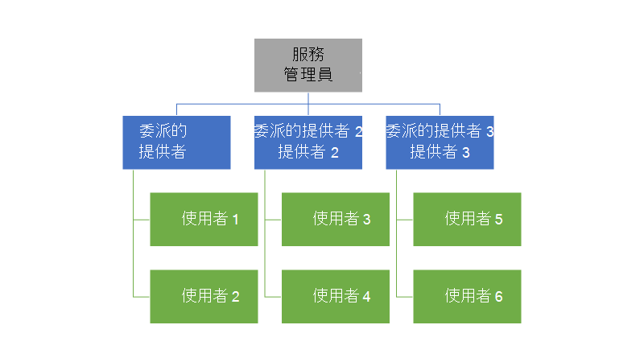
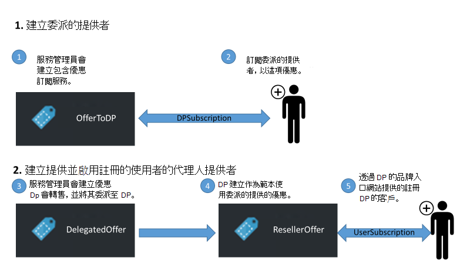
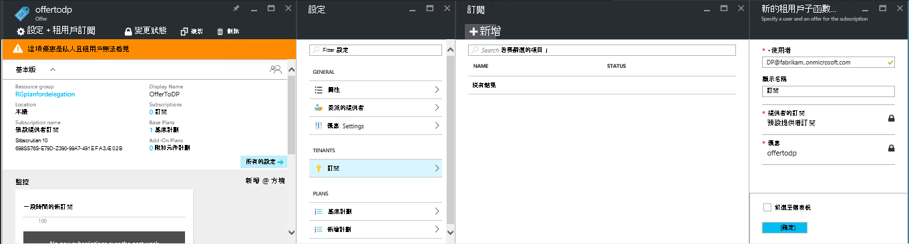
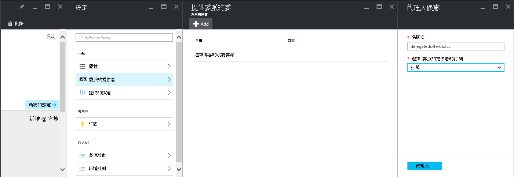
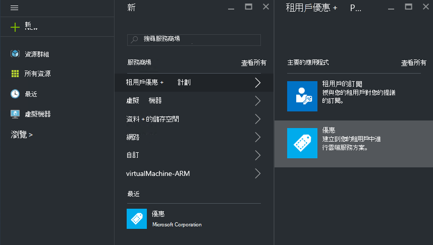
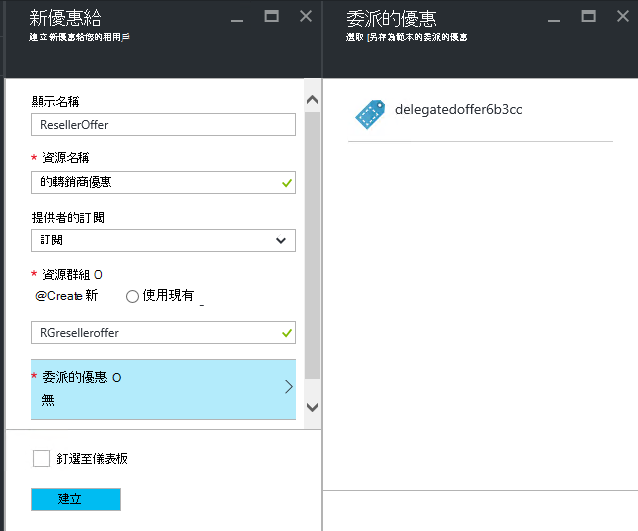
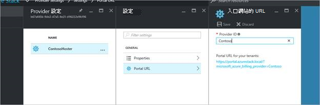
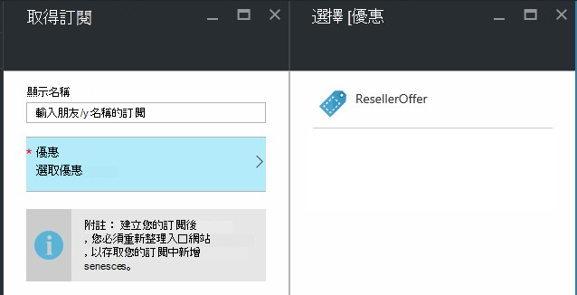

<properties
    pageTitle="委派 Azure 堆疊的優惠 |Microsoft Azure"
    description="瞭解如何將其他人決定建立優惠和註冊您的使用者。"
    services="azure-stack"
    documentationCenter=""
    authors="AlfredoPizzirani"
    manager="byronr"
    editor=""/>

<tags
    ms.service="azure-stack"
    ms.workload="na"
    ms.tgt_pltfrm="na"
    ms.devlang="na"
    ms.topic="article"
    ms.date="10/07/2016"
    ms.author="alfredop"/>

#委派 Azure 堆疊的優惠

服務管理員，您通常要放置建立優惠和註冊的使用者，讓您決定其他人。 例如，就會發生此如果您是服務提供者，而您想要註冊客戶，並管理您的轉售商。 如果您是中央 IT 群組的一部分，並想部門或子公司使用者不需登入，也可以發生在企業中。

委派可協助您執行這些工作，協助您連絡，並管理超過您都可以直接執行更多使用者。 下圖顯示一個層級的委派，但 Azure 堆疊支援多個層級。 委派的提供者可以在委派給其他提供者，最多五個層級中。

系統管理員可以委派提供建立和使用委派功能的其他使用者的租用戶。

##角色和委派中的步驟

若要瞭解委派，請記住，有三種角色的相關︰

-   **服務管理員**管理 Azure 堆疊基礎結構、 建立可提供的範本，並將其他人，請將其提供給使用者委派。

-   委派的使用者稱為**委派的提供者**。 他們可以屬於其他組織 （例如其他 Azure Active Directory 租用戶中）。

-   **使用者**註冊優惠] 之下，然後使用這些管理他們的工作量、 建立 Vm、 儲存資料等。

下圖所示，有兩個步驟中設定委派。

1.  找出委派的提供者。 藉由訂閱根據計劃包含訂閱服務，提供他們執行此動作。
    這項優惠訂閱的使用者會取得服務系統管理員的功能，包括擴充提供並登入為這些使用者的功能。

2.  委派提供委派的提供者。 這項優惠作為委派的提供者可以提供的範本。 委派的提供者現在能採取優惠、 選擇的名稱 （而不是變更其服務和配額），而其提供給客戶。

若要作為委派的提供者，使用者必須建立關係，主要的提供者。換句話說，需要建立的訂閱。 在這個案例中，此訂閱會識別為簡報提供代表主要提供者的權限的委派提供者。

此關聯建立之後，系統管理員可以委派提供委派的提供者。 委派的提供者現在能採取優惠，將其重新命名 （但不是變更其內容），而提供此客戶。

若要建立委派的提供者，代理人提供的服務，並確認使用者可以註冊其，執行下列各節中的指示進行。

##設定的角色

若要查看公司委派提供者，必須額外的 Azure Active Directory 帳戶以外的服務系統管理員帳戶。 如果沒有的話，建立兩個帳戶。 帳戶可屬於任何 AAD 租用戶。 我們會稱其為委派的提供者 (DP) 與使用者。

| **角色** | **組織的權限** |
| -------------------- | ----------------------- |
|  委派的提供者 | 使用者 |
| 使用者 | 使用者 |

##找出委派的提供者

1.  服務系統管理員身分登入。

2.  建立可讓成為委派的提供者的租用戶優惠。 這需要您建立的計劃，並根據其優惠︰

    。  [建立計劃](azure-stack-create-plan.md)。
        此計劃應該包含訂閱服務。 在本文中，我們會使用稱為 PlanForDelegation 的計劃。

    b。  [建立優惠](azure-stack-create-offer.md)
    根據本方案。 在本文中，我們會使用稱為 OfferToDP 優惠。

    c。  優惠建立完成後，請新增委派的提供者的使用者識別碼為這項優惠的租用戶即可    **訂閱** &gt; **新增** &gt; **新的租用戶訂閱**。

  

> [AZURE.NOTE]為所有 Azure 堆疊優惠，與您有選項製作優惠公用和讓使用者註冊，或將私人且無法管理註冊服務系統管理員。 委派的提供者通常少數而您想要控制獲准進入會議，讓保留這項優惠私人會在大部分情況下進行有意義。

##服務管理員建立委派的優惠

您現在建立您委派的提供者。 下一步是建立計劃和優惠要代理人，並會使用您的客戶。 要客戶能夠看到它，因為委派的提供者將無法變更的計劃和其包含的配額一樣，您應該定義這項優惠。

1.  服務管理員、[建立計劃](azure-stack-create-plan.md)和[提議](azure-stack-create-offer.md)根據它。 在本文中，我們使用稱為 DelegatedOffer 優惠。
> [AZURE.NOTE]這項優惠不需要設為公用。 它可以設為公用如果您選擇，但在大部分情況下，您只想委派的提供者的存取權。 當您委派私人項優惠，如以下步驟所述時，委派的提供者都會有存取權。

2.  委派優惠。 移至 DelegatedOffer，然後在 [設定] 窗格中，按一下 [**委派的提供者** &gt; **新增**。

3.  選取 [委派的提供者的訂閱]，請從下拉式清單方塊，然後按一下 [**代理人**]。

> 

##委派的提供者特有優惠

委派的提供者的身分登入，並建立新優惠給使用委派的優惠另存為範本。

1.  按一下 [**新** &gt; **租用戶提供 + 方案** &gt; **提供**。

    

2.  指定優惠名稱。 我們在這裡選擇 ResellerOffer。 選取 [委派的優惠為基礎，然後按一下 [**建立**]。
    
    

    >[AZURE.NOTE] 請注意相較於提供建立為服務管理員經驗豐富的差異。 委派的提供者不建構基準計劃和附加元件方案; 優惠她只能從優惠的委派，選擇，將會對其進行變更。

3. 按一下 [**瀏覽**公開優惠&gt;**提供**，選取提供的服務，然後按一下 [**變更狀態**。

4. 委派的提供者公開這些透過他或她自己入口網站提供 URL。 請注意，下列優惠可見僅透過此委派入口網站。 若要尋找及變更此 URL:

    。  按一下 [**瀏覽**&gt; **提供者設定** &gt; **入口網站的 URL**。

    b。  如有需要，請變更 [提供者 ID。

    c。  複製入口網站的 URL 以不同的位置，「 記事本 」 等。

    
<!-- -->
您現在已完成的委派優惠建立做為委派的提供者。 登出做為委派的提供者。 關閉您使用的瀏覽器索引標籤。

##註冊優惠

1.  在新的瀏覽器視窗中，移至委派的入口網站 URL 您儲存在上一個步驟。 使用者身分登入入口網站。 注意︰ 您必須使用這個步驟委派入口網站。 委派的優惠不會看到否則。

2.  在儀表板中，按一下 [**取得訂閱**。 您會看到使用者呈現僅由委派的提供者建立委派的優惠︰

> 

這會結束提供委派的程序。 使用者可以立即註冊這項優惠，取得訂閱。

##多層委派

多層委派 」 能讓委派與其他實體提供委派的提供者。 這個選項可讓，例如，更深入的轉銷商頻道管理 Azure 堆疊的提供者將委派經銷商，依序將委派給轉售商提供的優惠方案的建立。
Azure 堆疊支援最多五個層級的委派。

若要建立提供委派的多個層級，委派的提供者會依序將優惠委派至下一個提供者。 程序也適用於委派的提供者是在服務的系統管理員 （請參閱[服務管理員所建立的委派的提供](#service-admin-creates-the-delegated-offer)）。

##後續步驟
[佈建 VM](azure-stack-provision-vm.md)
