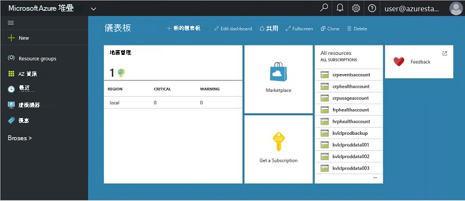
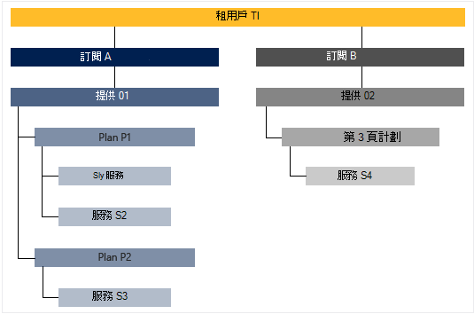

<properties
    pageTitle="主要功能和 Azure 堆疊的概念 |Microsoft Azure"
    description="瞭解主要功能和 Azure 堆疊的概念。"
    services="azure-stack"
    documentationCenter=""
    authors="Heathl17"
    manager="byronr"
    editor=""/>

<tags
    ms.service="azure-stack"
    ms.workload="na"
    ms.tgt_pltfrm="na"
    ms.devlang="na"
    ms.topic="article"
    ms.date="10/25/2016"
    ms.author="helaw"/>

# 重要功能和 Azure 堆疊的概念

如果您是 Microsoft Azure 堆疊的新手，這些條款與功能描述可能會很有幫助。

## 角色

有兩種 Microsoft Azure 堆疊、 服務管理員和 （客戶） 的租用戶的使用者。

-  **服務管理員**可以設定及管理資源提供者、 租用戶優惠、 計劃、 服務、 配額、 和價格。
-  **租用戶**擷取 （或購買） 服務系統管理員所提供的服務。 租用戶可以佈建、 監控及管理其已經訂閱，例如 Web 應用程式、 儲存及虛擬機器的服務。

## 入口網站

與 Microsoft Azure 堆疊互動的主要的方法是入口網站與 PowerShell。

Microsoft Azure 堆疊入口網站是在您的伺服器上執行 [Azure 入口網站的執行個體。 它是與資源和雲端容量、 啟用快速應用程式與服務開發及部署的角色型存取控制 (RBAC) 提供自助體驗服務系統管理員] 與 [租用戶的網站。

## 區域、 服務、 計劃、 方案及訂閱

Azure 堆疊的服務將傳送至 [使用地區、 訂閱、 方案及計劃的租用戶。 多個優惠訂閱租用戶。 優惠可以有一或多個計劃，而方案可以有一或多個服務。

範例階層的提議，各有不同的租用戶的訂閱方案和服務。

### 區域
Azure 堆疊區域的小數位數] 和 [管理的基本項目。  每個區域中，組織可能有與資源的多個區域。  地區也可能有可用的不同的服務方案。

### 服務

Microsoft Azure 堆疊可提供者提供各種不同的服務與應用程式，例如虛擬機器、 SQL Server 資料庫、 SharePoint、 Exchange 及更多。

### 計劃

計劃是一或多個服務的群組。 為提供者，您可以建立要提供給您的租用戶的方案。 接著，您的租用戶訂閱您使用的計劃和其包含的服務提供。

您可以設定計劃新增每個服務配額設定，協助您管理您的雲端容量。 配額包括例如 VM、 RAM 和 CPU 限制的限制，以及每個使用者訂閱就會套用。 位置可區分配額。 比方說，包含計算區域的服務方案可能會有兩個虛擬機器、 4 GB 的 RAM，和 10 CPU 核心的配額。

當您在撰寫提議，服務系統管理員可以包含**基準計劃**。 租用戶而定的優惠時，預設會包含這些基本的計劃。 當使用者而定，訂閱會建立使用者擁有的存取權 （含對應的配額） 基準計劃中所指定的所有資源提供者。

服務管理員也可以包含**附加元件計劃**中提供。 根據預設，訂閱中不包含附加元件方案。 附加元件計劃是其他方案 （配額） 用於訂閱的擁有者可以新增至他們的訂閱優惠。

### 優惠

優惠是群組的一或多個提供者展示到租用戶購買的方案 （訂閱）。 例如，提供 Alpha 可以包含 （從包含一組計算服務區域 1) 的計劃 A 和 B 計劃 （從包含一組儲存和網路服務的地區 2)。

優惠隨附一組的基準計劃，並服務系統管理員可以建立的租用戶可以新增至其訂閱附加元件方案。

### 訂閱

訂閱是租用戶購買您提供的方式。 訂閱是提議的租用戶的組合。 租用戶可以有多個優惠的訂閱。 只有一個提供適用於每個訂閱。 租用戶的訂閱會決定其存取計劃/服務。

訂閱協助組織存取和使用雲端資源及服務提供者。

## Azure 資源管理員

藉由使用 Azure 資源管理員，您可以使用您的基礎結構資源以範本為基礎、 宣告式模型中。   會提供單一的介面，您可以使用部署、 管理及監控您的方案元件，例如虛擬機器、 儲存帳戶、 web 應用程式，以及資料庫。 如需完整的資訊與指引，請參閱[Azure 資源管理員的概觀](../azure-resource-manager/resource-group-overview.md)。

### 資源群組

資源群組是資源、 服務與應用程式的集合，且每個資源類型，例如虛擬機器、 虛擬網路、 公用 IPs、 儲存帳戶及網站。 每個必須資源的 [資源] 群組中，因此資源群組邏輯協助組織資源，例如工作量或位置。

以下是定義資源群組時，請考慮的一些重要事項︰

-   每個資源只能存在於某個資源] 群組中。

-   部署、 更新和刪除資源群組中的項目在一起。 如果某個資源，例如 [資料庫伺服器，必須在不同的部署循環存在於，應該會在另一個資源群組。

-   您可以新增或移除任何時間資源群組中的資源。

-   您可以資源從某個資源群組移到另一個群組。

-   資源群組可以包含位於不同區域的資源。

-   資源群組可用來設定存取控制系統管理動作的列印範圍。

-   資源可以連結至另一個資源群組中的資源，當兩個資源必須彼此互動，但不是會共用相同的生命週期。 例如，多個應用程式必須連線至資料庫，但該資料庫不會更新或刪除應用程式為相同的速度。

-   Microsoft Azure 堆疊的資源，例如計劃和提供您也可管理資源] 群組中。

-   您可以重新部署資源群組。  這是測試或開發用途有用。  

### Azure 資源管理員範本

使用 Azure 資源管理員中，您可以建立簡單範本 （使用 JSON 格式），以定義部署及應用程式的設定。 此範本稱為 Azure 資源管理員範本，並提供用宣告方式定義部署。 使用範本，您可以重複部署整個應用程式生命週期應用程式並部署資源一致的信賴度。

## 資源提供者 （每秒要求數量），網路資源點數，計算資源點數儲存資源點數

資源提供者是針對所有 Azure 基礎 IaaS 表單為基礎的 web 服務及 PaaS 服務。 Azure 資源管理員必須使用不同的每秒提供存取主服務要求數量。

有三個主要的每秒要求數量︰ 網路、 儲存及計算。 每個這些每秒要求數量可協助您設定，並控制其個別的資源。 服務管理員也可以新增新的自訂資源提供者。

### 計算資源點數

計算資源提供者 (CRP) 可讓您建立自己的虛擬機器 Azure 堆疊租用戶。 同時也會提供服務的系統管理員可以安裝並設定租用戶的資源提供者的功能。 CRP 包含建立虛擬機器，以及虛擬機器副檔名的能力。 虛擬機器副檔名服務可協助提供的 Windows 和 Linux 虛擬機器 IaaS 功能。

### 網路資源點數

網路資源提供者 (NRP) 提供一系列的私人雲端軟體定義網路 (SDN) 和網路函數虛擬化 (NFV) 的功能。 這些功能可與 Azure 公用雲端一致，以便可以一次撰寫並部署中的 Azure 公用雲端或內部部署 Microsoft Azure 堆疊應用程式範本。 網路資源點數可讓您微調網路控制、 中繼資料標籤，更快速地設定、 快速且可重複自訂及多個控制項介面 （包括 PowerShell、.NET SDK、 Node.JS SDK 其餘為基礎的 API）。 若要建立軟體負載平衡器、 公用 IPs，網路安全性群組，還有其他的虛擬網路，您可以使用 NRP。

### 儲存資源點數

儲存資源點數傳遞四個 Azure 一致的儲存空間服務︰ blob、 表格、 佇列中，與帳戶管理。 它也會提供儲存雲端管理服務，以促進 Azure 一致的儲存空間服務的服務提供者管理。 Azure 儲存體提供儲存和擷取大量的非結構化資料，例如文件和 Azure blob 的媒體檔案的彈性而結構化的 NoSQL Azure 資料表的資料。 如需有關 Azure 儲存體的詳細資訊，請參閱[簡介 Microsoft Azure 儲存體](../storage/storage-introduction.md)。

#### Blob 儲存體

Blob 儲存體儲存任何資料集。 Blob 可以是任何類型的文字或二進位資料，例如文件、 媒體檔案或應用程式安裝程式。 資料表儲存體儲存結構化資料集。 資料表儲存體是 NoSQL 鍵屬性的資料存放區，可快速開發及快速存取大量資料。 佇列中的儲存空間提供可靠的訊息的工作流程處理和雲端服務的元件之間的通訊。

每個 blob 的組織在容器。 容器也會提供有用的方式來指派給群組物件的安全性原則。 儲存帳戶最多可以包含任何數目的容器，然後容器可以包含的儲存空間帳戶的 500 TB 容量限制二進位大型物件的任何數字。 Blob 儲存體提供三種類型的二進位大型物件、 封鎖二進位大型物件、 新增二進位大型物件，然後頁面二進位大型物件 （磁碟）。 封鎖 blob 適用於串流和儲存雲端的物件，且儲存的文件、 媒體檔案備份等不錯的選擇。附加 blob 區塊 blob 類似，但適用於附加作業。 新增 blob 都可以更新只能由結尾加入新的區塊。 附加 blob 的記錄，新的資料必須只寫入 blob 的結束位置，例如案例不錯的選擇。 頁面 blob 適用於代表 IaaS 磁碟並支援隨機寫入，可能是 1 TB 的大小。 Azure 虛擬機器網路附加的 IaaS 磁碟是儲存為網頁 blob VHD。

#### 資料表儲存體

資料表儲存體是 Microsoft 的 NoSQL 主要/屬性存放區 – 有不結構描述，讓您與傳統的關聯式資料庫設計。 資料會將儲存缺少結構描述，因此您可以輕鬆為您的應用程式 evolve 的需求，調整您的資料。 資料表儲存體是易於使用，開發人員可以快速建立應用程式。 資料表儲存體是主要屬性存放區，表示資料表中的每個值儲存為輸入的屬性名稱。 屬性名稱可以用於篩選和指定選取準則。 屬性和其值的集合組成的實體。 表格儲存空間不足的結構描述、 自之相同資料表中的兩個實體最多可以包含不同集合的內容，而這些屬性可為不同類型。 您可以使用資料表儲存體儲存彈性的資料集，例如使用者資料的 web 應用程式、 通訊錄、 裝置的詳細資訊及其他任何類型的中繼資料，您的服務要求。 您可以儲存任何數目的項目在資料表中，並且儲存帳戶可能包含表格的儲存空間帳戶的容量限制的任何數字。

#### 佇列中的儲存空間
Azure 佇列中的儲存空間提供訊息應用程式元件間的雲端。 在設計應用程式的小數位數，應用程式元件是通常分離，讓他們可以不按比例縮放獨立。 佇列中的儲存空間提供非同步訊息應用程式元件之間的通訊是否在雲端，在桌面上，在內部部署伺服器上，或在行動裝置上執行。 佇列中的儲存空間也支援管理非同步工作，以及建立程序的工作流程。

## 角色存取控制 (RBAC)

您可以使用 RBAC 来指派這些角色訂閱、 資源群組或個別的資源層級來授予存取系統授權的使用者、 群組和服務。 每個角色定義的使用者、 群組或服務的高於 Microsoft Azure 堆疊資源的存取層級。

Azure RBAC 有三個基本的角色適用於所有的資源類型︰ 擁有者、 參與者及閱讀程式。 擁有完整存取所有的資源，包括委派給其他人的存取權限的權限。 參與者可以建立及管理 Azure 資源的所有類型，但無法授與其他人的存取權。 閱讀程式僅可檢視現有的 Azure 資源。 Azure RBAC 角色的其餘部分允許特定的 Azure 資源管理。 例如的虛擬機器參與者角色允許建立與管理虛擬機器，但不允許虛擬網路或虛擬機器連線到子網路的管理。

## 使用資料

Microsoft Azure 堆疊收集並過所有資源提供者提供精簡的報表，每個使用者會使用資料彙總。 資料可與使用的資源 count 不同，以簡單或複雜個別的效能和小數位數計數器。 透過 REST API 使用資料。 有 Azure 一致的租用戶 API，以及提供者，並委派的提供者 Api 取得使用情況資料所有租用戶訂閱。 此資料可用來整合外部工具或帳單或 chargeback 的服務。

## 後續步驟

[部署 Azure 堆疊 Technical Preview 2 (POC)](azure-stack-deploy.md)
