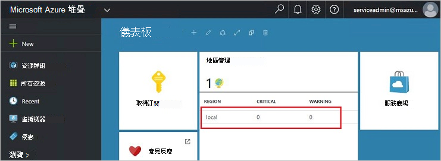
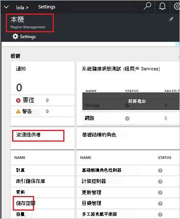
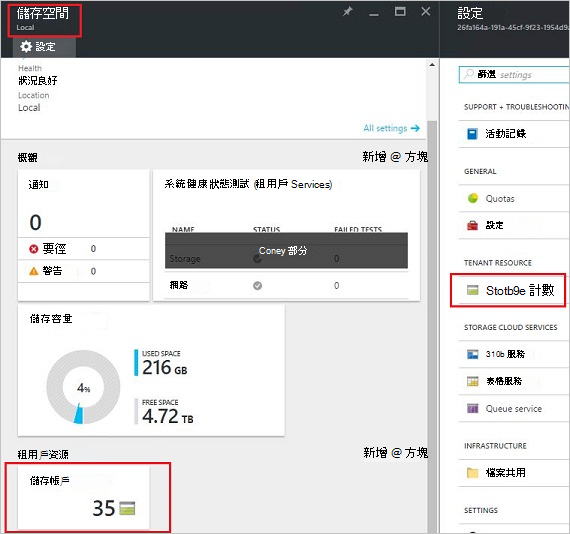
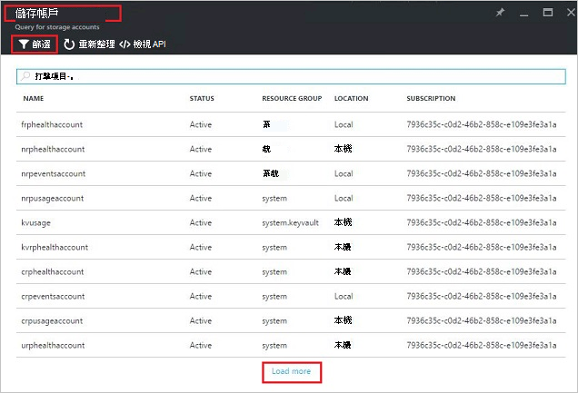
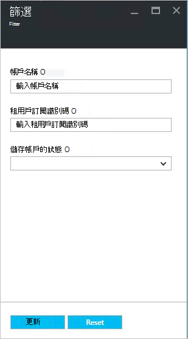
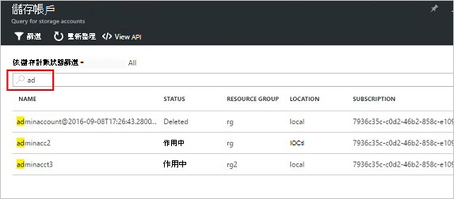
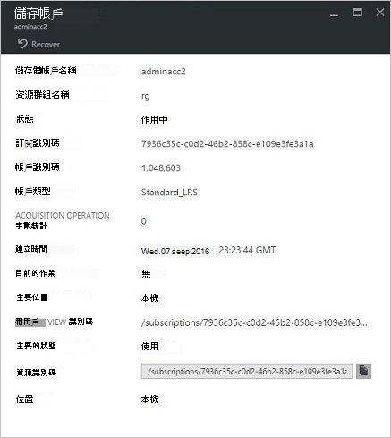
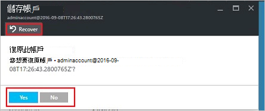
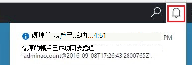
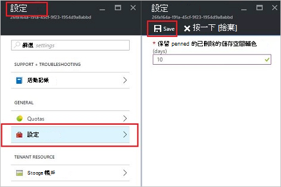

<properties
    pageTitle="管理 Azure 堆疊儲存帳戶 |Microsoft Azure"
    description="了解如何尋找、 管理、 復原和回收 Azure 堆疊儲存帳戶"
    services="azure-stack"
    documentationCenter=""
    authors="AniAnirudh"
    manager="darmour"
    editor=""/>

<tags
    ms.service="azure-stack"
    ms.workload="na"
    ms.tgt_pltfrm="na"
    ms.devlang="na"
    ms.topic="get-started-article"
    ms.date="09/26/2016"
    ms.author="anirudha"/>

# <a name="manage-storage-accounts-in-azure-stack"></a>管理 Azure 堆疊中的儲存空間帳戶

瞭解如何管理儲存空間中尋找、 復原，並回收根據業務需求的儲存空間容量 Azure 堆疊的帳戶。

## <a name="find-a-storage-account"></a>尋找儲存的帳戶

Azure 堆疊方式可檢視的區域中的儲存空間帳戶清單︰

1.  網際網路瀏覽器中瀏覽至[https://portal.azurestack.local](https://portal.azurestack.local/)。

2.  （使用您在部署期間所提供的認證） 以系統管理員身分登入 Azure 堆疊入口網站

3.  在預設儀表板-上尋找 [**地區管理**清單，然後按一下您想要探索 – 例如區域上**(本機**)。

    

4.  從**資源提供者**] 清單中選取 [**儲存**]。

    

5.  現在，儲存資源提供者管理刀 – 上向下捲動 」 儲存帳戶 」] 索引標籤並按一下它。

    
    
    [結果] 頁面會儲存在該區域的帳戶清單。

    

根據預設，會顯示前 10 個帳戶。 您可以選擇以擷取更多按一下清單底部的 「 載入更多] 連結 <br>
OR <br>
如果您想要特定的儲存空間帳戶 – 您可以**篩選並擷取相關帳戶**只。<br>

若要篩選的帳戶︰

1. 按一下頂端的刀 [篩選] 按鈕。

2. 在篩選刀，其可讓您指定 ****帳戶名稱**、 訂閱 ID**或**狀態**微調的儲存空間帳戶清單會顯示。 視需要使用它們。

3. 按一下 [更新]。 應該會相應地重新整理清單。

    

4. 若要重設篩選-按一下 [篩選] 按鈕，清除選取項目並更新。

[搜尋文字] 方塊上方的儲存空間的帳戶清單刀，可讓您的帳戶清單中選取的文字反白顯示。 完整名稱或識別碼無法輕易地使用時，這是很好用的大小寫。<br>
您可以使用免費的文字來協助尋找您感興趣的帳戶。




## <a name="look-at-account-details"></a>看看帳戶詳細資料

一旦您找到想要檢視的帳戶，您可以按一下特定的帳戶，以檢視特定詳細資料。 新的刀隨即會開啟為帳戶詳細資料，例如帳戶建立時間、 位置等的類型。




## <a name="recover-a-deleted-account"></a>復原刪除的帳戶

您可能會在您想要復原已刪除的帳戶的情況下。<br>
在 AzureStack 沒有非常簡單的方法。

1.  請瀏覽至儲存的帳戶清單。 [請參閱尋找儲存的帳戶](#find-a-storage-account)

2.  在清單中，找出該特定的帳戶。 您可能需要篩選。

3.  檢查 「 狀態 」 的帳戶。 會顯示 「 刪除 」。

4.  按一下 [開啟帳戶詳細資料刀的帳戶。

5.  此刀 – 上方找出 [復原] 按鈕，然後按一下。

6.  按下 「 」 來確認

    

7.  復原現在...程序中等待已順利完成的指示。
    您也可以按一下頂端的入口網站檢視進度指示"bell"圖示上。

    

  一旦復原的帳戶已成功同步處理，其中一個可以回到使用。

### <a name="some-gotchas"></a>某些陷阱

- 您已刪除的帳戶會顯示狀態為 「 不在保留 」。

  這代表已刪除的帳戶已超過保留期限，以及可能無法復原了。

- 在 [帳戶] 清單中未顯示您已刪除的帳戶。

  這表示已刪除的帳戶已回收。 在此情況下將無法復原了。 下面，請參閱 「 回收容量 」。

## <a name="set-retention-period"></a>設定保留期間

保留期限設定可讓系統管理員 （0 到 9999 天） 之間的天數的任何已刪除的帳戶可能復原中指定的時間範圍。 預設的保留期限會設定為 15 天。 將值設定為 「 0 」 所代表的意義立即不保留在任何已刪除的帳戶，並已標示為定期回收。

若要變更保留期限 –

1.  網際網路瀏覽器中瀏覽至[https://portal.azurestack.local](https://portal.azurestack.local/)。

2.  （使用您在部署期間所提供的認證） 以系統管理員身分登入 Azure 堆疊入口網站

3.  在預設儀表板-上尋找 [**地區管理**清單，然後按一下您想要探索 – 例如區域上**(本機**)。

4.  從**資源提供者**] 清單中選取 [**儲存**]。

5.  按一下以開啟 [設定刀頂端的 [設定] 圖示。

6.  按一下 [設定-保留期限。

7.  您可以編輯的值，並將其儲存。

 此值將會立即生效，並會反映您整個區域。



## <a name="reclaim-capacity"></a>回收容量

側邊無法在保留期間內的內容之一是效果的已刪除的帳戶會繼續保留期限出之前，請使用容量。 現在身為管理員，您可能需要回收此方式刪除帳戶空間即使保留期限尚未過期。 目前您可以使用命令行明確覆寫保留期限，並立即回收容量。 若要執行這項操作︰

1.  假設您有 PowerShell 的 Azure 安裝和設定。 如果不是請遵循以下指示︰ 若要安裝最新版的 PowerShell 的 Azure 關聯 Azure 訂閱，請參閱[如何安裝和設定 PowerShell 的 Azure](http://azure.microsoft.com/documentation/articles/powershell-install-configure/)。
    如需有關 Azure 資源管理員 cmdlet 的詳細資訊，請參閱[使用 PowerShell 的 Azure 與 Azure 資源管理員](http://go.microsoft.com/fwlink/?LinkId=394767)

2.  執行此 cmdlet:

    ```
    PS C:\\>; Clear-ACSStorageAccount -ResourceGroupName system
    -FarmName <your farmname>
    ```

> 如需詳細資訊，請參閱[AzureStack powershell 文件](https://msdn.microsoft.com/library/mt637964.aspx)

> [AZURE.NOTE] 執行這個指令程式會永久刪除帳戶，其內容。 它就不會出現可復原。 謹慎使用。

