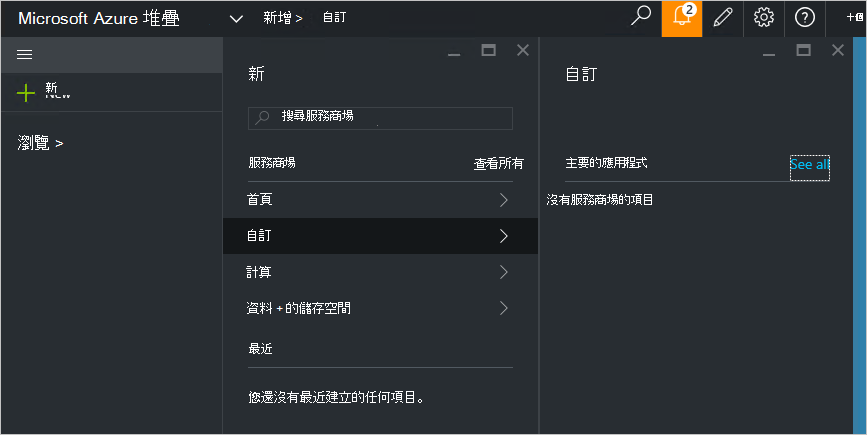

<properties
    pageTitle="Azure 堆疊 （服務系統管理員） 的發佈的自訂服務商場項目 |Microsoft Azure"
    description="服務管理員，瞭解如何將 Azure 堆疊的發佈的自訂服務商場項目。"
    services="azure-stack"
    documentationCenter=""
    authors="rupisure"
    manager="byronr"
    editor=""/>

<tags
    ms.service="azure-stack"
    ms.workload="na"
    ms.tgt_pltfrm="na"
    ms.devlang="na"
    ms.topic="article"
    ms.date="09/26/2016"
    ms.author="rupisure"/>

# 堆疊 Azure Marketplace

服務商場是自訂的 Azure 堆疊等服務應用程式與資源的項目集合。 它是租用戶來源建立新的資源，及部署新的應用程式的位置。 服務管理員可新增的服務商場和租用戶的自訂項目會立即看到。

若要開啟的 Marketplace，按一下 [**新增**]。

服務商場會更新每隔五分鐘。

## 服務商場的項目

具有每個服務商場項目︰

-   資源佈建 Azure 資源管理員範本

-   中繼資料，例如字串、 圖示和其他行銷資料

-   若要顯示在入口網站中的項目格式設定的資訊

發佈服務商場至每個項目所用的格式，稱為 Azure 庫套件 (azpkg)。 部署或執行階段的資源 （例如軟體或虛擬機器圖像的 zip 檔案的程式碼） 應會新增至 Azure 堆疊分別不屬於服務商場項目。 

## 後續步驟

[建立及發佈服務商場項目](azure-stack-create-and-publish-marketplace-item.md)
