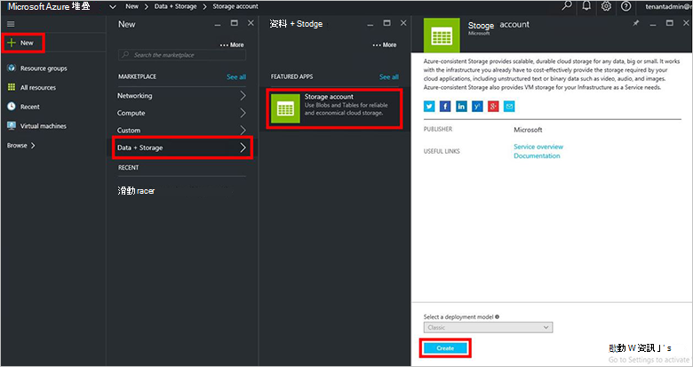
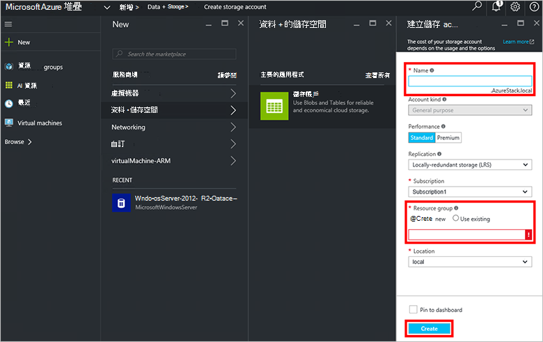
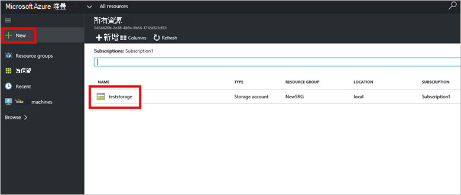

<properties
    pageTitle="Azure 堆疊中的儲存空間帳戶 |Microsoft Azure"
    description="瞭解如何建立 Azure 堆疊儲存帳戶。"
    services="azure-stack"
    documentationCenter=""
    authors="ErikjeMS"
    manager="byronr"
    editor=""/>

<tags
    ms.service="azure-stack"
    ms.workload="na"
    ms.tgt_pltfrm="na"
    ms.devlang="na"
    ms.topic="get-started-article"
    ms.date="09/26/2016"
    ms.author="erikje"/>

# Azure 堆疊中的儲存空間帳戶

儲存帳戶包含 Blob 和資料表服務及您儲存資料物件的唯一命名空間。 根據預設，您的帳戶中的資料時，才可使用您儲存帳戶擁有者。

1.  Azure 堆疊 POC 電腦上，登入`https://portal.azurestack.local`身[為管理員](azure-stack-connect-azure-stack.md#log-in-as-a-service-administrator)，然後按一下 [**新增** > **資料 + 的儲存空間** > **儲存的帳戶**。

    

2.  在**建立儲存帳戶**刀中，輸入您儲存帳戶的名稱。 建立新的**資源群組**，或選取現有的項目，然後按一下 [**建立**]，以建立儲存帳戶。

    

3. 若要查看您的新儲存帳戶，按一下 [**所有資源**]，然後搜尋的儲存空間帳戶並按一下其名稱。

    
    
## 後續步驟

[使用 Azure 資源管理員範本](azure-stack-arm-templates.md)

[深入了解 Azure 儲存體帳戶](../storage/storage-create-storage-account.md)

[下載 Azure 堆疊 Azure 一致的儲存空間驗證指南](http://aka.ms/azurestacktp1doc)
