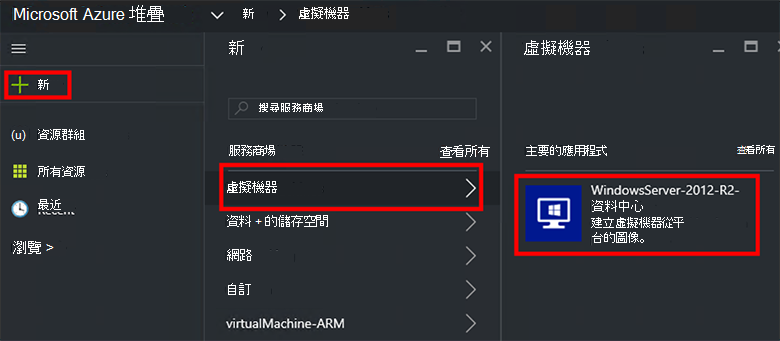
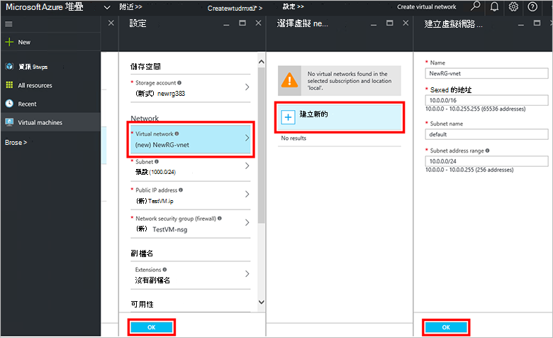
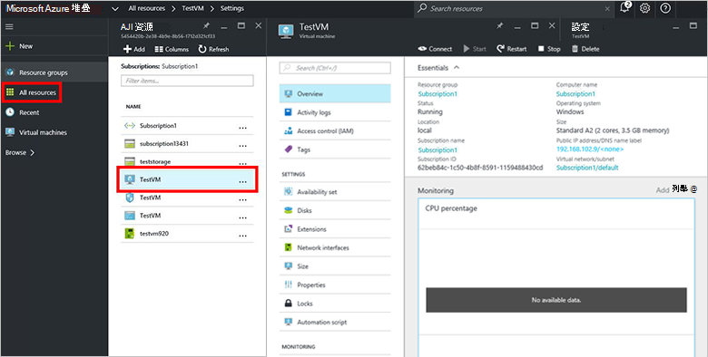

<properties
    pageTitle="佈建 Azure 堆疊 （租用戶） 的 VM |Microsoft Azure"
    description="為租用戶，瞭解如何佈建 VM Azure 堆疊中。"
    services="azure-stack"
    documentationCenter=""
    authors="ErikjeMS"
    manager="byronr"
    editor=""/>

<tags
    ms.service="azure-stack"
    ms.workload="na"
    ms.tgt_pltfrm="na"
    ms.devlang="na"
    ms.topic="get-started-article"
    ms.date="10/12/2016"
    ms.author="erikje"/>

# 佈建虛擬機器

身為管理員，您可以建立虛擬機器評估資源之前提供這些方案的項目。

## 佈建虛擬機器

1.  Azure 堆疊 POC 電腦上，登入`https://portal.azurestack.local`身[為管理員](azure-stack-connect-azure-stack.md#log-in-as-a-service-administrator)，然後按一下 [**新增** > **虛擬機器** > **WindowsServer 2012 R2-中心**。  

    

2.  在**基本概念**刀中，輸入**名稱**、**使用者名稱**和**密碼**。 **VM 磁碟類型**，選擇 [ **HDD**]。 選擇 [**訂閱**]。 建立**資源群組**，或選取現有的項目，然後按一下**[確定]**。  

3.  在**選擇大小**刀中，按一下**A1 基本**，然後按一下 [**選取**。  

4.  在**設定**刀中，按一下 [**虛擬網路**。 在 [**選擇虛擬網路**刀中，按一下 [**建立新**。 在**建立虛擬網路**刀，接受預設值，然後按一下**[確定]**。 在**設定**刀中，按一下**[確定]**。

    

5.  在**摘要**刀中，按一下**[確定**] 以建立虛擬機器。  

6. 若要查看新的虛擬機器中，按一下 [**所有資源**]，然後搜尋虛擬機器並按一下其名稱。

    

## 後續步驟

[儲存帳戶](azure-stack-provision-storage-account.md)
