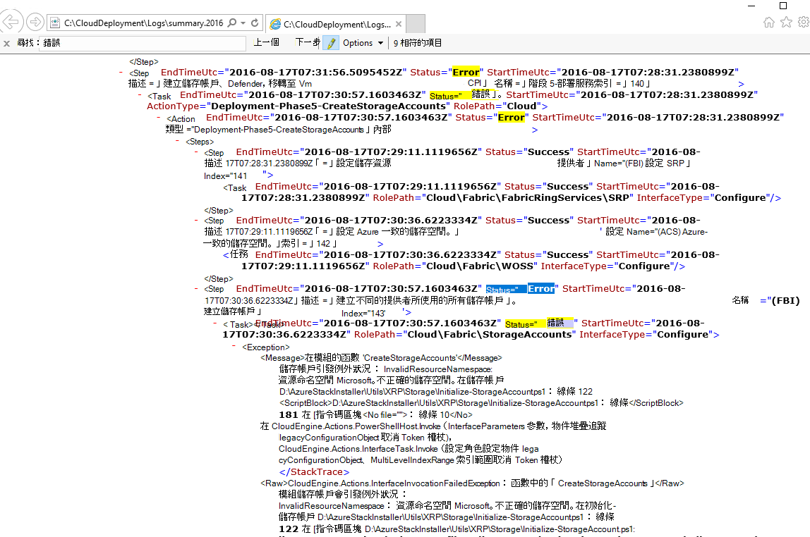
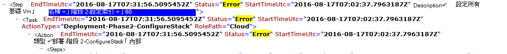

<properties
    pageTitle="重新執行失敗的步驟部署 |Microsoft Azure"
    description="如果您是部署期間發生錯誤，您可以嘗試下列步驟，以重新執行部署失敗的地方。"
    services="azure-stack"
    documentationCenter=""
    authors="ErikjeMS"
    manager="byronr"
    editor=""/>

<tags
    ms.service="azure-stack"
    ms.workload="na"
    ms.tgt_pltfrm="na"
    ms.devlang="na"
    ms.topic="get-started-article"
    ms.date="09/26/2016"
    ms.author="erikje"/>
    
# 重新執行部署失敗的步驟
  
如果您是部署期間發生錯誤，您可以嘗試下列步驟，以重新執行部署失敗的地方。

## 尋找失敗

記錄筆記的失敗，特別是在哪些步驟引動的通話的部分失敗。 例如，

**2016-08 17 00:30:57 錯誤 1 > 1 > 巨集指令︰ 引動步驟 60.140.143 失敗。停止的計劃。**

這是您會在此開始重新執行部署的部署步驟。

## 失敗上尋找更多詳細資料

若要在錯誤的更多詳細資料，請找出相關聯**摘要。YYYY-MM-DD.tt.N.log.xml**中 **C:\CloudDeployment\Logs\**資料夾。
搜尋字串 「 錯誤 」，並向下透過輸出鍵，直到您看到大量包含錯誤訊息 （此區段通常會符合 」 的錯誤 」 的字串的最後一個執行個體） 的非 XML 格式化文字。 例如︰

您也可以使用這項資訊來追蹤重新執行的步驟、 待處理的 「 索引 」 數字的最後一個錯誤。 在上方的圖片，您可以看到 （自最下方）︰ 143、 140 及如果向上捲動時，看到 60:

將所有分成一組 （現在從由上而下），您取得 60.140.143，就像 PS 主控台的輸出失敗 （如下所示上方的 「 尋找失敗 」 一節）。

## 重新執行部署在特定的步驟

有部署失敗的步驟之後，您可以嘗試的步驟的部署-重新執行。

> [AZURE.IMPORTANT] 必須執行下列命令，以正確的使用者，在發生失敗的內容。 如果之前已加入網域的主機發生失敗，，執行下列步驟以本機系統管理員帳戶。 如果主機已加入網域後，就會發生失敗，，執行下列步驟網域系統管理員 (azurestack\azurestackadmin)。

### 執行叫用 EceAction 命令

1. 從較高的 PS 主控台，匯入下列模組︰

        Import-Module C:\CloudDeployment\CloudDeployment.psd1 -Force
        Import-Module C:\CloudDeployment\ECEngine\EnterpriseCloudEngine.psd1 -Force 

2. 接著，請執行下列命令 （from above 使用這裡的範例）︰

        Invoke-EceAction -RolePath Cloud -ActionType Deployment -Start 60.140.143 -Verbose

3.  這會啟動的步驟識別部署-開始參數叫用 EceAction] 命令

### 結果的-重新執行/開始

選項無論您選擇，開始部署從指定-啟動參數。

1.  如果可復原失敗，部署會繼續到完成。

2.  如果在一次失敗部署...
    
    - 同一個地方︰ 失敗可能可復原，並不是必要的進一步調查。

    - 之後，這次失敗 」 的新位置︰ 您可以嘗試下列相同的步驟，將進行一次。

    - 新的位置，再失敗這次的地方︰ 其他發生錯誤的冪通話，需要進一步調查。

## 後續步驟

[連線至 Azure 堆疊](azure-stack-connect-azure-stack.md)

