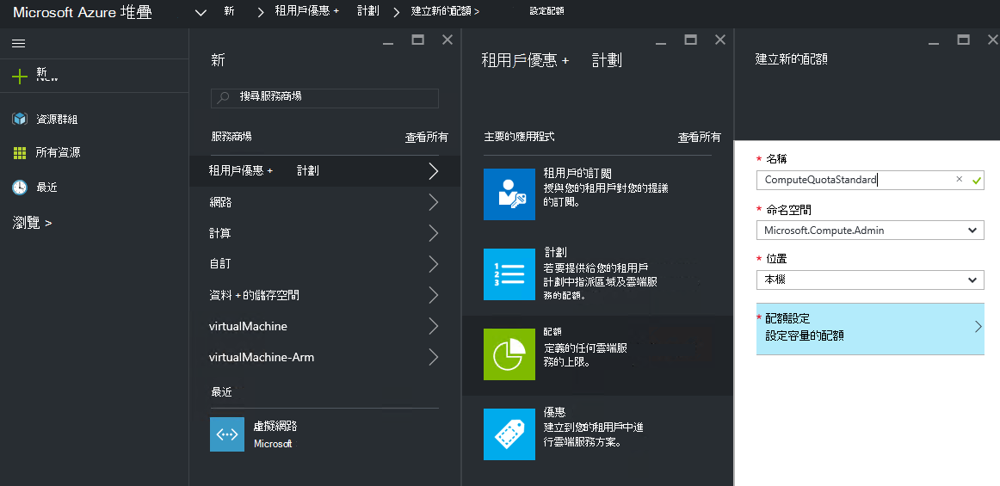
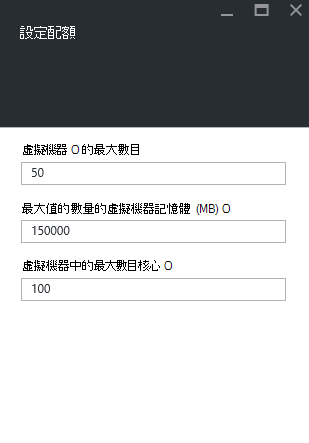

<properties
    pageTitle="Azure 堆疊的配額 |Microsoft Azure"
    description="系統管理員設定來限制的最大的租用戶有權存取的資源量配額。"
    services="azure-stack"
    documentationCenter=""
    authors="mattmcg"
    manager="byronr"
    editor=""/>

<tags
    ms.service="azure-stack"
    ms.workload="na"
    ms.tgt_pltfrm="na"
    ms.devlang="na"
    ms.topic="get-started-article"
    ms.date="09/26/2016"
    ms.author="mattmcg"/>

# Azure 堆疊中設定配額

配額定義資源可以佈建租用戶訂閱，或使用的限制。 例如，配額可能允許建立最多五個 Vm 租用戶。 若要新增的服務方案，管理員必須設定該服務的配額設定。

配額可設定每個服務和每個位置，讓系統管理員提供細微控制資源耗用的。 系統管理員可以建立一或多個配額資源，並產生關聯方案，這表示它們可以提供其服務差異的方案。 指定的服務的配額可以從該服務的**資源提供者**管理刀建立。

租用戶包含多個方案優惠而定，可以使用所提供的每個計劃的所有資源。

## 若要建立 IaaS 配額

1.  在瀏覽器中，移至[https://portal.azurestack.local](https://portal.azurestack.local/)。

    登入 Azure 堆疊入口網站以系統管理員身分 （藉由使用您在部署期間所提供的認證）。

2.  選取 [**新增**]，然後選取 [**配額**。

3.  選取您要建立的配額的第一個服務。 針對 IaaS 配額] 中，執行下列步驟計算、 網路和儲存的服務。
在此範例中，我們要先建立計算服務的配額。 在 [**命名空間**] 清單中，選取**Microsoft.Compute.Admin**命名空間。

    > 

4.  選擇位置 （例如，「 區域 」） 定義配額的位置。

5.  在 [**配額設定**項目，顯示 [**設定配額的容量**。 按一下 [設定配額設定此項目]。

6.  在**設定的配額**刀中，您會看到您可以設定限制的所有計算資源。 每個類型有預設值與其相關聯。 您可以變更這些值，或者您可以選取接受預設值刀底部的 [**確定**] 按鈕。

    > 

7.  您已設定值，並按一下 [**確定]**之後，**配額設定**項目會顯示為 [**已設定**中。 按一下 [**確定]**以建立**配額**資源]。

    您應該會看到通知，指出正在建立配額資源。

8.   配額設定已成功建立之後，您會收到第二個通知。 計算服務配額現在已準備好計劃相關聯的。 重複上述步驟與網路和儲存的服務，您已準備好建立 IaaS 計劃 ！

    >   

## 計算配額類型

|**類型**                    |**預設值**| **描述**|
|--------------------------- | ------------------------------------|------------------------------------------------------------------|
|虛擬機器中的最大數目   |50|在這個位置可以建立訂閱的虛擬機器數目上限。 |
|虛擬機器核心的最大數目              |100|訂閱可以建立在這個位置的核心的最大的數字 （例如，A3 VM 有四個核心）。|
|最大虛擬機器的記憶體 (GB) 的數量         |150|可以佈建後 mb 的 RAM 的最大量 （例如，A1 VM 使用 1.75 GB 的 RAM）。|

> [AZURE.NOTE] 計算此 technical preview 中未限制配額。

## 儲存配額類型

|**項目**                           |**預設值**   |**描述**|
|---------------------------------- |------------------- |-----------------------------------------------------------|
|最大容量 (GB)              |500                 |可以使用這個位置訂閱的總儲存空間容量。|
|儲存帳戶的總數   |20                  |在這個位置可以建立訂閱的儲存空間帳戶的數目上限。|

## 網路配額類型

|**項目**                                                   |**預設值**   |**描述**|
|----------------------------------------------------------| ------------------- |--------------------------------------------------------------------------------------------------------------------------------------------------------------------|
| 最大值的公用 Ip                         |50                  |在這個位置可以建立訂閱的公用 Ip 的數目上限。 |
| 最大虛擬網路                   |50                  |在這個位置可以建立訂閱的虛擬網路的數目上限。 |
| 最大虛擬網路閘道器           |1                   |虛擬網路閘道器 （VPN 閘道） 訂閱可以建立在這個位置的最大數目。 |
| 最大值網路連線                |2                   |訂閱可以建立在這個位置中的所有虛擬網路閘道間的網路連線 （點對點或網站的網站） 的數目上限。 |
| 最大值負載平衡器                     |50                  |在這個位置可以建立訂閱的負載平衡器數目上限。 |
| 最大值 Nic                               |100                 |網路介面訂閱可以建立在這個位置的最大數目。 |
| 最大值網路安全性群組            |50                  |網路訂閱可以在這個位置建立安全性群組的數目上限。 |
