<properties
    pageTitle="部署的 SQL Server 資源的提供者上 Azure 堆疊 |Microsoft Azure"
    description="若要部署的 SQL Server 資源提供者上介面卡 Azure 堆疊的詳細的步驟。"
    services="azure-stack"
    documentationCenter=""
    authors="Dumagar"
    manager="byronr"
    editor=""/>

<tags
    ms.service="multiple"
    ms.workload="na"
    ms.tgt_pltfrm="na"
    ms.devlang="na"
    ms.topic="article"
    ms.date="09/26/2016"
    ms.author="dumagar"/>

# 部署的 SQL Server 資源提供者介面卡 Azure 堆疊上

> [AZURE.NOTE] Azure 堆疊 TP1 部署僅適用於下列資訊。

遵循 SQL Server 資源提供者上的介面卡 Azure 堆疊證明概念 (POC) 上設定的詳細的步驟，使用這份文件。 請參閱瞭解資源提供者功能，以及架構的 [[使用 SQL Azure 堆疊的資料庫](azure-stack-sql-rp-deploy-short.md)。

## 部署前設定步驟

部署資源提供者之前，您需要︰

- 有預設的 Windows Server 圖像的.NET 3.5
- 關閉 Internet Explorer (IE) 增強安全性
- 安裝最新版的 PowerShell 的 Azure

### 建立包括.NET 3.5 的 Windows Server 的圖像

如果您將下載 Azure 堆疊位 2016/2/23，因為預設基底 Windows Server 2012 R2 圖像包含.NET 3.5 framework 在此下載及更新版本，您可以略過此步驟。

如果您下載 2/23/2016 之前，您需要建立 Windows Server 2012 R2 資料中心 VHD.NET 3.5 圖像，並設定為在平台圖像存放庫中的預設圖像。

### 關閉 IE 增強的安全性和啟用 cookie

若要部署資源提供者，您 PowerShell 整合式指令碼環境 （ise [以系統） 系統管理員身分執行，因此您必須登入 Azure Active Directory 系統管理員和使用者同時登增益集您使用 Internet Explorer 設定檔中允許 cookie 及 JavaScript。

**若要關閉 IE 增強安全性︰**

1. 登入/管理員，AzureStack Azure 堆疊的概念 (PoC) 電腦，然後開啟 [伺服器管理員。

2. 關閉**IE 增強的安全性設定**管理員和使用者兩者均適用。

3. 身為管理員， **ClientVM.AzureStack.local**虛擬機器登入，然後開啟 [伺服器管理員。

4. 關閉**IE 增強的安全性設定**管理員和使用者兩者均適用。

**若要啟用 cookie:**

1. 在 Windows [開始] 畫面中，按一下 [**所有應用程式**[ **Windows 附屬應用程式**、 以滑鼠右鍵按一下**Internet Explorer**、 指向 [**更多**]，再按一下**系統管理員身分執行**。

2. 如果出現提示，請核取 [**使用建議的安全性**，然後再按一下**[確定]**。

3. 在 Internet Explorer 中，按一下 [**工具 （齒輪） 圖示** &gt; **網際網路選項** &gt; **隱私權**] 索引標籤。

4. 按一下 [**進階]**確定已選取兩個**接受**按鈕、 **[確定**]，然後按一下然後再按一下**[確定]** 。

5. 關閉 Internet Explorer，並重新啟動 PowerShell 以系統管理員身分 ise [以系統。

### 安裝 PowerShell 的 Azure Azure 堆疊相容發行

1. 從您的用戶端 VM] 解除安裝任何現有 PowerShell 的 Azure。

2. 以 AzureStack/系統管理員身分登入 Azure 堆疊 POC 電腦。

3. 使用遠端桌面，請登入**ClientVM.AzureStack.local**虛擬機器以系統管理員。

4. 開啟 [控制台]，按一下 [**解除安裝程式**&gt;按一下**PowerShell 的 Azure** &gt;按一下 [**解除安裝**。

5. [下載最新 PowerShell 的 Azure 支援的 Azure 堆疊](http://aka.ms/azstackpsh)並將其安裝。

    安裝 PowerShell 之後，您可以執行此驗證 PowerShell 指令碼，請確定您可以連線到您 Azure 堆疊的執行個體 （應該出現登入網頁）。

## 啟動安裝程式資源提供者部署 PowerShell

1. 將 Azure 堆疊 POC 遠端桌面連線到 clientVm.AzureStack.Local 並登入 azurestack\\azurestackuser。

2. [下載 SQLRP 二進位檔案](http://aka.ms/massqlrprfrsh)的檔案。 若要移除網際網路下載安全性區塊，以滑鼠右鍵按一下檔案，選取 [**屬性**] 和 [**一般**] 索引標籤刻度**解除封鎖**， **[確定]**。 這應避免 DeploymentTelemetry.dll 及後續追蹤部署例外狀況相關的 「 無法載入檔案或組件 」 例外狀況。

3. D: 檔案中擷取\\SQLRP。

4. 執行 d\\SQLRP\\Bootstrap.cmd 檔案以系統管理員身分 (azurestack\\系統管理員)。

    這會在 PowerShell ise [以系統開啟 Bootstrap.ps1 檔案。

5. 當 PowerShell ise [以系統視窗完成載入時，請按一下 [播放] 按鈕，或按 F5。

    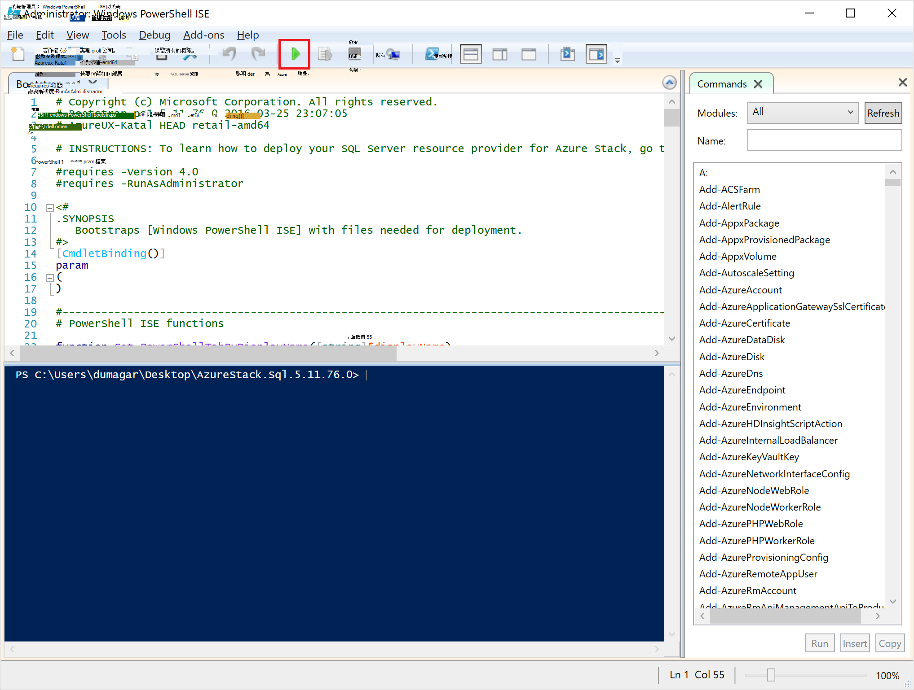

    將會載入兩個主要的搜尋索引標籤，每個包含所有的指令碼及部署資源提供者所需的檔案。

## 準備的先決條件

按一下 [**準備先決條件**] 索引標籤︰

- 建立所需的憑證
- 上傳到 Azure 堆疊上儲存的帳戶的成品
- 發佈庫項目

### 建立所需的憑證
這個**新增 SslCert.ps1**指令碼加入\_。D: AzureStack.local.pfx SSL 憑證\\SQLRP\\先決條件\\BlobStorage\\容器資料夾。 憑證保護資源提供者與本機的執行個體的 Azure 資源管理員之間的通訊。

1. **準備先決條件**主要的搜尋] 索引標籤中，按一下 [**新增 SslCert.ps1** ] 索引標籤，並執行。

2. 在出現提示時，輸入 PFX 密碼來保護私人索引鍵和**記下密碼**。 您必須將其更新版本。

### 將所有成品上都傳到 Azure 堆疊上儲存的帳戶

1. 按一下 [**上傳-Microsoft.Sql-RP.ps1** ] 索引標籤上，執行。

2. 在 [Windows PowerShell 認證邀請] 對話方塊中，輸入 Azure 堆疊服務系統管理員認證。

3. 出現提示時的 Azure Active Directory 租用戶識別碼，輸入您的 Azure Active Directory 租用戶的完整網域名稱︰ 例如，microsoftazurestack.onmicrosoft.com。

    在快顯視窗會要求認證。

    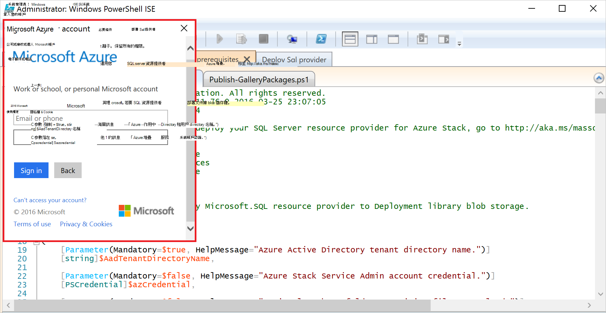

    > [AZURE.TIP] 如果沒有出現快顯視窗，您可能還沒有關閉 IE 增強的安全性，以啟用 JavaScript 上這台電腦和使用者，或您還沒有接受 cookie ie。 請參閱[設定部署前的步驟](#set-up-steps-before-you-deploy)。

4. 輸入您的 Azure 堆疊服務管理員認證，然後再按一下 [**登入**]。

### 發佈庫更新版本的資源建立的項目

選取 [**發佈 GalleryPackages.ps1** ] 索引標籤上，執行。 這個指令碼加入 Azure 堆疊 POC 入口網站的 marketplace，您可以用來部署服務商場項目的資料庫資源的兩個服務商場項目。

## 部署的 SQL Server 資源提供者 VM

現在您已準備好 Azure 堆疊 PoC 必要的憑證與服務商場的項目，您可以部署 SQL Server 資源提供者。 按一下 [**部署的 SQL 提供者**] 索引標籤︰

   - 提供的部署程序參照 JSON 檔案中的值
   - 部署資源提供者
   - 更新的本機 DNS
   - 註冊的 SQL Server 資源提供者介面卡

### 提供 JSON 檔案中的值

按一下 [ **Microsoft.Sqlprovider.Parameters.JSON**]。 這個檔案的 Azure 資源管理員範本必須正確部署至 Azure 堆疊的參數。

1. 填寫 JSON 檔案中的**空白**參數︰

    - 請確定您提供**adminusername**和**adminpassword** SQL 資源提供者 vm:

        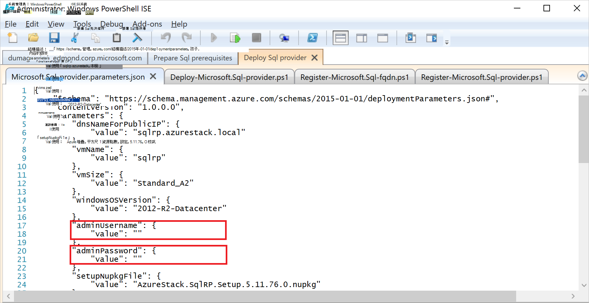

    - 請確定您所做的筆記中[準備 prequisites](#prepare-prerequisites)步驟**SetupPfxPassword**參數提供的密碼︰

    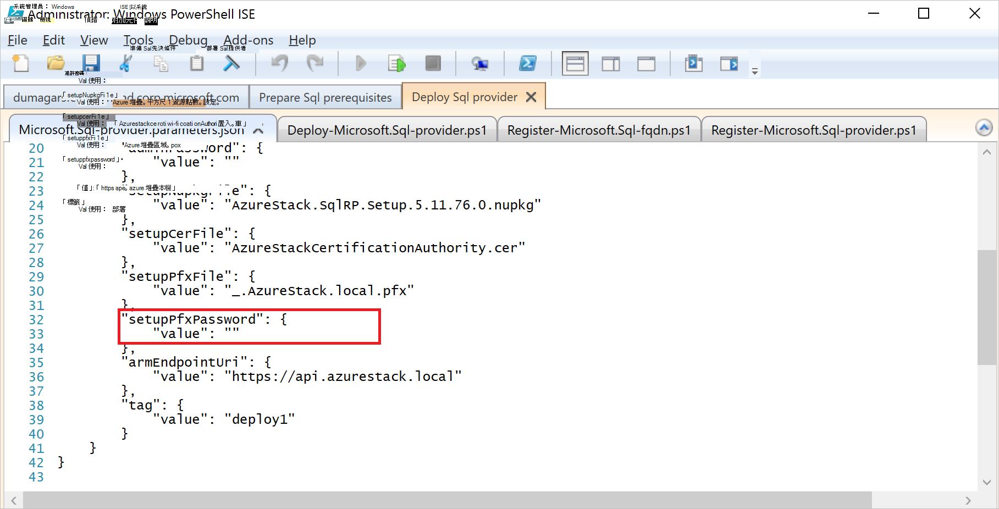

2. 按一下 [儲存參數檔案的 [**儲存**]。

### 部署資源提供者

1. 按一下 [**部署-Microsoft.sql-provider.PS1** ] 索引標籤，並執行指令碼。
2. 在出現提示時，則 Azure Active Directory 中輸入您的租用戶的名稱。
3. 在快顯視窗中，提交您 Azure 堆疊 service 的管理員認證。

完整的部署可能需要一些高度利用 Azure 堆疊 POCs 25 kb 55 分鐘之間。 想要的狀態設定 (DSC) 副檔名與 PowerShell 執行後，也就是最後一個步驟，將會最長的步驟。 每個可能需要 10-25 分鐘。

### 更新的本機 DNS

1. 按一下 [ **Register-Microsoft.SQL-fqdn.ps1** ] 索引標籤，並執行指令碼。
2. 出現提示時的 Azure Active Directory 租用戶識別碼，輸入您的 Azure Active Directory 租用戶的完整網域名稱︰ 例如， **microsoftazurestack.onmicrosoft.com**。

### 註冊 SQL 資源點數資源提供者##

1. 按一下 [ **Register-Microsoft.SQL-provider.ps1** ] 索引標籤，並執行指令碼。

2. 時提示輸入認證，請使用下列的值的使用者名稱和密碼︰

   - **sqlRpUsername**
   - **sqlRpPassw0rd**

   > [AZURE.IMPORTANT] 這些是您需要輸入認證的提示時輸入*常*值。 這些不是版面配置區。 **執行*不*類型 * * username\password 部署 VM 之前，先儲存參數檔案。

## 驗證使用 Azure 堆疊入口網站的部署

1. 登出 ClientVM 並再次登入為**AzureStack\AzureStackUser**。

2. 在桌面上，按一下 [ **Azure 堆疊 POC 入口網站**並登入服務管理員入口網站

3. 請確認部署成功。 按一下 [**瀏覽** &gt; **資源群組**&gt;按一下您所使用的資源群組 （預設為**SQLRP**），然後確定刀 （上半） 的基礎部分讀取**已成功部署**。

      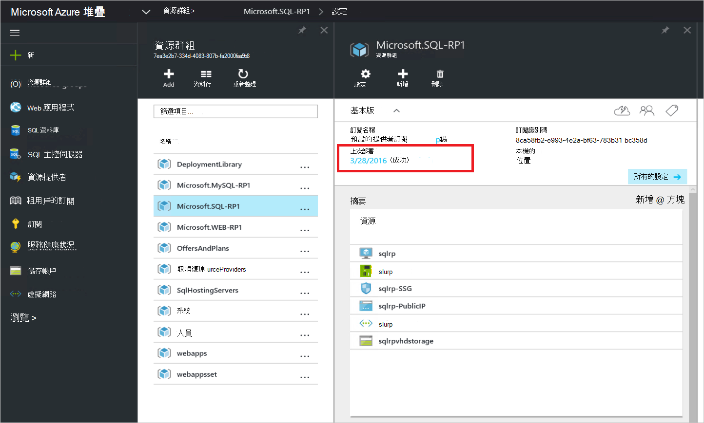

4. 請確認註冊成功。 按一下 [**瀏覽** &gt; **資源提供者**，並**SQL 本機**然後尋找︰

      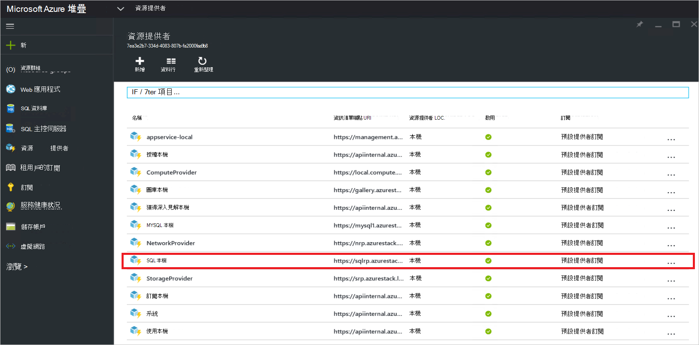

## 連接至裝載的 SQL server，提供給您的 SQL 資源提供者的容量

1. 服務管理員身分登入 Azure 堆疊 POC 入口網站

2. 按一下 [**資源提供者** &gt; **SQL 本機** &gt; **移至 [資源提供者管理** &gt; **伺服器** &gt; **新增**。

    **SQL 主控伺服器**刀是您可以在其中連線至 SQL Server 的實際做為資源提供者的後端的執行個體 SQL Server 資源提供者。

    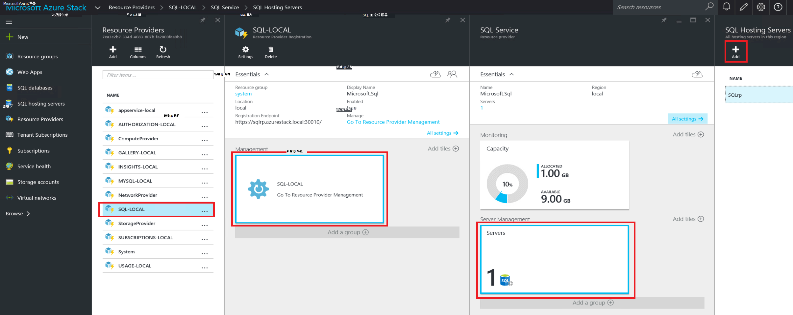

3. 填入您的 SQL Server 執行個體連線詳細資料表單。 根據預設，預先設定的 SQL Server 稱為 「 SQLRP 」 的系統管理員使用者名稱 」 索] 和密碼] 圖說文字中 JSON VM 執行的參數 」 adminpassword 」 參數中。

## 建立您的第一個 SQL 資料庫來測試您的部署

1. 服務管理員身分登入 Azure 堆疊 POC 入口網站

2. 按一下 [**瀏覽** &gt; **SQL 資料庫** &gt; **新增**
  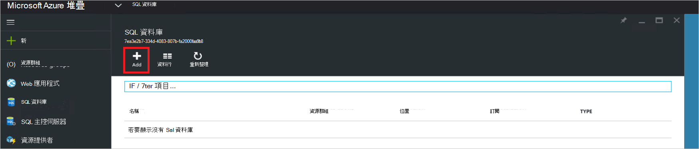

3. 填寫表單和資料庫的詳細資訊，包括**新的伺服器**刀中的新*虛擬伺服器*的**伺服器名稱**、**伺服器管理員登入**和**密碼**。

    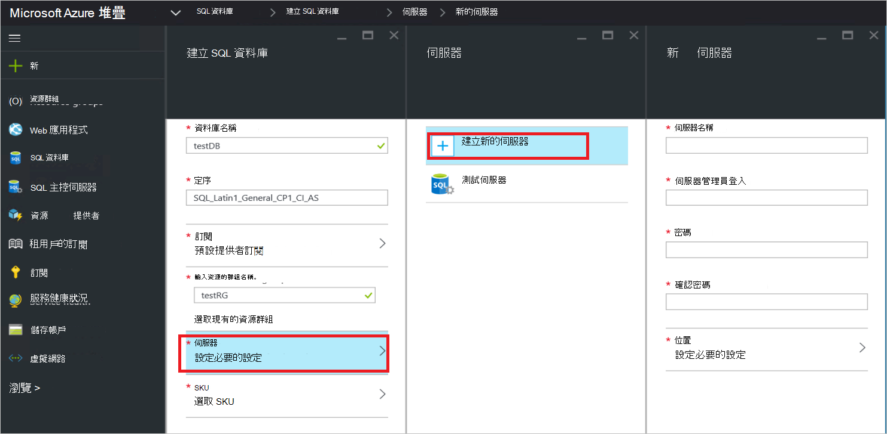

    虛擬伺服器是人工架構。 它不會對應到 SQL Server 本身，但改為資訊清單透過內部連接字串，其中的資源提供者會產生此程序結尾的使用者名稱。 **注意您輸入分別為虛擬伺服器的密碼**。 入口網站將不會顯示密碼]。

4. 系統要求您挑選資料庫的價格層。

    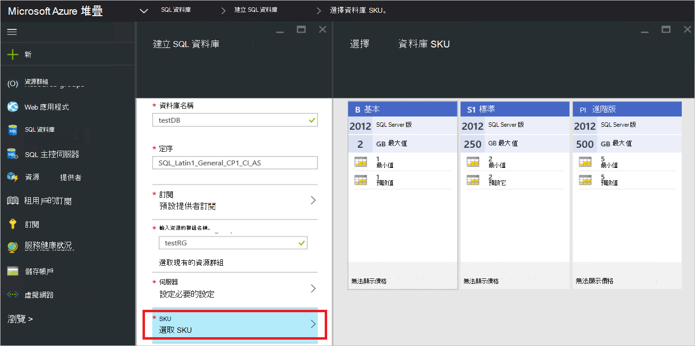

    層並未實作於此版本，但是他們消耗會 Azure 資源管理員來展現您可以建立的配額強制等的差異。

5. 送出表單並完成部署，請等候。

6. 在結果刀，請注意的 [連線字串] 欄位。 在您 Azure 堆疊中，您可以使用任何需要 SQL Server 存取 （例如，web 應用程式） 應用程式中的字串。

    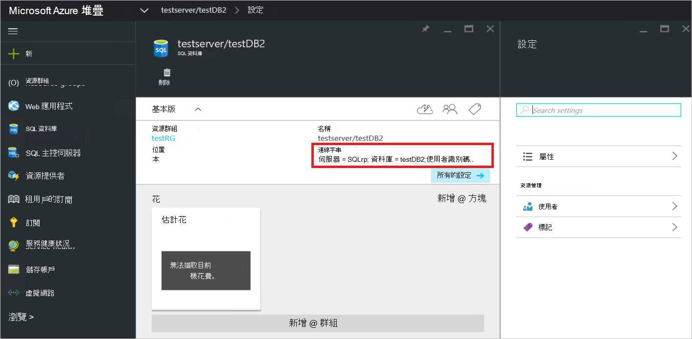

## 後續步驟

請嘗試[MySQL 伺服器資源提供者](azure-stack-mysql-rp-deploy-short.md)」 和 「 [Web 應用程式資源提供者](azure-stack-webapps-deploy.md)等其他[PaaS 服務](azure-stack-tools-paas-services.md)。
